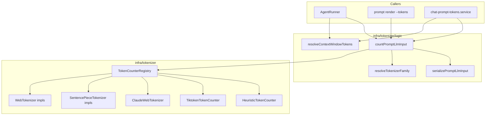

# 模型感知 Token 统计与统一口径 技术规格（SPEC）

> **PRD**：[prd.md](./prd.md)  
> **Supersedes**：[token-counting/spec.md](../token-counting/spec.md) 中的协议门控、压缩仅 `countMessages`、非 OpenAI tokenizer 排除、Mobile 排除等约定。  
> **Mobile 实现（迭代内变更）**：[features/android-native-tokenizer-bridge/spec.md](./features/android-native-tokenizer-bridge/spec.md) — RN **不得** 静态依赖 `@agnai/*`；Android 精确计数走 Kotlin 原生桥（M1）。下文涉及「RN 加载 `@agnai/*`」的段落以 feature SPEC 为准。  
> **参考实现**：`D:\Dev\Js\SillyTavern\src\endpoints\tokenizers.js`（`getTokenizerModel` + `/openai/count` 分支）。

---

## 设计目标

1. **路由键**：`vendorModelId` 子串 → tokenizer 族；**移除** `provider.protocol` 门控与「未保存模型 → heuristic」静默降级。
2. **一口径**：`countPromptLlmInput()` 为唯一产品计数入口；压缩 / CLI / Mobile 顶栏共用。
3. **多族 tokenizer**：Node（core）与 RN（Mobile）均可加载 ST 同级族；失败统一 `Math.ceil(chars / 3.35)`。
4. **预算分母**：`resolveContextWindowTokens()` 替代 `maxOutputTokensFromSampling` 用于顶栏 % 与 `tokenThreshold === -1`。
5. **可观测**：`PromptTokenCountResult` 含 `counterKind`、`estimated`、`tokenizerFamily`（调试）。

---

## 现状与约束（代码探索）

| 模块 | 现状 | 本迭代变更 |
|------|------|------------|
| `create-default-registry.ts` | `protocol === "openai"` 才 tiktoken；`savedModels` 缺失 → heuristic | 仅 `resolveTokenizerFamily(vendorModelId)`；`forVendorModel(id)` **去掉 protocol 参数**（保留 deprecated 重载 1 个版本） |
| `tiktoken-model-map.ts` | 仅 GPT 子串；无 claude/gemini | 拆为 `resolve-tokenizer-family.ts`（对齐 ST `getTokenizerModel` 顺序） |
| `HeuristicTokenCounter` | `Math.floor(len/4)` | `Math.ceil(len / 3.35)`（`CHARACTERS_PER_TOKEN_RATIO` 常量） |
| `token-threshold.trigger.ts` | `countMessages(visible)` | 改为对调用方传入的 `PromptLlmInput` 走 `countPromptLlmInput` |
| `create-compaction-condition-evaluator.ts` | `resolveMaxContextTokens` 用 `maxOutputTokensFromSampling` | 改为 `resolveContextWindowTokens`（模型名表 + 默认 128k） |
| `agent-runner.ts` | `shouldRequestCompaction(session, modelContext)` 无 prompt | 先 `buildPromptLlmInput`（与 step 相同 macro/messages）再传入 evaluator |
| `chat-prompt-tokens.service.ts` | 自拼 registry + `maxOutputTokens` 分母；fallback 仅消息 | 调 core `countPromptLlmInput` + `formatPromptTokenUsageLabel(count, contextWindow)` |
| `apps/cli/prompt/commands.ts` | 未保存模型 warning + heuristic；自拼 counter | 调 `countPromptLlmInput`；stderr 增加 `estimated` |
| `TokenCounterKind` | `"heuristic" \| "tiktoken"` | 扩展为族 id（见下）或 `counterKind: string` + `tokenizerFamily` |
| `SavedModel` | 无 context window 字段 | 本迭代 **不增 DB 列**；用 `context-window-map.ts` 静态子串表（与 tokenizer 表并列，可后补 KKV） |
| Mobile `metro.config.js` | 仅 shim `tiktoken` → `js-tiktoken` | blockList `@agnai/*`；GPT 用 `js-tiktoken`；WEB/SP 见 [android-native-tokenizer-bridge](./features/android-native-tokenizer-bridge/spec.md) |
| `packages/core/package.json` | 仅 `tiktoken`（RN 不打包 `@agnai/*`） | Node/CLI：`@agnai/*` 经 `tokenizer-node`；Mobile：Kotlin 原生桥 |

**架构约束**（`packages/core/ARCHITECTURE.md`）：

- 新 tokenizer 实现放 `infra/tokenizer/impl/`；族解析放 `infra/tokenizer/logic/`。
- `TokenThresholdConditionTrigger`（domain）可依赖 infra port；**完整 prompt 构建**留在 service（`agent-runner` / mobile service），domain 只接收 `PromptLlmInput`。
- domain 不得 import service。

**Compaction 评估时机**（`agent-runner.ts` L114–122）：

- 每 step 前评估；与 L145–177 的 `buildPromptLlmInput` 使用 **同一** `macroCache` + `session.list()` 可见消息（需在 runner 内抽 `buildStepPromptInput()` 复用）。

---

## 总体方案

### 架构



### 核心类型（定稿）

```ts
/** 与 ST getTokenizerModel 返回值 / 用户覆盖选项对齐 */
export type TokenizerFamily =
  | "heuristic"
  | "tiktoken"      // GPT 系
  | "claude"
  | "llama"
  | "llama3"
  | "mistral"
  | "yi"
  | "gemma"         // gemini / gemma / learnlm
  | "jamba"
  | "qwen2"
  | "command-r"
  | "command-a"
  | "nemo"
  | "deepseek"
  | "gpt2";         // 极少见；表内保留

export type TokenCounterKind = TokenizerFamily; // 别名，兼容 CLI 字段 counter

export interface TokenCounter {
  readonly kind: TokenCounterKind;
  countText(text: string): number;
  /** @deprecated 压缩主路径不再使用；保留供 estimateTokens 兼容 */
  countMessages(messages: readonly ChatMessage[]): number;
}

export interface CountPromptLlmInputParams {
  readonly input: PromptLlmInput;
  readonly applicationModelId: string;
  readonly registry: TokenCounterRegistry;
  /** 默认 "auto"：仅看 vendorModelId */
  readonly tokenizerOverride?: TokenizerFamily | "auto" | "heuristic";
}

export interface PromptTokenCountResult {
  readonly tokenCount: number;
  readonly counterKind: TokenCounterKind;
  /** true 当最终走 heuristic 或加载失败降级 */
  readonly estimated: boolean;
  readonly applicationModelId: string;
  readonly vendorModelId: string;
  readonly tokenizerFamily: TokenizerFamily;
}

export interface TokenCounterRegistry {
  readonly heuristic: TokenCounter;
  forApplicationModel(
    applicationModelId: string,
    options?: { override?: TokenizerFamily | "auto" | "heuristic" },
  ): Promise<TokenCounter>;
  /** 主路径：仅 vendorModelId */
  forVendorModel(
    vendorModelId: string,
    options?: { override?: TokenizerFamily | "auto" | "heuristic" },
  ): TokenCounter;
}
```

### 计数口径（锁定）

| 步骤 | 规则 |
|------|------|
| 序列化 | 沿用 `serializePromptLlmInput(input)`（`system` + `\n\n` + `role: body`） |
| GPT / Claude / Web 族 | 将序列化文本包装为 **单条** `{ role: "system", content: serialized }`，按 ST `/openai/count` 单消息路径计数（Claude 族 `full=true` 无 `-2` 调整） |
| SentencePiece 族 | 对 **纯文本** `encode(serialized)`（与 ST `countSentencepieceArrayTokens` 对 body 一致） |
| Heuristic | `Math.ceil(serialized.length / 3.35)` |
| 三端 | 同一 `CountPromptLlmInputParams`，同一返回值 |

**与旧版差异**：顶栏/CLI 原 `countText` 裸 tiktoken encode **不再使用**于 prompt 总数；改为上表包装计数，与 ST 对齐。

### 族解析顺序（`resolveTokenizerFamily`）

实现为 **有序子串表**（从 `SillyTavern/src/endpoints/tokenizers.js` `getTokenizerModel` 移植，单测锁定）。优先级要点：

1. `gpt-3.5-turbo-0301` → tiktoken 0301  
2. `gpt-4o` / `chatgpt-4o` → tiktoken gpt-4o  
3. `gpt-4.1` / `gpt-4.5` → gpt-4o encoding  
4. `o1` / `o3` / `o4-mini` 等 → tiktoken o1  
5. `gpt-4` / `gpt-3.5-turbo`  
6. **`claude` → claude**（早于默认 turbo）  
7. `llama3` / `llama-3` → llama3  
8. `llama` → llama  
9. `mistral` / `mixtral` → mistral  
10. `yi` → yi  
11. `deepseek` → deepseek  
12. `gemma` / `gemini` / `learnlm` → gemma  
13. `jamba` → jamba  
14. `qwen2` / `qwen` → qwen2  
15. `command-a` → command-a  
16. `command-r` → command-r  
17. `nemo` / `pixtral` → nemo  
18. 默认 → **heuristic**（ST 默认 `gpt-3.5-turbo`；本迭代 PRD 要求未知模型 heuristic，**有意与 ST 默认不同**，避免误用 GPT 编码）

`tokenizerOverride === "heuristic"` 强制 heuristic；其它 override 跳过子串表。

### Context window（`resolveContextWindowTokens`）

静态表 `context-window-map.ts`（子串 → tokens），示例：

| 子串 | 窗口 |
|------|------|
| `claude-3-5` / `claude-3-7` | 200_000 |
| `claude-3` | 200_000 |
| `gpt-4o` | 128_000 |
| `gpt-4-turbo` | 128_000 |
| `gpt-3.5` | 16_385 |
| `gemini-2.0` / `gemini-1.5` | 1_048_576 |
| `gemini` | 1_000_000 |
| 默认 | 128_000 |

无匹配 → `undefined`（顶栏不显示 %）。`tokenThreshold === -1` → 用解析值，仍无则 128_000。

### 用户覆盖（偏好）

| 存储 | Key | 值 |
|------|-----|-----|
| KKV `nm-preferences` | `tokenCounter.mode` | `auto` \| `heuristic` \| `<TokenizerFamily>` |
| Mobile `appUi` | 同 key | 与 core 同步读写 |

CLI：`nm preferences set tokenCounter.mode claude`（沿用现有 preferences 命令）。

Registry 构造注入 `getTokenizerOverride: () => Promise<"auto" | "heuristic" | TokenizerFamily>`（CLI/Mobile runtime 从 preferences 读）。

### Tokenizer 资源与运行时

| 平台 | 策略 |
|------|------|
| Node (core tests, CLI) | `packages/core/assets/tokenizers/` 从 SillyTavern 仓库拷贝：`claude.json`、`llama3.json`、`*.model`（llama/mistral/yi/gemma/jamba）；Web 族 JSON 从 `SillyTavern-Tokenizers` raw URL 或 vendor 到 `assets/tokenizers/web/` |
| RN (Mobile) | Metro `resolver` 将 `@novel-master/core` 内 `assets/tokenizers/*` 注册为 `assetExts`；`createTokenizerLoader("react-native")` 用 `require()` 读 bundled JSON；SentencePiece **若** Metro 无法加载 `.model`，则 RN 对该族 **降级 heuristic** 并 `estimated: true`（须在 Mobile 单测/手工清单注明）；优先尝试 `react-native-fs` + 预置 assets |

**依赖**（`packages/core/package.json`）：

```json
"@agnai/web-tokenizers": "^0.3.0",
"@agnai/sentencepiece-js": "^0.2.0"
```

（版本以 `SillyTavern/package.json` 对齐为准，实现时 pin 锁定。）

**实现类**（`infra/tokenizer/impl/`）：

| 族 | 类 | 底层 |
|----|-----|------|
| tiktoken | 现有 `TiktokenTokenCounter` | `tiktoken` / Mobile shim |
| claude | `ClaudeWebTokenCounter` | `@agnai/web-tokenizers` + `claude.json` |
| llama3, qwen2, command-r/a, nemo, deepseek | `WebTokenizerCounter` | 各 JSON + fallback 链 |
| llama, mistral, yi, gemma, jamba | `SentencePieceTokenCounter` | `@agnai/sentencepiece-js` + `.model` |
| heuristic | `HeuristicTokenCounter` | 纯 JS |

### Compaction 接线

**扩展 port**（`compaction-condition-trigger.port.ts`）：

```ts
export interface CompactionEvaluationContext {
  readonly modelContext: CompactionConditionModelContext;
  readonly promptInput: PromptLlmInput;
}

export interface CompactionConditionTrigger {
  shouldTrigger(
    session: AgentSession,
    evaluation: CompactionEvaluationContext,
  ): Promise<boolean>;
}

export interface CompactionConditionEvaluator {
  shouldRequestCompaction(
    session: AgentSession,
    evaluation: CompactionEvaluationContext,
  ): Promise<boolean>;
}
```

**AgentRunner**（每 step 前）：

```ts
const messages = await this.deps.session.list(); // 或过滤 visible，与 buildPromptLlmInput 一致
const macro = this.deps.macroCache.get(projectId, sessionId);
const promptInput = buildPromptLlmInput(options.definition.prompts, {
  worktreeDisplay: macro?.worktreeDisplay ?? "",
  filetreeDisplay: macro?.filetreeDisplay ?? "",
  messages,
});
await this.deps.compactionConditions.shouldRequestCompaction(session, {
  modelContext: { workspaceModelId, applicationModelId },
  promptInput,
});
```

**TokenThresholdConditionTrigger**：`countPromptLlmInput({ input: evaluation.promptInput, applicationModelId, registry })` 与 threshold 比较。

**注意**：压缩评估不包含 regex 通道差异时，与 Mobile `applyActiveRegexChannel` 可能差几条消息——本迭代 **在 agent-runner 增加与 CLI 相同的 regex 通道应用**（若已有 `regexConfig` 注入则接上，否则在 SPEC 实现时从 runner deps 传入）。Mobile/CLI 已应用 regex；**三端必须都应用 `llm` 通道**，否则违反 PRD「同一输入」。

探索：`agent-runner` 当前 `session.list()` 未走 regex——**本迭代必须在 runner 内对 messages 调用与 `applyActiveRegexChannel(..., 'llm')` 等价的 core API**（抽 `applyRegexChannelForLlm` 到 core 或 service 供 CLI/Mobile/Runner 共用）。

---

## 最终项目结构

```
packages/core/
  assets/tokenizers/           # NEW: vendored from SillyTavern (+ ST-Tokenizers JSON)
    claude.json
    llama3.json
    llama.model
    mistral.model
    yi.model
    gemma.model
    jamba.model
    web/
      qwen2.json
      command-r.json
      ...
  src/infra/tokenizer/
    logic/
      resolve-tokenizer-family.ts      # NEW
      context-window-map.ts            # NEW
      resolve-context-window.ts        # NEW
      count-prompt-llm-input.ts        # NEW (唯一入口)
      count-openai-style-message.ts    # NEW (ST 单条 message 计数)
      create-default-registry.ts       # REWRITE
      tiktoken-model-map.ts            # MERGE into resolve-tokenizer-family
      openai-message-token-count.ts    # KEEP (countMessages 路径)
      serialize-prompt-input.ts          # KEEP
    impl/
      heuristic-token-counter.ts         # UPDATE ratio
      tiktoken-token-counter.ts          # KEEP
      claude-web-token-counter.ts        # NEW
      web-tokenizer-counter.ts           # NEW
      sentencepiece-token-counter.ts     # NEW
      create-tokenizer-loader.ts         # NEW node | react-native
    ports/
      token-counter.port.ts              # EXTEND kind
      token-counter-registry.port.ts     # UPDATE signatures
  src/domain/compaction-conditions/
    triggers/token-threshold.trigger.ts  # UPDATE
    ports/compaction-condition-trigger.port.ts  # UPDATE
  src/service/compaction-conditions/
    create-compaction-condition-evaluator.ts  # UPDATE
  src/service/agent/impl/agent-runner.ts        # UPDATE prompt+regex
  src/service/prompt/
    apply-regex-channel-for-llm.ts              # NEW (或放 regex service)
  test/infra/tokenizer/
    resolve-tokenizer-family.test.ts
    count-prompt-llm-input.test.ts
    st-parity-fixtures.test.ts                  # 可选：锁定 ST 样例
  test/compaction-conditions/...

apps/cli/src/prompt/commands.ts                 # UPDATE
apps/cli/src/runtime.ts                         # wire preferences override

apps/mobile/
  src/services/chat-prompt-tokens.service.ts    # UPDATE
  src/services/session-prompt-input.service.ts  # KEEP (build input)
  src/utils/format-token-count.ts               # UPDATE label / 估算文案
  src/storage/app-ui-keys.ts                    # tokenCounter.mode
  src/shims/tiktoken.js                         # KEEP
  metro.config.js                               # assets + optional agnai
  __tests__/chat-prompt-tokens.test.ts            # NEW

.apm/kb/docs/Iterations/token-counting/prd.md   # 文首加 superseded 注记
```

---

## 变更点清单

| 文件 | 操作 |
|------|------|
| `resolve-tokenizer-family.ts` | 新增，ST 顺序单测 |
| `count-prompt-llm-input.ts` | 新增，导出 `@novel-master/core` |
| `create-default-registry.ts` | 重写路由；去掉 protocol/saved 门控 |
| `HeuristicTokenCounter` | 3.35 + `ceil` |
| `token-counter.port.ts` | 扩展 `TokenCounterKind` |
| `token-threshold.trigger.ts` | 使用 `PromptLlmInput` |
| `compaction-condition-trigger.port.ts` | `CompactionEvaluationContext` |
| `create-compaction-condition-evaluator.ts` | 传 evaluation；`resolveContextWindowTokens` |
| `agent-runner.ts` | 构建 `promptInput` + regex 通道 |
| `apply-regex-channel-for-llm.ts` | 新增共享 |
| `chat-prompt-tokens.service.ts` | 调 core API；分母改 context window；fallback 标「估算」 |
| `format-token-count.ts` | 支持 `estimated` 后缀 |
| `prompt/commands.ts` | 调 `countPromptLlmInput` |
| `index.ts` (core) | export 新 API |
| `token-counting/prd.md` | superseded 注记 |
| `assets/tokenizers/*` | 从 ST vendor（LICENSE 注明） |

---

## 详细实现步骤

### 步骤 1：族解析 + 启发式 + 单测

1. 新增 `resolveTokenizerFamily(vendorModelId, override?)`。
2. 更新 `HeuristicTokenCounter` 为 `CHARACTERS_PER_TOKEN_RATIO = 3.35`、`Math.ceil`。
3. `estimateTokens` 仍调 heuristic `countMessages`（兼容；行为随 ratio 变）。
4. 测试：`openai` 协议 + `claude-3-5-sonnet` → `claude`；`gemini-2.0-flash` → `gemma`；`my-custom/foo` → `heuristic`。

### 步骤 2：Tokenizer 资源与 Node 实现

1. 拷贝 ST tokenizer 资产到 `packages/core/assets/tokenizers/`（记录来源 commit）。
2. 实现 `createTokenizerLoader("node")`。
3. 实现 `ClaudeWebTokenCounter`、`WebTokenizerCounter`、`SentencePieceTokenCounter`。
4. 实现 `countOpenAiStyleMessage(encoding, {role, content}, {full})` 供 GPT/Claude 包装计数。
5. 单元测试：gpt-4o / claude / gemma 样例字符串锁定 token 数（容差 **0** 对 heuristic；对 claude/gemma **≤1** vs 预录期望值，CI 不依赖外部 ST 进程）。

### 步骤 3：Registry 重写

1. `forVendorModel(vendorModelId, options?)` 按族缓存 counter 实例。
2. `forApplicationModel`：parse id → `forVendorModel`；provider 缺失仍可按 vendorModelId 路由。
3. 删除「savedModels 未保存 → heuristic」；`savedModels` 依赖改为 **可选移除** 或仅用于未来元数据。
4. 更新 `registry.test.ts`（R3 协议切换用例 **删除**；新增 claude+openai 协议用例）。

### 步骤 4：`countPromptLlmInput` + context window

1. 实现 `countPromptLlmInput`（唯一入口）。
2. 实现 `resolveContextWindowTokens(vendorModelId)`。
3. 导出并在 `index.ts` 暴露。

### 步骤 5：压缩链路 + AgentRunner regex

1. 扩展 compaction port + evaluator + `TokenThresholdConditionTrigger`。
2. 抽 `applyRegexChannelForLlm`（core service 层，入参同 CLI `applyActiveRegexChannel`）。
3. `agent-runner`：step 前 `buildPromptLlmInput` + regex + `shouldRequestCompaction`。
4. 更新 `token-threshold-trigger.test.ts`（mock `countPromptLlmInput` 或传入 fixture `PromptLlmInput`）。

### 步骤 6：CLI

1. `prompt render --tokens` → `countPromptLlmInput`；stderr：`tokenCount`, `counter`, `model`, `estimated`, `tokenizerFamily`。
2. 无 `--model` 时用 workspace 当前 `applicationModelId`（与 Mobile 一致，从 `state.getCurrentModelId()`）。
3. Runtime 注入 preferences override。

### 步骤 7：Mobile

1. `chat-prompt-tokens.service.ts` 改用 `countPromptLlmInput` + `resolveContextWindowTokens`。
2. Fallback：`estimated: true`，标签加 `约` 或 `~` 前缀。
3. `appUi` + preferences key `tokenCounter.mode`；设置页增加「Token 计数器」选项（列表同 `TokenizerFamily` + 自动 + 启发式）。
4. Metro：bundle `assets/tokenizers`；扩展 shim 如需 `@agnai/web-tokenizers`。
5. 若 SentencePiece 在 RN 不可行：文档化降级矩阵，**GPT/Claude/Web 族必须可用**，SP 族可降级（与 PRD 冲突时以 PRD 为准——实现须尽量 bundle `.model`；验收用 `gemini-2.0-flash` 真机测试）。

### 步骤 8：文档与 supersede

1. `token-counting/prd.md` 顶部注明由本迭代 supersede。
2. CHANGELOG / 迭代 README 一句。

### 步骤 9：全量测试

1. `npm test -w @novel-master/core`
2. `npm test -w @novel-master/mobile`（含新 `chat-prompt-tokens.test.ts`）
3. `apps/cli/test/prompt-tokens-e2e.test.ts` 更新断言（`claude` 模型 fixture）

---

## 测试策略

### 单元测试（core）

| ID | 描述 |
|----|------|
| F1 | `resolveTokenizerFamily` 表驱动 ≥20 条（含中转 openai+claude、openai+gemini、gemini+gpt-4o） |
| H1 | heuristic `ceil(len/3.35)` |
| C1 | `countPromptLlmInput` 同一 `PromptLlmInput` + 模型 → 稳定整数 |
| C2 | 改 `system` 字段 → token 数增加 |
| P1 | compaction trigger：prompt tokens > threshold → true |
| W1 | `resolveContextWindowTokens('claude-3-5-sonnet')` → 200000 |

### 集成测试

| ID | 描述 |
|----|------|
| I1 | CLI e2e：`--tokens --model openai/claude-3-5-sonnet` → `counter !== tiktoken` 且 `!== heuristic`（若加载成功） |
| I2 | Mobile service mock runtime：`loadChatPromptTokenLabel` 与 `countPromptLlmInput` 同值 |
| I3 | AgentRunner + mock evaluator：传入 `promptInput` 被使用（spy） |

### 手工验收（PRD）

- Android：OpenAI 兼容 Provider + Claude / Gemini 顶栏非 heuristic（debug 可见族名）。
- 压缩与顶栏：同会话同阈值边界行为一致。

---

## 风险与回滚方案

| 风险 | 缓解 | 回滚 |
|------|------|------|
| RN 包体增大 | 仅 bundle 常用 JSON；SP `.model` 压缩；监控 APK 大小 | feature flag `tokenCounter.mode=heuristic` 默认关闭新族 |
| 压缩触发变频 | 完整 prompt 大于旧 message-only → 更易触发；在 PRD 已接受；可用 `tokenRatio` 调 | 恢复旧 trigger 需回滚 agent-runner + trigger 分支 |
| heuristic 3.35 改变历史阈值语义 | 发布说明提示用户重审 `tokenThreshold` | 常量 `USE_LEGACY_HEURISTIC_4` 仅测试/紧急 |
| @agnai 加载失败 | try/catch → heuristic + `estimated: true` | 同左 |
| regex 未接入 runner 导致口径不一致 | 步骤 5 强制 shared regex | 回滚 runner 改动 |

**回滚顺序**：Mobile/CLI 调用回旧 API → registry 恢复协议门控 → compaction port 恢复可选 `promptInput`。

---

## ST 对齐容差（定稿）

- **GPT tiktoken**：与 `tiktoken` encode **完全一致**（0 容差）。
- **Claude / Gemma / Llama3**：与 vendored 资产 + 本仓库单测 **预录 golden 值** 比较，允许 **≤1 token**。
- **不**在 CI 启动 SillyTavern 服务；golden 值由实现时从 ST 一次导出写入 `test/fixtures/token-count-golden.json`。

---

## 实现检查清单（编码前）

- [x] 已读 PRD
- [x] 已探索 tokenizer / compaction / mobile / CLI / agent-runner
- [x] 已写 spec.md
- [ ] **用户确认 spec.md 后再编码**
