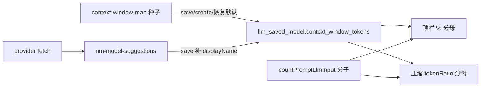

# 模型上下文配置与 Provider 存储精简 PRD

> **边界**：本文件为产品需求（PRD），不含接口设计、DDL 迁移步骤、任务拆分等技术 SPEC。  
> **关联**：[provider-model](../provider-model/prd.md)（服务商与 saved/suggestion 分离）、[model-aware-token-counting](../model-aware-token-counting/prd.md)（模型感知计数与顶栏口径）、[nmtp](../nmtp/prd.md)（NMTP 计数 driver，**本迭代不改变** tokenizer 计数规则）、[event-bus-compaction-conditions](../event-bus-compaction-conditions/prd.md)（压缩条件与事件总线）。  
> **取代**：运行时直接调用 `resolveContextWindowTokens(vendorModelId)` 作为顶栏分母与压缩 `tokenThreshold === -1` 分母；`llm_model_suggestion` SQLite 表作为 suggestion 持久化载体。

## 背景

### 现状问题

1. **上下文预算来源分裂**
   - 顶栏 `88% • 327/128K` 的分母、压缩 `tokenThreshold === -1` 的分母，运行时查 **core 静态表** `context-window-map`（按 `vendorModelId` 子串匹配）。
   - `llm_saved_model` 与采样 KKV（`nm-model-sampling`）**均不存** context window；用户无法在模型设置里纠错。
   - 历史上曾误将采样参数 `max_tokens` / `maxOutputTokens` 当作 prompt 预算分母，虽已改为 `resolveContextWindowTokens`，但注释与表单默认值仍易混淆（`max_tokens` = API **输出**上限，≠ context window）。

2. **压缩条件冗余**
   - `tokenThreshold`（含 `-1` 魔法值）与 `tokenRatio` 组合心智负担高；用户期望「跟着当前模型的 setting 走」，仅需全局 **比例**（如 80%）即可。
   - 绝对 token 阈值（如 `12000`）使用面窄，与「按模型预算比例压缩」目标不一致。

3. **Provider 存储层次不清**
   - `llm_saved_model`（SQLite）：用户确认的模型，参与 LLM 调用。
   - `llm_model_suggestion`（SQLite）：`fetch` API 列表缓存，**本质是临时候选池**，丢了可重新 fetch。
   - `nm-model-sampling`（KKV）：per-model 可选采样配置。
   - suggestion 与 saved 同为 SQLite 表，但语义更接近 KKV 缓存；provider 域表偏多、职责边界模糊。

### 用户目标

- **模型 setting 承载 context window**：创建/保存模型时用 `context-window-map` **赋初值**，之后压缩与顶栏 **只读** 该 setting；匹配错了用户可改。
- **压缩条件精简**：去掉 `tokenThreshold`，保留 `tokenRatio` + `visibleFloor`（OR）。
- **多表优化**：`llm_model_suggestion` 迁入 KKV；`llm_saved_model` 增加 `context_window_tokens`；provider 域 SQLite 仅保留 `llm_provider` + `llm_saved_model`。

## 目标（含成功指标）

| 目标 | 成功指标 |
|------|----------|
| 预算单一来源 | 对已保存模型，顶栏分母与压缩 token 触发分母 **均来自** `llm_saved_model.context_window_tokens`；运行时 **不再** 为上述用途调用 `resolveContextWindowTokens` |
| 可纠错 | Mobile / CLI 可查看并编辑已保存模型的 context window；提供「恢复为检测默认值」（从 map 重算，覆盖当前值） |
| 压缩简化 | `CompactionConditions` **移除** `tokenThreshold`；token 触发公式为 `promptTokens > contextWindowTokens × tokenRatio`；`schemaVersion` 升级且旧配置可迁移 |
| 存储分层清晰 | `llm_model_suggestion` 表 **删除**；suggestion 存 KKV `nm-model-suggestions`；`fetch` / `suggest list` / Mobile Fetch _sheet 行为不变 |
| 零计数回归 | NMTP `countPromptLlmInput` 数值与 `estimated` 语义 **不变**；仅预算分母来源变更 |
| 质量 | core / cli / mobile 相关测试全绿；含迁移、压缩触发、顶栏展示、save 种子赋值用例 |

## 用户与场景

| 角色 | 场景 |
|------|------|
| 对话用户 | 顶栏百分比反映 **该模型 setting 中的预算**；换模型后分母随模型变 |
| 运维 / 高级用户 | 中转站模型名怪异导致预算不准时，在模型编辑页改 `context_window_tokens` |
| 产品（App） | Provider 模型编辑：展示 context window 字段；Fetch 模型列表仍来自上次 fetch 缓存 |
| CLI 用户 | `nm provider model save` 自动写入 context window 初值；`nm compaction-conditions` 无 tokenThreshold 字段 |

## 范围

### 包含范围

#### 1. `llm_saved_model` 增加 context window

- 新增列 **`context_window_tokens`**（正整数，单位 token）。
- **`save` / `create`** 时：
  - 用现有 `resolveContextWindowTokens(vendorModelId)` 查静态 map；
  - 有匹配 → 写入匹配值；
  - 无匹配 → 写入 **`DEFAULT_CONTEXT_WINDOW_TOKENS`（128_000）**（与现压缩 fallback 一致）。
- **`edit`**：允许用户修改；可选「恢复默认」按 map 重算（**不**自动覆盖用户已改过的值，除非用户点恢复）。
- **已有 saved model 迁移**：bootstrap / 迁移脚本对存量行 backfill（map 查表 + 默认 128k）。
- `context-window-map.ts` **保留**，职责降为 **仅种子/恢复默认**，不作为产品运行时预算源。

#### 2. 顶栏与压缩读取 model setting

- **Mobile** `chat-prompt-tokens.service`：按当前 `applicationModelId` 查 **saved model** 的 `context_window_tokens` 作分母；无 saved 记录 → 仅显示绝对 token 数（无 %）。
- **压缩条件 evaluator**：`tokenRatio` 触发时，分母 = 当前 evaluation 上下文对应 saved model 的 `context_window_tokens`。
- **未保存模型**（见下文「边界场景」）：token 压缩条件 **不触发**（无 setting、**不回退 map**）；顶栏无 %。

#### 3. 压缩条件精简

- **删除** `tokenThreshold` 字段（含 `-1` 语义）。
- **保留**：
  - **`tokenRatio`**：相对当前模型 `context_window_tokens` 的比例，如 `0.8`；启用时若配置 token 路径则 **必填或出厂默认 0.8**（SPEC 定默认策略）。
  - **`visibleFloor`**：可见条数 OR 条件，语义不变。
- **触发逻辑**（enabled 时，OR）：
  - Token：`countPromptLlmInput(...) > contextWindowTokens × tokenRatio`（要求当前模型已 saved 且 `context_window_tokens` 有效）。
  - Floor：可见条数 `> visibleFloor`。
- **启用校验**：`enabled: true` 时至少 **`tokenRatio` 或 `visibleFloor` 之一**（SPEC 定 `tokenRatio` 缺省是否算已配置）。
- **`schemaVersion`**：升至 **3**；读取 v2 时迁移：丢弃 `tokenThreshold`；若仅有 `tokenThreshold` 无 `tokenRatio`，补默认 `tokenRatio: 0.8`。
- **Mobile** `CompactionConditionsScreen`：移除 Token 阈值输入；保留比例与 visible-floor。
- **CLI / 示例 YAML**：更新 `examples/compaction-conditions.yaml` 等。

#### 4. `llm_model_suggestion` → KKV

- 新 KKV module：**`nm-model-suggestions`**。
- 按 `providerId` 存 JSON 缓存（含 `vendorModelId`、`displayName`、`stale`、`lastSeenAtMs`；SPEC 定精确 schema）。
- `fetch`：合并 API 结果、标记 stale，写回 KKV。
- `suggestList`：读 KKV；Mobile `FetchModelsSheet` 行为不变（过滤 `!stale`）。
- `save` 时从 suggestion 补 `displayName` 的逻辑 **保留**（数据源改为 KKV）。
- `provider delete`：删除该 provider 的 suggestion KKV key；saved model 级联删除逻辑不变。
- **迁移**：**不保留**旧 suggestion 数据（仅为 fetch 缓存）；升级时 **DROP TABLE**，用户需重新 `fetch`。

#### 5. 语义清理（小范围）

- 修正 `protocol-sampling-defaults.ts` 等注释：`max_tokens` / `maxOutputTokensFromSampling` **仅** API 输出与表单，**不**用于 prompt 预算 %。
- 采样表单「Max Tokens」标签可保留（API 语义正确）；不在本迭代改名为 context window。

#### 6. 测试与文档

- Core：saved model CRUD 种子、backfill、compaction v2→v3 迁移、token 触发公式、无 saved 时跳过。
- Provider：suggestion KKV fetch/stale/save 补名、provider delete 清理。
- Mobile：顶栏分母、压缩条件 UI、模型编辑 context window 字段。
- CLI：compaction-conditions、model save 种子。
- 更新 `packages/core/ARCHITECTURE.md` 与 `feature-inventory` 相关表述。

### 不包含范围

1. **NMTP / tokenizer 计数规则变更** — `countPromptLlmInput`、`resolveTokenizerFamily`、driver 包不改动。
2. **扩展 context-window-map 覆盖** — 不新增子串规则（除非 SPEC 为迁移顺手补测）；map 仅作种子。
3. **采样参数语义变更** — `max_tokens` 仍表示 API 输出上限；不合并进 context window 字段。
4. **按 provider 协议区分 context window** — 仍按 `vendorModelId` 种子，不按 `providerId`。
5. **事件配置 / hide-message 深度切片** — 不变。
6. **suggestion 跨设备同步** — 仍为本地 DB/KKV 缓存。
7. **iOS / 新平台** — 仅沿用 Core 契约，无额外平台工作 unless Mobile 已有屏幕需改字段。

## 核心需求

1. **Saved model 为 context window 唯一产品数据源**（对已 save 模型）；静态 map 仅用于种子与「恢复默认」。
2. **`context_window_tokens` 在 save/create 时必有值**（map 或 128k 默认），避免 saved 模型出现「无预算」空洞；用户可事后编辑。
3. **压缩 token 触发** = 完整 prompt token 数 vs `contextWindowTokens × tokenRatio`；**不再**支持绝对 token 阈值与 `-1`。
4. **Suggestion 与 saved 存储介质分离**：SQLite 只承载「承诺态」实体；KKV 承载 fetch 缓存与既有 sampling/retry 等叠加配置。
5. **向后兼容**：DB 迁移 backfill saved models；compaction conditions v2→v3；suggestion 旧表 **直接丢弃**（不迁 KKV）。
6. **删除 `llm_model_suggestion` 表** 后，代码库无该表 DDL 残留（除迁移 changelog 文档）。

## 验收标准

### Saved model context window

- **Given** 用户 `save` 模型 `openai/claude-3-5-sonnet`  
  **When** 查询 `llm_saved_model`  
  **Then** `context_window_tokens = 200_000`（map 命中）。

- **Given** 用户 `save` 模型名无 map 命中  
  **When** 查询 saved model  
  **Then** `context_window_tokens = 128_000`。

- **Given** 用户将某 saved model 的 `context_window_tokens` 改为 `64_000`  
  **When** 顶栏刷新且压缩评估使用同一 `applicationModelId`  
  **Then** 分母为 `64_000`，**不**再读 map。

- **Given** 用户点击「恢复默认」  
  **When** `vendorModelId` 在 map 中为 `200_000`  
  **Then** setting 更新为 `200_000`。

### 顶栏

- **Given** 已 save 模型且 `context_window_tokens = 128_000`，prompt 计数 `64000`  
  **When** 展示 token 标签  
  **Then** 含 `50%` 与 `64K/128K`（格式与现网一致）。

- **Given** 当前 `applicationModelId` 未 save  
  **When** 展示 token 标签  
  **Then** 仅绝对 token 数（无 `%`）。

### 压缩条件

- **Given** `enabled: true`，`tokenRatio: 0.8`，模型 `context_window_tokens: 100_000`，prompt tokens `85_000`  
  **When** 评估压缩条件  
  **Then** token 条件 **不**触发（85k ≤ 80k）。

- **Given** 同上但 prompt tokens `85_001`  
  **Then** token 条件触发。

- **Given** 配置无 `tokenThreshold`（v3）  
  **When** 校验通过并保存  
  **Then** 成功。

- **Given** 存量 v2 配置 `tokenThreshold: -1`，`tokenRatio: 0.8`  
  **When** 读取并迁移  
  **Then** 等价 v3：仅 `tokenRatio: 0.8`；行为与改前 `-1 × 0.8` 一致（分母来自 model setting 而非 map）。

- **Given** `enabled: true` 且仅 `visibleFloor: 20`  
  **When** 可见条数 21  
  **Then** 触发；token 路径可不配置。

- **Given** 当前模型未 save  
  **When** 仅配置 `tokenRatio`  
  **Then** token 条件 **不**触发（或 SPEC 定义明确错误提示；**不得** 静默回退 map）。

### Suggestion KKV

- **Given** 执行 `fetch` 返回模型 A、B  
  **When** `suggest list`  
  **Then** A、B 可见且 `stale: false`。

- **Given** 第二次 `fetch` 仅返回 B  
  **When** `suggest list`  
  **Then** A 为 `stale: true`，B 仍可用；UI 默认过滤 stale。

- **Given** `provider delete`  
  **Then** 对应 suggestion KKV 与 saved models 均清除。

- **Given** 升级后 SQLite  
  **Then** 不存在 `llm_model_suggestion` 表。

### 回归

- **Given** 相同 prompt fixture  
  **When** `countPromptLlmInput`  
  **Then** token 数与 NMTP 交付后一致。

- **Given** `npm test`（core / cli / mobile 相关包）  
  **Then** 全绿。

## 数据存放（澄清）

| 数据 | 存储 | 用途 |
|------|------|------|
| 当前选用的模型 id | KKV `nm-workspace-state`（如 `currentModelId`） | 仅存 **字符串** `provider/vendor`；**不含** context window |
| Context window 预算 | SQLite `llm_saved_model.context_window_tokens` | 顶栏 % 分母、压缩 `tokenRatio` 分母 |
| 采样参数 | KKV `nm-model-sampling` | API 输出 `max_tokens` 等；**与** context window **无关** |
| Fetch 模型列表缓存 | KKV `nm-model-suggestions`（本迭代新增） | 候选池；save 前浏览用 |

**主路径**：Mobile 模型选择器、`nm model use` 均 **只允许 saved model**；压缩评估用的 `applicationModelId` 来自 Agent pin 或 workspace 当前模型——正常配置下 **一定是已 save 的 id**，并从 `llm_saved_model` 读 `context_window_tokens`。

## 边界场景（非主路径）

以下情况 `applicationModelId` 可能 **未** 对应 `llm_saved_model` 行；PRD 要求 **防御性处理**（非 everyday 逻辑）：

| 场景 | 顶栏 | Token 压缩 |
|------|------|------------|
| Agent YAML pin 了未 save 的 model | 无 %（或仅绝对 token） | 不触发 token 条件；`visibleFloor` 仍可用 |
| workspace `currentModelId` 指向已删 saved model | 同上 | 同上 |
| CLI `prompt render --tokens --model` 未 save | 无 % | 不适用（无 agent 压缩） |
| 尚未选择任何模型 | 估算 token，无 % | 不触发 token 条件 |

**不回退 map**：上述场景 **不得** 静默改用 `resolveContextWindowTokens`，避免与「用户确认的 model setting」原则冲突。产品主路径不受影响。

## 风险与待确认项

| 项 | 说明 | 状态 |
|----|------|------|
| `tokenRatio` 缺省 | enabled 且走 token 路径时默认 `0.8` | **已定稿** |
| 仅 `tokenRatio` 无 `visibleFloor` | 是否允许 | **允许** |
| Suggestion 迁移 | 旧表数据 | **已定稿：全部清空**，升级后重新 fetch |
| Mobile 模型编辑入口 | context window 字段放哪一屏 | SPEC 定 |
| `max_tokens` 表单误导 | 输出上限 vs context window | 本迭代仅修注释 |
| Compaction v1 绝对阈值 | `tokenThreshold: 12000` | 迁移丢弃；Breaking 说明 |

## 与相关迭代的关系

---

**请确认本 PRD 后**，再进入 SPEC（DDL 迁移、KKV schema、compaction v3 Zod、Mobile/CLI 命令与屏幕、类图）。本文件路径：

`.apm/kb/docs/Iterations/model-context-settings/prd.md`
