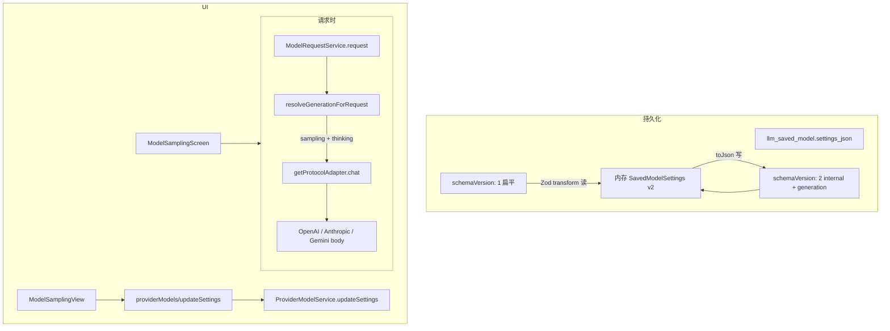

# 模型生成参数与思考能力 技术规格（SPEC）

> **PRD**：[prd.md](./prd.md)  
> **前置**：[provider-model/prd.md](../provider-model/prd.md)、[agent-system/prd.md](../agent-system/prd.md)  
> **建议分支**：`feature/model-generation-params`  
> **范围**：`packages/core/**`（schema、adapter、request service）；`apps/desktop/**`、`apps/mobile/**` 设置 UI；**不**含 CLI thinking 子命令（PRD defer）

## 设计目标

1. **生成参数框架**：`SavedModelSettings` 升为 **schema v2**，区分 `internal`（上下文、计数）与 `generation`（采样、思考）。
2. **思考开关**：每已保存模型 `generation.thinking.enabled`，默认 **关**；开启后三协议 adapter 写入对应请求字段。
3. **零迁移负担**：读 v1 JSON 自动 transform 为 v2 内存形态；写盘统一 v2；存量用户未改设置则请求行为不变。
4. **可扩展**：后续 generation 能力（如 reasoning effort 档位）在 `ModelThinkingParams` / `generation` 下扩展，不新增顶层开关字段。
5. **双端一致**：Desktop `ModelSamplingView`、Mobile `ModelSamplingScreen` 同字段读写。

---

## 总体方案

### 架构概览



### 设计决策

| 项 | 选择 | 理由 |
|----|------|------|
| Schema 版本 | **v2 嵌套**；内存恒为 v2 | PRD 要求 internal/generation 分层；v1 仅作读兼容 |
| Patch / IPC | **保持扁平** `contextWindowTokens` / `tokenCounterMode` / `sampling` / **`thinking`** | Desktop/Mobile 改动小；service 层映射到 v2 |
| 请求载体 | `LlmChatRequest` 增 **`thinking?: ModelThinkingParams`**（与 `sampling` 并列） | 镜像现有 sampling 路径，adapter 分文件映射 |
| thinking 关闭 | `enabled: false` 或缺失 → **不** 向 wire 写任何 thinking 字段 | PRD 兼容现网 |
| thinking 开启且无 params | `resolveThinkingWireDefaults(protocol)` 注入协议默认 | 首版仅 boolean UI |
| Anthropic budget | `budget_tokens = min(10_000, effective_max_tokens - 1)`；`effective_max_tokens` = sampling `max_tokens` 或 body 默认 4096 | API 要求 budget < max_tokens |
| OpenAI | `reasoning_effort: "medium"`（Chat Completions）；不支持时 HTTP 错误向上抛出 | 内置 openai/openrouter 首版；不 silent fail |
| Gemini | `generationConfig.thinkingConfig = { thinkingBudget: -1 }`（2.5 动态）；3.x 系列 detect 用 `thinkingLevel: "medium"`（按 `vendorModelId` 前缀启发式） | 避免同时发 budget 与 level |
| updateSettings 校验 | merge 后 **`savedModelSettingsFromJson(toJson(merged))` round-trip** 或等价 Zod 全量校验 | 关闭 explore 阶段 backlog 缺口 |
| Agent | 不改 `agent-runner`；仍经 `ModelRequestService` 读 saved model | PRD：以实际已保存模型为准 |

---

## 数据模型

### v2 内存与 JSON（canonical）

```typescript
/** 内部预算：不直接映射 HTTP 生成 body */
interface SavedModelInternalSettings {
  readonly contextWindowTokens: number;
  readonly tokenCounterMode: TokenizerOverride;
}

interface SavedModelThinkingSettings {
  readonly enabled: boolean;
  readonly params?: ModelThinkingParams;
}

interface SavedModelGenerationSettings {
  readonly sampling: SavedModelSamplingSettings;
  readonly thinking: SavedModelThinkingSettings;
}

interface SavedModelSettings {
  readonly schemaVersion: 2;
  readonly internal: SavedModelInternalSettings;
  readonly generation: SavedModelGenerationSettings;
}
```

**默认**（`defaultSavedModelSettings`）：

```typescript
{
  schemaVersion: 2,
  internal: { contextWindowTokens: seed..., tokenCounterMode: "auto" },
  generation: {
    sampling: { enabled: false },
    thinking: { enabled: false },
  },
}
```

### ModelThinkingParams（discriminated union，镜像 sampling）

| protocol | TypeScript 字段 | v1 产品默认（enabled 且无 params） |
|----------|-----------------|-----------------------------------|
| `anthropic` | `{ type: "enabled"; budget_tokens: number }` | `type: "enabled"`, budget 见上式 |
| `openai` | `{ reasoning_effort: "low" \| "medium" \| "high" }` | `"medium"` |
| `gemini` | `{ thinkingConfig: { thinkingBudget?: number; thinkingLevel?: string } }` | `{ thinkingBudget: -1 }` 或 `{ thinkingLevel: "medium" }` |

新文件：

- `packages/core/src/domain/provider/model/model-thinking-params.ts`
- `packages/core/src/domain/provider/model/model-thinking-params.schema.ts`
- `packages/core/src/domain/provider/logic/resolve-thinking-wire.ts`（纯函数：`protocol` + `SavedModelThinkingSettings` + optional `max_tokens` → wire 片段）

### v1 → v2 迁移（Zod）

```typescript
// savedModelSettingsDocumentSchema = z.union([
//   v1FlatSchema.transform(toV2Document),
//   v2NestedSchema,
// ]);
```

- **读**：v1 文档 → `thinking: { enabled: false }`，sampling/context/token 迁入对应节点。
- **写**：`savedModelSettingsToJson` **仅输出 v2**。
- **Patch**：`SavedModelSettingsPatch` 增加 `thinking?: SavedModelThinkingSettings`；扁平字段仍写入 `internal` / `generation` 对应子树。

---

## 请求路径

### ModelRequestService（`model-request.service.ts`）

在现有 sampling 解析后增加：

```typescript
let thinking: ModelThinkingParams | undefined = options?.thinking;
if (thinking === undefined) {
  const t = saved.settings.generation.thinking;
  if (t.enabled) {
    thinking = resolveThinkingParamsForProtocol(
      provider.protocol,
      t,
      saved.settings.generation.sampling,
    );
  }
}
// adapter.chat({ ..., sampling, thinking })
```

`resolveThinkingParamsForProtocol`：若 `t.params` 存在且 protocol 匹配则用之；否则 `resolveThinkingWireDefaults(protocol, vendorModelId, sampling)` 构造 `ModelThinkingParams`。

### LlmChatRequest（`adapter.port.ts`）

```typescript
readonly thinking?: ModelThinkingParams;
```

### Adapter 映射

| 文件 | 变更 |
|------|------|
| `anthropic.adapter.ts` | `buildBody`：若 `req.thinking?.protocol === "anthropic"` → `body.thinking = { type, budget_tokens }` |
| `openai.adapter.ts` | `buildBody`：spread 或设 `reasoning_effort`（勿与 text-only shortcut 冲突；thinking 时禁用 shortcut 若需 tools） |
| `gemini.adapter.ts` | `generationConfig.thinkingConfig = { ... }` 合并进现有 `generationConfig` |

**Outbound 注意**：OpenAI 仍拒绝 history 中 `thinking` blocks（现网）；本迭代不修改 mapper，仅 **请求侧** 开启 reasoning。

---

## 最终项目结构

```
packages/core/src/domain/provider/
  model/
    saved-model-settings.ts              # v2 类型；Patch + thinking
    saved-model-settings.schema.ts       # v1|v2 union + transform
    saved-model-settings-from-json.ts    # 读写 v2
    default-saved-model-settings.ts
    model-thinking-params.ts             # NEW
    model-thinking-params.schema.ts      # NEW
  logic/
    resolve-thinking-wire.ts             # NEW

packages/core/src/infra/llm-protocol/
  ports/adapter.port.ts                  # + thinking
  impl/openai.adapter.ts
  impl/anthropic.adapter.ts
  impl/gemini.adapter.ts

packages/core/src/service/provider/
  model-request.port.ts
  impl/model-request.service.ts
  impl/provider-model.service.ts         # patch merge + 校验

packages/core/src/public/provider.ts

apps/desktop/
  shared/ipc-types.ts                    # + thinking on UpdateSettingsRequest
  src/main/ipc/handlers/provider-models.ts
  renderer/features/settings/
    ModelSamplingView.tsx                # 分区文案 + 思考 Switch
    settings-ui 或 generation 小节标题

apps/mobile/
  src/screens/stack/ModelSamplingScreen.tsx

packages/core/test/
  provider/saved-model-settings.schema.test.ts   # v1→v2
  provider/model-thinking-params.schema.test.ts    # NEW
  provider/resolve-thinking-wire.test.ts           # NEW
  provider/model-request-thinking.test.ts          # NEW
  infra/llm-protocol/anthropic-thinking-body.test.ts  # NEW（body 快照）
  infra/llm-protocol/gemini-thinking-body.test.ts     # NEW
  infra/llm-protocol/openai-thinking-body.test.ts     # NEW
  package-exports/snapshots/public-provider-allowlist.json
```

---

## 变更点清单

### Core — Schema & 领域

| 文件 | 变更 |
|------|------|
| `saved-model-settings.ts` | v2 结构；`SavedModelSettingsPatch.thinking`；访问器 helper `savedModelInternal(settings)` / `savedModelGeneration(settings)` 可选 |
| `saved-model-settings.schema.ts` | v1 transform；`savedModelThinkingSettingsSchema`（`enabled` + optional params） |
| `saved-model-settings-from-json.ts` | 输出 v2 |
| `default-saved-model-settings.ts` | v2 默认 |
| `provider-model.service.ts` | merge patch 到 nested；`updateSettings` 后 Zod 校验；`getSaved` 返回 v2 |
| `sqlite-saved-model.repository.ts` | 无 DDL 变更；仍 `settings_json` TEXT |

### Core — 请求与 Adapter

| 文件 | 变更 |
|------|------|
| `model-request.service.ts` | 解析 `generation.thinking` → `LlmChatRequest.thinking` |
| `openai/anthropic/gemini.adapter.ts` | `buildBody` 合并 thinking wire |
| `public/provider.ts` | export `ModelThinkingParams`、`SavedModelThinkingSettings` 等 |

### Desktop

| 文件 | 变更 |
|------|------|
| `ipc-types.ts` | `ProviderModelsUpdateSettingsRequest.thinking?: { enabled: boolean }` |
| `provider-models.ts` | 透传 `thinking` 至 `updateSettings` patch |
| `ModelSamplingView.tsx` | 状态 `thinkingEnabled`；加载 `settings.generation?.thinking ?? settings.thinking`（兼容 v1 内存过渡）；保存 payload 含 `thinking`；UI：**内部预算** 区（上下文、计数）、**生成参数** 区（采样表单 + **思考** Switch） |
| `ModelSamplingView.tsx` | 读 v2：`saved.settings.internal` / `generation`（handler 返回 v2 JSON） |

### Mobile

| 文件 | 变更 |
|------|------|
| `ModelSamplingScreen.tsx` | 同 Desktop：思考 Switch + 分区标题；`updateSettings` patch 含 `thinking` |

### 不改

- `agent-runner.ts`（经 ModelRequestService）
- CLI thinking 子命令
- 响应侧 thinking 块 / stream UI
- `llm_saved_model` 表结构

---

## 详细实现步骤

### 阶段 1 — Schema v2 + thinking 类型（可独立验收）

1. 新增 `model-thinking-params.ts` + schema + `resolve-thinking-wire.ts`。
2. 重构 `saved-model-settings` 为 v2；实现 v1→v2 Zod transform。
3. 更新 `defaultSavedModelSettings`、`savedModelSettingsFromJson` / `ToJson`。
4. 扩展 `SavedModelSettingsPatch`；`provider-model.service.updateSettings` 映射扁平 patch → nested merge + 校验。
5. 单测：v1 文档读入 → v2 内存；默认 thinking off；patch round-trip。

### 阶段 2 — 请求与 Adapter

1. `adapter.port.ts` 增加 `thinking`。
2. 三 adapter `buildBody` 调用 `applyThinkingToBody(body, req.thinking, req)` 纯函数（便于单测）。
3. `model-request.service` 接入 `generation.thinking`。
4. Adapter body 单测：enabled on/off 各协议 JSON 快照。

### 阶段 3 — Desktop / Mobile UI

1. IPC 类型与 handler 扩展 `thinking`。
2. `ModelSamplingView` / `ModelSamplingScreen`：Switch + 分区文案；保存/加载。
3. 手工：双端同一模型开关状态一致。

### 阶段 4 — 回归与导出

1. 更新 `public-provider-allowlist.json`。
2. 跑 `npm test -w @novel-master/core` 相关子集 + desktop/mobile 若有模型设置测。
3. `npm run build`（core 包）。

---

## 测试策略

### 单元测试

| 文件 | 用例 |
|------|------|
| `saved-model-settings.schema.test.ts` | v1 `{schemaVersion:1,...}` → v2 + thinking false；v2 严格解析；缺 thinking → default false |
| `model-thinking-params.schema.test.ts` | 三协议 discriminated union |
| `resolve-thinking-wire.test.ts` | Anthropic budget < max_tokens；OpenAI effort；Gemini budget vs level 分支 |
| `model-request-thinking.test.ts` | saved thinking enabled → mock adapter 收到 thinking；disabled → undefined |
| `anthropic/openai/gemini-thinking-body.test.ts` | `buildBody` 含/不含 thinking 字段 |
| `provider-model.service.test.ts` | updateSettings patch `{ thinking: { enabled: true } }` 持久化 v2 JSON |

### 手工验收（PRD）

| 场景 | 预期 |
|------|------|
| 存量模型未改设置 | Agent 请求无 thinking wire 字段 |
| Anthropic 模型开启思考 | 流式/最终消息可见思考；body 含 `thinking` |
| Desktop 开启 → Mobile 查看 | 开关为开 |
| 不支持模型开启思考 | 可理解 HTTP/Provider 错误，非挂起 |

---

## 兼容性与迁移

| 项 | 说明 |
|----|------|
| DB | **无** migration；`settings_json` 仍 TEXT |
| 读 v1 | 无限期支持 transform |
| 写 | 首次保存后升级为 v2 JSON |
| IPC | 增 optional `thinking`；旧 Desktop 不发该字段 → 默认不改 thinking |
| Core public API | 新增 export；`SavedModelSettings.schemaVersion` 变为 `2` — **破坏性类型变更**，仅 TS 消费者需改访问路径；运行时 JSON 兼容 |
| OpenAI history | 仍须 strip outbound thinking blocks；与开启 reasoning **请求** 独立 |

---

## 风险与回滚方案

| 风险 | 缓解 | 回滚 |
|------|------|------|
| Anthropic budget vs max_tokens | `resolve-thinking-wire` 统一计算 effective max | 关 thinking 即回退 |
| OpenAI 代理不支持 `reasoning_effort` | ProviderError 带 HTTP 信息；PRD 验收可判定失败 | 用户关开关 |
| Gemini 型号差异 | `vendorModelId` 启发式选 budget/level | 文档 + follow-up 高级 params |
| TS v2 嵌套破坏编译 | 同 PR 内修 core 内所有 `settings.sampling` 访问点 | revert schema commit |
| text-only shortcut 与 thinking | thinking enabled 时禁用 shortcut 或 shortcut 仍合并 reasoning 字段 | adapter 单测锁定 |

**分阶段回滚**：阶段 3 UI → 阶段 2 adapter → 阶段 1 schema（互不强制依赖除请求链）。

---

## 建议实现顺序与提交粒度

1. `feat(core): SavedModelSettings schema v2 与 thinking 类型`
2. `feat(core): adapter 与 ModelRequestService 接入 thinking`
3. `feat(desktop): 模型设置页思考开关`
4. `feat(mobile): 模型设置页思考开关`
