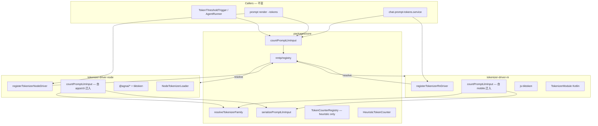

# NMTP（Novel Master Tokenizer Protocol）技术规格（SPEC）

> **PRD**：[prd.md](./prd.md)  
> **Supersedes**：无整体替代；本 SPEC **不改变** [model-aware-token-counting/spec.md](../model-aware-token-counting/spec.md) 中的计数口径、族解析、序列化规则，仅重构 **平台接入层**，对齐 [TDBC/spec.md](../TDBC/spec.md) / [SKSP](../sksp/prd.md) 的 driver + registry 模式。  
> **分支建议**：`feature/nmtp`

---

## 设计目标

1. **协议对齐**：在 `packages/core/src/infra/nmtp/` 建立 port + registry（零平台依赖），镜像 `infra/tdbc`、`infra/sksp`。
2. **双 driver 落地**：`@novel-master/tokenizer-driver-node`（CLI / 未来 Electron）、`@novel-master/tokenizer-driver-rn`（Android RN，含 Kotlin 原生模块）。
3. **彻底移除 global bridge**：删除 `NM_PROMPT_TOKEN_COUNTER_KEY`、`NM_TOKENIZER_LOADER_KEY` 及 dynamic import 隐式 Node 回退。
4. **core 瘦身**：`@novel-master/core` 移除 `tiktoken`、`@agnai/sentencepiece-js`、`@agnai/web-tokenizers`；重实现迁入 node driver。
5. **零行为回归**：`countPromptLlmInput` 对外签名不变；相同 fixture 下 `tokenCount` / `counterKind` / `estimated` 与重构前一致。
6. **可测试**：`clearTokenizerDrivers()` 隔离单测；未 register 时 `TokenizerError` 指明应调用的 register 函数。

---

## 现状与约束（代码探索）

| 模块 | 现状 | 本迭代变更 |
|------|------|------------|
| `count-prompt-llm-input.ts` | `globalThis[NM_PROMPT_TOKEN_COUNTER_KEY]` → bridge；否则 dynamic import `count-prompt-llm-input-node` | 改调 `resolveTokenizerDriver().countPromptLlmInput()` |
| `count-prompt-llm-input-node.ts` | core 内 Node 全族实现，依赖 `tiktoken`、`@agnai/*` | **迁入** `tokenizer-driver-node` |
| `web-tokenizer-counter.ts` / `sentencepiece-token-counter.ts` | core `impl/`，依赖 `getTokenizerLoader()` | **迁入** node driver |
| `tiktoken-token-counter.ts` | core `impl/`，`createDefaultTokenCounterRegistry` 与 node 计数共用 | **迁入** node driver；core registry **不再** 实例化 |
| `tokenizer-loader-shared.ts` / `get-tokenizer-loader.ts` | global `NM_TOKENIZER_LOADER_KEY` | `tokenizerAssetPaths` **留 core**（纯路径表）；`TokenizerLoader` + fs 读 **迁入** node driver |
| `create-default-registry.ts` | `forVendorModel` 对 GPT 族 `new TiktokenTokenCounter` | **仅返回 `heuristic`**（族解析由 `resolveTokenizerFamily` 承担；精确计数由 driver） |
| `apps/cli/src/tokenizer/*` | `installNodeTokenizerLoader` + `installNodePromptTokenCounter` 写 global | **删除**；改 `registerTokenizerNodeDriver()` |
| `apps/mobile/src/tokenizer/*` | `installMobilePromptTokenCounter` 写 global | **迁入** `tokenizer-driver-rn`；`polyfills.ts` 移除安装 |
| `apps/mobile/android/.../tokenizer/*.kt` | `TokenizerPackage` 在 `MainApplication` 手动注册 | **迁入** `tokenizer-driver-rn/android/`（对齐 `sksp-android`） |
| `apps/mobile/metro.config.js` | blockList node-only core 路径；stub `count-prompt-llm-input-node`；polyfills 装 bridge | 移除 node stub / 相关 blockList 项；RN 依赖 driver package |
| `core/package.json` exports | `./tokenizer-node` 指向 node 计数 | **删除**；新增 `./nmtp` |
| `token-threshold.trigger.ts` | 调 `countPromptLlmInput` | **不变**（经 NMTP registry 间接使用 driver） |
| `install-node-test-tokenizer-loader.ts` | core test helper 写 global | **迁入** node driver test helper，改 `registerTokenizerNodeDriver()` |

**架构约束**（`packages/core/ARCHITECTURE.md`）：

- NMTP 属 infra **adapter 型**：`ports/` + `logic/registry` + 平台 driver 包。
- domain / service 继续调 `countPromptLlmInput`（core 稳定 API），不直接依赖 driver 包。
- app 层（CLI / Mobile）负责 `registerTokenizerXxxDriver()`，与 `registerBetterSqlite3Driver()` 并列。

**RN 约束**（延续 [android-native-tokenizer-bridge/spec.md](../model-aware-token-counting/features/android-native-tokenizer-bridge/spec.md)）：

- RN driver **不得** 静态依赖 `@agnai/*`；GPT 用 `js-tiktoken`（peer/dep）；WEB/SP 走 Kotlin `NovelMasterTokenizer`。
- Metro 继续 shim `tiktoken` → `js-tiktoken`（在 mobile app 或 rn driver 文档中说明）。

**资产路径（平台分拆，保持现状）**：

| 平台 | 资产目录 | 读取方 |
|------|----------|--------|
| Node driver | `packages/tokenizer-driver-node/assets/tokenizers/`（由 `apps/cli/assets/tokenizers` 迁入） | `NodeTokenizerLoader.readJson/readModel` |
| Android native | `packages/tokenizer-driver-rn/android/src/main/assets/tokenizers/`（由 `apps/mobile/android/app/src/main/assets/tokenizers` 迁入） | Kotlin `TokenizerAssetPaths` |
| Mobile JS 侧 | `apps/mobile/assets/tokenizers/` 可 **删除**（若仅作文档/冗余副本） | 不再被 JS 读取 |

---

## 总体方案

### 架构（变更后）



### NMTP 协议（core）

**路径**：`packages/core/src/infra/nmtp/`

```typescript
// ports/tokenizer-driver.port.ts
export interface TokenizerDriver {
  readonly name: string;
  countPromptLlmInput(
    params: CountPromptLlmInputParams,
  ): Promise<PromptTokenCountResult>;
}

// logic/registry.ts — 语义对齐 sksp/registry.ts、tdbc/registry.ts
export function registerTokenizerDriver(driver: TokenizerDriver): void;
export function getTokenizerDriver(name: string): TokenizerDriver | undefined;
export function resolveTokenizerDriver(explicit?: string): TokenizerDriver;
export function clearTokenizerDrivers(): void; // @internal tests

// nmtp-error.ts
export type TokenizerErrorCode = "NOT_REGISTERED" | "MULTIPLE_DRIVERS";
```

**`resolveTokenizerDriver` 规则**（与 TDBC/SKSP 一致）：

- `explicit` 有值 → 按名查找，缺失抛 `TokenizerError NOT_REGISTERED`。
- 未指定且 registry 仅 1 个 driver → 返回该 driver。
- 0 个或多个 → 抛 `NOT_REGISTERED`，消息含 `registerTokenizerNodeDriver()` / `registerTokenizerRnDriver()` 提示。

**`countPromptLlmInput`（core，改写）**：

```typescript
export async function countPromptLlmInput(
  params: CountPromptLlmInputParams,
): Promise<PromptTokenCountResult> {
  return resolveTokenizerDriver().countPromptLlmInput(params);
}
```

- 删除 `NM_PROMPT_TOKEN_COUNTER_KEY`、`PromptTokenCounterBridge`、`injectedPromptTokenCounter`。
- 保留 `countPromptLlmInputHeuristicOnly`（纯 core 单测 / 无 driver 场景文档化例外；**产品路径**必须 register driver）。

**`TokenCounterRegistry` 收敛**：

- `createDefaultTokenCounterRegistry`：`createCounterForFamily` **统一返回 `this.heuristic`**（删除 `TiktokenTokenCounter` import）。
- `registry.forVendorModel` 仍可用于「按族缓存 heuristic 实例」或简化为始终 `heuristic`（实现任选，对外行为：`.kind === "heuristic"`）。
- 精确 tiktoken/web/sp 计数 **仅** 在 driver 内完成。

**core 保留文件**（不迁出）：

| 文件 | 职责 |
|------|------|
| `infra/tokenizer/ports/token-counter*.port.ts` | 计数器与 registry 契约 |
| `infra/tokenizer/impl/heuristic-token-counter.ts` | 启发式 fallback |
| `infra/tokenizer/logic/serialize-prompt-input.ts` | 统一序列化 |
| `infra/tokenizer/logic/resolve-tokenizer-family.ts` | 族解析 |
| `infra/tokenizer/logic/resolve-context-window.ts` | context window |
| `infra/tokenizer/logic/read-token-counter-mode-pref.ts` | 用户覆盖 |
| `infra/tokenizer/logic/create-default-registry.ts` | heuristic-only registry |
| `infra/tokenizer/logic/count-prompt-llm-input.ts` | 入口 + `formatPromptTokenUsageLabel` |
| `infra/nmtp/*` | driver port + registry + error |

**core 删除文件**：

| 文件 |
|------|
| `logic/count-prompt-llm-input-node.ts` |
| `impl/tiktoken-token-counter.ts` |
| `impl/web-tokenizer-counter.ts` |
| `impl/sentencepiece-token-counter.ts` |
| `impl/get-tokenizer-loader.ts` |
| `impl/tokenizer-loader-shared.ts` 中 loader 注入部分（`tokenizerAssetPaths` 迁至 `logic/tokenizer-asset-paths.ts`） |
| `logic/count-openai-style-message.ts` |
| `logic/openai-message-token-count.ts` |

---

## 最终项目结构

```text
packages/core/src/infra/
├── nmtp/
│   ├── ports/tokenizer-driver.port.ts
│   ├── logic/registry.ts
│   ├── nmtp-error.ts
│   └── index.ts
└── tokenizer/          # 计数规则与 heuristic（无平台重依赖）
    ├── ports/
    ├── impl/heuristic-token-counter.ts
    └── logic/          # serialize, resolve-family, create-default-registry, count-prompt-llm-input

packages/tokenizer-driver-node/
├── package.json
├── tsconfig.json
├── assets/tokenizers/          # 自 apps/cli/assets/tokenizers 迁入
├── src/
│   ├── index.ts
│   ├── register.ts             # registerTokenizerNodeDriver()
│   ├── count-prompt-llm-input.ts
│   ├── node-tokenizer-loader.ts
│   └── impl/
│       ├── tiktoken-token-counter.ts
│       ├── web-tokenizer-counter.ts
│       └── sentencepiece-token-counter.ts
│   └── logic/
│       ├── count-openai-style-message.ts
│       └── openai-message-token-count.ts
└── test/
    ├── registry.test.ts        # 可选：driver 级冒烟
    └── count-prompt-llm-input.test.ts  # 自 core 迁入并改 register

packages/tokenizer-driver-rn/
├── package.json                # react-native.android.sourceDir: "./android"
├── tsconfig.json
├── src/
│   ├── index.ts
│   ├── register.ts             # registerTokenizerRnDriver()
│   ├── native.ts               # 自 apps/mobile/src/tokenizer/native-tokenizer.ts
│   └── count-prompt-llm-input.ts  # 自 mobile-prompt-token-counter.js（可转 .ts）
└── android/
    ├── build.gradle
    ├── src/main/AndroidManifest.xml
    ├── src/main/assets/tokenizers/   # 自 apps/mobile/android/.../assets 迁入
    └── src/main/java/com/novelmaster/tokenizer/
        ├── TokenizerPackage.kt
        ├── TokenizerModule.kt
        ├── TokenizerEngine.kt
        ├── TokenizerAssetPaths.kt
        └── WebPromptConverter.kt

apps/cli/
├── package.json                  # + @novel-master/tokenizer-driver-node
└── src/runtime.ts                # registerTokenizerNodeDriver()；删 tokenizer/

apps/mobile/
├── package.json                  # + @novel-master/tokenizer-driver-rn；prestart/preandroid 增 build driver
├── src/db/connection.ts          # registerTokenizerRnDriver()
├── src/polyfills.ts              # 仅 fast-text-encoding；删 tokenizer install
├── metro.config.js               # 简化 blockList / 删 node stub
└── android/.../MainApplication.kt  # TokenizerPackage 改 import driver 包或依赖 autolink
```

**`package.json` exports（core）**：

```json
"./nmtp": {
  "types": "./dist/infra/nmtp/index.d.ts",
  "import": "./dist/infra/nmtp/index.js"
}
```

删除 `"./tokenizer-node"` export。

**Driver 包 exports**（对齐 `tdbc-driver-rn`）：

```json
// tokenizer-driver-rn
".": { "import": "./dist/index.js" },
"./native": { "import": "./dist/register.js" }   // 或 register 放 index，native 仅 re-export
```

---

## 变更点清单

### Core

| 操作 | 路径 |
|------|------|
| 新增 | `infra/nmtp/ports/tokenizer-driver.port.ts` |
| 新增 | `infra/nmtp/logic/registry.ts` |
| 新增 | `infra/nmtp/nmtp-error.ts` |
| 新增 | `infra/nmtp/index.ts` |
| 新增 | `infra/tokenizer/logic/tokenizer-asset-paths.ts`（自 loader-shared 拆出纯路径） |
| 修改 | `infra/tokenizer/logic/count-prompt-llm-input.ts` — registry 解析 |
| 修改 | `infra/tokenizer/logic/create-default-registry.ts` — heuristic-only |
| 修改 | `infra/tokenizer/index.ts` — 删 global 导出；可选 re-export nmtp |
| 修改 | `index.ts` — 导出 `registerTokenizerDriver` 等；删 `NM_*_KEY`、`getTokenizerLoader`、`TiktokenTokenCounter` |
| 修改 | `package.json` — 删重依赖；加 `./nmtp`；删 `./tokenizer-node` |
| 删除 | 见上文「core 删除文件」 |
| 修改 | `test/infra/tokenizer/registry.test.ts` — 期望全 heuristic |
| 修改 | `test/infra/tokenizer/count-prompt-llm-input.test.ts` — 用 node driver register |
| 删除 | `test/infra/tokenizer/install-node-test-tokenizer-loader.ts` |
| 删除 | `test/infra/tokenizer/tiktoken-token-counter.test.ts`（迁至 node driver） |

### tokenizer-driver-node（新建）

| 操作 | 说明 |
|------|------|
| 新建 package | 依赖 `@novel-master/core`、`tiktoken`、`@agnai/*` |
| 迁入 | `count-prompt-llm-input-node`、web/sp/tiktoken impl、openai 计数 logic |
| 迁入资产 | `apps/cli/assets/tokenizers` → `packages/tokenizer-driver-node/assets/tokenizers` |
| `register.ts` | 构造 `TokenizerDriver { name: "node", countPromptLlmInput }` 并 `registerTokenizerDriver`；内部持有 `NodeTokenizerLoader` |

### tokenizer-driver-rn（新建）

| 操作 | 说明 |
|------|------|
| 新建 package | 依赖 `@novel-master/core`；peer `react-native`；dep `js-tiktoken` |
| 迁入 JS | `mobile-prompt-token-counter.js` → `count-prompt-llm-input.ts` |
| 迁入 native | Kotlin 五文件 + `androidTest` 至 `packages/tokenizer-driver-rn/android/` |
| 迁入资产 | Android `assets/tokenizers` |
| `register.ts` | `name: "rn"` |

### apps/cli

| 操作 | 路径 |
|------|------|
| 修改 | `package.json` — 依赖 `tokenizer-driver-node` |
| 修改 | `runtime.ts` — `registerTokenizerNodeDriver()` 替换 install 两行 |
| 删除 | `src/tokenizer/` 目录 |

### apps/mobile

| 操作 | 路径 |
|------|------|
| 修改 | `package.json` — 依赖 `tokenizer-driver-rn`；`prestart`/`preandroid` build driver |
| 修改 | `src/db/connection.ts` — `registerTokenizerRnDriver()` |
| 修改 | `src/polyfills.ts` — 移除 tokenizer |
| 修改 | `metro.config.js` — 删 stub、精简 blockList、更新 smokeFiles |
| 删除 | `src/tokenizer/`、`src/shims/count-prompt-llm-input-node.stub.js` |
| 修改 | `__tests__/mobile-prompt-token-counter.test.ts` — 改 import 路径至 driver 包 |
| 修改 | `android/.../MainApplication.kt` — TokenizerPackage 来自 autolink 或显式 import driver 包 |
| 删除 | `android/.../java/com/novelmaster/tokenizer/`（已迁出） |
| 可选删除 | `apps/mobile/assets/tokenizers`（若确认无引用） |

### 根 monorepo

| 操作 | 说明 |
|------|------|
| `tsconfig` references | 加入两个新 package（若使用 project references） |
| `npm run build` | workspaces 自动包含新包 |

---

## 详细实现步骤

### Phase 1 — NMTP 协议层（core）

1. 新增 `infra/nmtp/`（port、registry、`TokenizerError`），单测 `registry.test.ts`（0/1/多 driver、clear）。
2. 改写 `countPromptLlmInput` 使用 `resolveTokenizerDriver`；删除 global 与 dynamic import。
3. 拆分 `tokenizerAssetPaths` 到 `logic/tokenizer-asset-paths.ts`。
4. 简化 `create-default-registry.ts` 为 heuristic-only；更新 `registry.test.ts`。
5. 更新 `infra/tokenizer/index.ts`、`core/index.ts`、`package.json` exports（先 **暂不删** node 实现文件，保证 Phase 1 可单独测 registry）。

**验证**：`packages/core` 单测中 `countPromptLlmInput` 在未 register 时抛 `TokenizerError`。

### Phase 2 — tokenizer-driver-node

1. 创建 `packages/tokenizer-driver-node`，迁入 Node 实现与资产。
2. 实现 `registerTokenizerNodeDriver()`：注册时可选传入 `assetsRoot`（默认 package 内 `assets/tokenizers`）。
3. 将 `count-prompt-llm-input.test.ts`、`tiktoken-token-counter.test.ts` 迁至 driver 包；测试 helper `registerTokenizerNodeDriverForTests(assetsRoot?)`。
4. 更新 core 测试：`token-threshold-trigger.test.ts` 等改为依赖 node driver register。

**验证**：`npm run test -w @novel-master/tokenizer-driver-node` 与 core 相关测试绿。

### Phase 3 — tokenizer-driver-rn

1. 创建 `packages/tokenizer-driver-rn`，迁入 JS 计数逻辑。
2. 迁入 Kotlin 模块与 `android/src/main/assets/tokenizers`；配置 `package.json` `react-native.android.sourceDir`。
3. 实现 `registerTokenizerRnDriver()`。
4. 更新 `MainApplication.kt`：移除旧路径 `com.novelmaster.tokenizer`，依赖 autolink（与 `sksp-android` 相同模式，必要时保留显式 `add(TokenizerPackage())`）。
5. 迁移 `mobile-prompt-token-counter.test.ts` import 至 driver 包。

**验证**：`npm run test -w @novel-master/mobile`；Android 仪器测试 `TokenizerParityTest` 在迁路径后仍绿。

### Phase 4 — 应用接线与清理

1. CLI `runtime.ts`：`registerTokenizerNodeDriver()`；删 `apps/cli/src/tokenizer/`。
2. Mobile `connection.ts` + `polyfills.ts`；删 `apps/mobile/src/tokenizer/`。
3. 精简 `metro.config.js`（移除 node stub、与已删 core 文件相关的 blockList）。
4. 从 core **物理删除** 已迁出文件；`package.json` 移除 `tiktoken`、`@agnai/*`、`tokenizer-node` export。
5. 全仓库 `rg NM_PROMPT_TOKEN_COUNTER|NM_TOKENIZER_LOADER` 为零结果。

**验证**：`npm run build && npm run test` 全 workspace；`nm prompt render --tokens` 冒烟；Mobile 顶栏 token 显示冒烟。

---

## 测试策略

### 单元测试

| 包 | 用例 |
|----|------|
| core `nmtp/registry` | 未注册抛错；单 driver 自动解析；多 driver 需 explicit；`clearTokenizerDrivers` 隔离 |
| core `tokenizer` | heuristic、serialize、resolveTokenizerFamily、heuristic-only registry |
| core `count-prompt-llm-input` | 未 register 抛错；**不**再测全族精确计数 |
| tokenizer-driver-node | GPT/Claude/llama fixture 计数；与迁前 baseline 一致；loader 读 assets |
| tokenizer-driver-rn | GPT tiktoken；native mock WEB/SP；heuristic fallback；`estimated` 标志 |

### 集成 / 冒烟

| 场景 | 命令 / 操作 | 期望 |
|------|-------------|------|
| CLI tokens | `nm prompt render --path <yaml> --tokens --model openai/gpt-4o` | stderr JSON 含 `counterKind: "tiktoken"`，`estimated: false` |
| CLI claude | `--model anthropic/claude-3-5-sonnet` | `counterKind: "claude"` |
| Compaction | `token-threshold-trigger.test.ts` | 阈值触发与迁前一致 |
| Mobile Jest | `npm run test -w @novel-master/mobile` | 全绿 |
| Android native | `./gradlew :app:test` 或现有 `TokenizerParityTest` | 与 CLI 容差一致 |

### 回归 baseline

在 Phase 2 开始前，对以下 fixture **快照** `PromptTokenCountResult`（写入 driver 测试）：

- `openai/gpt-4o`
- `anthropic/claude-3-5-sonnet`
- `google/gemini-2.0-flash`
- 固定 `PromptLlmInput`（system + 2–3 messages，含 tool_use/tool_result）

---

## 风险与回滚方案

| 风险 | 缓解 | 回滚 |
|------|------|------|
| Kotlin 迁包后 autolink / Gradle 路径失败 | 对齐 `sksp-android/android/build.gradle`；`MainApplication` 保留显式 `TokenizerPackage` | 暂留 Kotlin 于 `apps/mobile/android`，仅 JS 用 driver 包 |
| Metro 解析 driver 包失败 | `watchFolders` 已含 monorepo root；`prestart` build driver；smokeFiles 更新 | mobile 暂从 app 内 re-export driver |
| core 删依赖后某测试隐式依赖 tiktoken | 全量 `npm run test`；grep `from "tiktoken"` in core | 恢复 core 可选 dep（违背 PRD，仅紧急） |
| 多 driver 同时注册（CLI 测试误注册 RN） | 测试 `beforeEach` → `clearTokenizerDrivers()` | — |
| `registry.forVendorModel` 行为变更 | 文档注明「精确计数在 driver」；更新 R2 测试期望 heuristic | — |

**回滚策略**：本迭代为纯重构，可整分支 revert；若需部分回滚，保留 NMTP registry 但临时在 `countPromptLlmInput` 内恢复 node dynamic import（**不推荐**，与 PRD「不保留技术债」冲突）。

---

## 实现检查清单（编码前）

- [ ] 用户已确认本 SPEC
- [ ] Phase 顺序：协议层 → node driver → rn driver → 应用清理
- [ ] 迁出前拍摄 token 计数 baseline
- [ ] Android 资产与 Kotlin 同包迁移，避免双份 `assets/tokenizers`
- [ ] 完成后 `rg NM_PROMPT_TOKEN_COUNTER|NM_TOKENIZER_LOADER` 为零
