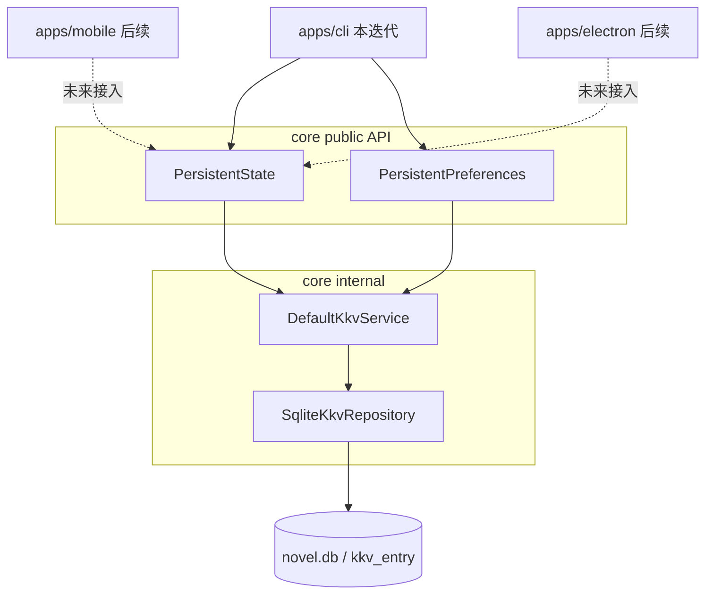

# 持久化状态与持久化配置 技术规格（SPEC）

## 设计目标

- 用 **`PersistentState`（持久化状态）** 与 **`PersistentPreferences`（持久化配置）** 替代 `ConfigService` + `global-config`，对外 **不再导出** `KkvService` / `ConfigService`。
- **KKV 仅作 core 内部实现**（`kkv_entry` 表不变）；状态与配置分属不同 KKV `module`，禁止再写入 `global-config`。
- **v1 冻结**：状态 4 指针；配置仅 `session-fs.versionCheck`（默认 `true`）。
- **本迭代交付范围（实现）**：仅 **`packages/core` + `apps/cli`**。RN App、Electron **不改动、不新建**；后续迭代再接入同一公开 API。
- **v1 不自动迁移** `global-config` 历史行；v2 bootstrap 会 **purge** 遗留 `global-config` KKV（指针改走 `nm-workspace-state`）。

**与 PRD 差异**：PRD 要求三端同发；本 SPEC 按产品拍板 **先出 CLI**。App/Electron 跨端验收移至后续迭代；core 公开 API 已按多客户端设计，供未来直接消费。

**Supersedes**：迭代 `global-config-system`（实现合并后在彼 `prd.md` / `spec.md` 顶部加 superseded 注记）。

### Preferences v2 注记（2026-06-07，`feature/preferences-v2`）

v2 在 v1 基础上将跨端**行为配置**上收到 `nm-preferences`，由 `PersistentPreferences` 显式 API 暴露。详见 [storage-schema-alignment/spec.md](../storage-schema-alignment/spec.md)。

| 新 key（`nm-preferences`） | 类型 | 默认 | 来源（bootstrap 迁移） |
| --- | --- | --- | --- |
| `session-fs.versionCheck` | boolean | `true` | v1 已有 |
| `chat.llmStream` | boolean | `true` | `nm-mobile-ui` / `nm-desktop-ui` → `llmStream` |

**已移除（2026-06-07）**：`chat.showFullToolParams`、`session-fs.checkpointRetention` — 无产品价值；bootstrap `migratePurgeRemovedPreferenceKeys` 删除 DB 中残留。

**端口**：`PersistentPreferences` v2 方法（`getLlmStreamEnabled`、`getSessionFsVersionCheck` 等）；UI **禁止**裸写 `setPreference` 写上述 key（CLI `nm preferences` 除外）。

**Bootstrap**：`migrateClientUiBehaviorPrefsToPreferences`（仅 `llmStream`）；`migratePurgeRemovedPreferenceKeys`；`migratePurgeGlobalConfigKkv`。

**KKV 导出收敛**：主入口 `@novel-master/core` **不再**导出 `createKkvService` / `KkvService`；App Client UI 经 `@novel-master/core/kkv` 子路径获取工厂（仅 runtime / `AppUiPreferences` 使用）。

| 客户端 | wiring 状态（2026-06-07） |
| --- | --- |
| **CLI** | ✅ `nm preferences` 支持 `session-fs.versionCheck`、`chat.llmStream` |
| **Mobile** | ✅ Profile 读写 `llmStream` / `session-fs.versionCheck` |
| **Desktop** | ✅ WorkspaceSettings 读写 `llmStream` / `session-fs.versionCheck` |

**指针契约（不变）**：`currentProviderId` **CLI 专用**；mobile/desktop **不**调用 `setCurrentProviderId`；app 以 `currentModelId` 为 LLM 权威。

---

## 现状与约束（代码探索）

| 项 | 现状 | 影响 |
|----|------|------|
| 存储 | `kkv_entry(module, key, value)`，`bootstrapNovelMaster` 已建表 | 无 DDL 变更；仅改 module 名与调用方 |
| `DefaultConfigService` | `module = "global-config"`，通用 `get/set/getBoolean/...` | 删除公开面；逻辑拆到两端口 + 内部 KKV |
| `packages/core/src/index.ts` | 导出 `createKkvService`、`createConfigService`、`KkvError`、`ConfigError` | 改为导出 `createPersistentState`、`createPersistentPreferences`、`PreferencesError`（见下） |
| `apps/cli/src/runtime.ts` | `kkv` + `config` 挂 `NovelMasterRuntime` | 改为 `state` + `preferences`；去掉 `kkv` |
| Scope | `CliScopeResolver` / `resolve-provider-scope` 读 `config.get("current*")` | 改读 `PersistentState` 同名语义方法 |
| 联动规则 | 写在 `project/commands.ts`、`session/commands.ts`、`provider/commands.ts` 等 | **保留在 CLI**；core 只存取值，不封装 `useProject` |
| `nm config` | `apps/cli/src/config-cmd/commands.ts` | **删除** |
| `nm kkv` | `apps/cli/src/kkv/commands.ts`，`main.ts` 路由 | **删除**（PRD：不对普通用户暴露；排障用 `nm preferences` + state 由 `use` 体现） |
| `apps/mobile` | 已用 core，**未**用 ConfigService | **本迭代不修改** |
| `apps/electron` | 不存在 | **本迭代不新建** |
| Agent | `agent-runner.test` 仅断言 runner 不读 ConfigService | 无改动 |
| 测试 helper | `apps/cli/test/helpers.ts` 的 `readCliConfig` 用 `createConfigService` | 改为 `createPersistentState` |

---

## 总体方案

### 架构



### KKV module 定案（内部）

| module | 用途 | v1 keys |
|--------|------|---------|
| `nm-workspace-state` | 持久化状态 | `currentProjectId`, `currentSessionId`, `currentProviderId`, `currentModelId` |
| `nm-preferences` | 持久化配置 | `session-fs.versionCheck` → `"true"` / `"false"` |

**禁止**：新代码写入 `global-config`；读取时 **不** 回退读旧 module。

### 公开类型命名（冻结）

| 产品用语 | 代码 |
|----------|------|
| 持久化状态 | `PersistentState`，工厂 `createPersistentState(conn)` |
| 持久化配置 | `PersistentPreferences`，工厂 `createPersistentPreferences(conn)` |
| 配置类型错误 | `PreferencesError`（`code: "INVALID_VALUE"`），替代对外 `ConfigError` |

### `PersistentState` 接口（薄、v1 显式指针）

```typescript
export interface PersistentState {
  getCurrentProjectId(): Promise<string | undefined>;
  setCurrentProjectId(id: string): Promise<void>;
  resetCurrentProjectId(): Promise<void>;

  getCurrentSessionId(): Promise<string | undefined>;
  setCurrentSessionId(id: string): Promise<void>;
  resetCurrentSessionId(): Promise<void>;

  getCurrentProviderId(): Promise<string | undefined>;
  setCurrentProviderId(id: string): Promise<void>;
  resetCurrentProviderId(): Promise<void>;

  getCurrentModelId(): Promise<string | undefined>;
  setCurrentModelId(id: string): Promise<void>;
  resetCurrentModelId(): Promise<void>;
}
```

实现：`DefaultPersistentState` 内聚 `KkvService` + `MODULE = "nm-workspace-state"`；`get*` 将 `KkvError NOT_FOUND` 转为 `undefined`；`reset*` 删除 key（不存在则成功，与现 `ConfigService.reset` 一致）。

### `PersistentPreferences` 接口（v1 仅 versionCheck + 可选 list 供调试）

```typescript
export interface PersistentPreferences {
  /** 默认 true；未存储时返回 true */
  getSessionFsVersionCheck(): Promise<boolean>;
  setSessionFsVersionCheck(enabled: boolean): Promise<void>;
  resetSessionFsVersionCheck(): Promise<void>;

  /** 列出 nm-preferences 下所有项（排序）；供 `nm preferences list` 与排障 */
  list(): Promise<ReadonlyArray<{ key: string; value: string }>>;
}
```

v1 **不** 对外暴露通用 `get(key)`，避免第二配置桶；新增偏好须改 PRD 并扩展接口。

内部复用 `infra/kkv-value-codec.ts`（`parseBoolean` / `formatBoolean`，从现 `config.service` 抽出）。

### CLI 行为映射（联动规则不变）

| 命令 | 状态/配置写入 |
|------|----------------|
| `project create` | `setCurrentProjectId`；`resetCurrentSessionId` |
| `project use` | 同上 |
| `project delete`（删的是 current） | `resetCurrentProjectId`；`resetCurrentSessionId` |
| `session create` | `setCurrentProjectId`；`setCurrentSessionId` |
| `session use` | `setCurrentProjectId(session.projectId)`；`setCurrentSessionId` |
| `session delete`（删的是 current） | `resetCurrentSessionId` |
| `provider use` | `setCurrentProviderId` |
| `provider delete` | 若 current provider → `resetCurrentProviderId`；若 `currentModelId` 前缀匹配 → `resetCurrentModelId` |
| `model use` | `setCurrentModelId` |
| `session vfs write` | `preferences.getSessionFsVersionCheck()` → `runWrite(..., { defaultNoVersionCheck: !enabled })` |

Scope 解析：**flag > PersistentState > Error**（与现网一致）。

### CLI：替代 `nm config`

新增 **`nm preferences`**（薄包装，非 KKV 暴露）：

```text
nm preferences get session-fs.versionCheck
nm preferences set session-fs.versionCheck <true|false>
nm preferences reset session-fs.versionCheck
nm preferences list
```

实现：`apps/cli/src/preferences-cmd/commands.ts`；`main.ts` 用 `preferences` 替换 `config` 路由；**不** 增加 `nm state`（状态仅通过 `project/session/provider/model use|current`）。

### App / Electron（本迭代）

**不交付**。`apps/mobile`、`apps/electron` 零改动。后续 App/Electron 仅依赖 core 已导出的 `createPersistentState` / `createPersistentPreferences`，无需再暴露 KKV。

**本迭代「多消费者」验收**：在 core 测试中对**同一 `TdbcConnection`** 创建两个 `PersistentState` / `PersistentPreferences` 工厂实例，验证读写一致（模拟未来第二客户端，非真实 App 代码）。

---

## 最终项目结构

```
packages/core/src/
  infra/kkv-value-codec.ts                    # 新增：boolean 编解码
  service/kkv/                                # 保留，package 内 internal
  service/persistent-state/
    persistent-state.port.ts
    impl/persistent-state.service.ts
    create-persistent-state.ts
  service/persistent-preferences/
    persistent-preferences.port.ts
    impl/persistent-preferences.service.ts
    create-persistent-preferences.ts
  errors/preferences-errors.ts                # 由 config-errors 改名/替换
  service/config/                             # 删除
  index.ts                                    # 改导出

packages/core/test/
  persistent-state/persistent-state.test.ts
  persistent-preferences/persistent-preferences.test.ts
  persistent/multi-consumer-contract.test.ts  # 同 conn 多实例（模拟未来客户端）

apps/cli/src/
  runtime.ts                                  # state + preferences
  config/resolve-scope.ts                     # PersistentState
  config/resolve-provider-scope.ts
  preferences-cmd/commands.ts                 # 新增
  project|session|provider|model/commands.ts  # config → state
  session/commands.ts                         # preferences
  main.ts                                     # 去掉 config/kkv
  config-cmd/                                 # 删除
  kkv/                                        # 删除

apps/cli/test/
  helpers.ts                                  # readCliState
  preferences-e2e.test.ts                     # 新增
  cli-context-e2e.test.ts                     # 改用 state
```

---

## 变更点清单

### `packages/core`

| 文件 | 操作 |
|------|------|
| `service/persistent-state/*` | 新增 |
| `service/persistent-preferences/*` | 新增 |
| `infra/kkv-value-codec.ts` | 新增 |
| `errors/preferences-errors.ts` | 新增；删除或不再导出 `config-errors` |
| `service/config/*` | 删除 |
| `index.ts` | 移除 Kkv/Config 导出；增加 Persistent* + PreferencesError |
| `test/helpers/novel-master.ts` | `state` / `preferences` 替代 `kkv` / `config` |
| `test/config/config.service.test.ts` | 拆/迁为 persistent-* 测试 |

### `apps/cli`

| 文件 | 操作 |
|------|------|
| `runtime.ts` | `state`, `preferences` |
| `main.ts` | `preferences` 子命令；移除 `config`/`kkv` |
| `config-cmd/`, `kkv/` | 删除 |
| `preferences-cmd/commands.ts` | 新增 |
| `config/resolve-scope.ts`, `resolve-provider-scope.ts` | 类型与调用替换 |
| `project/session/provider/model/agent/commands.ts` | `rt.config` → `rt.state` / `rt.preferences` |
| `test/helpers.ts` | `readCliState` |

### `apps/mobile` / `apps/electron`

**无变更**（本迭代）。

### 文档

| 文件 | 操作 |
|------|------|
| `.apm/kb/docs/Iterations/global-config-system/*.md` | 顶部 superseded |
| `.apm/memory/persist.md` | 去掉 `config.json`；写明 PersistentState/Preferences |
| `.apm/kb/docs/monorepo.md` | `nm preferences`；移除 `nm config` / `nm kkv` 用户向说明 |

---

## 兼容性与迁移

| 项 | 策略 |
|----|------|
| `global-config` 行 | 不读、不写；v2 bootstrap `migratePurgeGlobalConfigKkv` 删除遗留行 |
| `config.json` | 已移除多年；无动作 |
| 公开 API | **Breaking**：依赖 `ConfigService` / `KkvService` 的外部代码需改用 Persistent* |
| CLI | **Breaking**：`nm config` / `nm kkv` 移除；`nm preferences` 替代配置侧操作 |
| 升级说明 | CHANGELOG：重新 `nm project use` / `nm session use`；`session-fs.versionCheck` 用 `nm preferences set` |

---

## 详细实现步骤

### Phase 1 — Core

1. 新增 `kkv-value-codec`、`preferences-errors.ts`。
2. 实现 `DefaultPersistentState`、`DefaultPersistentPreferences`（内部 `createKkvService(conn)`，不导出）。
3. 新增 `createPersistentState` / `createPersistentPreferences`。
4. 更新 `index.ts` 导出；删除 `service/config`。
5. 迁移/重写测试；`openNovelMasterTestConnection` 返回 `state` + `preferences`。
6. `npm run build -w @novel-master/core` && `npm test -w @novel-master/core`。

### Phase 2 — CLI

7. 改 `runtime.ts`、`resolve-scope`、`resolve-provider-scope`、各 commands。
8. 实现 `preferences-cmd`；删 `config-cmd`、`kkv`；改 `main.ts`。
9. 更新 `helpers.ts` 与 e2e（`cli-context-e2e`、`provider-e2e` 等）。
10. `npm test -w @novel-master/cli`。

### Phase 3 — 文档与 APM

11. superseded 注记、`persist.md`、`monorepo.md`、CHANGELOG。
12. `apm kb index rebuild`。

---

## 测试策略

### 单元测试（core）

| ID | 用例 |
|----|------|
| S1 | state：set/get/reset 四指针；缺失返回 undefined |
| S2 | state：reset 幂等 |
| S3 | preferences：versionCheck 默认 true |
| S4 | preferences：set false / true 往返 |
| S5 | preferences：非法值（若未来 list 含脏数据）抛 `PreferencesError` |
| P1 | preferences：reset 后恢复默认 true |
| X1 | **multi-consumer**：同一 `conn`，`createPersistentState` 实例 A 写入 projectId，实例 B 读出相同 |
| X2 | multi-consumer：preferences 写入后第二实例读取一致 |
| X3 | 不向 `global-config` 写入；`getCurrentProjectId` 不读 `global-config` |

### E2E（cli）

| ID | 用例 |
|----|------|
| C1 | `nm preferences set session-fs.versionCheck false` + get + list |
| C2 | `nm config` → 用法错误 |
| C3 | `project create` → 省略 `--project` 成功（state） |
| C4 | `project use` 清 session（cli-context 现有场景，改 helper） |
| C5 | versionCheck false 时 `session vfs write` 无 version 冲突 |

### 合并门禁（本迭代）

合并前须通过：**`npm test -w @novel-master/core`** + **`npm test -w @novel-master/cli`**（及根目录 `npm run build` 若 CI 要求）。

---

## 风险与回滚方案

| 风险 | 缓解 |
|------|------|
| PRD 与实现范围不一致 | SPEC 已注明；后续单开 App/Electron 接入迭代 |
| Breaking 无迁移 | CHANGELOG + `apm read` persist 更新 |
| 外部依赖 ConfigService | monorepo 内 grep；mobile 未用 Config，无影响 |

**回滚**：恢复 `service/config` 与 `index.ts` 导出；恢复 `config-cmd`/`nm config`；revert state/preferences 提交。`nm-workspace-state` 行可留库。

---

## 实现检查清单（design-proposal）

- [x] 已读取 `prd.md`
- [x] 已探索 core/cli/mobile；**本迭代仅改 core + cli**（mobile/electron 不动）
- [x] 已体现现状、影响、迁移、测试、回滚
- [x] 已生成 `spec.md` 并将执行 `apm kb index rebuild`
- [x] 范围收窄：仅 core + cli（2026-05-30 确认）
- [x] 实现与 Phase 3 文档（2026-05-30）
