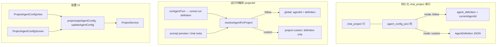

# 项目智能体配置 技术规格（SPEC）

> **PRD**：[prd.md](./prd.md)  
> **前置**：[agent-system/prd.md](../agent-system/prd.md)、[chat-project-vfs/prd.md](../chat-project-vfs/prd.md)、[persistent-state-and-preferences/prd.md](../persistent-state-and-preferences/prd.md)  
> **建议分支**：`feature/project-agent-config`  
> **范围**：`packages/core/**`（项目 Agent 配置持久化、运行时解析）；`apps/desktop/**`、`apps/mobile/**` 项目级配置 UI；**不**含 CLI 子命令、会话级覆盖、云同步冲突产品定义

## 已确认产品决策

| 项 | 决策 |
|----|------|
| 首次切「自定义」 | 以 **当前全局 Agent 定义** 克隆为初始表单（若无则 default） |
| 项目 copy | **复制** `agent_config_json` 至新项目（深拷贝 JSON） |
| 切回「跟随」 | `mode: follow`；**保留** `definition` 草稿于列内（不生效） |
| Desktop 入口 | `ChatRail` 项目 `⋯` 菜单 **「智能体配置」** |
| 存储形态 | **`chat_project` 表扩展列**（非独立表、无项目级 agentId） |
| 运行时语义 | **Agent run 吃的是 `AgentDefinition` 配置**；`agentId` 仅全局 registry 路径有意义 |

## 设计目标

1. **项目级二选一策略**：每项目 `follow`（跟随全局 `currentAgentId`）或 `custom`（专属 `AgentDefinition` 存于 project 行 JSON 列）。
2. **默认跟随**：列 `NULL` 或 `mode: follow` 时，行为与现网 **完全一致**。
3. **专属隔离**：自定义 definition **不** 写入 `agent_definition` 表；**无** 可选用/可注册的 project agentId；全局 Agent 列表与其他项目 **不可** 引用。
4. **配置绑定项目**：项目专属 Agent 类比 Agent 的 **model pin**——绑在 project 行 JSON 上，不是独立实体 id。
5. **切换项目即切换策略**：`runAgentTurn` 与 prompt 预览/元信息按 `scope.projectId` 解析。
6. **编辑器复用**：自定义态 UI 复用现有 Agent 表单（Desktop `AgentEditorView` 表单逻辑、Mobile `AgentEditorForm`）。
7. **生命周期**：`delete` 删 project 行即删配置；`copy` **一并复制** JSON 列。

---

## 总体方案

### 存储说明（重要）

**`agent_config_json` 不是新表**，而是现有 `chat_project` 表上的 **TEXT/JSON 扩展列**（与 `name`、`created_at_ms` 同表、同行）。一项目一行、一列一份配置；不引入 `project_agent_config` 等独立表。

### 架构概览



### 设计决策

| 项 | 选择 | 理由 |
|----|------|------|
| 存储 | **`chat_project.agent_config_json TEXT NULL` 列** | 1:1、最简单；删/copy 随 project 行；与 `user_vfs_pending_json` 等模式一致 |
| 文档形态 | `{ mode, definition? }` Zod 校验 | follow 可不存 definition；custom 必填 definition |
| 默认 | `NULL` / 缺省 → `{ mode: "follow" }` | 存量零行为变化 |
| 项目 custom **无 agentId** | 解析结果 **不含** registry id | 与 model pin 一致；避免伪造 `project-agent:*` |
| 全局 follow **有 agentId** | `resolveCurrentAgentDefinition` 原样 | 与现网 `currentAgentId` + registry 一致 |
| 首次切自定义 | 克隆 **当前全局 Agent** definition | 已确认 |
| 切回跟随 | 保留 definition 草稿；运行时 **不读** | 已确认 |
| 项目 copy | **复制** `agent_config_json` 至新行 | 已确认 |
| 解析入口 | `resolveAgentForProject(runtime, projectId)` | 单点替换 run / prompt / meta |
| 全局列表 | **不改** `listAgentIds` | 专属不进 registry |
| 云同步 | project 行同步则列一并同步；冲突 **本迭代不定义** | PRD：本地行为正确 |

### 执行语义：配置 vs id

| 层级 | 输入 | 说明 |
|------|------|------|
| `DefaultAgentRunner.run` | **`AgentDefinition`** | 始终用配置（prompts、tools、runtime、model pin） |
| 全局 follow 解析 | `agentId` + `definition` | id 来自 `currentAgentId` → registry |
| 项目 custom 解析 | **`definition` only** | 来自 `chat_project.agent_config_json`；**无 agentId** |
| Chat meta / 顶栏 | follow：全局 Agent 名；custom：`definition.name` + 「项目专属」 | 不暴露虚假 id |

---

## 数据模型

### ProjectAgentConfig（列内 JSON canonical）

```typescript
/** 项目智能体策略模式。 */
type ProjectAgentMode = "follow" | "custom";

/** 持久化在 chat_project.agent_config_json 列内的文档。 */
interface ProjectAgentConfig {
  readonly mode: ProjectAgentMode;
  /** mode === "custom" 时必填且校验为合法 AgentDefinition */
  readonly definition?: AgentDefinition;
}
```

**默认**（列 NULL 或缺省 mode）：

```typescript
{ mode: "follow" }
```

**校验规则**（Zod）：

- `mode: "custom"` → `definition` 必填 + `validateAgentDefinition`
- `mode: "follow"` → 运行时忽略 `definition`（列内可保留草稿）

新文件：

- `packages/core/src/domain/chat/model/project-agent-config.ts`
- `packages/core/src/domain/chat/model/project-agent-config.schema.ts`

### DB 迁移

在 `SCHEMA_COLUMN_ALIGNMENTS` 增加（**仅 ADD COLUMN，不建新表**）：

```sql
ALTER TABLE chat_project ADD COLUMN agent_config_json TEXT NULL
```

**无** backfill；`NULL` 即 follow。

### 领域与仓储

| 层 | 变更 |
|----|------|
| `ChatProject` | **不** 嵌入 config（保持瘦模型）；config 经 `ProjectService` 读写列 |
| `ProjectRepository` | `getAgentConfig(id)`、`updateAgentConfig(id, config, updatedAtMs)` |
| `SqliteProjectRepository` | 读写同一行的 `agent_config_json` |
| `ProjectService` | `getAgentConfig` / `updateAgentConfig`；`delete` 删行即清列；`copy` **复制列值** |

`updateAgentConfig` patch（service 层）：

```typescript
interface ProjectAgentConfigPatch {
  readonly mode?: ProjectAgentMode;
  readonly definition?: AgentDefinition;
}
```

合并 → Zod 全量校验 → custom 时 `validateAgentDefinition`。

**`copy` 实现要点**：`INSERT` 新项目行时，从源行 **拷贝** `agent_config_json`（含 follow/custom 与 definition 草稿）；无 JSON 则新行 `NULL`。

---

## 运行时解析

###  discriminated union（`resolve-agent-for-project.ts`）

```typescript
/** 项目域 Agent 解析结果；runner 仅消费 definition。 */
export type ResolvedAgentForProject =
  | {
      readonly source: "global";
      readonly agentId: string;
      readonly definition: AgentDefinition;
    }
  | {
      readonly source: "project-custom";
      readonly definition: AgentDefinition;
      /**  intentionally 无 agentId */
    };

export async function resolveAgentForProject(
  runtime: AgentTurnRuntimePort & { readonly projects: ProjectService },
  projectId: string,
): Promise<ResolvedAgentForProject>;
```

**逻辑**：

1. `config = await projects.getAgentConfig(projectId)`（列 NULL → follow）
2. **`follow`** → `resolveCurrentAgentDefinition(runtime)` → `{ source: "global", agentId, definition }`
3. **`custom`** → 取 `config.definition`；缺失/无效 → `AgentRunResolveError` → `{ source: "project-custom", definition }`（**不生成 synthetic id**）

**`runAgentTurn` 接线**：

```typescript
const resolved = await resolveAgentForProject(runtime, scope.projectId);
const { definition } = resolved;
// runner.run({ definition, ... }) — 与 today 相同
```

日志/调试可用 `projectId` + `resolved.source`，不必伪造 agentId。

导出：`ResolvedAgentForProject`、`resolveAgentForProject` via `@novel-master/core/agent`。

### Meta / IPC 响应形态（建议）

```typescript
interface AgentMetaDto {
  readonly source: "global" | "project-custom" | "none";
  readonly agentId?: string;           // 仅 global
  readonly agentName: string;
  readonly modelLabel: string;
  readonly hasDedicatedModel: boolean;
}
```

- **global**：`agentId` + `definition.name`
- **project-custom**：无 `agentId`；`agentName = definition.name`；UI 后缀「项目专属」
- **follow 配置页只读**：展示「跟随：{当前全局 Agent 名}」

### 接线点（必须改）

| 文件 | 变更 |
|------|------|
| `run-agent-turn.ts` | `resolveAgentForProject`；只向 runner 传 `definition` |
| `prompt-preview.service`（desktop/mobile） | 按 `scope.projectId` 解析 |
| `chat-prompt-tokens.service` | 同上 |
| `handlers/prompt.ts` | `handlePromptAgentMeta` 带 `projectId`（扩展 `PromptScopeRequest`） |
| `chat-agent-meta.ts` | `loadChatAgentMeta(runtime, projectId)`；custom 不设 agentId |
| Chat tab 调用方 | 传入 `projectId` |

**不改**：CLI 全局 Agent 命令、全局 Agent 管理列表/registry CRUD。

---

## 最终项目结构

```
packages/core/src/
  domain/chat/model/
    project-agent-config.ts
    project-agent-config.schema.ts
  domain/chat/repositories/
    project.port.ts
    impl/sqlite-project.repository.ts    # 读写 chat_project.agent_config_json 列
  bootstrap/schema-align/
    schema-column-alignments.ts
  service/chat/
    project.port.ts
    impl/project.service.ts              # copy 复制列；delete 随行
  service/agent/logic/
    resolve-agent-for-project.ts
    run-agent-turn.ts
  public/chat.ts
  public/agent.ts

apps/desktop/ …（同前）
apps/mobile/ …（同前）

packages/core/test/
  chat/project-agent-config.schema.test.ts
  service/agent/resolve-agent-for-project.test.ts
  service/agent/run-agent-turn-project-agent.test.ts
  chat/project.service.agent-config.test.ts   # 含 copy 复制 JSON
  bootstrap/schema-align-columns.test.ts
```

---

## 变更点清单

### Core

| 文件 | 变更 |
|------|------|
| `schema-column-alignments.ts` | `chat_project.agent_config_json` **列** |
| `sqlite-project.repository.ts` | 同行读写 JSON |
| `project.service.ts` | get/update；**copy 复制列**；delete 随 project 行 |
| `resolve-agent-for-project.ts` | discriminated union；custom **无 agentId** |
| `run-agent-turn.ts` | 项目域解析 |
| `public/chat.ts` / `public/agent.ts` | 导出 |

### Desktop / Mobile UI

| 要点 | 说明 |
|------|------|
| `ProjectAgentConfigView` / `Screen` | 模式切换；跟随只读全局名；自定义嵌入 Agent 表单；保存写 **列 JSON**，不写 registry |
| 入口 | Desktop `ChatRail` ⋯；Mobile `ProjectDrawer` |
| Meta | custom 显示 `definition.name` + 「项目专属」，无 agentId |

---

## 详细实现步骤

### 阶段 1 — 列 + 持久化

1. `ProjectAgentConfig` 类型 + Zod。
2. `ADD COLUMN agent_config_json` + repository/service。
3. 单测：NULL→follow、custom round-trip、**copy 复制 JSON**、invalid 拒绝。
4. Commit：`feat(core): chat_project 项目智能体配置列`

### 阶段 2 — 运行时解析

1. `resolveAgentForProject` + 单测（follow 有 agentId；custom 无 agentId；缺 definition 报错）。
2. `runAgentTurn` + prompt/meta 全接线。
3. Commit：`feat(core): 按 projectId 解析 Agent 配置`

### 阶段 3 — Desktop UI + IPC

（同前）

### 阶段 4 — Mobile UI

（同前）

### 阶段 5 — 回归

（同前）

---

## 测试策略

### 单元 / 集成

| 文件 | 用例 |
|------|------|
| `project-agent-config.schema.test.ts` | follow / custom / 非法 mode |
| `project.service.agent-config.test.ts` | NULL→follow；custom 持久化；**copy 后新 project 同 mode+definition**；delete 后不可 get |
| `resolve-agent-for-project.test.ts` | follow → global + agentId；custom → definition only、**无 agentId**；custom 无 definition 抛错 |
| `run-agent-turn-project-agent.test.ts` | custom 项目使用专属 prompts |
| `schema-align-columns.test.ts` | 列存在于 `chat_project`（非新表） |

### 手工验收（PRD + 已确认项）

| 场景 | 预期 |
|------|------|
| 存量项目列 NULL | 与现网一致 |
| 项目 B custom | 仅 B 使用专属 definition；全局列表无 B |
| copy 源项目 custom | 副本同为 custom，definition 一致 |
| 切回 follow | 运行用全局；列内草稿仍在 |
| Desktop 保存 → Mobile 打开 | 模式与 definition 一致 |
| 删除项目 | 配置不可再访问 |

---

## 兼容性与迁移

| 项 | 说明 |
|----|------|
| DB | 幂等 `ADD COLUMN` on **`chat_project`**；无新表 |
| 存量 | `NULL` = follow |
| API | 新增 get/updateAgentConfig；无破坏性变更 |
| 全局 Agent | registry / `currentAgentId` 不变 |
| CLI | 仍全局解析；本迭代无项目 CLI |

---

## 风险与回滚方案

| 风险 | 缓解 | 回滚 |
|------|------|------|
| 调用方假设必有 agentId | `ResolvedAgentForProject`  discriminated union；TypeScript 强制分支 | revert 阶段 2 |
| prompt/meta 漏改 projectId | 清单 + 单测 | revert 阶段 2 |
| copy 漏复制列 | `project.service` 单测断言 JSON 相等 | fix forward |
| UI 与全局 Agent 混淆 | 文案「项目专属」/「跟随全局」 | 文案 |

**分阶段回滚**：UI → 解析 → 列迁移。

---

## 建议实现顺序与提交粒度

1. `feat(core): chat_project 项目智能体配置列`
2. `feat(core): 按 projectId 解析 Agent 配置`
3. `feat(desktop): 项目智能体配置页`
4. `feat(mobile): 项目智能体配置页`
