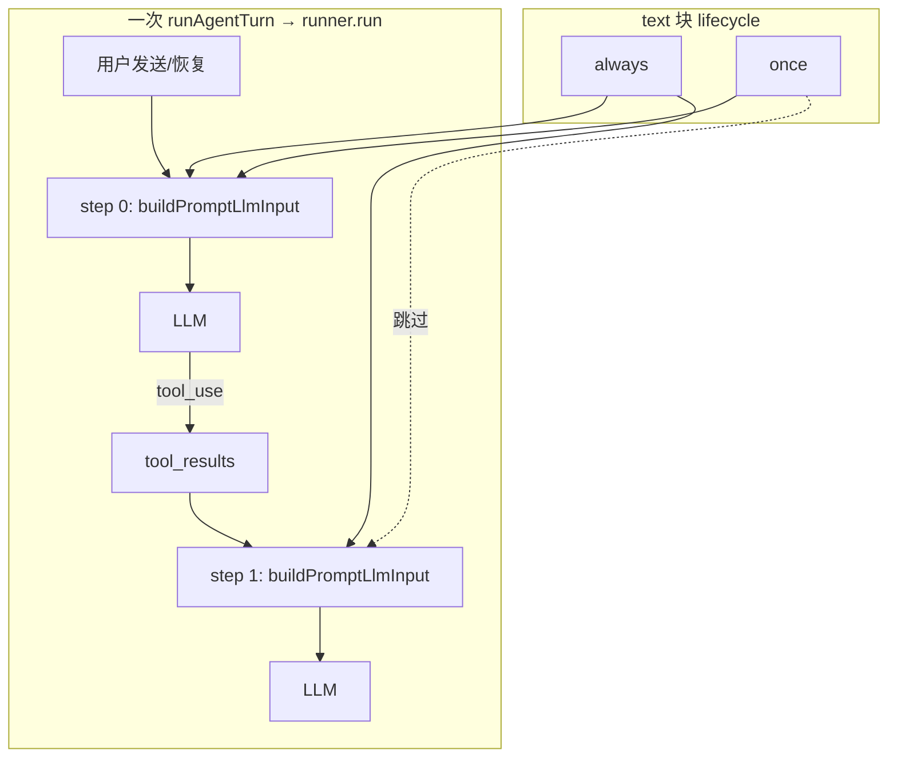

---

## date: 2026-06-12

# Prompt 块生命周期（lifecycle）技术规格（SPEC）

## 设计目标

- 落实 [PRD](./prd.md)：非 `system` 的 `text` 块支持 `**lifecycle: always | once**`，解决「继续」类块在 tool loop 每步重复注入导致 agent 异常拉长的问题。
- **默认 `always`**（省略字段）：旧 Agent 配置零迁移、行为不变。
- **单一 assembly 管道**：`buildPromptAssembly` / `buildPromptLlmInput` / `formatPromptLlmInputForCli` / token 序列化 / AgentRunner 共用同一 lifecycle 过滤逻辑。
- **预览与 token 按 step 0**：无 agent run 上下文时 `agentStepIndex` 默认为 `0`，`once` 块仍可见、可计数。
- **双端 UI**：Desktop / Mobile Agent 编辑器对 `user` / `assistant` text 块增加「常驻」开关（开 = always，关 = once）。

---

## 现状与约束（代码探索）


| 模块                                                | 现状                                                | 本迭代                                                       |
| ------------------------------------------------- | ------------------------------------------------- | --------------------------------------------------------- |
| `prompt-block.ts`                                 | `text                                             | chat`；text 无 lifecycle                                    |
| `validate-prompt-blocks.ts`                       | 解析 text/chat；`rejectWhen`                         | 解析/拒绝非法 lifecycle；system/chat 禁止 lifecycle 键              |
| `agent-definition.schema.ts`                      | `textPromptBlockValueSchema.strict()` 无 lifecycle | 增加 `lifecycle?: always                                    |
| `render-prompt.ts`                                | 每 block 遍历；non-system text → synthetic 每步都进       | 按 `agentStepIndex` 跳过 `once` 块（step > 0）                  |
| `agent-runner.ts` L145                            | `buildPromptLlmInput(prompts, ctx)` 无 step        | 传入 `agentStepIndex: step`                                 |
| `session-prompt-input.service.ts`（Desktop/Mobile） | `buildPromptLlmInput` 无第三参                        | 不传参 → 默认 step 0                                           |
| `serialize-prompt-input.ts`                       | `formatPromptLlmInputForCli(blocks, ctx)`         | 透传 `agentStepIndex`（默认 0）                                 |
| `AgentEditorView.tsx` / `AgentEditorForm.tsx`     | 名称、角色、内容                                          | 非 system text 增加「常驻」`SettingsSwitchRow` / `FormSwitchRow` |
| `config-forms/agent-editor-state.ts`              | `createDefaultTextBlock` role=system              | 不变（system 无开关）                                            |
| compaction token 评估                               | `agent-runner` 每步 `promptInput`                   | step ≥ 1 时 `once` 块不计入 → token 比率更准确                      |


**不变**：

- Synthetic template 消息仍 **不持久化** DB（`id: prompt:${name}`）。
- `role: system` 仍只合并进 `system` 字符串。
- `type: chat` 仍展开 `ctx.messages`。
- CLI `nm prompt render` 无 step 上下文 → 等同 step 0（PRD 验收口径）。

---

## 总体方案

### 语义




| `lifecycle` | 省略时  | step 0 | step ≥ 1 |
| ----------- | ---- | ------ | -------- |
| `always`    | ✅ 等同 | 包含     | 包含       |
| `once`      | —    | 包含     | **跳过**   |


- `**agentStepIndex`**：`DefaultAgentRunner` 循环变量 `step`（0-based）。
- `**role: system`**：忽略 lifecycle（校验层拒绝 system 块带 lifecycle）；始终每步合并 system。
- **新用户消息**：新的 `runner.run()` → step 从 0 重启 → `once` 块再次出现。

### 核心 API

```typescript
/** Prompt assembly inclusion policy for non-system text blocks. */
export type PromptBlockLifecycle = "always" | "once";

export interface PromptAssemblyOptions {
  /**
   * Agent run step index (0 = first LLM round after user action).
   * Defaults to 0 (preview, token count, CLI render).
   */
  readonly agentStepIndex?: number;
}

// prompt-block.ts — text variant only
export type PromptBlock =
  | {
      readonly name: string;
      readonly type: "text";
      readonly role: PromptBlockRole;
      readonly content: string;
      readonly lifecycle?: PromptBlockLifecycle; // default always
    }
  | { readonly name: string; readonly type: "chat" };
```

**过滤函数**（建议 `domain/prompt/logic/should-include-prompt-text-block.ts`）：

```typescript
export function shouldIncludePromptTextBlock(
  block: Extract<PromptBlock, { type: "text" }>,
  agentStepIndex: number,
): boolean {
  if (block.role === "system") {
    return true;
  }
  const lifecycle = block.lifecycle ?? "always";
  if (lifecycle === "always") {
    return true;
  }
  return agentStepIndex === 0;
}
```

**组装入口签名**（第三参可选，默认 `{}`）：

```typescript
export function buildPromptAssembly(
  blocks: readonly PromptBlock[],
  ctx: PromptRenderContext,
  options?: PromptAssemblyOptions,
): readonly PromptAssemblySegment[];

export function buildPromptLlmInput(
  blocks: readonly PromptBlock[],
  ctx: PromptRenderContext,
  options?: PromptAssemblyOptions,
): PromptLlmInput;
```

`buildPromptLlmInput` / `buildPromptAssembly` 在 `block.type === "text"` 且 `!shouldIncludePromptTextBlock(block, step)` 时 **continue**（不产 segment / synthetic 消息）。`system` 块不受 lifecycle 字段影响（且不应存在该字段）。

### YAML / Wire 契约

```yaml
prompts:
  blocks:
    kick:
      type: text
      role: user
      content: 继续
      lifecycle: once
    ctx:
      type: text
      role: user
      content: "{{ .worktree }}"
      # 省略 lifecycle → always
    rules:
      type: text
      role: system
      content: You are a writer.
      # 禁止 lifecycle 键
    history:
      type: chat
```


| 规则                                       | 行为                              |
| ---------------------------------------- | ------------------------------- |
| `lifecycle` 仅 `text` 且 `role !== system` | 否则 `INVALID_BLOCK`              |
| 省略 / `always`                            | 常驻                              |
| `once`                                   | 仅 step 0                        |
| 非法值                                      | `INVALID_BLOCK`                 |
| 序列化                                      | `always` **省略**字段；`once` **写出** |


### UI 映射（`@novel-master/config-forms` 建议辅助函数）

```typescript
export function isPromptBlockPersistent(
  block: Extract<PromptBlock, { type: "text" }>,
): boolean {
  return (block.lifecycle ?? "always") === "always";
}

export function withPromptBlockPersistence(
  block: Extract<PromptBlock, { type: "text" }>,
  persistent: boolean,
): Extract<PromptBlock, { type: "text" }> {
  if (persistent) {
    const { lifecycle: _removed, ...rest } = block;
    return rest;
  }
  return { ...block, lifecycle: "once" };
}
```


| UI                | 配置                                |
| ----------------- | --------------------------------- |
| 「常驻」开             | 省略 `lifecycle`                    |
| 「常驻」关             | `lifecycle: once`                 |
| `role: system`    | 不显示开关                             |
| `type: chat`      | 不显示开关                             |
| 角色从 user → system | `updateBlock` 时 strip `lifecycle` |
| 角色从 system → user | 默认常驻（无 lifecycle 字段）              |


**文案（双端一致）**：

- 标签：**常驻**
- 开：无额外说明（或「每轮工具循环都会带入」）
- 关 hint：**仅在用户发送或恢复后的第一轮带入；工具循环后续轮不再重复**

Desktop：`SettingsSwitchRow` + `config-block-card__hint`  
Mobile：`FormSwitchRow`（`description` 放关时的 hint）

---

## 最终项目结构

无新顶层包；变更文件：

```
packages/core/src/
  domain/prompt/model/prompt-block.ts              # +PromptBlockLifecycle, text.lifecycle?
  domain/prompt/logic/should-include-prompt-text-block.ts  # 新建
  domain/prompt/logic/validate-prompt-blocks.ts    # lifecycle 解析/拒绝
  domain/agent/model/agent-definition.schema.ts    # Zod + blockToMapValue
  service/prompt/render-prompt.ts                  # 过滤 + 第三参
  service/agent/impl/agent-runner.ts               # agentStepIndex: step
  index.ts                                         # export 新类型/函数

packages/core/test/
  prompt/validate-prompt-blocks.test.ts            # lifecycle 校验
  prompt/render-prompt-lifecycle.test.ts         # 新建
  agent/agent-runner-lifecycle.test.ts             # 新建（多 step 捕获 history）

packages/config-forms/src/agent/agent-editor-state.ts   # 可选 UI 辅助
packages/config-forms/test/agent-editor-state.test.ts   # 辅助函数单测

apps/desktop/renderer/features/settings/AgentEditorView.tsx
apps/mobile/src/components/agent/AgentEditorForm.tsx

apps/desktop/src/main/services/session-prompt-input.service.ts   # 无改或显式注释默认 step0
apps/mobile/src/services/session-prompt-input.service.ts         # 同上
packages/core/src/infra/tokenizer/logic/serialize-prompt-input.ts  # 透传 options（若签名扩展）
```

**不修改**：LLM adapter、DB schema、compaction 事件管线、CLI 新子命令。

---

## 变更点清单


| #   | 文件                                    | 变更                                                                             |
| --- | ------------------------------------- | ------------------------------------------------------------------------------ |
| 1   | `prompt-block.ts`                     | 导出 `PromptBlockLifecycle`；text 联合类型加 `lifecycle?`                              |
| 2   | `should-include-prompt-text-block.ts` | 纯函数过滤逻辑                                                                        |
| 3   | `validate-prompt-blocks.ts`           | 解析 `lifecycle`；拒绝 system/chat 上的 lifecycle；拒绝非法枚举                              |
| 4   | `agent-definition.schema.ts`          | Zod `lifecycle` optional enum；`blockToMapValue` 条件写出                           |
| 5   | `render-prompt.ts`                    | `buildPromptAssembly` / `buildPromptLlmInput` / 派生函数接受 `PromptAssemblyOptions` |
| 6   | `agent-runner.ts`                     | `buildPromptLlmInput(..., { agentStepIndex: step })`                           |
| 7   | `index.ts`                            | export 新符号                                                                     |
| 8   | `agent-editor-state.ts`               | `isPromptBlockPersistent` / `withPromptBlockPersistence`（供双端复用）                |
| 9   | `AgentEditorView.tsx`                 | 非 system text：`SettingsSwitchRow`「常驻」                                          |
| 10  | `AgentEditorForm.tsx`                 | 同上 `FormSwitchRow`                                                             |


---

## 详细实现步骤

### Phase 1 — Core 模型与校验

1. 扩展 `PromptBlock` 类型与 `index.ts` export。
2. 实现 `shouldIncludePromptTextBlock` + 单测（always/once/step0/step1/system 忽略 lifecycle）。
3. 更新 `validate-prompt-blocks.ts`：
  - `lifecycle` 可选，仅 `always`  `once`
  - `role === "system"` 且含 `lifecycle` → `INVALID_BLOCK`：`system text block must not include lifecycle`
  - `type === "chat"` 且含 `lifecycle` → `INVALID_BLOCK`
4. 更新 `agent-definition.schema.ts`：
  - `textPromptBlockValueSchema` 增加 `lifecycle: z.enum(["always", "once"]).optional()`
  - `blockToMapValue`：仅 `lifecycle === "once"` 时写出
  - 确保 `definitionToDocument` → `agentDefinitionFromJson` round-trip

### Phase 2 — Assembly 与 Runner

1. `render-prompt.ts`：
  - 新增 `PromptAssemblyOptions`；`resolveAgentStepIndex(options)` 默认 `0`
  - `buildPromptAssembly`：text 块在 `!shouldInclude` 时 skip
  - `buildPromptLlmInput`：与 assembly 同规则（保持 block 顺序）
  - `formatPromptLlmInputForCli` / `buildPromptPreviewSegments` 透传 options
2. `serialize-prompt-input.ts`：签名增加可选 `options?`（或保持两参，内部默认 step 0 — 与现行为一致）
3. `agent-runner.ts`：`buildPromptLlmInput(blocks, ctx, { agentStepIndex: step })`
4. 确认 compaction `shouldRequestCompaction` 收到的 `promptInput` 已反映当前 step 的 lifecycle（无需额外改 evaluator）

### Phase 3 — 单测

见「测试策略」。

### Phase 4 — config-forms + UI

1. `agent-editor-state.ts` 增加 persistence 辅助函数 + 单测。
2. Desktop `AgentEditorView.tsx`：
  - `block.type === "text" && block.role !== "system"` 时渲染 `SettingsSwitchRow`
  - `checked={isPromptBlockPersistent(block)}`
  - `onChange={(v) => updateBlock(index, withPromptBlockPersistence(block, v))}`
  - 角色 select onChange：若改为 system，strip lifecycle
3. Mobile `AgentEditorForm.tsx`：同上，用 `FormSwitchRow`。

### Phase 5 — 手工验收

- Desktop + Mobile 各 1 条：配置 kick `once` → 多轮 tool 对话 → agent 正常 completed
- 真实 Prompt 预览可见 `once` 块
- Token 顶栏计数包含 `once` 块（step 0 口径）

---

## 测试策略

### 单元测试（`packages/core`）


| 用例 ID | 文件                                          | 断言                                                         |
| ----- | ------------------------------------------- | ---------------------------------------------------------- |
| L1    | `validate-prompt-blocks.test.ts`            | `lifecycle: once` 解析成功                                     |
| L2    | 同上                                          | 省略 lifecycle → `block.lifecycle` undefined                 |
| L3    | 同上                                          | `lifecycle: foo` → `INVALID_BLOCK`                         |
| L4    | 同上                                          | system + lifecycle → `INVALID_BLOCK`                       |
| L5    | 同上                                          | chat + lifecycle → `INVALID_BLOCK`                         |
| L6    | `render-prompt-lifecycle.test.ts`           | once user 块 step0 在 `messages`；step1 不在                    |
| L7    | 同上                                          | always user 块 step0/1 均在                                   |
| L8    | 同上                                          | `buildPromptAssembly` 与 `buildPromptLlmInput` segment 数一致  |
| L9    | 同上                                          | 默认无第三参 = step0 行为                                          |
| L10   | `agent-definition.schema` 或 round-trip test | `once` 写出；`always` 省略                                      |
| R1    | `agent-runner-lifecycle.test.ts`            | mock model 2 步 tool：step0 history 含 `prompt:kick`；step1 不含 |
| R2    | 同上                                          | kick=`继续`+once，第二步 mock 返回纯文本 → `stopReason: completed`    |
| R3    | `agent-runner-template-blocks.test.ts`      | 无 lifecycle 块仍每步存在（回归）                                     |


**Mock 捕获模式**（R1）：

```typescript
const histories: ModelRequestOptions[] = [];
const model: ModelRequestService = {
  request: mock.fn(async (_id, _c, opts) => {
    histories.push(opts);
    if (histories.length < 2) {
      return { blocks: [{ type: "tool_use", id: "t1", name: "write", input: {} }], ... };
    }
    return { blocks: [{ type: "text", text: "done" }], ... };
  }),
};
// assert histories[0].history has prompt:kick
// assert histories[1].history lacks prompt:kick
```

### config-forms


| 用例                                                             | 断言  |
| -------------------------------------------------------------- | --- |
| `withPromptBlockPersistence(block, false)` → `lifecycle: once` |     |
| `withPromptBlockPersistence(block, true)` → 无 lifecycle 键      |     |
| `isPromptBlockPersistent` 与上一致                                 |     |


### 手工（双端）


| #   | 步骤                   | 期望                          |
| --- | -------------------- | --------------------------- |
| M1  | user 块「继续」+ 常驻关 + 保存 | YAML/DB 含 `lifecycle: once` |
| M2  | 再打开编辑页               | 常驻关                         |
| M3  | 多轮 tool 会话           | agent 不无故跑满 maxSteps        |
| M4  | system 块卡片           | 无常驻开关                       |
| M5  | 真实 Prompt 预览         | 可见 once 块                   |


### 命令

```bash
npm test -w @novel-master/core -- --testPathPattern="validate-prompt-blocks|render-prompt-lifecycle|agent-runner-lifecycle"
npm test -w @novel-master/config-forms -- --testPathPattern="agent-editor-state"
npm run build
```

---

## 风险与回滚方案


| 风险                                          | 缓解                                    |
| ------------------------------------------- | ------------------------------------- |
| 作者忘记关「常驻」导致 kick 块仍每步注入                     | PRD 已接受；hint 文案；后续可单独立项「新建 user 块默认关」 |
| compaction token 评估 step≥1 不含 once 块，阈值行为略变 | 符合意图（后续轮 prompt 更短）；单测覆盖 evaluator 入参 |
| 双端 UI 不一致                                   | 共用 `config-forms` 辅助函数 + 统一文案         |
| `buildPromptLlmInput` 第三参遗漏某调用方             | 默认 step0；仅 runner 传真实 step；grep 全仓调用点 |


**回滚**：revert 合并提交；旧配置无 `lifecycle` 字段，回滚后行为与现网一致。若已写入 `lifecycle: once` 的配置在旧版 core 上：Zod `.strict()` 会拒载 — 升级前勿回滚 core 而不回滚数据，或回滚时清空 `lifecycle` 键（运维注记）。

---

## 与 PRD 验收映射


| PRD 验收项                | SPEC 落点                  |
| ---------------------- | ------------------------ |
| 旧配置无 lifecycle 行为不变    | 默认 `always`；R3 回归        |
| once 仅 step0           | L6, R1                   |
| 继续+once 可 completed    | R2                       |
| 非法 lifecycle 拒载        | L3                       |
| 双端开关                   | Phase 4 + M1–M5          |
| 预览/token 含 once（step0） | L9 + 默认 agentStepIndex=0 |
| 新 run 再含 once          | R1 扩展：两次 `runner.run`    |


---

## 实现顺序建议（单 PR 或两 PR）

**PR1（Core，可独立合并）**：Phase 1–3  
**PR2（UI）**：Phase 4–5，依赖 PR1 的 `@novel-master/core` 类型

若单 PR：按 Phase 1 → 2 → 3 → 4 → 5 顺序提交。