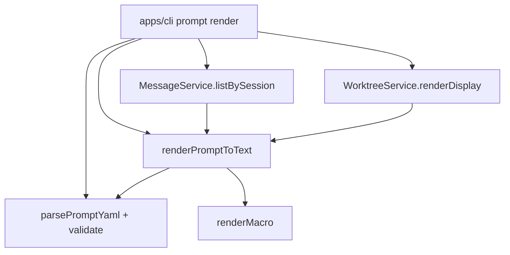

# Prompt 引擎 技术规格（SPEC）

## 设计目标

- 在 `@novel-master/core` 新增 **Prompt Block 模型**、**YAML 解析与校验**、**轻量宏替换**、**纯文本拼接渲染**；复用现有 **`MessageService.listBySession`** 与 **`WorktreeService.renderDisplay`**（session 域）。
- CLI 扩展：`nm prompt render --path <file>`；读取**本机 YAML**，stdout 输出 PRD 约定的 **role 前缀纯文本**。
- **测试双轨**：`packages/core` 单元测试 + 知识库 **CLI 验收文档**（cli-test skill，真实执行、原样捕获）；**当前均未实现**，属本迭代必交付。
- **不修改** `infra/tdbc`、`infra/sql-template`；**不新增** SQLite DDL；**不修改** `apps/mobile`；repository **不导出**。
- 宏引擎**不复用** `SqlTemplateParser`（XML/动态 SQL 语义不同）；独立模块 `infra/prompt-template`。

## 现状与约束（代码探索）

| 项 | 现状 | 本迭代 |
|----|------|--------|
| `packages/core` | 无 prompt 相关代码；无 YAML 依赖 | 新增 `domain/prompt`、`infra/prompt-template`、`errors/prompt-errors.ts` |
| `WorktreeService` | `renderDisplay(): Promise<string>`；session scope 经 `createWorktreeService(conn, { kind: "session", projectId, sessionId })` | prompt 渲染注入 `.worktree` |
| `MessageService` | `listBySession(sessionId)` 按 `seq` 排序返回 `ChatMessage[]` | `type: chat` 块展开消息 |
| `MessageContent` | `content?: string`；CLI `message list` 回退 `JSON.stringify(content)` | **同款** `messageBodyText(m)` 纯函数 |
| `formatLocalMtime` | `yyyy-MM-dd HH:mm:ss` 本地时区（worktree-display） | `$.time` **复用同一格式化函数**（从 `worktree-display.ts` 导出或抽到 `infra/date-format.ts` 避免循环依赖） |
| `CliScopeResolver` | `resolveProjectSession(flags)`：flag > config.json | `nm prompt render` **必须**解析 project+session（与 worktree / chat 一致） |
| `apps/cli/main.ts` | 顶层路由 `vfs` / `kkv` / `project` / `session` / `message` | 增加 `prompt` |
| `cli-errors.ts` | 识别 `VfsError` / `ChatError` 等 | 增加 `PromptError` |
| `bootstrapNovelMaster` | 无 prompt 表 | **不变** |
| 依赖 | monorepo 无 `yaml` 包 | `packages/core` 增加 **`yaml`**（`npm:yaml@^2`） |
| CLI 验收文档 | **不存在** `Iterations/prompt-engine/test/*.md` | 实现完成后新增 **`test/prompt-cli.md`**（见下文「CLI 验收文档」） |

**PRD 对齐（实现锁定）**

| PRD 待确认项 | SPEC 决策 |
|--------------|-----------|
| 未定义模板字段（如 `{{ .current_input }}`） | **报错**：`PromptError` `UNKNOWN_FIELD`，渲染失败 |
| 多行 `content` 与 `role:` 前缀 | **每段仅首行**带 `{role}: `；后续行原样拼接（与「一段一条消息」常见展示一致） |
| 段间分隔 | 段与段之间 **单个** `\n` 连接（不额外插空行） |
| 含 `chat` 块但无 session | 与「缺 session」相同：`resolveProjectSession` 抛错 → CLI 非 0 |
| `$.week_cn` | `Date#toLocaleDateString("zh-CN", { weekday: "long" })`（如「星期一」） |
| 示例 YAML | 文档/测试示例**不得**含未支持占位符 |

---

## 总体方案

### 架构



- **纯函数为主**：`parsePromptYaml`、`validatePromptBlocks`、`buildPromptContext`、`renderPromptToText`、`renderMacro`；无新 repository。
- **CLI 编排**：读文件 → `parsePromptYaml` → 解析 scope → 拉取 messages + worktree display → `renderPromptToText` → `stdout`。
- **可测性**：core 单测注入 `now: Date` 与固定 `worktreeDisplay` / `messages`，不依赖 DB；集成测可走现有 `test/helpers` 开库。

### Block 模型（TypeScript）

```typescript
export type PromptBlockRole = "system" | "user" | "assistant";

export type PromptBlock =
  | {
      readonly name: string;
      readonly type: "text";
      readonly role: PromptBlockRole;
      readonly content: string;
    }
  | {
      readonly name: string;
      readonly type: "chat";
    };
```

### YAML 契约

- 根对象**必须**含 `blocks`（数组）；否则 `INVALID_YAML`。
- 每项**必须**含非空 `name`、`type`。
- `type: text` → 必填 `role`（小写，仅三种）、`content`（string，可为空串）。
- `type: chat` → **禁止**出现 `role` / `content`（多余键报错，避免静默忽略）。
- 未知 `type` → `INVALID_BLOCK`。

### 宏语法（首期）

扫描 `content` 中 `{{` … `}}`，支持：

| 形式 | 行为 |
|------|------|
| `{{/* ... */}}` | 注释，不输出 |
| `{{ .worktree }}` | 当前上下文 `worktree` 字符串 |
| `{{ .a.b }}` | 从 dot 根对象按路径查找；首期仅 `.worktree` 有值，其它路径 → `UNKNOWN_FIELD` |
| `{{ $.time }}` | `formatLocalDateTime(now)` → `YYYY-MM-DD HH:mm:ss` |
| `{{ $.week_cn }}` | 中文星期 |
| `{{ $.foo }}` | 未知 `$` 键 → `UNKNOWN_FIELD` |
| 空白 | `{{  .worktree  }}` 允许；动作内去首尾空白 |

**不支持**（出现即 `UNSUPPORTED_SYNTAX`）：`|`、`if`、`range`、`with`、`:=`、`template`、`define` 等。

实现建议：`infra/prompt-template/macro-scan.ts` 手写扫描器（比纯正则更稳，便于注释与错误偏移）。

### 文本拼接（`renderPromptToText`）

```typescript
function formatSegment(role: string, body: string): string {
  const trimmed = body.replace(/\r\n/g, "\n");
  if (trimmed === "") return `${role}: `;
  const lines = trimmed.split("\n");
  return `${role}: ${lines[0]}\n${lines.slice(1).join("\n")}`;
}
```

- **text 块**：宏替换后的 `content` → `formatSegment(block.role, content)`。
- **chat 块**：对每条 message：`formatSegment(m.role, messageBodyText(m))`（**不**跑宏）。
- 所有 segment 用 `\n` join；**不**输出 block `name`。

### `messageBodyText`

```typescript
export function messageBodyText(m: ChatMessage): string {
  if (m.content.content != null) return m.content.content;
  return JSON.stringify(m.content);
}
```

与 `apps/cli/src/message/commands.ts` `list` 行为一致。

### Prompt 渲染上下文

```typescript
export interface PromptRenderContext {
  readonly worktreeDisplay: string;
  readonly messages: readonly ChatMessage[];
  /** 默认 `new Date()`；单测注入固定时间 */
  readonly now?: Date;
}
```

`buildMacroDot(ctx)` → `{ worktree: ctx.worktreeDisplay }`  
`buildMacroRoot(ctx)` → `{ time: format..., week_cn: formatWeekCn(ctx.now) }`

---

## 最终项目结构

```text
packages/core/src/
  errors/prompt-errors.ts
  domain/prompt/
    model/prompt-block.ts
    prompt-blocks-validate.ts      # 校验原始 object → PromptBlock[]
    message-body.ts                # messageBodyText
  infra/prompt-template/
    macro-render.ts                # renderMacro(content, { dot, root, now? })
    macro-scan.ts                  # 扫描 + 错误偏移
    week-cn.ts                     # formatWeekCn
  infra/prompt-yaml/
    parse-prompt-yaml.ts           # yaml.parse + 入口校验
  service/prompt/
    render-prompt.ts               # renderPromptToText(blocks, ctx)
  index.ts                         # 导出 parse / render / 类型 / PromptError

packages/core/test/prompt/
  prompt-blocks-validate.test.ts
  macro-render.test.ts
  render-prompt.test.ts

apps/cli/src/
  prompt/commands.ts               # runPromptRender
  main.ts                          # case "prompt"

.apm/kb/docs/Iterations/prompt-engine/
  test/prompt-cli.md               # 【必交付】CLI 验收捕获（cli-test；实现后真实执行写入）
  fixtures/example.yaml            # render 用例输入（与 prompt-cli 场景共用）
```

**说明**：`test/prompt-cli.md` 在 SPEC 阶段**尚未创建**；编码完成并通过 `npm run build` 后，按 cli-test skill **真实跑命令**再落盘，禁止预填占位输出。

**可选**：将 `formatLocalMtime` 重命名为 `formatLocalDateTime` 并迁至 `infra/date-format.ts`，`worktree-display` 与 prompt 共用；若改动面大，则 prompt 内复制 5 行格式化函数并加注释「与 worktree 一致」——**优先抽共用**，避免漂移。

---

## 变更点清单

| 文件 | 变更 |
|------|------|
| `packages/core/package.json` | `dependencies.yaml` |
| `packages/core/src/errors/prompt-errors.ts` | **新增** `PromptError` / `PromptErrorCode` |
| `packages/core/src/domain/prompt/**` | **新增** 模型与校验 |
| `packages/core/src/infra/prompt-template/**` | **新增** 宏引擎 |
| `packages/core/src/infra/prompt-yaml/parse-prompt-yaml.ts` | **新增** |
| `packages/core/src/service/prompt/render-prompt.ts` | **新增** |
| `packages/core/src/index.ts` | 导出 prompt API |
| `apps/cli/src/prompt/commands.ts` | **新增** |
| `apps/cli/src/main.ts` | 注册 `prompt` |
| `apps/cli/src/cli-errors.ts` | `PromptError` 分支 |
| `.apm/kb/docs/Iterations/prompt-engine/test/prompt-cli.md` | **新增**（实现后 cli-test 捕获，见专节） |
| `.apm/kb/docs/Iterations/prompt-engine/fixtures/example.yaml` | **新增** 验收用 prompt 定义 |

**不改动**：`bootstrap/*`、`infra/sql-template/*`、`apps/mobile/*`、各 repository impl。

---

## 详细实现步骤

### 步骤 1：错误类型与 Block 模型

1. 新增 `PromptErrorCode`：`INVALID_YAML` | `INVALID_BLOCK` | `UNKNOWN_FIELD` | `UNSUPPORTED_SYNTAX`。
2. 定义 `PromptBlock`、`PromptBlockRole`；`prompt-blocks-validate.ts` 对 `unknown[]` 做运行时校验（与 chat-project-vfs 风格一致，不用 zod）。

**验证**：`prompt-blocks-validate.test.ts` 覆盖 PRD 四条 block 校验用例。

### 步骤 2：YAML 解析

1. `parsePromptYaml(source: string): readonly PromptBlock[]` 使用 `yaml` 包 `parse`。
2. 断言根为 object 且 `blocks` 为 array，委托 validate。

**验证**：非法 YAML、缺 `blocks`、类型错误均抛 `PromptError`。

### 步骤 3：宏引擎

1. `renderMacro(template, { dot, root })`。
2. 实现注释、`$.time`、`$.week_cn`、`.worktree`、嵌套路径解析。
3. 未知字段、非法语法抛带 `offset` 的 `PromptError`（可选，至少 message 含字段名）。

**验证**：`macro-render.test.ts` 覆盖 PRD 宏验收 + 未知字段报错 + 注释不输出。

### 步骤 4：拼接渲染

1. `renderPromptToText(blocks, ctx)`。
2. text 块先 `renderMacro` 再 `formatSegment`；chat 块遍历 `ctx.messages`（调用方保证已按 `seq` 排序，`listBySession` 已满足）。

**验证**：`render-prompt.test.ts` 覆盖 text+chat+text 顺序、chat 内 `{{` 不替换、多行前缀规则。

### 步骤 5：core 导出

`index.ts` 导出：

- `PromptError`, `PromptErrorCode`
- `PromptBlock`, `PromptBlockRole`
- `parsePromptYaml`, `renderPromptToText`, `messageBodyText`

### 步骤 6：CLI

1. `runPrompt(rt, sub, args)`：`sub === "render"`。
2. `parseCliArgs`：`--path` 必填；支持 `--project` / `--session`（与 message 相同）。
3. `readFile(path, "utf8")` → `parsePromptYaml`。
4. `const { projectId, sessionId } = rt.scope.resolveProjectSession(flags)`。
5. `messages = await rt.messages.listBySession(sessionId)`。
6. `worktreeDisplay = await rt.worktree({ kind: "session", projectId, sessionId }).renderDisplay()`。
7. `process.stdout.write(renderPromptToText(blocks, { worktreeDisplay, messages }))`；末尾无强制换行（与 `worktree display` 一致，有内容且不以 `\n` 结尾时不补）。

`main.ts`：

```typescript
if (top === "prompt" || top === "kkv" || ...) {
  // switch 增加 case "prompt": await runPrompt(rt, sub, rest);
}
```

Usage 字符串：`Usage: novel-master prompt render --path <file> [--project <id>] [--session <id>] [--db <path>]`

**验证**：见步骤 7 CLI 验收文档（非可选）。

### 步骤 7：Fixture + CLI 验收文档（cli-test）

**前置**：`npm run build`（根目录或 `-w @novel-master/core` + `-w @novel-master/cli`）成功。

1. **Fixture**：新增 `.apm/kb/docs/Iterations/prompt-engine/fixtures/example.yaml`  
   - 含 `text`（`{{ .worktree }}`、`{{ $.time }}`、`{{ $.week_cn }}`）+ `chat` + `text` 三块；**不得**含未支持占位符。
2. **临时库**：在仓库外或 `tmp/` 下建目录，设置 `NOVEL_MASTER_DB=<绝对路径>`（备注中写真实路径，**禁止** `<占位符>`）。
3. **按 cli-test skill** 撰写 `.apm/kb/docs/Iterations/prompt-engine/test/prompt-cli.md`：  
   - 多场景**顺序执行**、状态延续；  
   - 每条命令记录：bash 块、退出码、stdout/stderr 原样粘贴、`---` 分隔；  
   - 优先使用已安装 CLI：`nm …` 或 `novel-master …`；若环境无全局 bin，可用 `node apps/cli/dist/index.js …`（与 virtual-worktree 验收一致），但须在文档头备注。  
   - **禁止编造输出**；未跑通的场景不得写入「预期结果」。
4. **建议场景清单**（实现后逐条真实执行并捕获）：

| # | 场景 | 目的 |
|---|------|------|
| S0 | 建 project / session、`session use` | 建立 CLI 默认作用域 |
| S1 | `session` 域 VFS 写文件 + `worktree` 规则 + `session worktree display` | 为 `.worktree` 准备可对比数据 |
| S2 | `message append` 多条（含 `{{literal}}` 正文） | 为 `chat` 块准备历史 |
| S3 | `prompt render --path <fixtures/example.yaml绝对路径>` | 主路径：宏 + chat + 拼接 stdout |
| S4 | 对比 S1 display 与 S3 输出中的 worktree 片段 | PRD：与 display 一致 |
| S5 | `prompt render --path <不存在>` | 非 0 + stderr |
| S6 | 缺 `--path` 或缺 session | Usage / Missing session 非 0 |

5. 文档头元数据（对齐 `worktree-cli.md`）：

```markdown
# CLI 验收：Prompt 引擎（nm prompt render）

- 日期: <YYYY-MM-DD>
- 审查人: pending
- 迭代: prompt-engine
- 仓库根目录: <绝对路径>
- CLI: nm / novel-master（备注实际调用方式）
- 环境: NOVEL_MASTER_DB=<绝对路径>；可选 NO_COLOR=1
```

**完成定义**：`prompt-cli.md` 已提交且 S0–S6（或等价覆盖 PRD CLI 验收项）均有真实捕获；审查人仍为 pending 即可合并。

**不默认要求**：`apps/cli/test/prompt-e2e.test.ts`（spawn CLI）——若后续 CI 需要可另开迭代；本期以知识库 cli-test 文档为准。

---

## 测试策略

测试分两层，**均须在本迭代完成**（当前均未实现）：

| 层级 | 产物 | 命令 / 方式 |
|------|------|-------------|
| 单元测试 | `packages/core/test/prompt/*.test.ts` | `npm test -w @novel-master/core` |
| CLI 验收文档 | `.apm/kb/docs/Iterations/prompt-engine/test/prompt-cli.md` | cli-test skill：实现后**真实执行** `nm` 并原样记录 |

### 单元测试（`packages/core`）

| 文件 | 要点 |
|------|------|
| `prompt-blocks-validate.test.ts` | text 缺 role；chat 含 role；未知 type |
| `macro-render.test.ts` | `.worktree`、`$.time`（固定 `now`）、`$.week_cn`、`{{/* */}}`、未知 `.foo` 抛错 |
| `render-prompt.test.ts` | 三块顺序；chat 中 literal `{{x}}`；多行 `system:` 仅首行前缀 |

### CLI 验收文档（cli-test）

**路径**（固定）：`.apm/kb/docs/Iterations/prompt-engine/test/prompt-cli.md`  
（知识库目录名为 `Iterations`；与 skill 模板中 `iterations` 小写等价，以仓库实际路径为准。）

**规范**（摘自项目 `.cursor/skills/cli-test/SKILL.md`）：

1. 必须真实执行，禁止编造 stdout/stderr。
2. 使用独立临时库目录；**备注中写实际绝对路径**，不用 `<TMP>` 等占位符。
3. 多场景顺序执行，状态延续；场景间用 `---` 分隔。
4. 每条场景含：命令、退出码、标准输出、标准错误（无则省略 stderr 小节）。

**与单元测试分工**：

| 能力 | 单元测试 | cli-test 文档 |
|------|----------|---------------|
| Block / 宏 / 拼接逻辑 | 覆盖 | 不重复细测 |
| DB + scope + worktree + message 集成 | 仅 mock / 内存库可选 | **必须** E2E 走真实 CLI |
| PRD「与 display 一致」 | 不测 | **必须** S1+S4 对照捕获 |
| 错误路径（坏文件、缺参数） | 部分 | **必须** S5+S6 捕获退出码 |

### 回归

- 全量 `npm run build`；`packages/core` test 全绿；现有 worktree/chat 测试无破坏。
- **合并前检查**：`prompt-cli.md` 存在且非空模板（无「TBD 输出」类占位）。

---

## 测试用例（摘要）

| ID | Given | When | Then |
|----|-------|------|------|
| B1 | 合法 text+chat+text YAML | parse | 3 块顺序正确，chat 无 role |
| B2 | text 无 role | parse | `INVALID_BLOCK` |
| B3 | chat 含 role | parse | `INVALID_BLOCK` |
| B4 | type foo | parse | `INVALID_BLOCK` |
| M1 | `{{ .worktree }}` + 固定 display | renderMacro | 输出 display |
| M2 | `{{ $.time }}` + fixed now | renderMacro | `YYYY-MM-DD HH:mm:ss` |
| M3 | `{{ $.week_cn }}` + fixed now | renderMacro | 中文星期 |
| M4 | `{{/* x */}}` | renderMacro | 无 `x` |
| M5 | `{{ .missing }}` | renderMacro | `UNKNOWN_FIELD` |
| R1 | chat 消息含 `{{a}}` | renderPromptToText | 原文保留 |
| R2 | 两个 text 块 | renderPromptToText | 两段 `role:` 一行 `\n` 连接，无 block name |
| C1 | 完整环境 + fixture | `nm prompt render` | stdout 非 JSON，含 message roles |
| C2 | 坏路径 | CLI | exit ≠ 0，stderr 有信息 |
| DOC1 | 实现完成 | cli-test 撰写 `test/prompt-cli.md` | S0–S6 真实捕获，无编造 |
| DOC2 | S4 场景 | display vs render | stdout 含与 S1 一致的 worktree 文本 |

---

## 迭代完成检查清单

- [x] `packages/core` prompt 单测通过
- [x] `npm run build` 通过
- [x] `nm prompt render` 可用
- [x] `.apm/kb/docs/Iterations/prompt-engine/fixtures/example.yaml` 已添加
- [x] `.apm/kb/docs/Iterations/prompt-engine/test/prompt-cli.md` 已按 cli-test **真实执行**写入
- [x] `apm kb index rebuild`（实现合并前执行）

---

## 风险与回滚方案

| 风险 | 缓解 |
|------|------|
| `yaml` 解析与手写校验不一致 | 校验层单测覆盖边界；拒绝未知键 |
| 宏扫描与 Go template 行为漂移 | PRD 明确首期子集；非法语法严格报错 |
| `formatLocalMtime` 与 `$.time` 格式不一致 | 共用格式化函数或单测断言相同 `now` 输出 |
| session 必填导致「仅本地 preview 无 DB」不便 | 本期接受；未来可加 `--offline`（**不在本期**） |

**回滚**：删除 `domain/prompt`、`infra/prompt-*`、`service/prompt`、`apps/cli/prompt` 与 `main` 路由；移除 `yaml` 依赖；无 DB 迁移故无数据回滚。

---

## 兼容性说明

- **无破坏性变更**：仅新增导出与 CLI 子命令。
- **SqlTemplateParser / TDBC / VFS / worktree DDL**：无改动。
- **CLI 用户**：需已 `nm session use`（或 flag）方可 render；与 `nm message` 一致。
