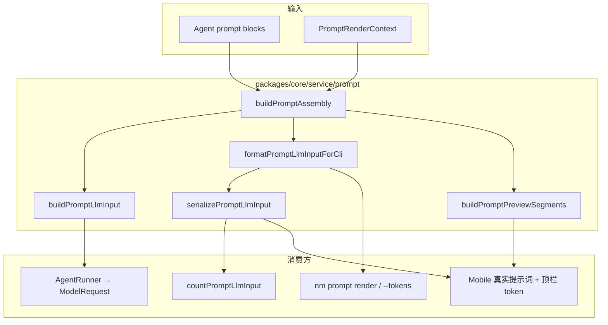

# Prompt LLM 输入与 Token 统计口径统一 技术规格（SPEC）

## 设计目标

- 恢复 [prompt-engine PRD](../prompt-engine/prd.md)「所见即所得」语义：**任意 `role` 的 text 块**经宏展开后均进入最终 prompt。
- **单一 assembly 管道**：真实提示词预览、CLI render、token 统计、Agent LLM 请求共用同一拼接逻辑，消除「预览有、计数无、模型无」三分裂。
- 最小侵入：不改 LLM adapter 协议；在 `buildPromptLlmInput` 层将 non-system text 块转为 **synthetic `ChatMessage`** 按 block 顺序插入 `history`。
- 附带修正 Mobile hide/show/压缩后 token 顶栏不刷新问题。

---

## 现状与约束（代码探索）

| 模块 | 现状 | 问题 |
|------|------|------|
| `render-prompt.ts` `buildPromptLlmInput` | 仅 `role === "system"` text → `input.system`；chat → `input.messages` | user/assistant text 块丢弃 |
| `buildPromptPreviewSegments` / `formatPromptLlmInputForCli` | 遍历全部 text 块 + chat 消息，带 `{role}:` 前缀 | 与 LLM 输入不一致 |
| `serialize-prompt-input.ts` | `system` 裸文本 + `role: body` 消息；**无** `system:` 前缀 | 与 preview/CLI 格式不一致 |
| `countPromptLlmInput` | `serializePromptLlmInput(input)` | 漏计 non-system text；system 格式与 preview 不同 |
| `agent-runner.ts` | `buildPromptLlmInput` → `request({ system, history })` | 模型收不到 user 块 worktree |
| `chat-prompt-tokens.service.ts` | `buildSessionPromptInput` + `countPromptLlmInput` | 同上 |
| `ChatTabScreen.tsx` | hide/show/compact 仅 `reloadMessages` | token 顶栏 stale |
| `agent-system/spec.md` | 明确「其他 role 默认不进 messages」 | **本迭代 supersede** 该条 |
| `agent-prompt-abstract-block` | `abstract` 类型已移除 | 不在范围 |

**LLM 映射约束（保持不变）**：

- `OpenAiProtocolAdapter.buildMessages`：`system` → 首条 `{ role: "system" }`；`history` 追加在后。
- `AnthropicProtocolAdapter`：`system` 字段 + `messages` 数组。
- Synthetic template 消息只需合法 `ChatMessage` 结构（`text` block content），mapper 不依赖 DB seq。

---

## 总体方案

### 核心抽象：`buildPromptAssembly`

在 `packages/core/src/service/prompt/render-prompt.ts`（或同级 `prompt-assembly.ts`）新增**唯一** block 遍历：

```typescript
export interface PromptAssemblySegment {
  readonly id: string;           // text-{name} | chat-{messageId}-{i}
  readonly role: string;         // system | user | assistant | tool（chat 预览）
  readonly title: string;        // preview UI 用
  readonly body: string;         // 宏已展开的正文（chat 来自 messageBodyText / preview formatter）
  readonly source: "template" | "message";
}

export function buildPromptAssembly(
  blocks: readonly PromptBlock[],
  ctx: PromptRenderContext,
): readonly PromptAssemblySegment[];
```

**遍历规则**（与现 `buildPromptPreviewSegments` 顺序一致）：

1. `type: text`：对 `content` 做 `renderMacro` → 产生 segment（任意 role）。
2. `type: chat`：对 `ctx.messages` 逐条 `formatChatMessageForCliPreview` → 每条 1..N segment。

> **产品约束**：prompt 模板至多一个 `chat` 块（校验可加在 `validatePromptBlocksFromMap`；本迭代实现按单 chat 块设计，不处理重复注入）。

### 从 assembly 派生 LLM 输入

```typescript
export function buildPromptLlmInput(
  blocks: readonly PromptBlock[],
  ctx: PromptRenderContext,
): PromptLlmInput {
  const segments = buildPromptAssembly(blocks, ctx);
  const systemParts: string[] = [];
  const messages: ChatMessage[] = [];

  // 第二遍按 blocks 顺序（需 block 边界信息 — 见实现细节）
  for (const block of blocks) { ... }
}
```

**推荐实现**：assembly 遍历时同步构建 LLM 结构，避免二次扫描：

| Block | LLM 映射 |
|-------|----------|
| `text` + `role: system` | 追加到 `systemParts`（宏展开后 `\n` join） |
| `text` + `role: user \| assistant` | 追加 `syntheticTemplateMessage(block, expanded)` 到 `messages` |
| `type: chat` | 追加 `...ctx.messages` 到 `messages`（保持顺序） |

**Synthetic（虚拟）消息**

Prompt 里 `role: user | assistant` 的 text 块不会落库，仅在本次 `buildPromptLlmInput` → LLM 请求 / token 计数链路中**临时**构造成 `ChatMessage`。一次性使用，**不持久化**。

`id` / `seq` / `createdAtMs` 对业务无意义，仅满足类型与 mapper 入参；实现采用**固定占位**，不保证唯一或排序：

```typescript
function syntheticTemplateMessage(
  block: TextPromptBlock,
  expanded: string,
  ctx: PromptRenderContext,
): ChatMessage {
  return {
    id: `prompt:${block.name}`,       // 占位；不参与 tool 配对
    sessionId: ctx.messages[0]?.sessionId ?? "",
    seq: 0,
    role: block.role,
    content: textBlocks(expanded),
    provider: null,
    raw: null,
    createdAtMs: 0,
    hidden: false,
  };
}
```

- **不参与** `toolUseLookupMessages` / tool_result 配对逻辑。
- `agent-runner` 已有 `normalizeOrphanToolResultsForLlm`：单测确认 synthetic 纯 text 消息不被误删。

### 统一文本序列化（token / CLI / preview）

```typescript
function formatSegment(role: string, body: string): string { /* 现有 */ }

export function formatPromptLlmInputForCli(
  blocks: readonly PromptBlock[],
  ctx: PromptRenderContext,
): string {
  return buildPromptAssembly(blocks, ctx)
    .map((s) => formatSegment(s.role, s.body))
    .join("\n");
}

export function buildPromptPreviewSegments(...): PromptPreviewSegment[] {
  return buildPromptAssembly(...).map(/* 映射 id/title */);
}

export function serializePromptLlmInput(
  blocks: readonly PromptBlock[],
  ctx: PromptRenderContext,
): string {
  return formatPromptLlmInputForCli(blocks, ctx);
}
```

**Breaking**：`serializePromptLlmInput` 签名从 `(input: PromptLlmInput)` 改为 `(blocks, ctx)`。旧签名删除，调用方一次性改完（本仓库 monorepo 可控）。

**Token 计数影响**：

- system 段增加 `system:` 前缀 → 纯 system Agent token **略增**（与 preview 一致，可接受）。
- user/assistant text 块 **新增** 计入 token（本需求目标）。

### `countPromptLlmInput` 入参调整

```typescript
export interface CountPromptLlmInputParams {
  readonly blocks: readonly PromptBlock[];
  readonly ctx: PromptRenderContext;
  readonly applicationModelId: string;
  readonly registry: TokenCounterRegistry;
  readonly tokenizerOverride?: TokenizerOverride;
}
```

Driver 内部：

```typescript
const serialized = serializePromptLlmInput(params.blocks, params.ctx);
```

`buildPromptLlmInput` 仍用于 compaction `TokenRatioConditionTrigger`（`evaluation.promptInput`），因 `promptInput.messages` 已含 template 消息，配合新 serialize 口径一致。

可选：`CountPromptLlmInputParams` 保留 `input?` 仅用于无 blocks 的极简测试 — **不建议**，测试应提供 blocks。

---

## 架构图



---

## 最终项目结构

```text
packages/core/src/service/prompt/
  render-prompt.ts              # buildPromptAssembly + 派生 API（或 prompt-assembly.ts）
  render-prompt.ts              # PromptLlmInput / PromptRenderContext 类型保留

packages/core/src/infra/tokenizer/logic/
  serialize-prompt-input.ts     # 改签名，委托 formatPromptLlmInputForCli
  count-prompt-llm-input.ts     # CountPromptLlmInputParams 增 blocks+ctx

packages/tokenizer-driver-node/src/
  count-prompt-llm-input.ts     # 同步 params

packages/tokenizer-driver-rn/src/
  count-prompt-llm-input.ts     # 同步 params

apps/cli/src/prompt/commands.ts # render / --tokens 调用新 API

apps/mobile/src/services/
  chat-prompt-tokens.service.ts # countPromptLlmInput({ blocks, ctx, ... })
  session-prompt-input.service.ts # 导出 blocks+ctx bundle（已有 definition+ctx+input）

apps/mobile/src/screens/tabs/ChatTabScreen.tsx
  # hide/show/compact 后 refreshChatTokenLabel

packages/core/test/prompt/
  render-prompt.test.ts         # 扩展 user 块 + worktree 用例
  prompt-assembly-parity.test.ts # serialize === format === preview join

packages/core/test/infra/tokenizer/
  serialize-prompt-input.test.ts
  count-prompt-llm-input parity tests（若已有）

packages/core/test/agent/
  agent-runner-template-blocks.test.ts  # synthetic 消息进入 history
```

---

## 变更点清单

| 文件 | 变更 |
|------|------|
| `packages/core/src/service/prompt/render-prompt.ts` | 新增 `buildPromptAssembly`；重写 `buildPromptLlmInput`；简化 preview/CLI；`formatPromptLlmInputForCli` 去掉 `input` 参数 |
| `packages/core/src/infra/tokenizer/logic/serialize-prompt-input.ts` | `(blocks, ctx) => string` |
| `packages/core/src/infra/tokenizer/logic/count-prompt-llm-input.ts` | params 增 `blocks`+`ctx` |
| `packages/core/src/index.ts` | 导出调整 |
| `packages/tokenizer-driver-node/src/count-prompt-llm-input.ts` | 同上 |
| `packages/tokenizer-driver-rn/src/count-prompt-llm-input.ts` | 同上 |
| `apps/cli/src/prompt/commands.ts` | 新 API |
| `apps/mobile/src/services/chat-prompt-tokens.service.ts` | 传 blocks+ctx |
| `apps/mobile/src/services/session-prompt-input.service.ts` | bundle 增 `blocks` 或复用 `definition.prompts` |
| `apps/mobile/src/services/prompt-preview.service.ts` | 去掉多余 `input` 传参（若 API 变） |
| `apps/mobile/src/screens/tabs/ChatTabScreen.tsx` | hide/show/compact/delete 后 `refreshChatTokenLabel` |
| `packages/core/test/**` | 见测试策略 |
| `.apm/kb/docs/Iterations/agent-system/spec.md` 等 | **不修改历史文档**；本 SPEC 声明 supersede |

---

## 详细实现步骤

### Step 1 — Assembly 抽取（Core）

1. 将 `buildPromptPreviewSegments` 循环提取为 `buildPromptAssembly`。
2. 单元测试：assembly segment 顺序、宏展开、chat tool 预览格式与现网 snapshot 一致。

### Step 2 — `buildPromptLlmInput` 扩展

1. 遍历时填充 `systemParts` + synthetic `messages`。
2. 测试：
   - `[system, user+{{.worktree}}, chat]` → `messages[0]` 为 synthetic user，body 含 WT；
   - `[system, chat, user]` → 顺序正确；
   - 仅 system+chat → 与现网相同。

### Step 3 — 统一 serialize / format

1. `formatPromptLlmInputForCli(blocks, ctx)` — 移除 `input` 参数。
2. `serializePromptLlmInput` → 委托 format。
3. 断言 `serialize === format` 恒成立。

### Step 4 — Token 计数链

1. 更新 `CountPromptLlmInputParams` 与 node/rn drivers。
2. 更新 `chat-prompt-tokens.service.ts`、`apps/cli/src/prompt/commands.ts`。
3. 测试：user 块含大 worktree 时 token > 仅 messages 计数。

### Step 5 — AgentRunner 回归

1. 新增测试：mock modelRequests，断言 `history` 含 synthetic 消息。
2. 跑 `normalizeOrphanToolResultsForLlm` 相关用例。

### Step 6 — Mobile token 刷新

1. `hideSelectedMessages` / `handleHideMessage` / `handleShowMessage` / `handleCompactSession` / `deleteSelectedMessages` 末尾 `void refreshChatTokenLabel()`（或共用 `handleMessagesChanged`）。
2. 轻量测试 optional（integration mock 已有 pattern）。

### Step 7 — 文档与 KB

1. `apm kb index rebuild`
2. 在 PR 描述中注明 **行为变更**：user/assistant text 块将进入模型。

---

## 测试策略

### 测试用例

| ID | 层 | 场景 | 期望 |
|----|-----|------|------|
| T1 | core | user 块 `{{.worktree}}`，ctx.worktreeDisplay=`WT` | assembly 含 `role:user, body:WT`；`buildPromptLlmInput.messages[0]` 正文 WT |
| T2 | core | `serializePromptLlmInput(blocks,ctx) === formatPromptLlmInputForCli(blocks,ctx)` | 字符串相等 |
| T3 | core | system+chat only（writer agent 形状） | token 计数 messages 部分不变；system 段含 `system:` 前缀 |
| T4 | core | hide 后 ctx.messages 变短，user 块不变 | serialize 长度下降小于「仅消息」场景（worktree 仍占显著比例） |
| T5 | core | agent-runner mock | `request` 的 history 含 synthetic 消息（`id` 前缀 `prompt:`） |
| T6 | core | tool 会话 + user template 块 | tool_result 配对不受影响 |
| T7 | cli | `prompt render --tokens` | stderr JSON tokenCount 与 render stdout 序列化一致（可加集成脚本） |
| T8 | mobile | hide 消息后 | token label 更新（单测 mock refresh 调用可选） |

### 运行命令

```bash
npm test -w @novel-master/core
npm test -w @novel-master/tokenizer-driver-node
npm test -w @novel-master/tokenizer-driver-rn
npm test -w @novel-master/mobile -- --testPathPattern="prompt|chat-prompt"
```

---

## 兼容性与迁移说明

| 项 | 说明 |
|----|------|
| **Agent 行为** | 已有 Agent 若在 user/assistant text 块写了指令/上下文，**从「不进模型」变为「进模型」** — 可能改善 worktree 场景，也可能改变对话（例如重复 user 前缀内容） |
| **Token 阈值** | compaction `TokenRatioConditionTrigger` 计数上升 → 可能更早触发压缩；符合「真实 prompt 体积」语义 |
| **API 破坏** | `serializePromptLlmInput(input)`、`formatPromptLlmInputForCli(blocks, input, ctx)`、`CountPromptLlmInputParams` 签名变更；monorepo 内一次性更新 |
| **Supersede** | `agent-system/spec.md` 中「其他 role 不进 messages」；`agent-prompt-abstract-block` 中同类描述 |

**回滚**：revert 本迭代 commit；无 DB migration。

---

## 风险与回滚方案

| 风险 | 缓解 |
|------|------|
| Synthetic 消息干扰 tool 配对 | T6 单测；虚拟消息仅 text block，不参与 toolUseLookup |
| Token 数值跳变导致用户困惑 | PR / release note 说明；Mobile 顶栏 hide 后即时刷新 |
| OpenAI 对连续 user 消息限制 | 现网 tool 流程已有连续 user（tool_result）；template user 块同理 |
| 实现复杂度 | assembly 单函数，preview/LLM/token 均派生，禁止双份循环逻辑 |

**回滚**：git revert；无持久化格式变更。

---

## 已确认决策

| 项 | 决策 |
|----|------|
| Synthetic `id` / `seq` | 一次性占位即可（`id: prompt:{blockName}`，`seq: 0`）；不要求唯一或有序 |
| 多 chat 块 | 产品禁止；实现按单 chat 块；可选在 `validatePromptBlocksFromMap` 加校验 |
| 整体方案 | 待用户确认 SPEC 全文后进入编码 |
