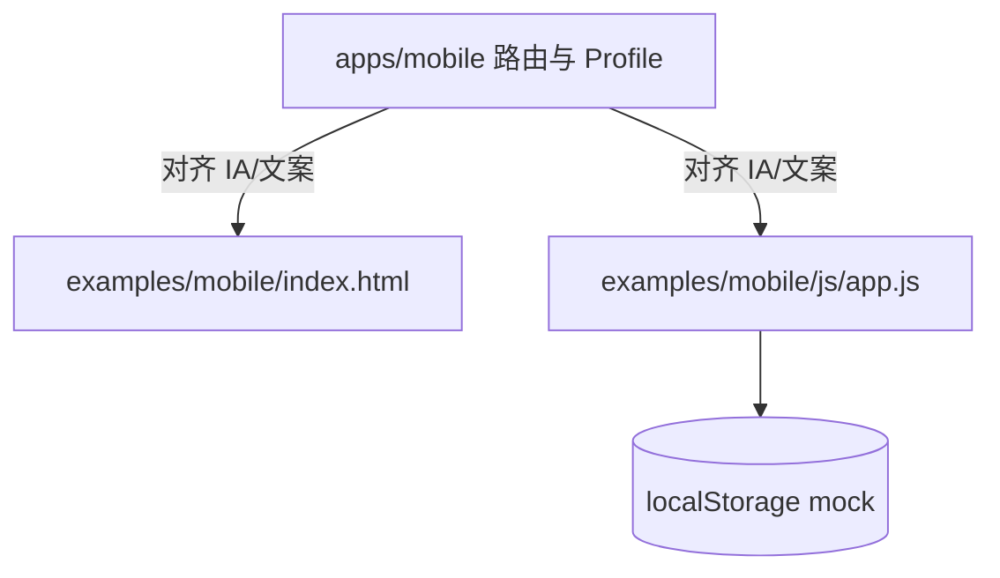
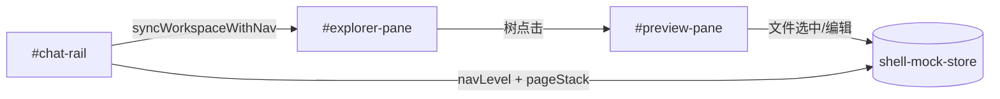

# 原型优化（Mobile 同步 + Desktop 完善）技术规格（SPEC）

## 设计目标

1. 在 **`desktop-dev` worktree** 内完成 `examples/mobile` 与 `examples/desktop` 原型升级，对齐 `apps/mobile` 当前 IA 与能力全集。
2. **冻结 desktop 真实布局**（见下文「现状分叉」），禁止按主分支 `examples/desktop` 的 sidebar 结构实现。
3. 交互标准为 **localStorage mock**：可增删改、可刷新保留；不接 Core。

---

## 现状分叉（为何之前方案对不上）

本次误实现的根因：**主仓库与 worktree 的 `examples/desktop` 是两套完全不同的原型**，实现者读了主分支代码，与用户截图 / worktree 不一致。

| 维度 | 主分支 `d:\Dev\Js\novel-master\examples\desktop` | **worktree（权威）** `desktop-dev-785029df/examples/desktop` |
|------|--------------------------------------------------|---------------------------------------------------------------|
| 入口文件 | `index.html` + `css/styles.css` + `js/app.js` | `index.html` + **`shell.css`** + **`shell.js`** |
| 顶层 DOM | `#sidebar` + `#mainContent` + `#rightSidebar` | **`#preview-pane`** + **`#explorer-pane`** + **`#chat-rail`** |
| 左栏语义 | 会话/Agent/设置 Tab + 列表 | **文件预览**（点击树后显示内容） |
| 中栏语义 | （无独立 explorer） | **工作区树**，标题 `#workspace-title` 随导航变 |
| 右栏语义 | 工作区文件 + 日志 Tab | **Chat rail 嵌套导航**（项目→会话→聊天） |
| 导航模式 | 左 Tab 切换视图 | 右栏 **drill-down** + 中栏 scope 联动（已实现） |
| 迭代约定 | 历史完整 mock（但未在 worktree 维护） | **浏览器优先 canonical copy**（见 `index.html` 注释） |

用户截图对应 **worktree 布局**：

```text
┌─────────────────────┬──────────────┬────────────────────┐
│ 文件预览             │ 全局工作区    │ 项目               │
│ shared-prompt.md    │ templates/   │ 星辰之海 ›         │
│ (选中文件内容)       │ agents/      │ 镜中城 ›           │
│                     │ shared-prompt│ 风语笔记 ›         │
│                     │  (高亮)      │                    │
└─────────────────────┴──────────────┴────────────────────┘
     #preview-pane      #explorer-pane    #chat-rail
```

**结论**：`prototype-optimization` 的 desktop 任务 **仅修改 worktree**；主分支 `examples/desktop` 在 merge 前 **不触碰**。

---

## 总体方案

### 任务 A — Mobile（`examples/mobile`）

**策略**：在现有 ~3700 行 `js/app.js` 上增量改造（与主分支同源，worktree 副本结构相同），以 `apps/mobile/src/navigation/types.ts` + `ProfileTabScreen.tsx` 为权威。



**核心改动轴**：

| 轴 | 现状（worktree） | 目标 |
|----|------------------|------|
| 底栏 | 对话 / **Agent** / 我的 | 对话 / 我的 |
| Agent | `agentsPage` + `defaultAgentId` + 「设为默认」 | `agentsSettingsPage` + `workspaceCurrentAgentId` |
| 我的 | 扁平 7 项菜单 | 工作区 / 数据管理 / 配置 三区 |
| 压缩 | `compactionPolicy`「压缩策略」 | `compactionConditions`「压缩条件」 |
| 事件 | 无 | `eventsConfig` 页 |
| 工作区 | 仅当前模型 | +当前 agent、当前正则组、流式、富文本、**Token 计数器** |
| 数据 | 无 | 导出/导入 JSON mock |
| 会话抽屉 | 仅切换模型 | +当前 agent 只读、切换 agent |

### 任务 B — Desktop（`examples/desktop` shell）

**策略**：扩展 `shell.js` 导航状态机 + 在 `#chat-rail` 内增加与 mobile 等价的 **nav view 栈**；`#explorer-pane` / `#preview-pane` 行为保持并增强；**不引入** `#sidebar`。



**Chat rail 导航扩展**（在现有 3 级 drill-down 之上）：

| `data-nav-view` | 说明 | mobile 对应 |
|-----------------|------|-------------|
| `projects` | 已有 | 项目 drawer |
| `sessions` | 已有 | 会话列表 |
| `conversation` | 已有；增强菜单 | 聊天 + 会话操作抽屉 |
| `profile` | **新增** | 底栏「我的」 |
| `agentsSettings` | **新增** | agent管理 |
| `agentEditor` | **新增** | AgentEditor |
| `providers` / `providerDetail` / `modelSampling` | **新增** | 服务商流 |
| `compactionConditions` | **新增** | 压缩条件 |
| `eventsConfig` | **新增** | 事件配置 |
| `regexGroups` / `regexRules` / `regexRuleEditor` | **新增** | 正则流 |
| `globalTemplate` | **新增** | 全局模板（或联动 explorer global 树） |
| `realPrompt` / `sessionLog` | **新增** | 会话抽屉入口 |

**Desktop 与 mobile 的 IA 映射**（布局不同、能力等价）：

| mobile | desktop（worktree） |
|--------|---------------------|
| 底栏「对话」 | chat rail 默认流（项目→会话→聊天） |
| 底栏「我的」 | chat rail `profile` 视图 + 顶栏入口按钮 |
| 顶栏主题 | preview-pane 顶栏或 rail 顶栏主题按钮 |
| 全屏 stack 子页 | chat rail 内 `showNavView` + `pageStack` 压栈 |
| VFS 文件编辑 | preview-pane 可编辑模式（textarea） |
| 项目模板 Tab | explorer `session` scope 树（已有） |

---

## 最终项目结构

```text
desktop-dev worktree/
├── .apm/kb/docs/Iterations/prototype-optimization/
│   ├── prd.md          # 已有
│   └── spec.md         # 本文件
├── examples/mobile/
│   ├── index.html      # IA、新页面、新 modal
│   ├── js/app.js       # 状态/路由/mock 增量
│   ├── css/styles.css  # profile 分区、drawer 只读区
│   └── docs/feature-inventory.md
└── examples/desktop/
    ├── index.html      # 新 nav-view 模板、chrome、modal
    ├── shell.css       # 新视图/表单/主题 dark 变量
    ├── shell.js        # 导航栈 + mock store + 配置页渲染
    ├── mock-store.js   # 【可选拆分】localStorage 读写与种子数据
    └── README.md       # 更新能力清单与布局说明
```

**不修改**：`apps/mobile`、`apps/desktop`（Electron 壳）、`packages/*`、主分支 `examples/`。

---

## 变更点清单

### Mobile — `index.html`

| 变更 | 说明 |
|------|------|
| 底栏 | 删除 `data-page="agents"` |
| `agentsPage` → `agentsSettingsPage` | id 更名，仅从 profile 进入 |
| `profilePage` | 三分区菜单（工作区/数据管理/配置） |
| `compactionPolicyPage` → `compactionConditionsPage` | id + 文案 |
| 新增 `eventsConfigPage` | 事件块表单 |
| 会话抽屉 | 只读 agent/model + `switch-agent` |
| 新增 modal | `agentPickerModal`、`regexGroupPickerModal` |
| 新增 `#dbImportInput` | 隐藏 file input |

### Mobile — `js/app.js`

| 变更 | 说明 |
|------|------|
| `defaultAgentId` → `workspaceCurrentAgentId` | + `WORKSPACE_AGENT_STORAGE_KEY` |
| `pageConfig` | 移除 `agents`；加 `agentsSettings`、`compactionConditions`、`eventsConfig` |
| `setupMenuItems` | 新 action 映射；开关 change 处理 |
| `showAgentItemMenu` | 重命名/复制/删除；移除 set-default |
| `renderAgentList` | 移除 default badge |
| 新增 | `openAgentPickerModal`、`exportDatabaseMock`、`importDatabaseMock`、`renderEventsConfigPage` 等 |
| `persistAgentCatalog` / `loadAgentCatalog` | Agent mock 持久化 |
| 偏好 | `llmStream`、`chatRichText`、`tokenCounterMode` + localStorage |

### Mobile — `css/styles.css`

- `.menu-section-title`、`.menu-item--switch`、`.drawer-readonly-*`、`.events-config-block`

### Desktop — `index.html`

| 变更 | 说明 |
|------|------|
| preview-pane header | 主题切换按钮 |
| chat-rail | 顶栏 **对话 | 我的** 切换（对齐 mobile 2 Tab） |
| chat-rail | 新增各 `data-nav-view` 容器（profile、配置子页等） |
| conversation 视图 | 会话操作按钮（模型/agent/真实提示词/日志） |
| 全局 modal 容器 | picker、confirm、toast |
| `mock-store.js` | 若拆分则 script 引入在 shell.js 前 |

### Desktop — `shell.js`

| 变更 | 说明 |
|------|------|
| `navState` | 扩展 `rootTab: 'chat'|'profile'`、`pageStack: string[]` |
| `showChatLevel` → 泛化 `showNavView(viewId)` | 支持配置子页 |
| `NAV_TO_WORKSPACE` | profile/配置页不改变 explorer scope 或置为 `global` |
| `MOCK_PREVIEW` | 改为从 store 读取；支持编辑写回 |
| 新增渲染器 | `renderProfileView`、`renderProvidersView`、`renderCompactionConditions`… |
| 主题 | `initTheme` / `toggleTheme`，`shell.css` `[data-theme=dark]` |
| 持久化 | `nm-desktop-shell-state-v1` |

### Desktop — `shell.css`

- `[data-theme="dark"]` 变量覆盖
- profile 列表、表单、modal、nav 栈内子页样式
- preview 编辑态 `textarea`

---

## 详细实现步骤

### Phase 0 — 环境锁定（0.5h）

1. 确认工作目录为 worktree 根：`desktop-dev-785029df`。
2. 禁止修改主分支 `novel-master/examples/*`。
3. 打开 `examples/desktop/index.html` 验收布局为 preview | explorer | rail。

### Phase 1 — Mobile 同步（优先，1.5–2d）

| 步骤 | 内容 | 验证 |
|------|------|------|
| 1.1 | 底栏 2 Tab + `agentsSettingsPage` | 无 Agent Tab |
| 1.2 | Profile 三区 + 开关 + Token 计数器 | 与 `ProfileTabScreen` 菜单一致 |
| 1.3 | Agent 语义（current agent、重命名、无默认） | 抽屉与列表验收 |
| 1.4 | `compactionConditions` + `eventsConfig` | 可编辑保存 |
| 1.5 | 导入导出 mock | JSON 下载/覆盖刷新 |
| 1.6 | 更新 `feature-inventory.md` | 对照 `types.ts` |

**复用**：mobile `app.js` 已有 providers/regex/vfs/batch 大部分逻辑，**优先改 IA 与缺口**，避免重写。

### Phase 2 — Desktop shell 导航扩展（1–1.5d）

| 步骤 | 内容 | 验证 |
|------|------|------|
| 2.1 | rail 顶栏「对话 \| 我的」 | 切换不破坏 drill-down 状态 |
| 2.2 | `profile` 视图 UI | 菜单项与 mobile 一致 |
| 2.3 | `pageStack` + 返回键 | 压栈/弹栈 |
| 2.4 | `syncWorkspaceWithNav` 回归 | 项目/会话/聊天仍联动标题与树 |
| 2.5 | 主题切换 + dark CSS | 刷新保留 |

### Phase 3 — Desktop 配置子页 mock（1.5–2d）

| 步骤 | 内容 | 验证 |
|------|------|------|
| 3.1 | agentsSettings + agentEditor | CRUD mock |
| 3.2 | providers → providerDetail → modelSampling | 列表可点 |
| 3.3 | compactionConditions、eventsConfig | 表单 localStorage |
| 3.4 | regex 三页 | 复用 mobile 字段语义（可简化） |
| 3.5 | globalTemplate | explorer global 树 + profile 入口一致 |
| 3.6 | conversation 会话菜单 | 真实提示词/日志在 rail 或 preview 展示 |
| 3.7 | preview 编辑模式 | 树选文件后可编辑保存 |

### Phase 4 — 文档与合并准备（0.5d）

1. 更新 `examples/desktop/README.md` 能力表。
2. worktree 合并回主分支时 **替换** 主分支 `examples/desktop`（非合并两套布局）。
3. 主分支 `apm kb index rebuild`（worktree 内 apm 不完整可跳过至 merge 后）。

---

## 测试策略

### 手动验收（浏览器 file://）

**Mobile**（`examples/mobile/index.html`）：

1. 底栏仅 2 Tab。
2. 我的 → 各配置项可进入并保存，刷新后保留。
3. 会话抽屉显示 agent/model，可切换。
4. Agent 列表无「默认」；⋮ 可重命名。

**Desktop**（`examples/desktop/index.html`）：

1. DOM 仍为 `#preview-pane`、`#explorer-pane`、`#chat-rail`（**无 `#sidebar`**）。
2. 选项目→会话→聊天，中间标题依次为 全局/会话/聊天工作区。
3. 点树文件，左侧预览更新。
4. 我的 → 压缩条件/事件配置可编辑保存。
5. 主题切换后刷新仍生效。

### 测试用例

| ID | Given | When | Then |
|----|-------|------|------|
| M-01 | 打开 mobile 原型 | 看底栏 | 仅对话、我的 |
| M-02 | 我的页 | 查看菜单 | 含工作区/数据管理/配置三区 |
| M-03 | 我的→事件配置 | 编辑保存刷新 | 数据仍在 |
| M-04 | Agent 列表 | 打开 ⋮ | 无「设为默认」，有重命名 |
| D-01 | 打开 desktop worktree | 检查 DOM | 三个 pane id 正确，无 sidebar |
| D-02 | 默认页 | 看右栏 | 项目列表（与截图一致） |
| D-03 | 点项目→会话→聊天 | 观察中栏标题 | 全局→会话→聊天工作区 |
| D-04 | 点 shared-prompt.md | 看左栏 | 预览内容更新 |
| D-05 | 我的→服务商 | 操作 | rail 内列表，非 Toast |
| D-06 | 切换深色主题 | 刷新 | 仍为深色 |
| N-01 | 主分支 examples/desktop | 打开 | 仍为旧 sidebar（本迭代不改） |

### 回归注意

- desktop `showChatLevel('projects')` 初始态与截图一致。
- explorer 三 panel（global/session/chat）切换不可回归破坏。
- mobile 现有 VFS/batch/regex 流程仍可点通。

---

## 风险与回滚方案

| 风险 | 缓解 | 回滚 |
|------|------|------|
| 再次改错仓库（主分支 vs worktree） | Phase 0 强制路径检查；PR 仅来自 `desktop-dev` 分支 | `git restore examples/` |
| mobile `app.js` 单体过大难维护 | 本迭代仍增量；后续可拆 `mock/` 模块 | 按文件 restore |
| desktop rail 视图过多导致 `index.html` 膨胀 | 复杂表单用 `shell.js` 动态渲染 | 保留 shell.js 单文件可回滚 |
| 与 `desktop-main-shell` 旧 SPEC 冲突 | 以 **当前 `shell.js` 嵌套导航** 为准，旧 SPEC 三列并列描述作废 | 在 README 注明 |
| merge 时覆盖主分支 examples/desktop | merge 前对比布局；一次性替换 | 主分支保留旧版 tag 备份 |

---

## 编码前确认项

请确认以下 SPEC 要点后再进入实现：

1. **Desktop 权威布局** = worktree `preview | explorer | chat-rail`（截图），**不是**主分支 sidebar 三栏。
2. **Mobile** 在 worktree `examples/mobile` 增量同步 `apps/mobile`。
3. **Desktop 配置页** 放在 **chat-rail 内压栈**，不放到 sidebar/中栏独立 App 框架。
4. **Token 计数器** 纳入 mobile/desktop profile 工作区（App 已有，原型此前缺失）。

确认后回复「按 SPEC 实现」或指出需调整的条目。
