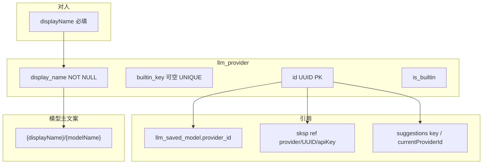

# provider-identity 技术规格（SPEC）

## 需求来源

- PRD：`.apm/kb/docs/Iterations/provider-identity/prd.md`
- 前置：`provider-model`、`saved-model-identity`、`mobile-bugfix`（本迭代**撤销**其「移除服务商 displayName、改展示 id」决策）
- 已拍板：技术主键 UUID；`displayName` 必填禁空；UI 主路径不见 id；模型主文案前缀走服务商名称；CLI **不做**旧 slug 兼容；验收 Mobile + Desktop + CLI

## 设计目标

1. `llm_provider.id` 改为系统生成 **UUID**；用户创建不填技术主键。
2. `displayName` 成为对人唯一身份字段（**必填**）；UI 主路径只展示它。
3. 登记制 migration `provider-identity-v1`：表重建 + 引用级联 + 空名称回填。
4. 模型派生主文案改为 `{服务商名称}/{modelName}`。
5. CLI / Desktop IPC / Mobile 表单合同与 Core 对齐；破坏性，零旧 slug 兼容层。

## 总体方案

### 身份模型（迁移后）



| 概念 | 角色 |
|------|------|
| `id` (UUID) | 技术主键；IPC/路由/FK/CLI 精确选用；**UI 主路径不展示** |
| `displayName` | 持久化、必填；列表/详情/Agent/创建编辑的人对身份 |
| `builtin_key` | 仅内置行：`openai` / `anthropic` / `google` / `openrouter` / `opencode`；自定义为 `NULL`；**seed 幂等与默认 key/协议护栏用此列，不对用户展示** |
| `is_builtin` | 禁删、禁改 protocol（保持） |

**为何保留 `builtin_key`（实现细节，非产品二选一）**：PRD 不要求用户看见内置 slug，但 seed / `builtinDefaultApiKey` / create 禁占 / 协议推断仍需稳定认出「哪一行是 OpenAI」。`builtin_key` 承接旧 slug 语义；`id` 一律 UUID。

### Core 合同变更

**`CreateProviderInput`（自定义）**

```ts
{
  // 无 id：服务内 randomUUID()
  protocol: LlmProtocol;
  baseUrl: string;
  displayName: string; // trim 后非空，否则 INVALID_ARGUMENT
  apiKey?: string;
  headers?: Record<string, string>;
}
```

（**无** `defaultModelId`：该字段不属于现网 `CreateProviderInput`，本迭代也不引入。）

**`EditProviderPatch`**

- `displayName?: string`：若出现则 trim 后必须非空（禁止写回 `null` / 空白；空白 → `INVALID_ARGUMENT`）
- 其余字段保持现网（`baseUrl` / `apiKey` / `headers` / `protocol` 内置禁改）

**内置 seed**

- 每条内置：固定 `builtin_key` + **固定 UUID 常量**（写入 `builtin-providers.ts`，保证跨安装一致）+ 非空 `displayName`
- 幂等：`WHERE NOT EXISTS (… builtin_key = #{key})`（**不再**按 `id = 'openai'`）
- `BUILTIN_PROVIDER_IDS` 重构为 `BUILTIN_PROVIDER_KEYS`（或保留旧名但值为 key）；`builtinDefaultApiKey` / `BUILTIN_PROVIDER_PROTOCOLS` 按 **key** 索引；运行时通过 `provider.builtinKey` 或查表解析

**协议推断（必须改）**

- `inferLlmProtocolFromSavedModelId` **不得**再写 `BUILTIN_PROVIDER_PROTOCOLS[saved.providerId]`：迁移后 `providerId` 是 UUID，用它当 map key 会永远 miss、退化到默认协议。
- 正确路径：查 `llm_provider`（或等价 join）→ 取 `builtin_key`（或固定 UUID→protocol 表）→ 再查 `BUILTIN_PROVIDER_PROTOCOLS[builtin_key]`；自定义无 `builtin_key` 时走行上 `protocol` 字段（与现网自定义行为一致）。
- 固定 UUID 常量若单独建 `UUID → protocol` 表，须与 seed 常量同源，禁止两套漂移。

**模型主文案签名（第二参必填）**

```ts
/** 主文案前缀为服务商 displayName（非技术 id） */
export function formatSavedModelDisplayName(
  providerDisplayName: string,
  modelName: string,
): string {
  return `${providerDisplayName}/${modelName}`;
}

/**
 * 派生已保存模型主文案。
 * @param providerDisplayName 必填：调用方须先 resolve 服务商 displayName 再传入；
 *   禁止省略；禁止把 provider UUID / 旧 slug 当作「碰巧能编译过」的第二参来源糊弄过去。
 */
export function savedModelDisplayName(
  model: SavedModel,
  providerDisplayName: string,
): string {
  return formatSavedModelDisplayName(providerDisplayName, model.modelName);
}
```

- **禁止**仅靠把两个 `string` 参数改名（例如第一参从 `providerId` 改成 `providerDisplayName`）指望 TypeScript 拦住误传 UUID——`(string, string)` 对编译器不可区分。第二参必须是**显式必填**的 `providerDisplayName: string`（或等价对象参数，如 `{ providerDisplayName: string }`），调用方漏传即编译失败。
- `toSavedModelView(model, providerDisplayName)` 同步要求第二参（或在 map 层先 `providers.get` / join 取名称后再调）。
- 调用方**不得**再把 `providerId`（UUID）传入展示前缀位。

**须改调用面（漏改即主文案仍可能是 UUID）**

| 位置 | 现状问题 | 改法 |
|------|----------|------|
| Core `toSavedModelView` / `savedModelDisplayName` | 现用 `model.providerId` 当前缀 | 签名加必填 `providerDisplayName`；内部只拼名称 |
| Desktop IPC DTO（`provider-models.ts` 等） | `savedModelDisplayName(model)` 单参 | 先取服务商 `displayName` 再传入；DTO `displayName` 类型为 **`string`**（非 `string \| null`），主路径**去掉** `\|\| id` 回退 |
| Desktop `agent.ts` / `prompt.ts` | 同上单参 | 同上 |
| Mobile `resolveModelDisplayLabel`（`model-display-label.ts`） | `formatSavedModelDisplayName(saved.providerId, …)` | resolve provider → 传 `displayName` |
| Mobile `ModelPickerModal` / `AgentEditorForm` / `ProviderDetailScreen` | 直接用 `providerId` 当前缀 | 传服务商名称 |
| CLI `model/commands.ts`、`provider/model/commands.ts` | `savedModelDisplayName(m)` 单参 | list/current 时带上 provider 名称再调 |

### 密钥与 env（破坏性）

- 新建：`secretRef = provider/${uuid}/apiKey`（继续用 `providerApiKeyRef(id)`）
- 迁移：旧 `provider/{slug}/apiKey` 行 **rename** 为 `provider/{uuid}/apiKey`，并更新 `llm_provider.secret_ref`
- **env 覆盖名随 ref 变**：`NOVEL_MASTER_PROVIDER_<REF_ID>_API_KEY` 中的 `<REF_ID>` 来自 secret ref 的 provider 段。升级后内置不再是 `OPENAI` 这类旧 slug，而是 **UUID 大写形态**（非 `[A-Z0-9]` → `_` 的既有规则不变）。
- 本迭代与 PRD「CLI 不考虑兼容」一致：**不**再为旧名 `NOVEL_MASTER_PROVIDER_OPENAI_API_KEY` 等提供兼容别名；也不做「内置按 `builtin_key` 解析旧 env」。CI / 文档 / 本地脚本须改用新 UUID env 名（发版说明写出固定内置 UUID → env 示例）。

### Migration：`provider-identity-v1`

对照 `saved-model-identity-v1` 的路径 A/B 与登记约定；**判定条件不同**——`llm_provider` **本就有** `id` 列（见现网 `provider-schema.ts`），**禁止**用 `columns.has("id")` 判定新形态（那是 saved-model 表从无 id 到有 id 的模式，原样抄会把旧库误判成路径 B no-op）。

**路径 B — 新库（canonical 已是新形态）**：无表重建，**仅登记**。

1. 用 `pragma_table_info('llm_provider')` 判定：**仅当**存在 **`builtin_key` 列**（推荐；或显式新形态列集：`builtin_key` 存在 **且** `display_name` 为 NOT NULL 语义已由 canonical 保证）→ 视为已迁移形态。
2. **禁止**检测「`id` 是否像 UUID」或「`has("id")`」作为 no-op 条件。
3. 已是新形态 → up 内跳过 DDL/数据步骤；由 runner 在 up 成功后 `markApplied('provider-identity-v1')`（与 saved-model 路径 B 相同：空操作 up + 登记）。
4. 若已登记 → 整步 no-op。

**路径 A — 旧库（无 `builtin_key`）**：表重建 + 引用级联 + 登记。步骤顺序（与 saved-model-identity-v1 同级粒度）：

1. 若 **不含** `builtin_key` → 执行下列步骤；否则走路径 B。
2. **建 new 表**：`CREATE TABLE llm_provider_new`（`id` UUID PK、`builtin_key` 可空 UNIQUE、`display_name NOT NULL`、其余现网列 + 索引）。
3. **逐行映射**（内存 `Map<oldId, newUuid>`）：
   - 内置（旧 `id` ∈ 内置 slug 集）：`newUuid = 常量 UUID`，`builtin_key = 旧 id`，`displayName = 旧 displayName?.trim() || seed 友好名`
   - 自定义：`newUuid = randomUUID()`，`builtin_key = NULL`，`displayName = 旧 displayName?.trim() || 旧 id`
   - `INSERT INTO llm_provider_new …`
4. **改写 `llm_saved_model.provider_id`**：`oldId → newUuid`（UPDATE 或临时表；须在 DROP 旧 `llm_provider` **之前**完成，避免 FK 断裂）。
5. **rename SKSP**：`sksp_secrets.ref` 从 `provider/{oldId}/apiKey` → `provider/{newUuid}/apiKey`；同步更新行内 `llm_provider_new.secret_ref`。
6. **KKV rename**：`nm-model-suggestions` 等以旧 provider id 为 key 段的条目 → 新 UUID；漏改则建议数据挂错行。
7. **`currentProviderId`**：`nm-workspace-state.currentProviderId` 若为旧 id → 映射为新 UUID；未知旧值 **fail-fast**（或与产品约定清除——须在实现与单测中二选一并写死；默认与 saved-model 孤儿策略对齐：**fail-fast + 事务回滚**）。
8. **DROP / RENAME**：处理 FK（必要时暂关或先迁子表引用）→ `DROP TABLE llm_provider` → `ALTER TABLE llm_provider_new RENAME TO llm_provider` → 重建索引。
9. **硬断言（可选但推荐）**：抽查无残留 `builtin_key` 缺失的内置行；`display_name` 无空串。
10. 成功后由 runner `markApplied`。

**失败策略**

- 整段 up 在 **同一 bootstrap 事务**内；任一步抛错 → 整体回滚，不部分写库、不提前 mark。
- 无法映射的引用（saved_model / sksp / KKV / currentProviderId）→ **fail-fast**，错误信息带位置，便于修 fixture 或清脏数据后重试。
- **禁止**「检测到像 UUID 的 id 就 skip」的半吊子启发式。

**Fixture 形状提示**（单测 / db-backup）

- **旧库 fixture**：`llm_provider` **无** `builtin_key`；`id` 为 slug（如 `openai`、`my-gw`）；可含 `display_name` NULL/空白行；`llm_saved_model.provider_id` 指向旧 slug；可选 `sksp_secrets.ref = provider/openai/apiKey`；KKV `currentProviderId=openai`。
- **新库 fixture**：canonical DDL 已含 `builtin_key` + `display_name NOT NULL` + UUID `id` → 走路径 B，仅登记 migration id，不重建表。
- 对照 `saved-model-identity` 的 T-SM3/T-SM9：旧包 restore → rebootstrap → 断言 UUID、名称非空、密钥仍可读。

**二次 bootstrap**：已 mark 则跳过（路径 A/B 均如此）。

**实现注**：canonical `provider-schema.ts` 增加 `builtin_key` 与本 migration **同 PR 或 schema 不晚于 migration 合并**；否则新安装可能误走路径 A。

### CLI（破坏性）

| 命令 | 新合同 |
|------|--------|
| `create` | 必填 `--name`（→ `displayName`）；**无**用户自选 `--providerId`；打印生成的 UUID（stderr 或约定列） |
| `list` | TSV：`uuid \t displayName \t protocol \t baseUrl \t apiKeyStatus`（对齐 model list「脚本用 UUID、人看名称」） |
| `current` | 优先打印 `displayName`；可附 UUID |
| `use` / `delete` | `--providerId <uuid>` 精确指定；**不**按名称解析（重名消歧交给 UUID） |
| `edit` | `--providerId <uuid>` + 可选字段；**改名用 `--name`**（与 `create` 同一旗标，**不要**继续用易与旧合同混淆的「可空 `--displayName` 且缺省变 null」）；若传入 `--name`，trim 后必须非空，否则 `INVALID_ARGUMENT`；**禁止**把名称清成 `null` / 省略值写回空 |
| 错误文案 | 去掉「请提供自选 slug」类提示 |

旧 `create --providerId mygw`：**不**兼容。  
旧 env `NOVEL_MASTER_PROVIDER_OPENAI_API_KEY`：**不**兼容（见上节）。

### Desktop IPC

`ProviderCreateRequest`：移除 `id`；`displayName: string` 必填；handler 调 `providers.create` 后返回 `{ providerId: generatedUuid }`（或整颗 `provider`，但调用方须能拿到生成的 id）。

模型相关 DTO：`displayName: string`（派生主文案）；主路径组装时**禁止** `displayName \|\| id` / `displayName ?? id` 把 UUID 顶进人对文案。

### Mobile / Desktop UI

- 创建：必填「服务商名称」；无 Provider ID 输入
- 编辑：可改名称；**不**展示只读技术 ID（或仅 `__DEV__` 调试，默认关闭）
- 列表 / 详情标题 / Agent 下拉：仅 `displayName`
- 撤销并改写 `provider-form.test.tsx` 中「omit displayName」断言

**Mobile 创建成功路径（须改）**

- `providers.create` 的返回值须含生成的 `provider.id`（与 Desktop 返回 UUID 对齐）。
- 导航：`navigation.replace('ProviderDetail', { providerId: created.provider.id })`（**禁止**再用 `input.id`——创建输入已无用户 id）。
- Toast：`已创建服务商：${created.provider.displayName}`（或表单提交的名称），**禁止** toast `input.id`。

## 最终项目结构

```text
packages/core/src/
  bootstrap/provider/provider-schema.ts          # display_name NOT NULL; builtin_key
  bootstrap/provider/seed-builtin-providers.ts   # 按 builtin_key + 固定 UUID
  bootstrap/schema-migrations/
    provider-identity-v1.ts                      # 新增
    index.ts                                     # 注册
  domain/provider/logic/builtin-providers.ts     # 常量 UUID + key + displayName
  domain/provider/logic/format-saved-model-display-name.ts
  domain/provider/logic/infer-llm-protocol-from-model-id.ts  # 经 builtin_key / 固定 UUID
  domain/provider/model/provider.ts              # builtinKey?; displayName: string
  domain/provider/model/saved-model.ts           # savedModelDisplayName 第二参必填
  service/provider/provider.port.ts
  service/provider/impl/provider.service.ts
apps/cli/src/provider/commands.ts
apps/cli/src/config/resolve-provider-scope.ts
apps/desktop/shared/ipc-types.ts
apps/desktop/src/main/ipc/handlers/providers.ts
apps/desktop/src/main/ipc/handlers/provider-models.ts
apps/desktop/renderer/features/settings/SettingsViews.tsx
apps/mobile/src/components/provider/ProviderForm.tsx
apps/mobile/src/screens/stack/Providers*.tsx / Provider*Screen.tsx
apps/mobile/src/screens/stack/ProviderCreateScreen.tsx  # 用返回 id 导航；toast 用 displayName
apps/mobile/src/provider/model-display-label.ts
```

## 变更点清单

| 模块 | 变更 |
|------|------|
| Core DDL + migration | UUID PK、`builtin_key`、`display_name NOT NULL`、级联引用；路径 B 以 `builtin_key` 判定 |
| Core ProviderService | create 生成 UUID；名称必填；edit 禁清空名称 |
| builtin seed / 协议推断 / 默认 key | 改绑 `builtin_key`；`inferLlmProtocolFromSavedModelId` 经 key/固定 UUID |
| 模型展示 | `savedModelDisplayName(model, providerDisplayName)` 第二参必填；全仓调用面 |
| CLI | 破坏性命令面；edit/create 统一 `--name`；env 名随 UUID |
| Desktop IPC + UI | create 无 id；名称必填；DTO `displayName: string`，无 `\|\| id` |
| Mobile UI + 测试 | 恢复名称；去掉 id 输入；create 用返回 id 导航、toast 用名称；翻转 T5 |
| CLI delete 清 currentModel | 改为按 `getSavedById` 查 `providerId`（对齐 Desktop，清掉失效的 `startsWith(id+/)`） |

## 详细实现步骤

- Step 1 — phase-core-schema — blocking: yes — qa: auto：扩展 `provider-schema`（`builtin_key`、`display_name NOT NULL`）；新增固定内置 UUID 常量与 `builtin_key` 字段；更新 seed 幂等条件
- Step 2 — phase-core-migration — blocking: yes — qa: auto：实现并注册 `provider-identity-v1`（路径 A 步骤顺序见上；路径 B 以 `builtin_key` no-op）；旧库/新库 fixture 单测
- Step 3 — phase-core-api — blocking: yes — qa: auto：`CreateProviderInput` 去用户 id；`displayName` 必填；`EditProviderPatch` 禁空名；`savedModelDisplayName` 第二参必填并修全部调用面；改 `inferLlmProtocolFromSavedModelId`
- Step 4 — phase-cli — blocking: yes — qa: auto：重写 `nm provider` create/list/current/use/edit/delete（`--name`）；改 e2e；不做旧 slug / 旧 OPENAI env 兼容
- Step 5 — phase-desktop — blocking: yes — qa: auto：IPC 类型与 handler；Settings 创建/列表/Agent 下拉；DTO 派生展示走服务商名称（`displayName: string`）
- Step 6 — phase-mobile — blocking: yes — qa: auto：ProviderForm/列表/详情/编辑/Agent；create 用返回 `provider.id` 导航、toast 用 `displayName`；`model-display-label` / Picker；改写 provider-form 测试
- Step 7 — phase-docs-changelog — blocking: no — qa: auto：发版说明写明 CLI 破坏性 + env `NOVEL_MASTER_PROVIDER_<UUID>_API_KEY`；KB 标注撤销 mobile-bugfix 服务商展示决策
- Step 8 — phase-manual-accept — blocking: no — qa: manual_user：Android + Desktop 手工验收 PRD Given/When/Then（创建不见 id、名称必填、模型主文案前缀为名称）

## 测试策略

### 测试用例

- T-PI1 — blocking: yes — Step 2：旧库含 slug 内置+自定义（含空 displayName）→ migration 后均为 UUID；名称非空；saved_model.provider_id / 密钥仍可用  
- T-PI2 — blocking: yes — Step 2：二次 bootstrap 幂等；新库（已有 `builtin_key`）路径 B 仅登记、不重建  
- T-PI3 — blocking: yes — Step 3：create 不传 id → UUID；缺/空白 displayName → 错误  
- T-PI4 — blocking: yes — Step 3：edit 清空 displayName → 错误；改名后派生模型主文案前缀为新名称  
- T-PI5 — blocking: yes — Step 3：内置不可删、不可改 protocol（按 builtin_key / is_builtin）  
- T-PI5b — blocking: yes — Step 3：`inferLlmProtocolFromSavedModelId` 在 providerId 为固定内置 UUID 时仍解析到正确 protocol（不得依赖 `PROTOCOLS[uuid]` miss）  
- T-PI6 — blocking: yes — Step 4：CLI create 必填 `--name`；edit `--name` 空串 → INVALID_ARGUMENT；list 含 uuid+名称；use/delete 用 UUID  
- T-PI7 — blocking: yes — Step 4：旧 `--providerId mygw` create **不**作为通过用例；旧 `NOVEL_MASTER_PROVIDER_OPENAI_API_KEY` **不**要求仍命中  
- T-PI8 — blocking: yes — Step 5：Desktop create 请求无 id；返回 UUID；UI 列表标题为名称；DTO 无 UUID 回退主文案  
- T-PI9 — blocking: yes — Step 6：Mobile create 含 displayName、无用户 id；成功后导航用**返回的** `provider.id`；toast 为名称；列表 title 为名称；原「omit displayName」测试删除或翻转  
- T-PI10 — blocking: yes — Step 3/5/6：`savedModelDisplayName(model, providerDisplayName)` / Picker / DTO 主文案为 `{名称}/{modelName}`，不以 UUID 为前缀  

## 风险与回滚方案

| 风险 | 缓解 |
|------|------|
| Seed 与 UUID 冲突导致双份内置 | 固定 UUID + `builtin_key` 幂等；单测 T-PI2 |
| SKSP ref 未搬迁导致密钥失效 | migration 内强制 rename ref + 更新 secret_ref；T-PI1 |
| 路径 B 误用 `has("id")` 跳过旧库 | **禁止**该判定；以 `builtin_key`（或新形态列集）为准；T-PI1/T-PI2 |
| 调用方仍把 UUID 传入展示前缀 | **第二参必填**迫使漏传编译失败；全仓调用面清单改完再合并——**不能**只靠 `(string,string)` 参数改名 |
| CLI / env 破坏性 | PRD 已接受零旧 slug / 旧 OPENAI env 兼容；CHANGELOG 明示新 UUID env |
| 名称重名 | CLI/精确操作只用 UUID；UI 可后续加副标题，本期不强制唯一 |

**回滚**：revert 迭代提交；已升级用户库无法自动回到 slug PK（与 saved-model-identity 相同，依赖发版前备份）。开发期靠 migration 单测与 fixture 验证，禁止在生产库手工改表。

## Context Bundle（实现参考）

```yaml
iteration_name: provider-identity
requirement_path: Iterations/provider-identity/prd.md
spec_path: Iterations/provider-identity/spec.md
explore_summary: >
  现网 slug PK + 可选 displayName；Mobile 故意只秀 id；
  模型文案仍 providerId/modelName；迁移可复用 saved-model-identity-v1 步骤粒度，
  但路径 B 须用 builtin_key 判定（禁止 has(id)）。
  内置用 builtin_key+固定 UUID；CLI/IPC/env 破坏性对齐 Core。
impact_files:
  - packages/core/src/bootstrap/schema-migrations/provider-identity-v1.ts
  - packages/core/src/service/provider/**
  - packages/core/src/domain/provider/logic/format-saved-model-display-name.ts
  - packages/core/src/domain/provider/logic/infer-llm-protocol-from-model-id.ts
  - packages/core/src/domain/provider/model/saved-model.ts
  - apps/cli/src/provider/commands.ts
  - apps/desktop/shared/ipc-types.ts
  - apps/mobile/src/components/provider/ProviderForm.tsx
  - apps/mobile/src/screens/stack/ProviderCreateScreen.tsx
constraints:
  - displayName 必填禁空
  - CLI 零旧 slug 兼容；零旧 OPENAI env 别名
  - UI 主路径不展示 UUID
  - 模型前缀用 displayName；savedModelDisplayName 第二参必填
  - migration 路径 B 以 builtin_key 判定
blocking_steps:
  - phase-core-schema
  - phase-core-migration
  - phase-core-api
  - phase-cli
  - phase-desktop
  - phase-mobile
```
