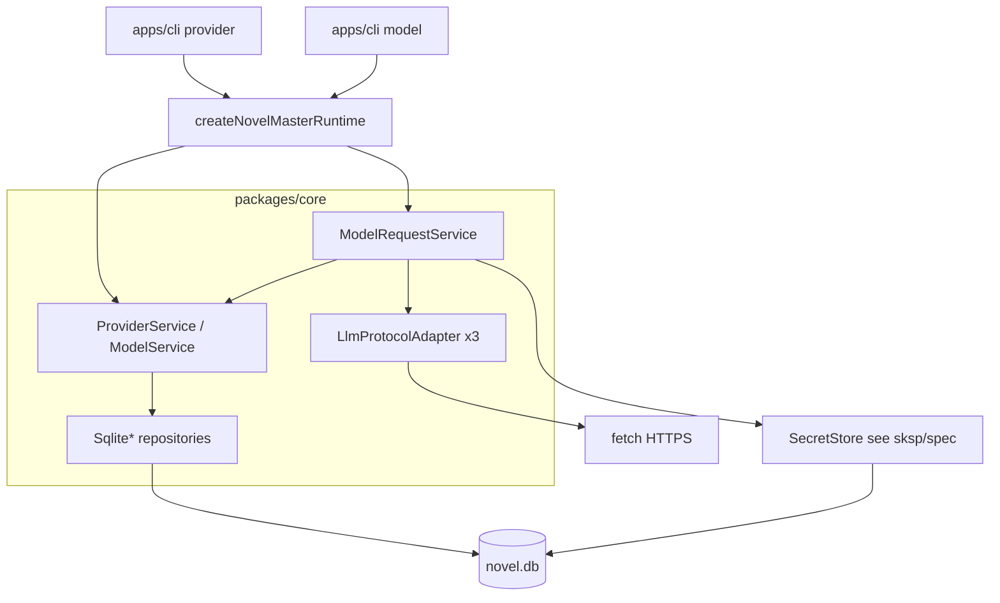

# provider-model 技术规格（SPEC）

## 设计目标

- 在 `@novel-master/core` 新增 **LLM 服务商 / 模型建议 / 已保存模型** 配置域，与 **chat** 共用 `novel.db`；DDL 经 `bootstrapNovelMaster` / `NOVEL_MASTER_SCHEMA_STATEMENTS` 迁移，**不走** KKV/VFS。
- 区分 **protocol**（`openai` | `anthropic` | `gemini`）与 **provider**（`providerId` + `baseUrl` + `secretRef` + 可选 headers）；内置 seed 四条；自定义可删、可改 `protocol`。
- **模型建议**（`fetch`）与 **已保存模型**（`save` / `create`）分表；应用模型 id = `{providerId}/{vendorModelId}`（**仅第一个** `/` 分隔）。
- **三协议 HTTP 客户端**（Node `fetch`）：非流式 chat/complete 最小路径，供 `nm model request`；v1 不写 `chat_message`、不建 session 历史。
- **凭据**经 [SKSP SPEC](./../sksp/spec.md)（实现）/ [SKSP PRD](./../sksp/prd.md)（需求）：`secretRef` = `provider/<providerId>/apiKey`；CLI 使用 `sksp-windows` + 可选 `sksp-env`。
- CLI 扩展：`nm provider` / `nm provider model` / `nm model`；`config.json` 增加 `currentProviderId`、`currentModelId`；作用域优先级与 `nm project` / `nm session` 一致（见 `apps/cli/src/config/resolve-scope.ts`）。
- **测试双轨**：`packages/core` 单元/集成测 + 知识库 **CLI 验收文档**（`.cursor/skills/cli-test`，真实执行、原样捕获）。
- **不修改** `infra/sql-template` 语义；repository SQL **必须** `SqlTemplateParser` + `queryTemplate` / `executeTemplate`（与 `SqliteProjectRepository` 一致）。
- **不交付** RN `nm provider` UI；**SKSP Android 本期必实现**（[sksp/spec.md](../sksp/spec.md) 步骤 5：`SkspDevScreen` 验收），不在 mobile 加 provider 子命令。
- **不承诺** 稳定对外 npm LLM API；`index.ts` 仅导出 CLI/测试所需工厂与错误类型（见下文导出清单）。

## 现状与约束（代码探索）

| 项 | 路径 / 现状 | 本迭代 |
|----|-------------|--------|
| CLI 入口路由 | `apps/cli/src/main.ts`：`kkv` / `project` / `session` / `message` / `prompt` 走 `createNovelMasterRuntime` + switch | 增加 `provider`、`model`；`provider model` 二级在 `provider/commands.ts` 分发 |
| 参数解析 | `apps/cli/src/vfs/parse-args.ts`：`--key value` / boolean flag | 全 provider/model 子命令复用 |
| DB 路径 | `apps/cli/src/runtime.ts`：`NOVEL_MASTER_DB` > `--db` > `./.novel-master/novel.db` | 不变 |
| `CliConfig` | `apps/cli/src/config/cli-config.ts`：仅 `currentProjectId` / `currentSessionId` | 扩展 `currentProviderId` / `currentModelId`；`mergeCliConfig` / `saveCliConfig` 同步 |
| 作用域解析 | `apps/cli/src/config/resolve-scope.ts`：`CliScopeResolver`，flag > config > Error | 新增 `resolve-provider-scope.ts`（或扩展 Resolver）：`resolveProviderId` / `resolveModelId` |
| `use` / `current` 模式 | `apps/cli/src/project/commands.ts`、`session/commands.ts` + `resolve-entity.ts` | `provider use/current`、`model use/current` 对齐 project `current`（无当前则 `current` 抛错） |
| 错误格式化 | `apps/cli/src/cli-errors.ts`：`ChatError` / `PromptError` 等 → `EXIT_RUNTIME` | 增加 `ProviderError`（及可选 `SkspError`） |
| Bootstrap | `packages/core/src/bootstrap/novel-master-bootstrap.ts` 聚合 `*_SCHEMA_STATEMENTS` | 追加 `PROVIDER_SCHEMA_STATEMENTS`、`SKSP_SCHEMA_STATEMENTS`；seed 在 bootstrap 事务末执行 |
| Chat DDL 模式 | `packages/core/src/bootstrap/chat/chat-schema.ts`：`CREATE TABLE IF NOT EXISTS` | 同款 `provider/provider-schema.ts`、`sksp/sksp-schema.ts` |
| Domain 分层 | `domain/chat` + `service/chat` + `Sqlite*Repository` | 新增 `domain/provider`、`service/provider`、`infra/llm-protocol` |
| SKSP 代码 | `packages/core/src/infra/sksp`（`@novel-master/core/sksp`） | 平台驱动 `sksp-windows` / `sksp-android`；provider 仅消费 `SecretStore` |
| `message.provider` | `chat_message.provider` 列已存在（`chat-schema.ts`） | v1 **不写**；二期与 chat 集成时再定 |
| Mobile | `apps/mobile`：VFS dev screen，`tdbc-driver-rn` | 本期 **不** 加 provider CLI；**SKSP Android 本期必交付**（sksp SPEC 步骤 5 + `SkspDevScreen`） |
| 参考 SPEC 结构 | `.apm/kb/docs/Iterations/prompt-engine/spec.md` | 本文档对齐章节：设计目标、探索表、架构、结构、变更清单、步骤、测试、风险 |

**PRD 对齐（实现锁定）**

| PRD 待确认项 | SPEC 决策 |
|--------------|-----------|
| 表名 | `llm_provider`、`llm_model_suggestion`、`llm_saved_model`；凭据 `sksp_secrets` |
| 内置 seed | bootstrap 后 **代码** `seedBuiltinProviders(conn)`（可重复：按 id upsert 仅补缺失内置行，不覆盖用户已 edit 的 `base_url`） |
| `fetch` 后建议未出现在远端 | 保留行，`stale = 1`；本次 fetch 出现的项 `stale = 0` 并更新 `last_seen_at_ms` |
| 无 list API 的网关 | `fetch` 失败：`stderr` 可读 + 非 0；不删已有建议 |
| Gemini 列模型 | 使用 Google `models` 列表端点（见协议节）；失败时同上 |
| `model current` 无当前 | 与 `nm project current` 一致：**抛错** + 提示 `nm model use` |
| `provider current` 无当前 | 同上，提示 `nm provider use` |
| `model request --raw` | stdout 输出完整 JSON（pretty 一行或 `JSON.stringify` 紧凑，SPEC 锁定紧凑单行） |
| `headers` | DB 存 `headers_json` TEXT；CLI `--headers` 为 JSON 字符串；非法 JSON → `ProviderError` `INVALID_ARGUMENT` |
| 环境变量密钥 | `sksp-env`：`get(ref)` 优先 env，再 DB；命名 `NOVEL_MASTER_PROVIDER_<PROVIDER_ID_UPPER>_API_KEY`（`providerId` 转大写，非字母数字转 `_`） |
| Core 导出 | 导出 `ProviderError`、`createProviderBundle`（或分拆 factories）、`parseApplicationModelId`、`LlmProtocol` 类型；**不导出** repository impl |

---

## 总体方案

### 架构



- **配置域服务**：`ProviderService`（CRUD、seed、edit 白名单）、`ProviderModelService`（建议 fetch/list/save/create/edit/delete）、`ModelRequestService`（解析已保存模型 → 协议调用）。
- **CLI 薄编排**：解析 flags → scope → 调 core → `stdout`/`stderr`；apiKey 经 `SecretStore`，list 显示 `apiKey: set|not set`（**不**打印完整 key）。
- **HTTP**：Node 内置 `fetch`（引擎 ≥20）；不设额外 axios 依赖。

### 应用模型 id

```typescript
/** 仅第一个 `/` 分割 */
export function parseApplicationModelId(modelId: string): {
  providerId: string;
  vendorModelId: string;
};

export function formatApplicationModelId(
  providerId: string,
  vendorModelId: string,
): string;
```

- `model request` / `model use` 的 `--modelId` 必须为**已保存**模型 id（查 `llm_saved_model`）。
- 建议表仅存 `(provider_id, vendor_model_id)`，**不**接受建议 id 直接 request。

### Protocol 适配器（端口）

```typescript
export type LlmProtocolKind = "openai" | "anthropic" | "gemini";

export interface LlmListModelsResult {
  readonly models: ReadonlyArray<{
    readonly vendorModelId: string;
    readonly displayName?: string;
  }>;
}

export interface LlmChatRequest {
  readonly baseUrl: string;       // 无尾斜杠，适配器内拼接 path
  readonly apiKey: string;
  readonly vendorModelId: string;
  readonly userContent: string;
  readonly extraHeaders?: Readonly<Record<string, string>>;
}

export interface LlmChatResult {
  readonly assistantText: string;
  readonly raw: unknown;          // 供 --raw
}

export interface LlmProtocolAdapter {
  readonly kind: LlmProtocolKind;
  listModels(req: Omit<LlmChatRequest, "vendorModelId" | "userContent">): Promise<LlmListModelsResult>;
  chat(req: LlmChatRequest): Promise<LlmChatResult>;
}
```

**三实现**（`packages/core/src/infra/llm-protocol/`）：

| protocol | listModels | chat（非流式） |
|----------|------------|----------------|
| `openai` | `GET {baseUrl}/models`，解析 `data[].id` | `POST {baseUrl}/chat/completions`，`stream: false`，取 `choices[0].message.content` |
| `anthropic` | `GET {baseUrl}/v1/models`（2025 API；若 404 则 **仅 openai 兼容网关** 在 SPEC 实现中允许降级提示，内置 anthropic 走官方路径） | `POST {baseUrl}/v1/messages`，`max_tokens` 默认 1024，`messages: [{role:user, content}]`，取 `content[0].text` |
| `gemini` | `GET {baseUrl}/models`（v1beta 列表） | `POST {baseUrl}/models/{model}:generateContent`，`contents: [{role:user, parts:[{text}]}]`，取 `candidates[0].content.parts[0].text` |

- **baseUrl 规范化**：入库前 `trimEnd('/')`；拼接 path 时保证单斜杠。
- **鉴权头**：openai/openrouter：`Authorization: Bearer <key>`；anthropic：`x-api-key` + `anthropic-version: 2023-06-01`；gemini：`?key=` 或 `x-goog-api-key`（实现锁定 query `key=` 于 generateContent/list，与 Google 文档一致）。
- **错误**：HTTP 非 2xx → `ProviderError` `HTTP_ERROR`，message 含 status + 截断 body（≤500 字符）。

`getProtocolAdapter(kind)` 注册表（纯函数 Map，无动态 import）。

---

## SQLite DDL

### `llm_provider`

```sql
CREATE TABLE IF NOT EXISTS llm_provider (
  id TEXT PRIMARY KEY,
  protocol TEXT NOT NULL CHECK (protocol IN ('openai', 'anthropic', 'gemini')),
  base_url TEXT NOT NULL,
  display_name TEXT,
  secret_ref TEXT,
  default_model_id TEXT,
  headers_json TEXT NOT NULL DEFAULT '{}',
  is_builtin INTEGER NOT NULL DEFAULT 0,
  created_at_ms INTEGER NOT NULL,
  updated_at_ms INTEGER NOT NULL
);
```

| 列 | 说明 |
|----|------|
| `id` | `providerId` |
| `secret_ref` | 如 `provider/openai/apiKey`；无 key 时为 `NULL`，list 显示 `not set` |
| `is_builtin` | `1` = openai/anthropic/google/openrouter，不可 delete，不可改 id/protocol |
| `default_model_id` | 完整应用模型 id；须引用**已保存**模型（edit 时校验） |

### `llm_model_suggestion`

```sql
CREATE TABLE IF NOT EXISTS llm_model_suggestion (
  provider_id TEXT NOT NULL,
  vendor_model_id TEXT NOT NULL,
  display_name TEXT,
  stale INTEGER NOT NULL DEFAULT 0,
  last_seen_at_ms INTEGER NOT NULL,
  PRIMARY KEY (provider_id, vendor_model_id),
  FOREIGN KEY (provider_id) REFERENCES llm_provider(id) ON DELETE CASCADE
);
```

### `llm_saved_model`

```sql
CREATE TABLE IF NOT EXISTS llm_saved_model (
  provider_id TEXT NOT NULL,
  vendor_model_id TEXT NOT NULL,
  display_name TEXT,
  created_at_ms INTEGER NOT NULL,
  updated_at_ms INTEGER NOT NULL,
  PRIMARY KEY (provider_id, vendor_model_id),
  FOREIGN KEY (provider_id) REFERENCES llm_provider(id) ON DELETE CASCADE
);
```

### `sksp_secrets`（SKSP）

表结构、驱动、DPAPI/Keystore、registry、composite 优先级见 **[sksp/spec.md](../sksp/spec.md)**。provider-model **依赖** 该表与 `SecretStore`；`NOVEL_MASTER_SCHEMA_STATEMENTS` 顺序：**sksp → provider**（无 FK 交叉）。

### Bootstrap seed（内置 provider）

在 `bootstrapNovelMaster` 事务内，DDL 执行后调用 `seedBuiltinProviders(tx)`：

| id | protocol | base_url（默认） |
|----|----------|------------------|
| `openai` | `openai` | `https://api.openai.com/v1` |
| `anthropic` | `anthropic` | `https://api.anthropic.com` |
| `google` | `gemini` | `https://generativelanguage.googleapis.com/v1beta` |
| `openrouter` | `openai` | `https://openrouter.ai/api/v1` |

逻辑（伪代码）：

```typescript
const BUILTIN = [ /* 上表 */ ] as const;
for (const row of BUILTIN) {
  await upsertIfMissing(tx, row); // INSERT WHERE NOT EXISTS id; 不覆盖已有 base_url/headers
}
// secret_ref 初始 NULL
```

### `NOVEL_MASTER_SCHEMA_STATEMENTS` 变更

`packages/core/src/bootstrap/novel-master-bootstrap.ts`：

```typescript
import { SKSP_SCHEMA_STATEMENTS } from "./sksp/sksp-schema.js";
import { PROVIDER_SCHEMA_STATEMENTS } from "./provider/provider-schema.js";

export const NOVEL_MASTER_SCHEMA_STATEMENTS: readonly string[] = [
  ...VFS_SCHEMA_STATEMENTS,
  ...KKV_SCHEMA_STATEMENTS,
  ...CHAT_SCHEMA_STATEMENTS,
  ...SESSION_FS_SCHEMA_STATEMENTS,
  ...WORKTREE_SCHEMA_STATEMENTS,
  ...SKSP_SCHEMA_STATEMENTS,
  ...PROVIDER_SCHEMA_STATEMENTS,
];
```

`bootstrapNovelMaster` 末尾在同一事务调用 `seedBuiltinProviders`。

---

## SKSP 集成（摘要）

实现细节见 **[sksp/spec.md](../sksp/spec.md)**。provider-model 仅约定：

| 操作 | 行为 |
|------|------|
| `provider create/edit --apiKey` | `secretRef = provider/${id}/apiKey`；`SecretStore.set`；更新 `llm_provider.secret_ref` |
| `provider list` | `has(ref)` → `apiKey: set` / `not set` |
| `provider delete`（自定义） | 级联后 `delete(secretRef)` |
| `model request` / `fetch` | `get(secretRef)`；`null` → `ProviderError` `API_KEY_NOT_SET`（文案含 `nm provider edit …`） |
| CLI runtime | `runtime.secretStore` 由 sksp 驱动注册（见 sksp SPEC） |

---

## CLI 设计

### `main.ts` 路由

与 `prompt` / `project` 同级：

```typescript
if (top === "provider" || top === "model" || top === "kkv" || ...) {
  const rt = await createNovelMasterRuntime(argv);
  switch (top) {
    case "provider":
      await runProvider(rt, sub, rest);
      break;
    case "model":
      await runModel(rt, sub, rest);
      break;
  }
}
```

### 模块布局（镜像 project/session）

```text
apps/cli/src/
  config/
    cli-config.ts              # + currentProviderId, currentModelId
    resolve-provider-scope.ts  # resolveProviderId, resolveModelId
  provider/
    commands.ts                # list|create|delete|edit|use|current + 分发 model
    model/commands.ts          # suggest list|fetch|save|create|list|edit|delete
  model/
    commands.ts                # use|current|request
  runtime.ts                   # + providerBundle, secretStore
  main.ts
  cli-errors.ts                # + ProviderError, SkspError
```

### 作用域与 flag

| 命令 | `--providerId` | `--modelId` |
|------|----------------|-------------|
| `provider model *` | 省略 → `currentProviderId`；无 → 报错 | — |
| `provider edit/delete` | **必填** | — |
| `model request` | 不要求（从 model 所属 provider 解析） | 省略 → `currentModelId` |
| `model use` | — | **必填** |

错误文案（与现网风格一致）：

- 缺 provider：`Missing --providerId <id> (or run: nm provider use --providerId <id>)`
- 缺 model：`Missing --modelId <id> (or run: nm model use --modelId <provider>/<vendor>)`
- 建议模型 request：`Model not saved: <id> (run: nm provider model save --vendorModelId …)`

### 子命令与 flags（PRD v1）

**provider**

| 子命令 | 关键 flags |
|--------|------------|
| `list` | 列：`id\tprotocol\tbaseUrl\tdisplayName\tapiKey: set\|not set` |
| `create` | `--providerId`、`--protocol`、`--baseUrl` 必填；`--displayName`、`--headers`、`--defaultModelId`、`--apiKey` 可选 |
| `delete` | `--providerId`；内置 → `BUILTIN_PROVIDER` 错误 |
| `edit` | `--providerId` 必填 + 白名单 attr（见 PRD）；内置禁止 `--protocol` |
| `use` / `current` | `--providerId`（use 必填） |

**provider model**

| 子命令 | 关键 flags |
|--------|------------|
| `suggest list` | 列：`vendorModelId\tdisplayName\tstale` |
| `fetch` | 调 `listModels` → upsert 建议 |
| `save` | `--vendorModelId`；可选 `--displayName` |
| `create` | `--vendorModelId` |
| `list` | 已保存；列：`modelId\tdisplayName`（modelId = 应用 id） |
| `edit` | `--modelId`；`--displayName` |
| `delete` | `--modelId` |

**model**

| 子命令 | 关键 flags |
|--------|------------|
| `use` | `--modelId` |
| `current` | 输出 `modelId` 或抛错 |
| `request` | `--content` 必填；`--modelId` 可选；`--raw` 可选 |

`provider edit` 实现：与 project 不同，支持动态 attr——解析 `flags` 中 `baseUrl`、`displayName`、`headers`、`defaultModelId`、`apiKey`、`protocol`（仅自定义）；**至少一个** attr，否则 Usage 错误。

### `config.json` 示例

```json
{
  "currentProjectId": "…",
  "currentSessionId": "…",
  "currentProviderId": "openai",
  "currentModelId": "openai/gpt-4o"
}
```

- `provider delete` 若删当前 provider：清空 `currentProviderId`；若 `currentModelId` 前缀匹配该 provider，一并清空。
- `provider use` **不**改 `currentModelId`。

---

## 最终项目结构

```text
# SKSP 包结构见 ../sksp/spec.md

packages/core/src/
  bootstrap/provider/provider-schema.ts
  bootstrap/provider/seed-builtin-providers.ts
  errors/provider-errors.ts
  domain/provider/model/
    provider.ts
    saved-model.ts
    model-suggestion.ts
  domain/provider/application-model-id.ts
  domain/provider/repositories/
    provider.port.ts
    model-suggestion.port.ts
    saved-model.port.ts
    impl/sqlite-*.repository.ts
  infra/llm-protocol/
    adapter.port.ts
    openai.adapter.ts
    anthropic.adapter.ts
    gemini.adapter.ts
    registry.ts
  service/provider/
    provider.port.ts
    provider-model.port.ts
    model-request.port.ts
    impl/*.service.ts
    create-provider-services.ts
  index.ts                      # 选择性导出

packages/core/test/provider/
  application-model-id.test.ts
  provider-service.test.ts
  bootstrap-seed.test.ts
  protocol-openai.test.ts       # 可选 mock fetch

apps/cli/src/
  provider/commands.ts
  provider/model/commands.ts
  model/commands.ts
  config/resolve-provider-scope.ts

.apm/kb/docs/Iterations/provider-model/
  test/provider-cli.md          # 实现后 cli-test 捕获
```

---

## 变更点清单 (file-level)

| 文件 | 变更 |
|------|------|
| SKSP 包与 DDL | 见 [sksp/spec.md](../sksp/spec.md) 变更清单 |
| `packages/core/src/bootstrap/provider/provider-schema.ts` | **新增** |
| `packages/core/src/bootstrap/provider/seed-builtin-providers.ts` | **新增** |
| `packages/core/src/bootstrap/novel-master-bootstrap.ts` | 追加 schema + seed |
| `packages/core/src/domain/provider/**` | **新增** |
| `packages/core/src/infra/llm-protocol/**` | **新增** |
| `packages/core/src/service/provider/**` | **新增** |
| `packages/core/src/errors/provider-errors.ts` | **新增** |
| `packages/core/src/index.ts` | 导出 provider/SKSP 工厂与类型 |
| `packages/core/package.json` | 导出 `./sksp` 子路径；**不**依赖 sksp-windows |
| `apps/cli/src/main.ts` | `provider`、`model` 路由 |
| `apps/cli/src/runtime.ts` | `secretStore`、`providers` bundle |
| `apps/cli/src/config/cli-config.ts` | 扩展字段 |
| `apps/cli/src/config/resolve-provider-scope.ts` | **新增** |
| `apps/cli/src/provider/**`、`apps/cli/src/model/**` | **新增** |
| `apps/cli/src/cli-errors.ts` | `ProviderError` / `SkspError` |
| `apps/cli/package.json` | workspace 依赖 sksp、sksp-windows、sksp-env（见 sksp SPEC） |
| 根 `package.json` workspaces | 已含 `packages/*`，新包自动纳入 |
| `.apm/kb/docs/Iterations/provider-model/test/provider-cli.md` | **新增**（实现后） |

**不改动**：`infra/sql-template/*` 核心、`chat_message` 写入逻辑。`apps/mobile` **仅** 允许 SKSP 相关改动（见 sksp SPEC），不加 provider CLI。

---

## 详细实现步骤 (numbered, verifiable)

### 步骤 1：SKSP（前置）

按 [sksp/spec.md](../sksp/spec.md) 完成 **步骤 1–5**（含 **`sksp-android` + mobile 接线**；windows 步骤 3–4 与 android 步骤 5 可并行 PR）。

**验证**：sksp 单测 + Windows round-trip + Android `SkspDevScreen` set/get（见 sksp SPEC）。

### 步骤 2：Provider DDL + seed

1. `provider-schema.ts` 三表 DDL。
2. `seedBuiltinProviders`：四内置行 idempotent。
3. 更新 `bootstrapNovelMaster` 调用 seed。

**验证**：`packages/core/test/provider/bootstrap-seed.test.ts` 新库 `list` 含 4 内置；二次 bootstrap 不重复插入。

### 步骤 3：Domain + Repository

1. 模型类型与 `parseApplicationModelId` / `formatApplicationModelId`。
2. 三个 `Sqlite*Repository`，SQL 全用 template helper。
3. `ProviderError`：`NOT_FOUND` | `CONFLICT` | `INVALID_ARGUMENT` | `BUILTIN_PROVIDER` | `HTTP_ERROR` | `API_KEY_NOT_SET` | `MODEL_NOT_SAVED`。

**验证**：`application-model-id.test.ts` 覆盖 `a/b/c` → vendor `b/c`；repository 集成测用 `openVfsTestConnection` + bootstrap。

### 步骤 4：协议适配器

1. 实现 openai / anthropic / gemini 三个 adapter + registry。
2. 单元测用 `globalThis.fetch` mock（或注入 `fetchFn` 可选参数，默认 `globalThis.fetch`）。

**验证**：mock 200 响应解析 assistant 文本；401 抛 `HTTP_ERROR`。

### 步骤 5：Service 层

1. `DefaultProviderService`：create/delete/edit 白名单、内置保护、delete 级联 + `secretStore.delete`。
2. `DefaultProviderModelService`：fetch 标记 stale、save/create、list 分离。
3. `DefaultModelRequestService`：仅已保存模型；组装 headers；调 adapter.chat。

**验证**：`provider-service.test.ts` 覆盖 create 内置 id 失败、edit 内置 protocol 失败、未保存模型 request 失败。

### 步骤 6：CLI config + scope

1. 扩展 `CliConfig`、`CliScopeResolver` 或 `ProviderScopeResolver`。
2. `setCliContext` 支持新字段；delete 时清理 config。

**验证**：`apps/cli/test` 可选 e2e；主验收在步骤 8 文档。

### 步骤 7：CLI 命令

1. `provider/commands.ts`、`provider/model/commands.ts`、`model/commands.ts`。
2. `main.ts` 注册；`runtime.ts` 注入服务 + `registerSkspWindowsDriver()`。
3. `cli-errors.ts` 注册 `ProviderError`。

**验证**：`npm run build` 通过；手动 `nm provider list` 见四内置。

### 步骤 8：CLI 验收文档（cli-test）

路径：`.apm/kb/docs/Iterations/provider-model/test/provider-cli.md`

建议场景（实现后**真实执行**并捕获）：

| # | 场景 | 目的 |
|---|------|------|
| P0 | 新库 `provider list` | 四内置 seed |
| P1 | `provider edit --apiKey` + list 不泄露 | SKSP |
| P2 | `provider model fetch` + `suggest list` + `model list` 空 | 建议 vs 已保存 |
| P3 | 未 save 时 `model request` 失败 | PRD |
| P4 | `save` + `model use` + `model request --content hi` | 主路径（需有效 key 或 mock 注明 skip） |
| P5 | `model request` 后 `message list` 仍空 | 不写 chat |
| P6 | 自定义 provider create/delete 级联 | 清理 |

文档头对齐 prompt-engine：`日期`、`审查人: pending`、`NOVEL_MASTER_DB` 绝对路径。

### 步骤 9：Core 导出与 monorepo 接线

1. `index.ts` 导出 `ProviderError`、`createProviderServices`、`parseApplicationModelId` 等。
2. 根目录 `npm run build` / `npm test`。

**验证**：全 workspace build + core test 绿。

---

## 测试策略 + 测试用例

| 层级 | 产物 | 命令 |
|------|------|------|
| 单元 | `packages/core/test/provider/*.test.ts` | `npm test -w @novel-master/core` |
| SKSP | 见 [sksp/spec.md](../sksp/spec.md) 测试策略 |
| Bootstrap | `bootstrap-seed.test.ts` | 表存在 + 四行 |
| CLI 验收 | `test/provider-cli.md` | cli-test skill，真实 `nm` |
| 回归 | 现有 vfs/chat/prompt 测试 | 不破坏 |

**核心用例映射 PRD 验收**：

- 新库 bootstrap → `provider list` 含 openai/anthropic/google/openrouter
- create 内置 id → 失败
- 内置 edit `--protocol` → 失败；`--baseUrl` → request 用新 URL（可 mock）
- fetch 后 suggest 非空、saved 仍空；未 save request 失败
- save 后 list 含 `providerId/v`；request 成功（或文档标注需真实 key）
- anthropic/google provider request 走对应 adapter（单元测 mock URL path）
- 无 currentModelId request → 失败文案含 `nm model use`
- edit apiKey 后 DB provider 表无明文；list 无完整 key
- request 成功 → `message list` 无新增

---

## 风险与回滚方案

| 风险 | 缓解 |
|------|------|
| 三协议端点差异 / 文档漂移 | 适配器集中；列模型失败 stderr 明确；openai 网关可共用 `/models` |
| Anthropic list API 不可用 | `fetch` 失败提示用手工 `model create`；不静默空列表 |
| SKSP / DPAPI | 见 [sksp/spec.md](../sksp/spec.md) 风险节 |
| provider + sksp 排期 | 先 sksp 步骤 1–4，再 provider 步骤 2+ |
| `fetch` 集成测试依赖外网 | 单测 mock；CLI 文档区分「需真实 API key」场景 |

**回滚**：新表 `IF NOT EXISTS` 可保留；回退代码后旧 CLI 忽略新表。若需撤销 DDL，单独迁移脚本 `DROP TABLE`（非本期）。`config.json` 新字段向后兼容（旧版忽略未知键）。

---

## 关联文档

- [prd.md](./prd.md) — 需求来源
- [../sksp/spec.md](../sksp/spec.md) — 凭据实现规格
- [../sksp/prd.md](../sksp/prd.md) — 凭据需求
- [../prompt-engine/spec.md](../prompt-engine/spec.md) — SPEC 体例参考
- [../chat-project-vfs/spec.md](../chat-project-vfs/spec.md) — CLI / bootstrap / repository 模式参考

---

**实现完成后**：`npm run build` → 按 cli-test 撰写 `test/provider-cli.md` → `apm kb index rebuild`。
