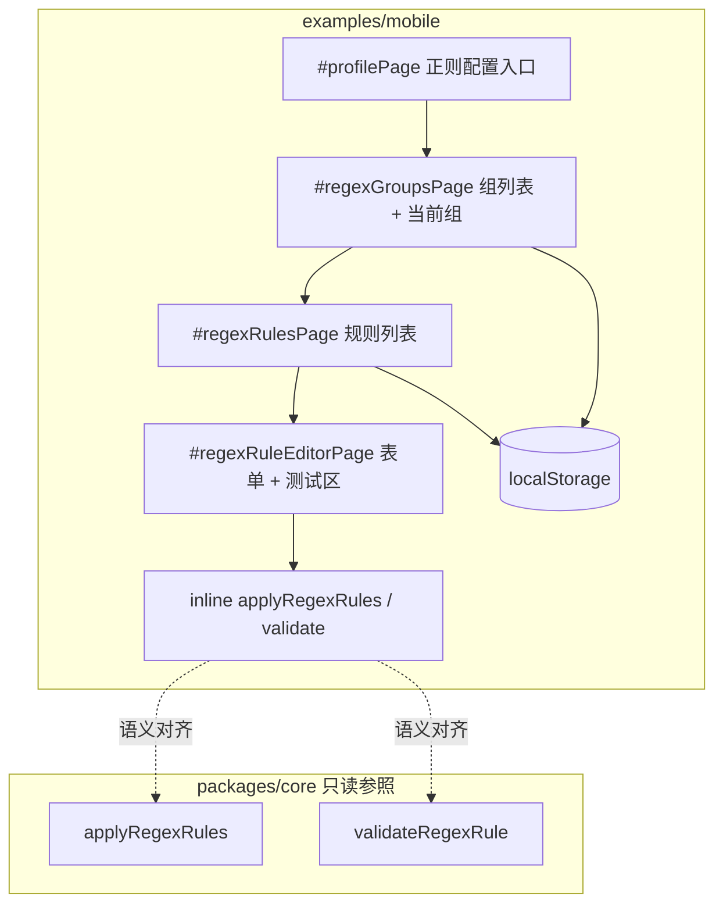

# 正则配置 — 移动原型 技术规格（SPEC）

## 设计目标

- 在 **`examples/mobile` 静态原型** 内实现 [PRD](./prd.md) 四级页面栈：**我的 → 正则组列表 → 规则列表 → 规则详情 + 测试预览**。
- Mock 数据形状与 [regex-system SPEC](../regex-system/spec.md) / Core `RegexGroup`、`RegexRule` **字段对齐**；校验与 `applyRegexRules` 语义与 Core **一致**。
- **不接** `novel.db`、`RegexConfigService`、RN；**不改** `packages/core`、`apps/cli`。
- 交互复用现有 **服务商管理** 范式（`manage-header`、批量删除、`handleManagedListItemClick`、全屏栈 `navigateToPage`）。

**上游依赖**：Core/CLI 正则已在 main 交付；本 SPEC 仅动 `examples/mobile` 与 kb 文档。

---

## 现状与约束（代码探索）

| 模块 | 现状 | 本迭代 |
|------|------|--------|
| `examples/mobile/app.js` | 单 IIFE ~2700 行；`pageConfig` + `navigateToPage` 全屏栈 | + `regexGroups` / `regexRules` / `regexRuleEditor` 三页路由与逻辑块 |
| 服务商列表 `#providersPage` | `renderProviderList`、`BATCH_LIST_CONFIG.providers`、`data-batch-list` | **对齐**：正则组列表同结构 |
| 模型列表 `#providerDetailPage` | `renderProviderDetail`、`providerModels` batch | **对齐**：组内规则列表 |
| 采样页 `#modelSamplingPage` | 独立表单 + 工具栏保存 + `pop` 返回 | **对齐**：规则详情 + 测试区 + 脏标记离开确认 |
| `workspaceCurrentModelId` | `localStorage` key `nm-mobile-workspace-current-model` | 新增 `workspaceCurrentRegexGroupId` + key `nm-mobile-workspace-current-regex-group` |
| `MOCK_PROVIDERS` | 内存常量，**未**整体持久化 | 正则组/规则 **必须** `localStorage` 持久化（PRD 硬性要求） |
| `new-provider` | 仅 `showToast('未实现')` | 正则 **须实现** 添加组/规则（PRD CRUD） |
| `globalCompactionPolicy` | 内存 + 表单页 `#compactionPolicyPage` | 参考表单渲染/保存模式；正则详情更复杂 |
| `@novel-master/core` | `applyRegexRules`、`validateRegexRule`、`compileRegexRule` | 原型 **file:// 无 bundler**，**不能** import；在 `app.js` **内联等价实现**（见 § 预览引擎） |
| `#chatPage` | 消息气泡 mock | **不接入** display 替换（PRD 范围外） |

**技术边界**

- 保持「双击 `index.html`」即可打开，不引入 Vite/Webpack。
- 内联 regex 逻辑须与 Core 单测语义一致；实现后对照 [apply-regex-rules.test.ts](../../../packages/core/test/regex/apply-regex-rules.test.ts) 核心用例手工 spot-check（见测试策略）。
- `flags` 字段：Core 实体含 `flags`（默认 `""`）；表单提供可选输入（高级），与 CLI `--flags` 一致。

---

## 总体方案

### 架构



### Mock 数据模型

与 Core 实体 JSON 形状对齐（时间戳可选，便于排序展示）：

```js
/** @typedef {{ groupId: string, displayName: string|null, createdAtMs: number, updatedAtMs: number }} RegexGroup */

/** @typedef {{
 *   groupId: string, ruleId: string, sortOrder: number,
 *   name: string, pattern: string, flags: string,
 *   enabled: boolean,
 *   llmReplace: string|null, displayReplace: string|null,
 *   minDepth: number, maxDepth: number,
 *   scopeUser: boolean, scopeAssistant: boolean,
 *   createdAtMs: number, updatedAtMs: number
 * }} RegexRule */
```

**存储 keys**

| Key | 内容 |
|-----|------|
| `nm-mobile-regex-groups` | `JSON.stringify(RegexGroup[])` |
| `nm-mobile-regex-rules` | `JSON.stringify(RegexRule[])`（全表；按 `groupId` 过滤） |
| `nm-mobile-workspace-current-regex-group` | `groupId` 字符串；不存在 = 无当前组 |

**默认 seed**（首次无 localStorage 时写入并 persist）：

| groupId | displayName | 说明 |
|---------|-------------|------|
| `strict-filter` | 严格脱敏 | 默认 **当前组** |
| `llm-only` | 仅提示词 | 备用组 |

`strict-filter` 下 1 条规则 `mask-email`（对齐 [cli-regex.md](../regex-system/test/cli-regex.md)）：邮箱 pattern、`llmReplace: '[redacted]'`、`displayReplace: '***'`、`minDepth: 1`、`maxDepth: 99`、`scopeUser+scopeAssistant: true`。

### 页面与路由

| pageId | DOM id | 标题 | 对标 |
|--------|--------|------|------|
| `regexGroups` | `#regexGroupsPage` | 正则配置 | `#providersPage` |
| `regexRules` | `#regexRulesPage` | 组 displayName | `#providerDetailPage` |
| `regexRuleEditor` | `#regexRuleEditorPage` | 规则名称 / 新建 | `#modelSamplingPage` + `#agentEditorPage` |

**appState 扩展**

```js
regexGroups: [],           // 内存镜像，init 时 load
regexRules: [],
workspaceCurrentRegexGroupId: null,
editingRegexGroupId: null,
editingRegexRuleId: null,  // null = 新建规则
regexRuleEditorDirty: false,
```

**导航**

- `#profilePage`：`data-action="regex-config"` → `navigateToPage('regexGroups', true)`
- 组列表点击行（非批量）→ `openRegexRulesPage(groupId)`
- 规则列表点击行 → `openRegexRuleEditor(ruleId)`；「添加规则」→ `openRegexRuleEditor(null)`
- 组列表 ⋮ 菜单：**设为当前**（`setWorkspaceCurrentRegexGroup`）、编辑 displayName（可选，modal）
- 返回栈：与 `providerDetail` / `modelSampling` 相同，由 `pageStack` 驱动

**当前生效组 UI**

- 组列表项：`groupId === workspaceCurrentRegexGroupId` 时显示 `<span class="current-badge">当前</span>`（复用 `.project-item.active` / `.current-badge` 样式）。
- 页头 info banner（可选）：`当前生效：strict-filter（严格脱敏）`。
- 非当前组菜单项「设为当前」→ 写 pointer + persist + 重绘列表 + toast。

**删除当前组**

- `batchDeleteRegexGroups` / 单删：若 id ∈ 删除集且等于 `workspaceCurrentRegexGroupId` → `resetWorkspaceCurrentRegexGroup()`（删 key + `appState = null`），对齐 CLI `delete` 自动 reset。

### 预览引擎（内联，不对 Core 打补丁）

在 `app.js` 新增注释块 `// --- Regex mock engine (align packages/core domain/regex) ---`：

| 函数 | 行为（对齐 Core） |
|------|-------------------|
| `validateRegexRuleFields(fields)` | 复制 `validate-regex-rule.ts` 规则；失败 `return { ok: false, message }`（浏览器友好，不抛 RegexError） |
| `compileRegexRuleDraft(fields)` | `new RegExp(pattern, flags)`；失败返回 null + message |
| `applyRegexRules(text, rules, ctx)` | 复制 `apply-regex-rules.ts` 循环；`ctx = { channel, floor, role }` |
| `previewRegexRule(text, draftFields, ctx)` | 若 `!draftFields.enabled` 返回原文；否则 compile 单条 rules 数组 `[compiled]` 后 apply |

**单规则 test** 对齐 `nm regex test`：只测 **当前编辑条**，非整组串联（与 CLI `regex test` 一致）。

Channel 未配置替换字段时：`replaceForChannel` 保持原文（Core 同）。

### 规则详情表单

字段（`data-regex-field`）：

| 字段 | 控件 |
|------|------|
| name | text |
| pattern | text |
| flags | text，placeholder `gim`，可空 |
| enabled | checkbox toggle |
| llmReplace | text，可空 |
| displayReplace | text，可空 |
| minDepth / maxDepth | number，min=1 |
| scopeUser / scopeAssistant | checkbox |

**测试区**（表单下方 `<section class="regex-test-panel">`）：

| 控件 | 默认 |
|------|------|
| 样例文本 textarea | `mysecret@email.com` |
| floor | `1` |
| role | select `user` / `assistant` |
| channel | select `display` / `llm` |
| 预览输出 readonly pre | 实时 `input`/`change` 触发 `updateRegexTestPreview()` |

保存：工具栏「保存」→ `collectRegexRuleFromForm()` → validate → upsert `regexRules` → `persistRegexStore()` → 清除 dirty → toast → pop 或留页。

新建 `ruleId`：modal 输入或 `slugify(name)` + 冲突检测；`sortOrder = max(group)+1`。

---

## 最终项目结构

```text
examples/mobile/
├── index.html              # + 菜单项、三 page div
├── styles.css              # + .regex-* 复用 .provider-* / .agent-form-*
├── app.js                  # + regex 块 (~450 行)
├── README.md               # 信息架构 + 正则配置入口
└── docs/
    └── feature-inventory.md  # 新 § 正则配置

.apm/kb/docs/Iterations/regex-mobile-prototype/
├── prd.md
└── spec.md                 # 本文件
```

**不新增**独立 `regex.js` 文件（与现网单文件维护方式一致；若后续超 3500 行可再拆）。

---

## 变更点清单

| 文件 | 变更 |
|------|------|
| `examples/mobile/index.html` | `#profilePage` 增加「正则配置」menu-item；新增 `#regexGroupsPage`、`#regexRulesPage`、`#regexRuleEditorPage`（结构复制 providers/providerDetail/modelSampling） |
| `examples/mobile/app.js` | `pageConfig`、appState、localStorage load/save、seed、render×3、setup、batch config、regex engine、脏标记/back 拦截 |
| `examples/mobile/styles.css` | `.regex-group-list` 复用 `.provider-list`；`.regex-test-panel` 预览区；组列表 banner |
| `examples/mobile/README.md` | 「我的 → 正则配置」；mock 与 CLI 概念对齐一句 |
| `examples/mobile/docs/feature-inventory.md` | 新 **§8.x 或 §9 正则配置**（用户可见能力，无实现细节） |

---

## 详细实现步骤

### 步骤 1：localStorage 与 seed

1. 常量 `REGEX_GROUPS_STORAGE_KEY`、`REGEX_RULES_STORAGE_KEY`、`WORKSPACE_REGEX_GROUP_STORAGE_KEY`。
2. `loadRegexStore()` / `persistRegexStore()` / `persistWorkspaceRegexGroup()`。
3. `ensureDefaultRegexSeed()`：无 groups key 时写入 PRD 默认组+规则并设当前组为 `strict-filter`。
4. `init()` 最早阶段调用 `loadRegexStore()`（在 `setupNavigation` 之前或之内）。

### 步骤 2：`index.html` 结构

1. 在「压缩策略」与「全局模板」之间插入 menu-item：

```html
<div class="menu-item" data-action="regex-config">
  <div class="menu-icon">🛡️</div>
  <div class="menu-label">正则配置</div>
  <div class="menu-arrow">›</div>
</div>
```

2. 复制 `#providersPage` → `#regexGroupsPage`：`data-batch-list="regexGroups"`、`data-action="new-regex-group"`。
3. 复制 `#providerDetailPage` → `#regexRulesPage`：`regexRulesList`、`regexRulesTitle`、`data-batch-list="regexRules"`、`new-regex-rule`。
4. 复制 `#modelSamplingPage` → `#regexRuleEditorPage`：toolbar 保存 + `#regexRuleEditorRoot`。

### 步骤 3：组列表（二级）

1. `pageConfig.regexGroups = { title: '正则配置', showBack: true, showNav: false }`。
2. `renderRegexGroupList()`：遍历 `appState.regexGroups`；meta 行显示规则条数；current-badge；batch checkbox。
3. `BATCH_LIST_CONFIG.regexGroups`：`deleteItems: batchDeleteRegexGroups`（删组 cascade 删 rules；reset pointer if needed）。
4. `setupRegexGroups()`：click 委托、`new-regex-group` → modal（groupId + displayName）→ create + persist。
5. 行菜单 `showRegexGroupMenu(groupId)`：设为当前、删除（非 batch）。

### 步骤 4：规则列表（三级）

1. `openRegexRulesPage(groupId)` 设置 `editingRegexGroupId`。
2. `renderRegexRuleList()`：按 `sortOrder` 排序；meta `层数 a–b · user/assistant · 启用/禁用`。
3. `BATCH_LIST_CONFIG.regexRules` + `batchDeleteRegexRules`。
4. `new-regex-rule` → `openRegexRuleEditor(null)`。

### 步骤 5：规则详情 + 测试区（四级）

1. `renderRegexRuleEditor()`：新建 vs 编辑标题；渲染表单 + 测试区。
2. `collectRegexRuleFromForm()` + `validateRegexRuleFields`。
3. `saveRegexRuleEditor()`：upsert；persist；刷新规则列表；dirty 清除。
4. `setupRegexRuleEditor()`：`input`/`change` → `markRegexRuleEditorDirty` + `updateRegexTestPreview`。
5. `setupBackButton` / `setupAgentEditor` 同类：离开 `regexRuleEditor` 且 dirty → `confirm`。

### 步骤 6：内联 regex engine

1. 从 Core 复制逻辑为纯 JS（无 TypeScript、无 `@/` 别名）。
2. 单元注释引用源文件路径，便于 diff 时同步。
3. `updateRegexTestPreview()`：校验失败时在 preview 区显示错误文案（红色 hint），不抛 uncaught。

### 步骤 7：路由与菜单

1. `setupMenuItems`：`regex-config` 分支。
2. `navigateToPage`：`regexRules` 标题用 `findRegexGroup(editingRegexGroupId).displayName`。
3. `handleBackNavigation`：从 `regexRuleEditor` pop 到 `regexRules` 等同 provider 链。

### 步骤 8：样式

1. 组/规则列表项复用 `.provider-item` / `.provider-model-item` class（或 alias `.regex-group-item` 继承相同 rules）。
2. `.regex-test-panel`：`pre`  monospace、channel toggle 与 `.agent-field` 网格一致。
3. 页头 banner `.regex-current-banner`（当前组摘要）。

### 步骤 9：文档

1. `feature-inventory.md`：正则配置四级栈、字段列表、测试预览、与 CLI `nm regex-group` / `nm regex test` 概念对齐。
2. `README.md` 信息架构表增加一行。

### 步骤 10：手工验收

按 [测试策略](#测试策略) 表格在 Chrome 移动模拟 + `file://` 走一遍；可选对照 CLI [cli-regex.md](../regex-system/test/cli-regex.md) 同规则预览结果。

---

## 测试策略

### 自动化

- **本迭代不要求** 新增 Jest（`examples/mobile` 现有 Jest 仅覆盖 `vfs/errors` shim）。
- 可选（非阻塞）：在 `packages/core` 已有测试不变；实现者自测时运行 `npm test -w @novel-master/core -- test/regex/apply-regex-rules.test.ts` 确认参照基线未变。

### 手工测试用例

| ID | 步骤 | 预期 |
|----|------|------|
| M1 | 我的 → 正则配置 | 进入组列表；seed 可见 `strict-filter` 带「当前」 |
| M2 | 添加组 `demo` | 列表出现；localStorage 有 groups |
| M3 | 非当前组 ⋮ → 设为当前 | badge 转移；pointer key 更新 |
| M4 | 进入 strict-filter → 添加规则 | 进入详情空表单 |
| M5 | 仅 displayReplace=`***`，pattern 邮箱，保存 | 列表 meta 正确；刷新仍在 |
| M6 | 详情测试区 channel=display | 样例邮箱 → `***` |
| M7 | 切换 channel=llm（同规则有 llmReplace） | 输出 `[redacted]` |
| M8 | scope 仅 user + role=assistant | 预览不变（原文） |
| M9 | floor=99，minDepth=1 maxDepth=5 | 预览不变 |
| M10 | pattern=`[` 保存 | toast/inline 错误，不写入 |
| M11 | 双替换皆空保存 | 失败提示 |
| M12 | 批量删当前组 | pointer 清空；无「当前」badge |
| M13 | 编辑中返回 | 脏时 confirm |
| M14 | 聊天页消息 | **无** 脱敏（范围外） |
| M15 | 刷新页面 | 组/规则/当前组恢复 |

### 与 CLI 对照（可选）

同 seed 规则在 CLI：

```bash
nm regex test --regexGroup strict-filter --regexId mask-email --channel display --text mysecret@email.com
```

浏览器详情页同参数预览结果应一致。

---

## 风险与回滚方案

| 风险 | 缓解 |
|------|------|
| `app.js` 体积继续膨胀 | 单块注释分区；超 3500 行再拆 `regex-mock.js` 第二 script 标签 |
| 内联引擎与 Core 漂移 | 文件头注释链接 Core 源；改 Core regex 时同步 mobile |
| localStorage 与内存 MOCK 不一致 | 所有 mutate 路径 **唯一** 经 `persistRegexStore()` |
| 用户清空 localStorage | `ensureDefaultRegexSeed` 重建 demo 数据 |

**回滚**：本迭代仅触及 `examples/mobile` 与 kb；`git checkout -- examples/mobile` 可恢复 UI；kb 中 `regex-mobile-prototype/spec.md` 可单独 revert。

---

## 兼容性与迁移

- **无** Core/CLI/DB 迁移。
- localStorage 新 key 与旧原型 **无冲突**；首次访问自动 seed，不影响已有 `nm-mobile-workspace-current-model` 等 key。
- 后续若 `examples/mobile` 接真 Core：mock 形状已对齐 `RegexGroup`/`RegexRule`/`currentRegexGroupId`，替换 persist 层即可。

---

**生成路径**：`.apm/kb/docs/Iterations/regex-mobile-prototype/spec.md`

**迭代文件夹名**：`regex-mobile-prototype`

请确认本 SPEC 后再进入 `examples/mobile` 编码。
