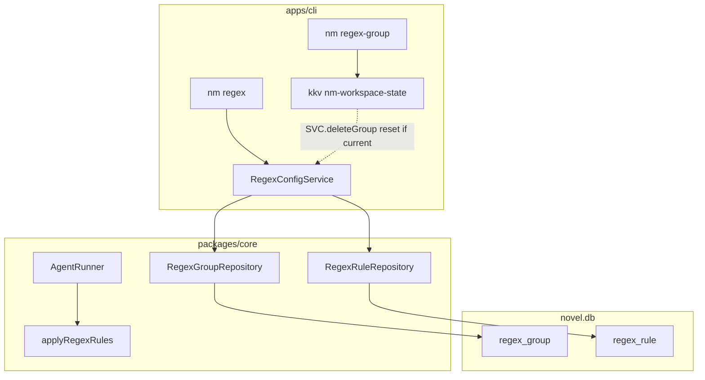

# 正则系统 技术规格（SPEC）

## 设计目标

- **两级配置**：正则组（`groupId`）+ 组内规则（`ruleId`），规则有稳定 **`sort_order`**；组内启用规则 **OR**，多命中 **按序串联**。
- **当前生效正则组**：`PersistentState.currentRegexGroupId`（KKV `nm-workspace-state` 指针，与 `currentModelId` 同类）。
- **实体持久化**：**SQLite 表 + Repository + Service**（对齐 `domain/provider`，**不**对齐 `domain/compaction` KKV 单条 JSON）。
- **运行时替换**：纯函数 `applyRegexRules`；不改写 `chat_message` 原文；LLM / CLI 展示路径视图时应用。
- **层数 `x`**：**可见消息 floor**（与 `FloorThresholdTrigger` / `AgentSession.list()` 同源，hidden 不计）。
- **CLI**：`nm regex-group`、`nm regex`；e2e **必测** llm（`prompt render` 等）与 display（`message list`）两通道。

**本期交付**：Core（bootstrap DDL + domain + service）+ CLI。**不含** mobile / RN。

**不含本期**：compaction/agent 迁 SQL 见独立迭代 **[compaction-agent-update](../compaction-agent-update/spec.md)**。

---

## 存储分层约定（纠正参照系）

早期方案误将 regex 组/规则对标 **`domain/compaction`**（KKV 单 key `policy`）或 **`domain/agent`**（YAML/内存会话），导致「用 KKV 存实体」的误解。

| 数据形状 | 应选存储 | 本仓库参考 | regex 本期 |
|----------|----------|------------|------------|
| 工作区指针（当前 project/session/model/**regexGroup**） | KKV `nm-workspace-state` | `PersistentState` | `currentRegexGroupId` **仍 KKV** |
| **1:N 实体**（服务商→模型、**组→规则**） | **SQL 表 + `Sqlite*Repository`** | `domain/provider` | **`regex_group` / `regex_rule` 表** |
| 全局单例配置 blob | SQL 表 *或* KKV 单 key（历史） | compaction 暂 `nm-compaction` | **regex 不采用 KKV 实体** |
| Agent prompts / runtime | 文件或 registry（非 novel.db 行表） | `agent-definition` | 本期 **不迁** |

**结论**：组/规则是实体关系 → **必须用 SQL 风格**（bootstrap DDL + repository.port + impl）。层数计算可对齐 **compaction 的 floor 语义**（可见消息计数），但 **不能** 对齐 compaction 的 **持久化形态**。

### 后续迭代（非本期 regex 任务）

已单独成稿：**[compaction-agent-update SPEC](../compaction-agent-update/spec.md)**（`compaction_policy` + `agent_definition` 表，KKV/YAML 迁移）。

| 模块 | 本迭代 regex | compaction-agent-update |
|------|----------------|-------------------------|
| `domain/compaction` | 仅 floor 语义 | KKV → SQL |
| `domain/agent` bundle | 不改动 | `agents.yaml` → SQL registry |
| `model-sampling` | 不改动 | 仍 KKV（1:1 附属，可选以后再议） |

---

## 现状与约束（代码探索）

| 模块 | 现状 | 本迭代 |
|------|------|--------|
| `provider-schema.ts` | `llm_provider`、`llm_saved_model` + FK | **对齐**：`regex_group`、`regex_rule` + CASCADE |
| `SqliteSavedModelRepository` | TDBC + SqlTemplate | `SqliteRegexGroupRepository` / `SqliteRegexRuleRepository` |
| `CompactionPolicyStore` | KKV（**非实体模型**） | regex **不沿用**；仅 floor **语义**参照 |
| `AgentDefinition` | YAML/JSON 文件 | 本期不改；runner 只接 `activeRegexGroupId` |
| `FloorThresholdTrigger` | `session.list()` 可见条数 | regex 层数同一可见集 |
| `PersistentState` | 指针 KKV | + `currentRegexGroupId` |
| `novel-master-bootstrap.ts` | 聚合 `*_SCHEMA_STATEMENTS` | + `REGEX_SCHEMA_STATEMENTS` |

**边界**：Core 不读 `PersistentState` 决定业务组内容；CLI resolve 指针后调 `RegexConfigService`。

---

## 总体方案

### 架构



### 领域模型（应用层类型）

```ts
interface RegexGroup {
  readonly groupId: string;
  readonly displayName: string | null;
  readonly createdAtMs: number;
  readonly updatedAtMs: number;
}

interface RegexRule {
  readonly groupId: string;
  readonly ruleId: string;
  readonly sortOrder: number;
  readonly name: string;
  readonly pattern: string;
  readonly flags: string;
  readonly enabled: boolean;
  readonly llmReplace: string | null;
  readonly displayReplace: string | null;
  readonly minDepth: number;
  readonly maxDepth: number;
  readonly scopeUser: boolean;
  readonly scopeAssistant: boolean;
  readonly createdAtMs: number;
  readonly updatedAtMs: number;
}
```

写入前经 Zod / `validateRegexRule`：`llmReplace`/`displayReplace` 至少其一；`scopeUser || scopeAssistant`；`minDepth <= maxDepth`；`new RegExp(pattern, flags)` 合法。

### 层数 `x` = 可见消息 floor

实现：`domain/chat/message-visible-floor.ts`（`listVisibleSorted`、`visibleFloorByMessageId`）。hidden 无 floor、不参与替换。PRD 字段名仍为 `minDepth`/`maxDepth`，语义为 floor 闭区间。

### 替换管道

`domain/regex/apply-regex-rules.ts`：`applyRegexRules`、`applyRegexToMessageContent`。**规则顺序** = SQL `ORDER BY sort_order ASC`（同组内）。

### 指针与删除

| 事件 | 行为 |
|------|------|
| `regex-group use g` | `setCurrentRegexGroupId(g)`；`regex_group` 行须存在 |
| `regex-group delete g` | `DELETE` 组 → **FK CASCADE** 删规则；若 `current === g` → **`resetCurrentRegexGroupId`** |
| 指针指向不存在组 | 视为无生效组 |

---

## SQLite 表（Bootstrap DDL）

新增 `packages/core/src/bootstrap/regex/regex-schema.ts`，并入 `NOVEL_MASTER_SCHEMA_STATEMENTS`：

```sql
CREATE TABLE IF NOT EXISTS regex_group (
  group_id TEXT PRIMARY KEY,
  display_name TEXT,
  created_at_ms INTEGER NOT NULL,
  updated_at_ms INTEGER NOT NULL
);

CREATE TABLE IF NOT EXISTS regex_rule (
  group_id TEXT NOT NULL,
  rule_id TEXT NOT NULL,
  sort_order INTEGER NOT NULL,
  name TEXT NOT NULL,
  pattern TEXT NOT NULL,
  flags TEXT NOT NULL DEFAULT '',
  enabled INTEGER NOT NULL DEFAULT 1,
  llm_replace TEXT,
  display_replace TEXT,
  min_depth INTEGER NOT NULL,
  max_depth INTEGER NOT NULL,
  scope_user INTEGER NOT NULL DEFAULT 0,
  scope_assistant INTEGER NOT NULL DEFAULT 0,
  created_at_ms INTEGER NOT NULL,
  updated_at_ms INTEGER NOT NULL,
  PRIMARY KEY (group_id, rule_id),
  FOREIGN KEY (group_id) REFERENCES regex_group(group_id) ON DELETE CASCADE
);

CREATE INDEX IF NOT EXISTS idx_regex_rule_group_sort
  ON regex_rule (group_id, sort_order);
```

| 列 | 说明 |
|----|------|
| `sort_order` | 组内稳定顺序；`create` 时 `MAX(sort_order)+1` 或追加末尾 |
| `enabled` | SQLite 0/1 |
| `llm_replace` / `display_replace` | NULL 表示未配置该侧；写入前 Service 校验至少一侧非 NULL |
| `scope_*` | 至少一列为 1 |

**Zod**（`domain/regex/*.schema.ts`）用于 Service/CLI 入参校验；**DDL 在 bootstrap**，二者职责分离。

---

## Repository 与 Service

### Ports（`domain/regex/repositories/`）

```ts
interface RegexGroupRepository {
  list(): Promise<RegexGroup[]>;
  findById(groupId: string): Promise<RegexGroup | null>;
  insert(group: RegexGroup): Promise<void>;
  update(group: RegexGroup): Promise<void>;
  delete(groupId: string): Promise<void>;
}

interface RegexRuleRepository {
  listByGroupOrdered(groupId: string): Promise<RegexRule[]>;
  find(groupId: string, ruleId: string): Promise<RegexRule | null>;
  insert(rule: RegexRule): Promise<void>;
  update(rule: RegexRule): Promise<void>;
  delete(groupId: string, ruleId: string): Promise<void>;
  nextSortOrder(groupId: string): Promise<number>;
  // 可选：reorder(groupId, ruleId, newSortOrder)
}
```

实现：`repositories/impl/sqlite-regex-group.repository.ts`、`sqlite-regex-rule.repository.ts`（模式同 `sqlite-saved-model.repository.ts`）。

### `RegexConfigService`（`service/regex/`）

| 方法 | 行为 |
|------|------|
| `createGroup` / `listGroups` / `getGroup` / `updateGroup` / `deleteGroup` | 组 CRUD；`deleteGroup` 后若指针命中则 `resetCurrentRegexGroupId`（调 PersistentState，由 factory 注入） |
| `createRule` / `listRules` / `getRule` / `updateRule` / `deleteRule` / `setRuleEnabled` | 规则 CRUD；创建时校验 + 分配 `sortOrder` |
| `listCompiledRulesForGroup(groupId)` | 按 `sort_order` 加载 enabled 规则并 `compileRegexRule` |

工厂：`createRegexConfigService(conn, state?)` — `state` 仅用于 delete 时清指针（或 CLI 层清指针，Service 只 CASCADE）。

---

## 最终项目结构

```
packages/core/src/
  bootstrap/regex/
    regex-schema.ts                    # NEW → novel-master-bootstrap.ts
  domain/chat/
    message-visible-floor.ts
  domain/regex/
    model/regex-group.ts
    model/regex-rule.ts
    regex-rule.schema.ts               # Zod（入参/校验，非 bootstrap）
    validate-regex-rule.ts
    compile-regex-rule.ts
    apply-regex-rules.ts
    repositories/
      regex-group.port.ts
      regex-rule.port.ts
      impl/sqlite-regex-group.repository.ts
      impl/sqlite-regex-rule.repository.ts
  errors/regex-errors.ts
  service/regex/
    regex-config.port.ts
    impl/regex-config.service.ts
    create-regex-config-service.ts
  service/persistent-state/            # + currentRegexGroupId
  service/agent/impl/agent-runner.ts   # LLM 替换

apps/cli/src/
  regex-group/commands.ts
  regex/commands.ts
  runtime.ts                           # regexConfig + state

packages/core/test/
  regex/sqlite-regex-repository.test.ts
  regex/regex-config.service.test.ts
  regex/apply-regex-rules.test.ts
  chat/message-visible-floor.test.ts

apps/cli/test/regex-e2e.test.ts
```

---

## 变更点清单

| 文件 | 改动 |
|------|------|
| `bootstrap/regex/regex-schema.ts` | **新增** DDL |
| `bootstrap/novel-master-bootstrap.ts` | `...REGEX_SCHEMA_STATEMENTS` |
| `domain/regex/repositories/**` | **新增** Sqlite 实现 |
| `service/regex/**` | **新增** Service |
| `persistent-state.*` | `currentRegexGroupId` |
| `agent.port.ts` / `agent-runner.ts` | `activeRegexGroupId` + llm 替换 |
| `apps/cli` prompt/message/agent | 双通道接入 |
| `index.ts` | export |

**不改动（本期）**：`compaction-policy-store.service.ts`、`agent-definition` 存储形态。

---

## CLI 命令（冻结）

与 PRD 一致；`nm regex-group delete` 触发 SQL CASCADE + 指针 reset。

`nm regex list` 输出列含 `sort_order`（或隐含顺序）。

`nm regex test --channel llm|display` **必填**。

---

## 详细实现步骤

### Step 1 — Bootstrap + Domain 类型 + 纯函数

1. `regex-schema.ts` + 注册 bootstrap。
2. `message-visible-floor.ts`、`apply-regex-rules.ts`、Zod/validate。
3. 单测：apply + floor（**不依赖** DB）。

### Step 2 — Repository + Service

1. `SqliteRegexGroupRepository`、`SqliteRegexRuleRepository` + repository 单测（memory sqlite）。
2. `DefaultRegexConfigService`：事务内组删级联由 FK 保证；指针 reset。
3. `PersistentState` 扩展 + 测试。

### Step 3 — CLI

1. `createRegexConfigService(conn, state)` 接入 runtime。
2. `regex-group` / `regex` commands。
3. `regex-e2e.test.ts`：CRUD + C5/C6 双通道。

### Step 4 — 运行时（LLM）

`agent run` / `prompt render` / `model request --session`：`listBySession` → floor map → llm 替换。

### Step 5 — 运行时（Display）

`nm message list`：display 替换（必测）。

### Step 6 — 导出

`packages/core/src/index.ts`。

---

## 测试策略

| ID | 场景 |
|----|------|
| R-SQL1 | 删组后 `regex_rule` 无残留（CASCADE） |
| R-SQL2 | `listByGroupOrdered` 与 `sort_order` 一致 |
| R8 | 删当前组后指针 reset |
| C5/C6 | llm / display CLI 分叉（PRD） |

---

## 风险与回滚

| 风险 | 缓解 |
|------|------|
| 与 compaction KKV 混淆 | 本文 §存储分层约定；regex 仅借 floor **语义** |
| `sort_order` 空洞 | 本期允许空洞；二期 `reorder` 子命令压缩 |
| FK 与旧 DB | `CREATE IF NOT EXISTS`；新表无迁移数据 |

**回滚**：从 bootstrap 移除 REGEX DDL（不删表）、删 service/cli；指针字段可保留。

---

## 兼容性与迁移

- **新增** SQL 表；`bootstrapNovelMaster` 幂等创建。
- 无旧 regex 数据迁移（新功能）。
- KKV 仅 **`currentRegexGroupId`** 指针。
- PRD 持久化描述以 **本 SPEC SQL 方案** 为准（若 PRD 仍写 KKV，以 SPEC 为准）。

---

**生成路径**：`.apm/kb/docs/Iterations/regex-system/spec.md`

**存储决策**：组/规则 = **SQL**（对齐 provider）；指针 = **KKV**。**compaction/agent 迁 SQL** → [compaction-agent-update](../compaction-agent-update/spec.md)。

确认后即可编码。
