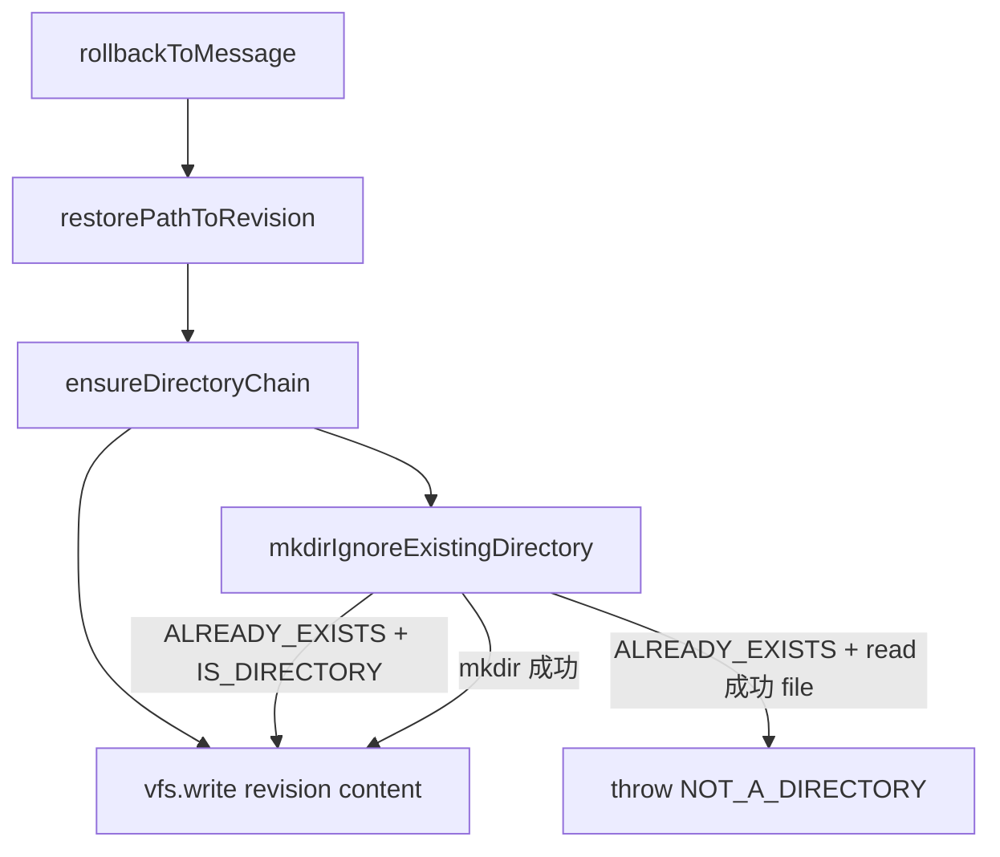

# 消息回滚 `ensureDirectoryChain` 幂等修复 技术规格（SPEC）

> PRD：`.apm/kb/docs/Iterations/rollback-mkdir-idempotent/prd.md`

## 设计目标

- 修复 `rollbackToMessage` 在恢复嵌套文件路径时，因父目录**已存在**而抛出 `VfsError: ALREADY_EXISTS` 导致整次回滚失败的问题。
- 对齐 message-checkpoint v2 SPEC 对 `ensureDirectoryChain` **idempotent** 的定案，与同仓库 `vfs-move` / `vfs-copy` 的目录链语义一致。
- **不改动** checkpoint 采集策略、回滚 reconcile 范围（仍为 `tail ∪ target`）、跨端 IPC。
- 父路径已为 **file** 时仍失败，且错误码为 `NOT_A_DIRECTORY`（不可与「目录已存在可跳过」混淆）。

---

## 现状与约束（代码探索）

| 模块 | 现状 | 本迭代 |
|------|------|--------|
| `restore-path.ts` → `ensureDirectoryChain` | 对每级父路径直接 `vfs.mkdir(dir)` | 改为幂等 mkdir + 文件占位校验 |
| `vfs-move.ts` → `mkdirIgnoreExists` | `mkdir` 失败且 `ALREADY_EXISTS` 时静默返回；**不区分** file / directory | 保留；新增更严格 helper 供回滚使用 |
| `ensure-parent-dirs.ts` → `ensureParentDirectories` | 基于 `VfsEntryRepository.findByPath` 检查 `entryKind`；file → `NOT_A_DIRECTORY` | **语义参考**；回滚路径仅有 `VfsService` |
| `message-rollback.service.ts` | `restorePathToRevision` → `ensureDirectoryChain` → `vfs.write` | **不改** reconcile 算法 |
| `rollback.test.ts` R4 | 回滚前**删除**整棵父目录链，再验证可重建 | 保留；缺「父目录仍在」分支 |
| Mobile / Desktop / CLI | 均调用 `sessionFs.rollbackToMessage` | 无改动，自动受益 |

**根因**

```32:34:packages/core/src/domain/message-checkpoint/logic/restore-path.ts
  for (const dir of dirs) {
    await vfs.mkdir(dir);
  }
```

`DefaultVfsService.mkdir` 在路径上**已有任意 entry**（含 directory row）时均抛 `ALREADY_EXISTS`：

```52:55:packages/core/src/service/vfs/impl/vfs.service.ts
    const existing = await this.repo.findByPath(normalized);
    if (existing != null) {
      throw vfsAlreadyExists(normalized);
    }
```

嵌套文件回滚的常见路径是：父目录从未删除，仅子文件内容被 tail 修改 → `ensureDirectoryChain` 对仍存在的 `/原文` 执行 `mkdir` → 失败。这与 checkpoint 是否覆盖每条消息**无关**。

**`mkdirIgnoreExists` 为何不能原样复用**

现网 `mkdirIgnoreExists` 吞掉一切 `ALREADY_EXISTS`，若父路径为 **file** 也会静默通过，违反 PRD A3。回滚需「目录可跳过、文件必须报错」。

**兼容性原则**

- 仅改 `packages/core`；不新增表、迁移、IPC 字段。
- `rollbackToMessage` 事务边界与 `pathsToReconcile` 集合逻辑不变。
- `mkdirIgnoreExists` 签名与 move/copy 调用方行为**保持不变**（本迭代不强制改 move 链）。

---

## 总体方案

### 回滚恢复路径（修复后）



### 新增 helper：`mkdirIgnoreExistingDirectory`

**位置**：`packages/core/src/domain/vfs/logic/vfs-move.ts`（与 `mkdirIgnoreExists` 同模块，一并 export）

**语义**（对每个父目录路径 `dir`）：

1. `await vfs.mkdir(dir)` — 不存在则创建 directory row。
2. 若抛 `VfsError` 且 `code === "ALREADY_EXISTS"`：
   - `await vfs.read(dir)`  
     - **成功**（有文件内容）→ `throw vfsNotADirectory(dir)`  
     - **失败 `IS_DIRECTORY`** → 视为目录已存在，**return**（幂等成功）  
     - 其他错误 → 原样抛出
3. 其余 mkdir 错误原样抛出。

**与 `ensureParentDirectories` 对齐**：后者用 repo 查 `entryKind`；前者用 `VfsService` 的 read/IS_DIRECTORY 探针，在 scoped 边界内等效。

### `ensureDirectoryChain` 修改

```typescript
import { mkdirIgnoreExistingDirectory } from "@/domain/vfs/logic/vfs-move.js";

export async function ensureDirectoryChain(
  vfs: VfsService,
  logicalPath: string,
): Promise<void> {
  // ... 构建 dirs 链（逻辑不变）...
  for (const dir of dirs) {
    await mkdirIgnoreExistingDirectory(vfs, dir);
  }
}
```

`restorePathToRevision` 其余逻辑不变。

---

## 最终项目结构

```
packages/core/src/
├── domain/
│   ├── vfs/logic/
│   │   └── vfs-move.ts                    # 修改：+ mkdirIgnoreExistingDirectory
│   └── message-checkpoint/logic/
│       └── restore-path.ts                # 修改：ensureDirectoryChain 调用新 helper
├── index.ts                               # 修改：export 新 helper（可选，与 mkdirIgnoreExists 并列）
└── test/
    └── message-checkpoint/
        └── rollback.test.ts               # 修改：+ R10、+ R11（或 restore-path 单测文件）
```

无 Mobile / Desktop / CLI / schema 变更。

---

## 变更点清单

| # | 文件 | 操作 | 要点 |
|---|------|------|------|
| 1 | `domain/vfs/logic/vfs-move.ts` | 修改 | 新增 `mkdirIgnoreExistingDirectory`；补 JSDoc |
| 2 | `domain/message-checkpoint/logic/restore-path.ts` | 修改 | `ensureDirectoryChain` 改用新 helper |
| 3 | `packages/core/src/index.ts` | 修改 | `export { mkdirIgnoreExistingDirectory }` |
| 4 | `test/message-checkpoint/rollback.test.ts` | 修改 | 新增 A1/A3 对应用例 |

**明确不改**

- `message-rollback.service.ts` reconcile 集合与事务
- `message-checkpoint.service.ts` capture 时机
- `mkdirIgnoreExists` 实现（move/copy 保持现状）
- `DefaultVfsService.mkdir` 行为

---

## 实现细节

### `mkdirIgnoreExistingDirectory` 伪代码

```typescript
export async function mkdirIgnoreExistingDirectory(
  vfs: VfsService,
  path: string,
): Promise<void> {
  try {
    await vfs.mkdir(path);
    return;
  } catch (error) {
    if (!(error instanceof VfsError && error.code === "ALREADY_EXISTS")) {
      throw error;
    }
  }
  try {
    await vfs.read(path);
    throw vfsNotADirectory(path);
  } catch (readError) {
    if (isVfsError(readError, "IS_DIRECTORY")) {
      return;
    }
    if (isVfsError(readError, "NOT_A_DIRECTORY")) {
      throw readError;
    }
    throw readError;
  }
}
```

**边界**

| 情况 | 行为 |
|------|------|
| 路径不存在 | mkdir 创建 directory |
| 路径为 directory row | mkdir → ALREADY_EXISTS → read → IS_DIRECTORY → 成功 |
| 路径为 file row | mkdir → ALREADY_EXISTS → read 成功 → NOT_A_DIRECTORY |
| 路径为 `/` | 不在 `ensureDirectoryChain` 生成的链中（`parentDir` 终止于 `/`） |

### 错误信息（用户可见）

Mobile Toast 经 `formatError` 透出 `VfsError.message`：

- 目录幂等成功：**无错误**
- 文件占位：`Not a directory: <physical path>`（scoped 内层仍为 physical path，与现网 mkdir 错误一致）

---

## 测试计划

### 新增用例（`rollback.test.ts`）

| ID | 名称 | 覆盖 PRD | 步骤摘要 |
|----|------|----------|----------|
| **R10** | 父目录存在时嵌套文件内容回滚 | A1 | write `/dir/file.md` v1 → capture → write v2（**不删** `/dir`）→ rollback → assert v1 |
| **R11** | 父路径为 file 时恢复子路径失败 | A3 | write `/dir` 为 file → 手工 insert checkpoint 行指向 `/dir/child.md`（或 capture 后 rename `/dir` 为 file 且保留 checkpoint 指针）→ rollback → assert rejects `NOT_A_DIRECTORY` |

**R11 实现建议**（最小可行）：

- 在测试中 `svfs.write("/dir", "file-content")` 建立 file 行；
- 通过 `messageCheckpoint.capture` 不可直接得到 `/dir/child.md`（父为 file 时 write 子路径会先失败）。
- **改法**：对 R11 单独测 `ensureDirectoryChain` / `restorePathToRevision`——在 `test/message-checkpoint/restore-path.test.ts` **新建**文件更干净：
  - 先 `write("/dir/child.md")` + capture revision；
  - 再 `delete("/dir/child.md")`、`write("/dir", "x")` 使 `/dir` 变为 file；
  - 调用 `restorePathToRevision(..., "/dir/child.md", version)` → expect `NOT_A_DIRECTORY`。

| ID | 文件 | 名称 |
|----|------|------|
| **U1** | `restore-path.test.ts`（新建） | `ensureDirectoryChain` 幂等 + file 占位 |

### 回归

- 全量 `packages/core/test/message-checkpoint/rollback.test.ts`（R1–R9、R10）
- 全量 `packages/core/test/vfs/vfs-move.test.ts`（确保未改 `mkdirIgnoreExists`）

### 可选集成（PRD A4，P1）

手动 rename + Agent mutating 场景依赖 checkpoint 路径与 rename 时序，断言较多；**M1 不强制**，R10 已覆盖「父目录仍在」硬失败根因。

---

## 实施步骤

### Step 1 — Helper

1. 在 `vfs-move.ts` 实现 `mkdirIgnoreExistingDirectory`。
2. 从 `index.ts` export。
3. （可选）同文件内 2–3 个单元测试 via `vfs-move.test.ts` 的纯 vfs 场景。

### Step 2 — 接入回滚

1. 修改 `restore-path.ts` 的 `ensureDirectoryChain`。
2. 确认注释「idempotent」与实现一致。

### Step 3 — 测试

1. 新增 R10 于 `rollback.test.ts`。
2. 新增 `restore-path.test.ts` 覆盖 U1（A3）。
3. 本地 `npm test -w @novel-master/core -- test/message-checkpoint/`

### Step 4 — 验收

- Windows / CI：Core 测试绿。
- Mobile：嵌套路径会话手动回滚 smoke（可选，不阻塞 M1）。

---

## 验收矩阵

| PRD | SPEC 测试 | 通过条件 |
|-----|-----------|----------|
| A1 | R10 | rollback 成功，内容 v1，无 ALREADY_EXISTS |
| A2 | R4（已有） | 父链缺失时自动创建 |
| A3 | U1 | NOT_A_DIRECTORY，非静默成功 |
| A4 | —（P1 可选） | 本迭代不阻塞 |
| A5 | R1–R11 + vfs-move | 全通过 |

---

## 风险与后续

| 风险 | 缓解 |
|------|------|
| `read` 探针在极端 NOT_FOUND 与 ALREADY_EXISTS 不一致 | 单测覆盖；不一致时抛出 read 错误而非吞掉 |
| 仅修 mkdir，checkpoint 路径与 live 仍可能不一致 | PRD 已标为后续迭代；本修只消除硬失败 |
| 未来统一 `mkdirIgnoreExists` → 新 helper | 可 follow-up；move 到 file 路径时会从静默变 NOT_A_DIRECTORY，属行为收紧 |

---

## 估算

| 步骤 | 工作量 |
|------|--------|
| Helper + restore-path | ~30 行 |
| 测试 R10 + U1 | ~80 行 |
| **合计** | 小迭代，单 PR 可交付 |
