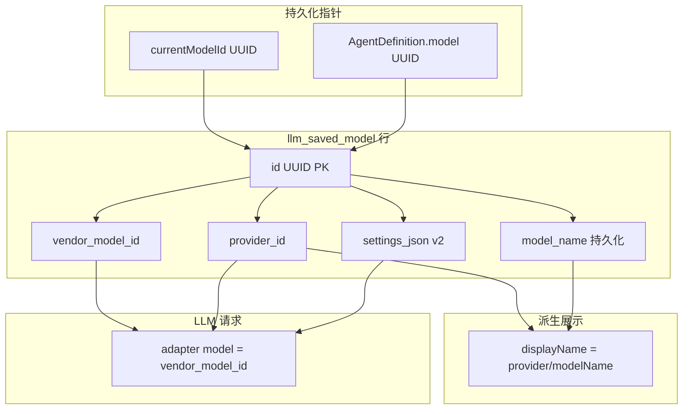

# saved-model-identity 技术规格（SPEC）

## 需求来源

- PRD：`.apm/kb/docs/Iterations/saved-model-identity/prd.md`
- 用户已确认：`currentModelId` / Agent `model` **一次性全量迁移为 UUID**；扩展 bootstrap 政策，采用 **正式 migration 登记**，禁止随意 ad-hoc 脚本。

## 设计目标

1. 引入 **saved model UUID** 作为全局预设指针；`vendor_model_id` 降为普通列（可重复）。
2. UI/CLI 默认展示 **派生 displayName**（`provider/modelName`）；隐藏 UUID / raw vendorModelId。
3. 在 bootstrap 内交付 **可登记、可幂等、可测试** 的 schema migration 框架，并完成 saved model 表重建 migration。
4. 一次性迁移旧库数据与 KKV/Agent 指针，**不**长期双轨 `provider/vendor`。

## 总体方案

### 身份模型（迁移后）



| 字段 | 角色 |
|------|------|
| `id` (UUID) | 主键；`currentModelId` / Agent pin / Picker 选中值 |
| `provider_id` | 不可改；FK → `llm_provider` |
| `vendor_model_id` | 厂商 API `model` 参数；**可重复**；不可改 |
| `model_name` | **持久化**；用户可编辑；默认 = `vendor_model_id` |
| `displayName` | **不落库**；`formatSavedModelDisplayName(provider_id, model_name)` → `{provider_id}/{model_name}` |

**Core 派生函数**（新增，public export 可选）：

```ts
export function formatSavedModelDisplayName(
  providerId: string,
  modelName: string,
): string {
  return `${providerId}/${modelName}`;
}
```

`SavedModel` 域对象：`readonly modelName: string`；`displayName` 为 **getter 或 map 层派生**，不写入 repository insert/update。

**废弃 / 保留**：

- `applicationModelId` 作为持久化指针 → 废弃
- 旧列 `display_name` → migration 重命名为 `model_name` 并按规则推导（见 v1 migration）
- `formatApplicationModelId(provider, vendor)` 保留，**仅** migration / 日志 / 高级详情

### Bootstrap migration 框架

在 `bootstrapNovelMaster` 事务内，DDL 之后、seed 之前插入：

```text
1. ensureSchemaMigrationsTable()
2. runPendingSchemaMigrations()   // 按 id 排序，skip 已登记
3. alignSchemaColumns()          // 保留 legacy ADD COLUMN（baseline 可 retro 登记）
4. seedBuiltinProviders()
```

**`schema_migrations` 表**（新建，DDL 在 `schema-migrations/schema-migrations-table.ts` 的 `ensureSchemaMigrationsTable()` 内 `CREATE IF NOT EXISTS`，**不**放入 `NOVEL_MASTER_SCHEMA_STATEMENTS`；由 Step 1 runner 在 `runPendingSchemaMigrations` 之前调用）：

```sql
CREATE TABLE IF NOT EXISTS schema_migrations (
  id TEXT PRIMARY KEY,
  applied_at_ms INTEGER NOT NULL
);
```

**Migration 模块约定**：

- 目录：`packages/core/src/bootstrap/schema-migrations/`
- 文件：`saved-model-identity-v1.ts`（示例 id 与 PRD 一致）
- 导出：`{ id: string, up: (tx: TdbcConnection) => Promise<void> }`
- 注册表：`SCHEMA_MIGRATIONS` 数组（有序）
- **禁止** 未列入注册表的 `migrate-*.ts` 散落模块（修订 T-B2）

**幂等策略**：

- 以 `schema_migrations.id` 为 **唯一** apply 依据（非仅 pragma）
- 每个 `up()` 内部仍可用 pragma 辅助（如列已存在则 skip 子步骤）
- 全部在 **同一 transaction** 内（与现 bootstrap 一致）

**与 alignSchemaColumns 关系**：

- 现有 5 条 alignment **保留**（低风险 ADD COLUMN）
- saved model **表重建** 走 migration `saved-model-identity-v1`，**不** 尝试 ALTER PK
- 长期：新增破坏性变更只走 migration；ADD COLUMN 可继续 dual 登记（migration id + alignment 二选一，SPEC 推荐 **仅 migration** 用于新变更）

### saved model 表 migration（`saved-model-identity-v1`）

**旧表** → **新表**（SQLite 表重建）：

```sql
-- 新表结构（示意）
CREATE TABLE llm_saved_model_new (
  id TEXT PRIMARY KEY,
  provider_id TEXT NOT NULL,
  vendor_model_id TEXT NOT NULL,
  model_name TEXT NOT NULL,
  settings_json TEXT NOT NULL,
  created_at_ms INTEGER NOT NULL,
  updated_at_ms INTEGER NOT NULL,
  FOREIGN KEY (provider_id) REFERENCES llm_provider(id) ON DELETE CASCADE
);
CREATE INDEX idx_llm_saved_model_provider ON llm_saved_model_new(provider_id);
-- RENAME 后索引名随表保留，无需再建
```

**数据迁移步骤**（`up()` 内）：

**路径 A — 旧库（无 `id` 列）**：表重建 + 指针替换 + 登记。

1. 若 `pragma_table_info('llm_saved_model')` **不含** `id` 列 → 执行 2–7。
2. `CREATE llm_saved_model_new`（含上示索引）。
3. **TS 侧逐行迁移**（`randomUUID()` + **modelName 推导**）：
   - `SELECT * FROM llm_saved_model`（旧表含 `display_name`）
   - 对每行：
     - `id = randomUUID()`
     - `modelName = deriveModelNameFromLegacy(provider_id, vendor_model_id, display_name)`（见下）
     - `INSERT INTO llm_saved_model_new (id, provider_id, vendor_model_id, model_name, …)`
   - 映射 key 仍为 `formatApplicationModelId(provider_id, vendor_model_id)`（legacy 指针按 vendor 级唯一行匹配；同 vendor 多行属新能力，旧库不存在）

**`deriveModelNameFromLegacy` 规则**：

| 旧 `display_name`（**先 trim**） | 新 `model_name` |
|-------------------|-----------------|
| NULL / trim 后空 | `vendor_model_id` |
| 等于 `{provider_id}/{vendor_model_id}` | `vendor_model_id` |
| 以 `{provider_id}/` 开头 | 去掉前缀后的后缀（用户曾存 path 形 displayName） |
| 其他任意文本 | 原样作为 modelName（如 `写作专用`） |
4. `DROP TABLE llm_saved_model`；`ALTER TABLE llm_saved_model_new RENAME TO llm_saved_model`
5. **指针迁移**（同 transaction）：
   - KKV `nm-workspace-state/currentModelId`：legacy 且在映射中 → UUID
   - **`agent_definition`**：逐行读 `prompts_json`（wire JSON），若顶层 `model` 为 legacy 且在映射中 → 写回 UUID 后 `UPDATE`
   - **`chat_project.agent_config_json`**：解析 JSON，`definition.model` legacy 且在映射中 → 写回 UUID 后 `UPDATE`
   - **孤儿 legacy 指针**（含 `/` 但不在映射中）：**fail-fast**，抛 `ProviderError('MIGRATION_ORPHAN_POINTER', …)` 并列出位置；事务回滚
6. **硬断言**：扫描 KKV + 全部 `agent_definition.prompts_json` + 全部 `chat_project.agent_config_json`，凡 `model` / `currentModelId` 非空且含 `/` → fail-fast（PRD B3）

**路径 B — 新库（canonical DDL 已含 `id` 列）**：无表重建，**仅登记**。

1. 若 `pragma_table_info('llm_saved_model')` **含** `id` 列 → 跳过 2–7 的 DDL/指针步骤。
2. 若 `schema_migrations` **尚未** 含 `saved-model-identity-v1` → 调用 `markApplied('saved-model-identity-v1')`（空操作 up，保证 T-SM2 与未来 migration 链一致）。
3. 若已登记 → no-op。

**两条路径共同收尾**：

- `markApplied('saved-model-identity-v1')` 在路径 A 步骤 5–6 成功后执行；路径 B 见上。
- **禁止**「检测到 `id` 列就整步 return 且不登记」——新库也必须写入 migration 记录。

**实现注（Step 顺序）**：Step 3 与 Step 9 须 **同 PR 或 Step 9 不晚于 Step 3 合并发布**——`provider-schema.ts` canonical DDL 含 `id` PK 后，新安装走路径 B；若 Step 9 滞后，中间阶段新库会误走路径 A 表重建（功能仍正确但多余）。

**用户确认**：**一次性全改 UUID**，migration 完成后不再保留 `provider/vendor` 指针。

### Core 服务层

| 组件 | 变更 |
|------|------|
| `SavedModel` | 增加 `id: string`（UUID v4） |
| `SavedModelRepository` | 见 **Repository Port 对照** |
| `ProviderModelService` | 见下表 **Port 签名对照** |
| `ModelRequestService` | Port 参数 **`savedModelId`**（breaking）；`request(savedModelId, …)` → `findById` → vendor + settings |
| `resolveSavedModelId` | 新函数（或重命名 `resolveApplicationModelId`）：解析工作区/CLI flag → UUID；内部 `assertSavedModelUuid` |
| `parseApplicationModelId` | **仅** migration 输入、日志/高级详情；**禁止**用于持久化指针解析 |
| `assertSavedModelUuid` | 校验 UUID 格式且 `findById` 存在；拒绝含 `/` 的 legacy 字符串 |

**`SavedModelRepository` Port 对照**：

| 旧签名 | 新签名 |
|--------|--------|
| `find(providerId, vendorModelId)` | **移除**（或 `@deprecated` 仅 migration 读旧行）；改用 `findById(id)` |
| `insert(model)` | `insert(model)` — `SavedModel.id` **必填**（调用方 `randomUUID()`） |
| `update(model)` | `updateById(model)` — 按 `id` 更新 |
| `delete(providerId, vendorModelId)` | `deleteById(id): Promise<boolean>` |
| `listByProvider(providerId)` | 不变；SELECT 含 `id` |
| `deleteByProvider(providerId)` | 不变（provider 级联删） |
| — | **新增** `findById(id): Promise<SavedModel \| null>` |

**`ProviderModelService` Port 签名对照**（breaking；public export 同步）：

| 旧签名 | 新签名 |
|--------|--------|
| `save(providerId, vendorModelId, modelName?)` | 不变 vendor 入参；`modelName ?? vendorModelId`；**always insert** + 新 UUID |
| `create(providerId, vendorModelId)` | `modelName = vendorModelId`；always insert |
| `editSaved(providerId, vendorModelId, displayName?)` | `editSaved(savedModelId, modelName?)` — **仅改 modelName**（见下） |
| `deleteSaved(providerId, vendorModelId)` | `deleteSaved(savedModelId)`；删除前引用校验（见下） |
| `updateSettings(providerId, vendorModelId, patch)` | `updateSettings(savedModelId, patch)` |
| `resetContextWindowToDefault(providerId, vendorModelId)` | `resetContextWindowToDefault(savedModelId)` |
| `getSaved(applicationModelId)` | `getSavedById(savedModelId)` |
| `getContextWindow(applicationModelId)` | `getContextWindow(savedModelId)` |
| `getTokenCounterMode(applicationModelId)` | `getTokenCounterMode(savedModelId)` |
| `savedList(providerId)` | 不变；返回行含 `id` |

**`editSaved(savedModelId, modelName?)` 语义**：

| 入参 | 行为 |
|------|------|
| `modelName === undefined` | **不改名**（保留现有 modelName） |
| `modelName === null` 或 `""` 或 trim 后空 | **拒绝**：`ProviderError('INVALID_MODEL_NAME', …)` |
| 非空 string | trim 后写入 `model_name`；派生 displayName 随之变化 |

**Breaking Changes（相对现 main）**：

| 区域 | 旧 | 新 |
|------|----|----|
| `SavedModel` 域对象 | `displayName: string \| null`（DB 列） | `modelName: string`（DB `model_name`）；`displayName` **只读派生** getter |
| `save` / `create` | upsert 同 vendor | always insert + 新 UUID |
| 持久化指针 | `applicationModelId` / composite key | `savedModelId` UUID |
| CLI | `--displayName`；`--modelId provider/vendor` | `--modelName`；`--modelId` UUID only |
| IPC save | `ProviderModelsSaveRequest.displayName?` | `modelName?` |
| IPC edit | 无 | **`PROVIDER_MODELS_EDIT_SAVED`** + `modelName?` |
| Mobile label  helpers | `resolveModelShortLabel` 读 `m.displayName` | 主行 `formatSavedModelDisplayName`；短标签 = **modelName**（非派生 path） |
| fetch suggest | `ModelSuggestion.displayName`（厂商 API） | **不变**；与 saved model 派生 displayName 无关 |

**`deleteSaved` 引用校验**（PRD E1/E2 / T-SM8）：

1. 若 `currentModelId === savedModelId` → 抛 `ProviderError('SAVED_MODEL_IN_USE', …)`，阻止删除。
2. 扫描 Agent registry + 各项目 `agent_config_json`：任一 `model === savedModelId` → 同上错误，列出引用方 id。
3. Mobile/Desktop 删除 UI 展示同一错误文案。

**UUID 校验规则**（post-migration 写入路径）：

- `assertSavedModelUuid(id)`：`z.string().uuid()` + DB 存在性。
- `setCurrentModelId` / Agent 保存 / CLI `--modelId`：**仅接受 UUID**；legacy `provider/vendor` → `ProviderError('INVALID_SAVED_MODEL_ID', …)`。
- `agentDefinitionDocumentSchema.model`：改为 `z.string().uuid().optional()`（或 refine + 存在性校验于 validate 层）。

**下游须改为 `findById` 再取 vendor/provider**（不可再 `parseApplicationModelId(uuid)`）：

| 模块 | 变更 |
|------|------|
| `infer-llm-protocol-from-model-id.ts` | 先 `findById` 再取 `providerId` |
| `count-prompt-llm-input.ts` / tokenizer registry | 入参 savedModelId → lookup vendor |
| `agent-runner.ts` | 同上 |
| `resolve-token-counter-mode-for-model.ts` | 同上 |
| `apps/desktop/.../chat-prompt-tokens.service.ts` | 同上 |
| `apps/mobile/.../model-display-label.ts` | `resolveModelDisplayLabel` → `formatSavedModelDisplayName`；`resolveModelShortLabel` → **modelName**（非 displayName path） |
| `apps/cli/src/config/resolve-provider-scope.ts` | `resolveModelId` 返回 UUID |
| `apps/cli/src/model/commands.ts` | use/current/request 按 UUID |
| `apps/cli/src/provider/model/commands.ts` / `sampling-commands.ts` | `--modelId` UUID |
| `apps/cli/src/agent/*`、`prompt/commands.ts` | Agent pin / prompt 模型字段 UUID |
| `apps/desktop/.../agent.ts`、`agent-run.service.ts` | 模型 pin UUID |
| `apps/desktop/renderer/.../ModelSamplingView.tsx` | route/handler 按 savedModelId |
| `apps/mobile/.../ModelSamplingScreen.tsx`、`AgentEditorForm.tsx` | 同上 |
| `packages/core/src/config-forms/**` | 表单校验改为 UUID（非 parse vendor path） |
| compaction `token-ratio.trigger.ts`（若引用 model id） | findById 链 |

**Public export / snapshot**（Step 5/6）：

- `packages/core/src/public/provider.ts`：`ModelRequestService.request` 参数 rename 为 `savedModelId`；`getSavedById` 等同步。
- 更新 `packages/core/test/package-exports/snapshots/public-provider-allowlist.json`。
- **保留** `parseApplicationModelId` / `formatApplicationModelId` 于 public export，**仅**用于 migration、日志、高级详情（文档注释标明）。

**Provider 删除时 currentModelId 清理**（UUID 化后）：

- Desktop `providers.ts`、Mobile `ProvidersScreen.tsx`：由 `currentModelId?.startsWith(\`${providerId}/\`)` 改为 `getSavedById(currentModelId)?.providerId === providerId`（或等价 SQL join）。

### 三端 UI / CLI / IPC

| 端 | 要点 |
|----|------|
| Mobile | 主行 = **displayName**（派生）；**modelName 重名**时副标题 = vendorModelId；ModelSampling 副标题 = modelName + vendorModelId（隐藏 UUID）；编辑 modelName 入口在 Provider 列表 / Sampling |
| Desktop | IPC DTO 含 `modelName` + 派生 `displayName`；编辑 modelName |
| CLI | 见 **CLI 契约** |
| Agent 表单 | dropdown value = UUID；hint = **displayName**（派生） |

**Mobile 路由**（Step 7）：`RootStackParamList.ModelSampling` 参数 `applicationModelId` → `savedModelId`；`ProviderDetailScreen` navigate 同步改。

**内部字段命名**（Step 5/6 统一）：持久化/运行时语义为 UUID 的字段统一 rename 为 `savedModelId`（含 `AgentRunOptions`、`compaction modelContext`、`token-counter-registry.port.ts`）；仅 migration/日志保留 `applicationModelId` 术语。

**新 ProviderErrorCode**（Step 4/5）：`MIGRATION_ORPHAN_POINTER`、`SAVED_MODEL_IN_USE`、`INVALID_SAVED_MODEL_ID`、**`INVALID_MODEL_NAME`** 加入 `provider-errors.ts`。

**CLI 契约**（多预设下 **全部** 已保存模型操作须 UUID 寻址）：

| 命令 | 变更 |
|------|------|
| `nm model use --modelId <uuid>` | 仅 UUID；拒绝 `provider/vendor` |
| `nm model current` | stdout = **displayName**（派生；可选括号 UUID） |
| `nm model list` | **新增** top-level；TSV = `uuid\tdisplayName\tvendorModelId` |
| `nm model request [--modelId <uuid>]` | flag 为 UUID |
| `nm provider model list` | 列：`uuid`、`displayName`（派生）、`vendorModelId` |
| `nm provider model edit/delete/sampling *` | `--modelId` UUID；edit 用 **`--modelName`**（非 displayName） |
| `nm provider model save/create` | save 可选 `--modelName`；默认 vendorModelId |

**Desktop IPC DTO**（breaking；Step 7 须 **ipc-types + preload + renderer + handler** 四端同步）：

| 类型 | 旧字段 | 新字段 |
|------|--------|--------|
| `ProviderModelSavedDto` | `applicationModelId`, `displayName` | `id`, `vendorModelId`, **`modelName`**, **`displayName`（handler 派生）** |
| `ModelPickerRowDto` | `applicationModelId`, `label` | `savedModelId`, `label`（**displayName 派生**） |
| `ModelListPickerResponse` | `currentId` | `currentId` 语义改为 **savedModelId UUID** |
| `ModelSetCurrentRequest` | `applicationModelId` | `savedModelId` |
| `ProviderModelsGetSavedRequest` | `applicationModelId` | `savedModelId` |
| `ProviderModelsDeleteSavedRequest` | `providerId` + `vendorModelId` | `savedModelId`（可保留 `providerId` 作校验） |
| `ProviderModelsUpdateSettingsRequest` | `providerId` + `vendorModelId` | `savedModelId` + settings 字段不变 |
| `ProviderModelsResetContextWindowRequest` | `providerId` + `vendorModelId` | `savedModelId` |
| `ProviderModelsSaveRequest` | `displayName?` | `vendorModelId` + **`modelName?`**（留空 → vendorModelId） |
| `ProviderModelsEditSavedRequest` | — | `{ savedModelId, modelName? }` — **无 displayName** |
| `ProviderModelSavedDetailDto`（**GET_SAVED 响应**） | raw `SavedModel` wire | `{ id, providerId, vendorModelId, modelName, displayName, settings, createdAtMs, updatedAtMs }` — handler 派生 displayName |
| IPC channel | — | **`PROVIDER_MODELS_EDIT_SAVED: "nm:providerModels/editSaved"`**（preload + handler + renderer 四端） |
| `provider-models.ts` handlers | composite key | delete/get/updateSettings/reset/**editSaved** 按 `savedModelId` |
| `agent.ts` handlers | `applicationModelId` | picker/setCurrent 用 `savedModelId`；label = displayName |
| `prompt.ts` / `PromptAgentMetaResponse` | `modelLabel` | `formatSavedModelDisplayName` |

**fetch suggest 列表**：`ModelSuggestion.displayName` 仍为厂商返回字段；**不**套用 saved model 派生规则。`handleProviderModelsSuggestList` 继续返回 suggest DTO（勿与 `ProviderModelSavedDto` 混用字段语义）。

### T-B2 政策修订

- 禁止：`packages/core/src/**/migrate-*.ts` **未在** `SCHEMA_MIGRATIONS` 注册的文件
- 允许：`bootstrap/schema-migrations/*.ts` + 中央注册表
- 测试：扫描 orphan migrate 文件 + 注册表 id 唯一 + 每个 migration 有单测

## 最终项目结构

```text
packages/core/src/bootstrap/
  schema-migrations/
    index.ts                    # SCHEMA_MIGRATIONS 注册表
    schema-migrations-table.ts  # ensure + mark applied + isApplied
    saved-model-identity-v1.ts  # 表重建 + 指针迁移
  provider/provider-schema.ts   # canonical DDL 更新为新表结构
  novel-master-bootstrap.ts     # 插入 runPendingSchemaMigrations
  schema-align/                 # 保留 legacy alignments

packages/core/src/domain/provider/
  model/saved-model.ts          # +id, modelName; displayName 派生
  logic/format-saved-model-display-name.ts
  logic/derive-model-name-from-legacy.ts

packages/core/test/bootstrap/
  schema-migrations.test.ts     # 登记幂等、saved-model-identity-v1
  bootstrap-no-migrate.test.ts  # 修订 T-B2 规则
```

## 变更点清单

| 文件/模块 | 变更 |
|-----------|------|
| `provider-schema.ts` | Step 3 同步：新 `llm_saved_model` DDL（含 `id` PK） |
| `schema-migrations/schema-migrations-table.ts` | `ensureSchemaMigrationsTable()` DDL |
| `model-request.port.ts` | `request(savedModelId, …)` breaking |
| `public/provider.ts` + export snapshot | breaking rename |
| `apps/cli/src/config/resolve-provider-scope.ts` | UUID resolve |
| `apps/cli/src/agent/*`、`prompt/commands.ts` | UUID |
| `apps/desktop/.../agent.ts`、`agent-run.service.ts` | UUID |
| `apps/desktop/renderer/.../ModelSamplingView.tsx` | savedModelId |
| `apps/mobile/.../ModelSamplingScreen.tsx`、`AgentEditorForm.tsx` | savedModelId |
| `packages/core/src/config-forms/**` | UUID 校验 |
| compaction `token-ratio.trigger.ts` | findById 链（若引用 model id） |
| `schema-migrations/*` | 新框架 + v1 migration（路径 A/B + 孤儿 fail-fast） |
| `novel-master-bootstrap.ts` | 调用 migration runner |
| `saved-model.ts` | `modelName` 字段；移除持久化 `displayName` |
| `format-saved-model-display-name.ts` | 派生 displayName |
| `derive-model-name-from-legacy.ts` | migration 用 |
| `sqlite-saved-model.repository.ts` | CRUD by id；列 `model_name` |
| `provider-model.port.ts` / `provider-model.service.ts` | Port 全表 UUID 签名；save=insert；delete 引用校验 |
| `saved-model.port.ts` | findById / deleteById / updateById |
| `model-request.service.ts` / port | `savedModelId` 入参 |
| `resolve-application-model-id.ts` | UUID 语义 + assertSavedModelUuid |
| `infer-llm-protocol-from-model-id.ts` 等 | findById 链 |
| `agent-definition.schema.ts` | model 字段 UUID |
| `persistent-state` / Agent validate | assert UUID saved |
| Mobile/Desktop picker、sampling、ProvidersScreen | id + displayName + provider 删除逻辑 |
| Desktop `providers.ts`、`ipc-types.ts`、`provider-models.ts` | DTO + handler |
| CLI `model/commands.ts`、`provider/model/*` | UUID + 新增 `model list` |
| `bootstrap-no-migrate.test.ts` | 政策更新 |

## 详细实现步骤

- Step 1 — phase-schema-migrations — blocking: yes — qa: auto：新增 `schema_migrations` 表与 runner（`ensure` / `isApplied` / `markApplied` / `runPending`）
- Step 2 — phase-schema-migrations — blocking: yes — qa: auto：修订 T-B2（白名单 `bootstrap/schema-migrations/**` + 注册表 id 唯一 + orphan 仍 fail）
- Step 3 — phase-saved-model-v1 — blocking: yes — qa: auto：**同步**更新 `provider-schema.ts` canonical DDL + 实现 v1（路径 A TS 迁移 + 路径 B markApplied）
- Step 4 — phase-saved-model-v1 — blocking: yes — qa: auto：路径 A 指针迁移 + 孤儿 fail-fast + B3 硬断言
- Step 5 — phase-core-api — blocking: yes — qa: auto：Port/Repository 全表 UUID 签名；save=insert；delete 引用校验
- Step 6 — phase-core-api — blocking: yes — qa: auto：ModelRequest、resolve/assert UUID、Agent schema、infer/tokenizer 下游 findById
- Step 7 — phase-ui-cli — blocking: yes — qa: auto：Mobile/Desktop Picker/Sampling/Provider 删除逻辑；CLI 全命令 UUID + 新增 `nm model list`；Desktop IPC DTO
- Step 8 — phase-ui-cli — blocking: yes — qa: auto：**AddModelModal** 字段改 **modelName**（添加时可选）；**Provider 列表 / ModelSampling / Desktop Settings** 新增 rename（`editSaved`）；Mobile 占位符「模型名称」
- Step 9 — phase-saved-model-v1 — blocking: yes — qa: auto：db-backup snapshot 测试与 fixture 对齐新 DDL（若 Step 3 已更新 canonical DDL，本步仅 snapshot/fixture）
- Step 10 — phase-saved-model-v1 — blocking: no — qa: manual_user：Android/Desktop 升级旧库 → 对话/Agent/双预设切换录屏验收
- Step 11 — phase-saved-model-v1 — blocking: no — qa: manual_user：db-backup 导入旧包 → rebootstrap → migration 成功

## 测试策略

### 单元 / 集成（auto）

| ID | 用例 | Step |
|----|------|------|
| T-SM1 | 空库 bootstrap 后存在 `schema_migrations` 表且含 `saved-model-identity-v1` | 1,3 |
| T-SM2 | 二次 bootstrap 不重复 insert migration id；新库路径 B 首次即登记 | 2,3 |
| T-SM3 | legacy 库（旧 PK）跑 v1 后含 `id` 列、行数不变、每行 id 唯一 | 3 |
| T-SM4 | legacy `currentModelId=openai/gpt-4o` 迁移后为 UUID 且 request 可解析 | 4,5 |
| T-SM5 | 同 provider+vendor insert 两行成功，settings 独立 | 5 |
| T-SM6 | `save` 第二次同 vendor **新增**行（非 upsert modelName only） | 5 |
| T-SM13 | `deriveModelNameFromLegacy`：旧 display_name 各形态 → 正确 model_name | 3 |
| T-SM14 | `formatSavedModelDisplayName` + 默认 modelName=vendor → displayName 等于 legacy path | 5 |
| T-SM15 | `editSaved(id)` 省略 modelName 不改名；空字符串拒绝 | 5,8 |
| T-SM7 | Agent YAML `model: provider/vendor` 迁移后为 UUID | 4,6 |
| T-SM8 | delete saved model 被 currentModelId 或 Agent pin 引用时拒绝 | 5,6 |
| T-SM9 | db-backup restore + rebootstrap 触发 v1（fixture SQL） | 9 |
| T-SM10 | T-B2 orphan migrate 文件仍失败；注册 migration 通过 | 2 |
| T-SM11 | 新库（canonical DDL）首次 bootstrap 登记 v1 且无表重建 | 3 |
| T-SM12 | 孤儿 legacy 指针（未 save 的 vendor path）migration fail-fast，事务回滚 | 4 |

### 手动（manual_user）

| ID | 用例 | Step |
|----|------|------|
| T-M1 | Mobile Picker 主行 displayName（派生）；选预设后聊天正常 | 10 |
| T-M2 | 同 vendor 两条预设 thinking 不同，切换后请求行为不同 | 10 |
| T-M3 | Desktop 工作区 footer 模型摘要为 displayName | 10 |
| T-M4 | CLI `model current` 输出 displayName | 7 |

## 风险与回滚方案

| 风险 | 缓解 |
|------|------|
| migration 中途失败 | 全事务包裹 v1；失败则整体回滚 |
| 指针漏迁移 | T-SM4/T-SM7/T-SM12；migration 末尾硬断言无 `/` 指针 |
| 孤儿 legacy 指针 | fail-fast + 明确错误；用户 save 模型或清除 pin 后重试 |
| modelName 重复 | Picker 副标题展示 vendorModelId |
| 跨端版本不一致 | Core 单点 migration；三端同版本发版 |
| T-B2 与新政冲突 | Step 2 先修订测试 |
| db-backup 旧包 | T-SM9；导入后 rebootstrap 跑 migration |
| Public API breaking | Port 对照表 + 三端/CLI 同步发版；发版说明列 breaking 命令 |

**回滚**：

- 代码：`git revert` 发版提交
- 数据：依赖升级前 `.nmbackup` / 云同步备份；migration 不提供自动 downgrade（SQLite down migration 不实现）

## Context Bundle

```yaml
iteration_name: saved-model-identity
requirement_path: Iterations/saved-model-identity/prd.md
spec_path: Iterations/saved-model-identity/spec.md
explore_summary: applicationModelId 作 PK 阻止同 vendor 多预设；bootstrap 仅 ADD COLUMN；用户确认指针一次性 UUID 化 + 登记式 migration
impact_files:
  - packages/core/src/bootstrap/**
  - packages/core/src/domain/provider/**
  - packages/core/src/service/provider/**
  - packages/core/src/domain/agent/model/agent-definition.schema.ts
  - packages/core/src/infra/tokenizer/logic/count-prompt-llm-input.ts
  - packages/core/src/domain/provider/logic/infer-llm-protocol-from-model-id.ts
  - apps/mobile/src/components/provider/**
  - apps/mobile/src/screens/stack/ProvidersScreen.tsx
  - apps/mobile/src/provider/model-display-label.ts
  - apps/desktop/renderer/features/settings/**
  - apps/desktop/src/main/ipc/handlers/providers.ts
  - apps/desktop/src/main/ipc/handlers/provider-models.ts
  - apps/desktop/shared/ipc-types.ts
  - apps/desktop/src/main/services/chat-prompt-tokens.service.ts
  - apps/cli/src/config/resolve-provider-scope.ts
  - apps/cli/src/agent/**
  - apps/cli/src/prompt/commands.ts
  - apps/desktop/src/main/services/agent-run.service.ts
  - apps/desktop/src/main/ipc/handlers/agent.ts
  - apps/desktop/src/main/ipc/handlers/prompt.ts
  - apps/desktop/renderer/features/settings/settings-nav.ts
  - apps/mobile/src/navigation/types.ts
  - packages/core/src/service/agent/agent.port.ts
  - packages/core/src/service/agent/impl/run-agent-turn.ts
  - packages/core/src/domain/provider/logic/provider-errors.ts
  - apps/desktop/renderer/features/settings/ModelSamplingView.tsx
  - apps/mobile/src/screens/stack/ModelSamplingScreen.tsx
  - apps/mobile/src/components/agent/AgentEditorForm.tsx
  - packages/core/src/config-forms/**
  - packages/core/src/public/provider.ts
  - packages/core/test/package-exports/snapshots/public-provider-allowlist.json
constraints:
  - 修订 T-B2 为登记制
  - migration 在 bootstrap 单事务
  - 不长期双轨 provider/vendor 指针
blocking_steps:
  - Step 1-9
```
