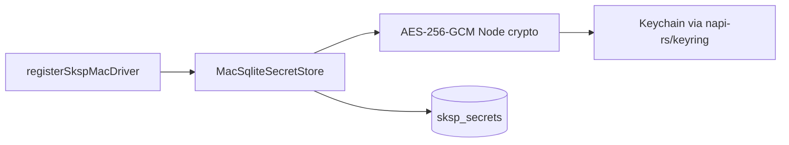

# SKSP macOS 驱动 技术规格（SPEC）

## 设计目标

- 在 [sksp-mac PRD](./prd.md) 范围内交付 `@novel-master/sksp-mac`，补齐 macOS 平台 SKSP 驱动。
- **镜像现有驱动包模式**（以 `sksp-windows` 为主参考）：独立 npm workspace 包、TDBC 连接 + `sksp_secrets` SQL、`registerSkspDriver` 注册。
- **零 core 变更**：复用 `SecretStore`、`SkspError`、`registerSkspDriver` / `resolveSkspDriver`、既有 DDL。
- **本期不接线** CLI / Desktop；仅保证驱动可被未来 `resolveSkspDriver("macos")` 消费。

## 现状与约束（代码探索）

| 项 | 路径 / 现状 | 本迭代 |
|----|-------------|--------|
| SKSP 协议 | `packages/core/src/infra/sksp` | 不改动 |
| DDL | `packages/core/src/bootstrap/sksp/sksp-schema.ts` → `sksp_secrets` | 不改动 |
| Windows 参考实现 | `packages/sksp-windows`：DPAPI → SQLite，`algo=dpapi-v1`，`iv=NULL` | 结构对齐；加密实现不同 |
| Android 参考 | `packages/sksp-android`：Keystore AES-GCM，`iv` 必填 | `iv` 列用法参考 |
| Registry | `packages/core/src/infra/sksp/logic/registry.ts` | 注册名 `macos` |
| CLI runtime | `apps/cli/src/runtime.ts` 硬编码 `windows` | **本期不改** |
| Desktop | `apps/desktop` 无 SKSP | **本期不改** |
| 单测模式 | `sksp-windows`：`setDpapiTestPassthrough(true)` 绕过 DPAPI | 同等 passthrough 钩子 |

**技术选型（本期锁定，无需用户确认）**

| 决策 | 选择 | 理由 |
|------|------|------|
| Keychain 访问 | `@napi-rs/keyring` | 维护活跃的 N-API 绑定；macOS Login Keychain；Windows/Linux 亦有实现但本期仅用 darwin 路径 |
| 密文形式 | Keychain 存 **应用主密钥**（32 字节）；Node `crypto` AES-256-GCM 加密 secret → SQLite `ciphertext` + `iv` | 满足「密文在 SQLite、密钥在 Keychain」；比逐 ref 存 Keychain 项更符合 SKSP 表模型 |
| `algo` | `macos-keychain-aes-gcm-v1` | 与 `dpapi-v1` / `android-keystore-aes-gcm-v1` 并列 |
| 驱动名 | `macos` | 对齐 `windows` / `android` 平台语义 |
| CI 测试 | `setMacKeychainTestPassthrough(true)` 使用内存固定主密钥 | 镜像 `setDpapiTestPassthrough` |

Keychain 条目约定：

- **service**：`novel-master`
- **user**：`sksp-master-v1`
- 值为 32 字节随机主密钥（首次 `getOrCreateMasterKey()` 生成并写入 Keychain）

---

## 总体方案

### 架构



1. **`registerSkspMacDriver()`** → `registerSkspDriver({ name: "macos", createStore })`。
2. **`MacSqliteSecretStore`** 实现 `SecretStore`；SQL 模板与 `sksp-windows/src/sqlite-secret-store.ts` 同形（`INSERT ... ON CONFLICT`）。
3. **`keychain.ts`**：`getOrCreateMasterKey()` / passthrough 钩子 / darwin 平台检测。
4. **`crypto.ts`**：`encryptUtf8(plain, ref)` → `{ ciphertext, iv }`；`decryptUtf8(...)` → plain。

### 加密流程

```text
set(ref, plain):
  masterKey ← Keychain.getOrCreate()   // 或 passthrough 固定 key
  { ciphertext, iv } ← AES-256-GCM(masterKey, plain)
  UPSERT sksp_secrets (ref, ciphertext, iv, algo, ...)

get(ref):
  row ← SELECT ciphertext, iv, algo FROM sksp_secrets WHERE ref = ?
  if algo ≠ macos-keychain-aes-gcm-v1 → DECRYPT_FAILED
  masterKey ← Keychain
  plain ← AES-256-GCM decrypt
```

GCM 每次 `set` 生成随机 12 字节 `iv`；`ciphertext` 含 auth tag（Node `cipher.getAuthTag()` 追加或使用 `createCipheriv` 默认行为 — 实现时采用 `Buffer.concat([enc, tag])` 与 decrypt 对称）。

---

## 最终项目结构

```text
packages/sksp-mac/
├── package.json
├── tsconfig.json
├── README.md
├── src/
│   ├── index.ts
│   ├── register.ts
│   ├── keychain.ts          # Keychain 主密钥 + test passthrough
│   ├── crypto.ts            # AES-256-GCM
│   └── sqlite-secret-store.ts
└── test/
    └── sqlite-secret-store.test.ts
```

**monorepo 变更（最小）**

| 文件 | 变更 |
|------|------|
| `packages/sksp-mac/*` | 新建 |
| `package-lock.json` | `npm install` 后自动更新（`@napi-rs/keyring`） |
| `packages/core/ARCHITECTURE.md` | 可选：外部驱动表补一行 `sksp-mac`（若维护者表存在） |

**明确不改**：`apps/cli`、`apps/desktop`、`apps/mobile`、`packages/core/src/infra/sksp/*`（除非 ARCHITECTURE 文档一行）。

---

## 变更点清单

| # | 文件 | 动作 |
|---|------|------|
| 1 | `packages/sksp-mac/package.json` | 新建；依赖 `core`、devDep `tdbc-driver-better-sqlite3`、`tsx`；dep `@napi-rs/keyring` |
| 2 | `packages/sksp-mac/tsconfig.json` | extends `tsconfig.base.json`，reference `../core` |
| 3 | `packages/sksp-mac/src/keychain.ts` | Keychain 读写 + `setMacKeychainTestPassthrough` |
| 4 | `packages/sksp-mac/src/crypto.ts` | AES-256-GCM encrypt/decrypt |
| 5 | `packages/sksp-mac/src/sqlite-secret-store.ts` | `MacSqliteSecretStore` + `createMacSecretStore` |
| 6 | `packages/sksp-mac/src/register.ts` | `registerSkspMacDriver` |
| 7 | `packages/sksp-mac/src/index.ts` | 公开 API 导出 |
| 8 | `packages/sksp-mac/test/sqlite-secret-store.test.ts` | 镜像 windows 单测 |
| 9 | `packages/sksp-mac/README.md` | 注册示例 + passthrough 说明 |

### 公开 API

```typescript
// packages/sksp-mac/src/index.ts
export { registerSkspMacDriver } from "./register.js";
export { createMacSecretStore, MacSqliteSecretStore } from "./sqlite-secret-store.js";
export { setMacKeychainTestPassthrough } from "./keychain.js";
```

---

## 详细实现步骤

### Step 1 — 脚手架

1. 复制 `sksp-windows` 的 `package.json` / `tsconfig.json` 骨架，改名 `@novel-master/sksp-mac`。
2. 将 `@primno/dpapi` 换为 `@napi-rs/keyring`（版本取 npm 当前稳定版，安装时解析）。
3. 在 monorepo 根执行 `npm install` 链接 workspace。

### Step 2 — `keychain.ts`

1. 常量：`SERVICE = "novel-master"`，`USER = "sksp-master-v1"`，`MASTER_KEY_BYTES = 32`。
2. `setMacKeychainTestPassthrough(enabled: boolean)`：模块级 flag；启用时使用 `crypto.randomBytes` 一次生成的固定测试 key（或全零测试 key，仅测试环境）。
3. `getOrCreateMasterKey(): Promise<Uint8Array>`：
   - passthrough → 返回测试 key；
   - `process.platform !== "darwin"` → `SkspError ENCRYPT_FAILED`（与 DPAPI 非 win32 行为对称）；
   - `Keyring.getPassword(SERVICE, USER)` 命中 → 解析 base64/hex；
   - 未命中 → `randomBytes(32)` → `setPassword` → 返回。
4. Keychain API 异常 → `SkspError ENCRYPT_FAILED` / `DECRYPT_FAILED` + `{ ref }` 当在加解密上下文。

### Step 3 — `crypto.ts`

1. `encryptUtf8(plain, masterKey, ref)` → `{ ciphertext: Uint8Array, iv: Uint8Array }`。
2. `decryptUtf8(ciphertext, iv, masterKey, ref)` → `string`。
3. 使用 `node:crypto` `createCipheriv` / `createDecipheriv`，`aes-256-gcm`。
4. 失败 → `SkspError ENCRYPT_FAILED` / `DECRYPT_FAILED`。

### Step 4 — `sqlite-secret-store.ts`

1. 从 `sksp-windows/src/sqlite-secret-store.ts` 复制类结构，替换 `protectUtf8` / `unprotectUtf8` 为 `getOrCreateMasterKey` + crypto。
2. `ALGO = "macos-keychain-aes-gcm-v1"`。
3. `set`：`iv` 写入 SQL（非 NULL）；`get`：校验 `algo` 与 `iv` 存在。
4. `rowIv` / `rowCiphertext` 辅助函数处理 `Uint8Array` | `string`（参考 windows/android）。

### Step 5 — `register.ts` + `index.ts`

```typescript
export function registerSkspMacDriver(): void {
  registerSkspDriver({
    name: "macos",
    createStore: (conn) => createMacSecretStore(conn as TdbcConnection),
  });
}
```

### Step 6 — 单测

1. 复制 `sksp-windows/test/sqlite-secret-store.test.ts` 结构。
2. `before`：`setMacKeychainTestPassthrough(true)` + `registerBetterSqlite3Driver()`。
3. `after`：passthrough false。
4. 断言 `algo === "macos-keychain-aes-gcm-v1"`、`iv` 非 null。
5. 可选：注册驱动 + `resolveSkspDriver("macos")` smoke 断言。

### Step 7 — 验证

```bash
npm run build -w @novel-master/sksp-mac
npm run test -w @novel-master/sksp-mac
```

macOS 实机（手工）：passthrough 关闭，临时脚本或 REPL 执行 round-trip（可在 README 记录，不纳入 CI 门槛）。

---

## 测试策略

### 自动化（CI，任意 OS）

| 用例 | 预期 |
|------|------|
| set/get round-trip | 明文一致 |
| has / delete | 行为与 windows 单测一致 |
| 密文非明文 | DB 中无明文 secret |
| algo / iv | `macos-keychain-aes-gcm-v1`，iv 有值 |
| wrong algo row | 手动 INSERT `dpapi-v1` 行 → get 抛 `DECRYPT_FAILED` |
| register + resolve | `macos` 驱动可解析 |

### 手工（macOS only）

| 用例 | 预期 |
|------|------|
| passthrough off round-trip | Keychain 出现 `novel-master` / `sksp-master-v1` 条目 |
| 删除 Keychain 条目后 get | `DECRYPT_FAILED` |

### 不测

- CLI `nm provider edit` 集成
- Electron IPC
- 与 Windows 密文互操作

---

## 风险与回滚方案

| 风险 | 缓解 |
|------|------|
| `@napi-rs/keyring` 在非 macOS 安装失败 | 可选依赖或 try/catch；单测始终 passthrough，不触达原生模块 |
| macOS Keychain 弹窗/权限 | 使用非 UI 的 generic password API；文档说明首次写入行为 |
| GCM iv/tag 编码与 SQLite BLOB | 单测固定向量断言；与 android base64 策略独立，mac 存 raw BLOB（同 windows） |
| 主密钥丢失导致全库 secret 不可用 | 与 Android Keystore 清空一致；`DECRYPT_FAILED` + 提示重新配置 |

**回滚**：删除 `packages/sksp-mac` 目录并 revert `package-lock.json`；无 core/schema 迁移，无数据迁移脚本。

---

## 后续迭代（本期外）

- `apps/cli` / `apps/desktop`：`resolvePlatformSkspDriver()` 按 `process.platform` 选 `windows` | `macos`
- [SKSP PRD](../sksp/prd.md) 更新 v2 驱动列表
- Linux：`sksp-linux` 或 env-only
