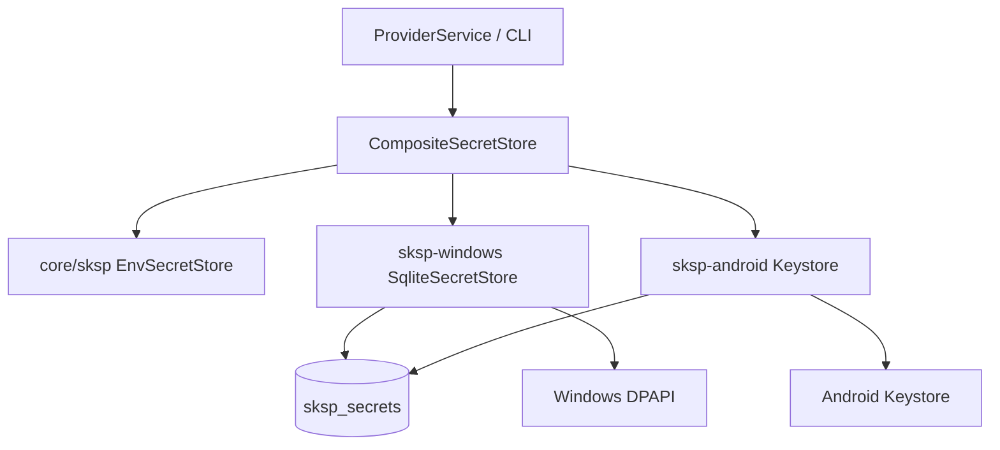

# SKSP 技术规格（SPEC）

## 设计目标

- 定义 **Secret Key Storage Protocol（SKSP）**：异步 `SecretStore` 端口 + 可插拔驱动，模式对齐 [TDBC SPEC](../TDBC/spec.md)（`registerDriver` / `resolveDriver`）。
- **统一持久化**：API Key 等敏感值以**密文**存入与业务共用的 `novel.db` 表 `sksp_secrets`；业务表（如 `llm_provider`）仅存 **`secretRef`**，**无明文** key。
- **v1 驱动（本期均必交付）**：`@novel-master/sksp-windows`（DPAPI + SQLite）、`@novel-master/sksp-android`（Keystore + RN 桥）。
- **零原生依赖** 的协议在 `@novel-master/core/sksp`（`packages/core/src/infra/sksp`）；含 env 读（CI，无原生）；Windows/Android 原生逻辑仅在各自 driver 包。
- 供 [provider-model SPEC](../provider-model/spec.md) 通过 `SecretStore.get/set/delete/has` 接线；SKSP **不** 解析 HTTP、provider 业务规则。

## 现状与约束（代码探索）

| 项 | 路径 / 现状 | 本迭代 |
|----|-------------|--------|
| TDBC registry | `packages/core/src/infra/tdbc/registry.ts`：`registerDriver`、`resolveDriver` | SKSP `packages/core/src/infra/sksp/registry.ts` 镜像同等语义（`registerSkspDriver`）；平台驱动独立包 |
| Bootstrap | `packages/core/src/bootstrap/novel-master-bootstrap.ts` 聚合 `*_SCHEMA_STATEMENTS` | `SKSP_SCHEMA_STATEMENTS` 在 **core** `bootstrap/sksp/sksp-schema.ts`（DDL 与 novel 库绑定）；驱动不负责建表 |
| CLI runtime | `apps/cli/src/runtime.ts`：`registerBetterSqlite3Driver()` → `createNovelMasterRuntime` | 其后 `registerSkspWindowsDriver()`；`runtime.secretStore` 注入 |
| SKSP 代码 | `packages/core/src/infra/sksp` + `sksp-windows` / `sksp-android` | 协议与 env 在 core；驱动包独立 |
| `CliConfig` | 不含密钥 | 密钥 **永不** 写入 `config.json` |
| Mobile | `apps/mobile` + `tdbc-driver-rn` | **本期实现** `sksp-android` 注册 + 最小验收（Dev 探针或单元桥接测）；RN `nm provider` UI **不做** |

**PRD 锁定（[prd.md](./prd.md)）**

| 项 | SPEC 决策 |
|----|-----------|
| 存储模型 | 方案 B：平台 encrypt → `sksp_secrets`；非 Credential Manager 主存、非用户主密码 |
| `ref` 格式 | 不透明字符串；provider-model 约定 `provider/<providerId>/apiKey` |
| `algo` | Windows：`dpapi-v1`（`iv` NULL）；Android：`android-keystore-aes-gcm-v1`（`iv` 必填） |
| 读取优先级 | **env 命中 > DB 解密 > `null`**（见下文 Composite） |
| env 命名 | `NOVEL_MASTER_PROVIDER_<ID>_API_KEY`：`providerId` 大写，非 `[A-Z0-9]` → `_` |
| 失败策略 | 无驱动注册 / 解密失败：**抛 `SkspError`**，不回退明文落盘 |

---

## 总体方案

### 架构



1. **`@novel-master/core/sksp`**：`SecretStore`、`SkspError`、`registerSkspDriver` / `resolveSkspDriver`、`createCompositeSecretStore`、`EnvSecretStore` / `refToEnvVar`（env 无原生，供 CI）。
2. **`@novel-master/sksp-windows`**（CLI）：DPAPI + `sksp_secrets` CRUD。
3. **`@novel-master/sksp-android`**（RN，**本期必交付**）：Keystore AES-GCM + 同表 CRUD。
4. **DDL** 由 core bootstrap 执行；驱动假定表已存在。

### `SecretStore` 端口

```typescript
export interface SecretStore {
  get(ref: string): Promise<string | null>;
  set(ref: string, plain: string): Promise<void>;
  delete(ref: string): Promise<boolean>;
  has(ref: string): Promise<boolean>;
}
```

- 全方法 **async**（与 TDBC 一致）。
- `get` 返回 `null` 表示「未配置」；**不** 与「空字符串 secret」混淆（`set(ref, "")` 允许则 `get` 返回 `""`，一般 apiKey 禁止空，由调用方校验）。
- `delete` 返回是否删除了行。

### `SkspError`

```typescript
export type SkspErrorCode =
  | "NOT_REGISTERED"
  | "ENCRYPT_FAILED"
  | "DECRYPT_FAILED"
  | "DB_ERROR"
  | "INVALID_REF";

export class SkspError extends Error {
  readonly code: SkspErrorCode;
  readonly ref?: string;
  readonly cause?: unknown;
}
```

| code | 场景 |
|------|------|
| `DECRYPT_FAILED` | DPAPI/Keystore 解密失败（换机、拷库、重装后常见） |
| `ENCRYPT_FAILED` | 平台加密 API 失败 |
| `NOT_REGISTERED` | 无 SKSP 驱动 |
| `DB_ERROR` | SQL 失败 |
| `INVALID_REF` | 空 ref 或非法字符（`\0`、超长，SPEC 锁定 max 512） |

CLI：`apps/cli/src/cli-errors.ts` 映射 `SkspError` → `EXIT_RUNTIME`，stderr 单行可读文案。

### Registry

`packages/core/src/infra/sksp/registry.ts`（镜像 `infra/tdbc/registry.ts`）：

```typescript
export interface SkspDriver {
  readonly name: string;
  createStore(connection: unknown): SecretStore;
}

export function registerSkspDriver(driver: SkspDriver): void;
export function resolveSkspDriver(explicit?: string): SkspDriver;
export function clearSkspDrivers(): void; // @internal tests
```

- CLI 启动：`registerSkspWindowsDriver()` 注册 `windows`。
- 若同时注册 `env` 包装，由 `createCompositeSecretStore` 组合，**不**占用 registry 双默认（见下）。

### CompositeSecretStore（读取优先级）

```typescript
export function createCompositeSecretStore(options: {
  db: SecretStore;           // sksp-windows
  env?: EnvSecretStore;      // core/sksp env-secret-store
}): SecretStore;
```

| 方法 | 行为 |
|------|------|
| `get(ref)` | 1）`env.get(ref)` 若返回值非 `undefined`（env 仅当变量存在时返回 string）；2）否则 `db.get(ref)` |
| `has(ref)` | `env.has(ref) \|\| db.has(ref)` |
| `set(ref, plain)` | **仅** `db.set`（env 不落库；CI 靠环境变量只读） |
| `delete(ref)` | `db.delete`；env 无删除语义 |

**说明**：生产 CLI 注册 windows + composite 包 env；单测可注入 `MemorySecretStore` 跳过 DPAPI。

---

## DDL

`packages/core/src/bootstrap/sksp/sksp-schema.ts`：

```sql
CREATE TABLE IF NOT EXISTS sksp_secrets (
  ref TEXT PRIMARY KEY,
  ciphertext BLOB NOT NULL,
  iv BLOB,
  algo TEXT NOT NULL,
  version INTEGER NOT NULL DEFAULT 1,
  updated_at_ms INTEGER NOT NULL
);
```

```typescript
export const SKSP_SCHEMA_STATEMENTS: readonly string[] = [
  `CREATE TABLE IF NOT EXISTS sksp_secrets ( ... );`,
];
```

并入 `NOVEL_MASTER_SCHEMA_STATEMENTS` 顺序：**在 `PROVIDER_SCHEMA_STATEMENTS` 之前**（无 FK 交叉，仅约定顺序）。

| 列 | 说明 |
|----|------|
| `ref` | 主键，如 `provider/openai/apiKey` |
| `ciphertext` | 密文 BLOB |
| `iv` | Android AES-GCM 用；DPAPI 为 NULL |
| `algo` | `dpapi-v1` \| `android-keystore-aes-gcm-v1` |
| `version` | 将来算法迁移用；v1 恒为 1 |
| `updated_at_ms` | `Date.now()` 写入时 |

**安全**：表中**无**明文列；禁止应用层 `INSERT` 绕过驱动。

---

## sksp-windows（v1 必交付）

### 依赖

- Node **≥20**，`better-sqlite3` 经已有 TDBC connection（与 CLI 相同 `conn`）。
- Windows DPAPI：优先 **Node 内置** `import { encrypt, decrypt } from 'node:crypto'` 的 `webcrypto` 不适用；使用 **`node:win32`** 不存在时，采用 **`@napi-rs/dpapi`** 或小型 FFI 包装 `CryptProtectData` / `CryptUnprotectData`（实现时择一并在 `package.json` 锁定）。

**若无可用 DPAPI 包**：临时用 `node:crypto` `aes-256-gcm` + 随机 key 存 OS store 仍复杂；**SPEC 锁定**：Windows 仅目标平台实现 DPAPI，非 Windows CI 用 **mock `SecretStore`** 测 SQL 路径。

### 加解密

| 步骤 | 行为 |
|------|------|
| `set` | `plain` UTF-8 → `CryptProtectData`（`CRYPTPROTECT_UI_FORBIDDEN`，当前用户）→ `ciphertext`；`algo='dpapi-v1'`；`iv=NULL` |
| `get` | 读行 → `CryptUnprotectData` → UTF-8 字符串 |
| 失败 | `SkspError` `DECRYPT_FAILED`，message 含 `ref`，提示重新 `nm provider edit --apiKey` |

### SQL（经 TDBC template）

- `upsert`：`INSERT INTO sksp_secrets ... ON CONFLICT(ref) DO UPDATE SET ...`
- `delete`：`DELETE FROM sksp_secrets WHERE ref = ?`
- `select`：`SELECT ciphertext, iv, algo, version FROM sksp_secrets WHERE ref = ?`

`createWindowsSecretStore(connection: TdbcConnection): SecretStore` 导出自 `@novel-master/sksp-windows`。

### 注册

```typescript
// packages/sksp-windows/src/register.ts
export function registerSkspWindowsDriver(): void {
  registerSkspDriver({
    name: "windows",
    createStore: (conn) => createWindowsSecretStore(conn as TdbcConnection),
  });
}
```

`apps/cli/src/runtime.ts`：

```typescript
registerBetterSqlite3Driver();
registerSkspWindowsDriver();
// ...
const dbStore = resolveSkspDriver("windows").createStore(conn);
const secretStore = createCompositeSecretStore({
  db: dbStore,
  env: createEnvSecretStore(),
});
```

---

## Env 后端（CI，合入 core/sksp）

`packages/core/src/infra/sksp/env-secret-store.ts`（零原生，不单独发包）：

```typescript
export function refToEnvVar(ref: string): string | null {
  // provider/<id>/apiKey → NOVEL_MASTER_PROVIDER_<ID>_API_KEY
  const m = /^provider\/([^/]+)\/apiKey$/.exec(ref);
  if (!m) return null;
  const id = m[1]!.toUpperCase().replace(/[^A-Z0-9]/g, "_");
  return `NOVEL_MASTER_PROVIDER_${id}_API_KEY`;
}

export class EnvSecretStore implements Pick<SecretStore, "get" | "has"> {
  async get(ref: string): Promise<string | null> {
    const name = refToEnvVar(ref);
    if (!name) return null;
    const v = process.env[name];
    return v !== undefined ? v : null; // 未设置 → 交给 composite 走 DB
  }
  async has(ref: string): Promise<boolean> {
    const v = await this.get(ref);
    return v !== null && v !== "";
  }
}
```

- `set` / `delete`：不在 env 实现；composite 只调 DB。
- 通用 ref（非 provider apiKey）：env **不**映射，仅 DB。

---

## sksp-android（v1 必交付）

### 模块

| 位置 | 职责 |
|------|------|
| `packages/sksp-android/android/src/main/java/.../SkspModule.kt` | `encrypt(ref, plain) → {ciphertext, iv}` / `decrypt(ref, ciphertext, iv)`（Keystore 内 AES-256-GCM） |
| `packages/sksp-android/android/.../SkspPackage.kt` | RN 包注册 |
| `packages/sksp-android/src/native.ts` | `NativeModules.SkspModule` 桥 |
| `packages/sksp-android/src/android-secret-store.ts` | `SecretStore`：`set/get/delete/has`；SQL 与 windows 相同（`SqlTemplate` + TDBC `Connection`） |
| `packages/sksp-android/src/register.ts` | `registerSkspAndroidDriver()` |

**Keystore alias**：`nm_sksp_<sha256(ref)前16hex>`，避免 ref 特殊字符；每个 ref 独立 AES key（或 v1 单 master key + ref 作 AAD，SPEC 实现时二选一并在测试锁定，**推荐 per-ref key**）。

**`set` 流程**：生成 12-byte IV → Keystore AES-GCM 加密 → `INSERT` `algo=android-keystore-aes-gcm-v1`。

**`get` 流程**：读行 → 若 `algo` 非 Android 族 → `DECRYPT_FAILED` → Keystore 解密。

### 行为

- 与 windows **共用** `sksp_secrets` 表；跨平台拷库解密失败 → `DECRYPT_FAILED`（预期）。
- 清应用数据 / 重装：Keystore 清空 → `get` 抛 `DECRYPT_FAILED`，message 提示重新配置 apiKey。

### RN 集成（`apps/mobile`）

| 文件 | 变更 |
|------|------|
| `apps/mobile/package.json` | 依赖 `@novel-master/core`、`@novel-master/sksp-android` |
| `apps/mobile/android/settings.gradle` / `app/build.gradle` | 纳入 `sksp-android` 原生模块（或 autolinking） |
| `apps/mobile/src/vfs/runtime.ts`（或新建 `src/sksp/runtime.ts`） | `bootstrapNovelMaster` 后 `registerSkspAndroidDriver()`；`createAndroidSecretStore(conn)` 供后续 provider 复用 |
| `apps/mobile/src/screens/SkspDevScreen.tsx`（**新增，本期验收用**） | 按钮：`set(testRef)` → `get` → 显示 ok/fail；不暴露完整 secret；可从 Home 导航进入（与 VfsDevScreen 同级） |

- **不验收** RN 上 `nm provider` 子命令；SKSP 通过 **Dev Screen 或 Jest 桥接 mock** 验收 set/get 闭环。
- 初始化顺序：`registerRnDriver` → open DB → `bootstrapNovelMaster` → `registerSkspAndroidDriver` → 业务使用 `secretStore`。

---

## 与 provider-model 接线（摘要）

完整 CLI 行为见 [provider-model/spec.md](../provider-model/spec.md)。

| 调用方 | SKSP 用法 |
|--------|-----------|
| `provider edit --apiKey` | `secretRef = provider/${id}/apiKey`；`set(ref, plain)`；`llm_provider.secret_ref` 更新 |
| `provider list` | `has(ref)` → `apiKey: set \| not set` |
| `provider delete` | 级联后 `delete(secretRef)` |
| `model request` / `fetch` | `get(secretRef)`；`null` → `ProviderError` `API_KEY_NOT_SET`（非 `SkspError`） |

---

## 最终项目结构

```text
packages/core/src/infra/sksp/
  secret-store.port.ts
  sksp-error.ts
  registry.ts
  composite-secret-store.ts
  ref-to-env.ts
  env-secret-store.ts
  index.ts
packages/core/test/infra/sksp/
  composite.test.ts
  registry.test.ts
  env-secret-store.test.ts

packages/sksp-windows/
  package.json
  src/
    dpapi.ts
    sqlite-secret-store.ts
    register.ts
    index.ts
  test/
    sqlite-secret-store.test.ts   # mock DPAPI 或 skip on non-win

packages/sksp-android/
  package.json
  android/src/main/java/.../SkspModule.kt
  src/
    native.ts
    android-secret-store.ts
    register.ts
    index.ts

apps/mobile/src/
  sksp/runtime.ts               # 或合入 vfs/runtime.ts
  screens/SkspDevScreen.tsx

packages/core/src/bootstrap/sksp/
  sksp-schema.ts
```

**不放入 core 协议模块**：平台 `SecretStore` 实现（DPAPI / Keystore）；core 含 DDL、协议、`EnvSecretStore`，并 re-export `SecretStore` 类型；驱动包依赖 `@novel-master/core/sksp`。

---

## 变更点清单

| 文件 | 变更 |
|------|------|
| `packages/core/src/infra/sksp/**` | 协议 + env |
| `packages/sksp-windows/**` | Windows 驱动 |
| `packages/sksp-android/**` | Android 驱动 |
| `packages/core/src/bootstrap/sksp/sksp-schema.ts` | **新增** |
| `packages/core/src/bootstrap/novel-master-bootstrap.ts` | 追加 `SKSP_SCHEMA_STATEMENTS` |
| `apps/cli/src/runtime.ts` | 注册 windows 驱动 + `secretStore` |
| `apps/cli/src/cli-errors.ts` | `SkspError` 格式化 |
| `apps/cli/package.json` | `core`（`/sksp` 子路径）、`sksp-windows` |
| `apps/mobile/**` | `sksp-android` 依赖、原生链接、`SkspDevScreen`、runtime 注册 |
| `packages/core/package.json` | 导出 `./sksp` 子路径；无 `@novel-master/sksp` 依赖 |

---

## 详细实现步骤

### 步骤 1：协议包

1. `packages/core/src/infra/sksp`：`SecretStore`、`SkspError`、`registry`、`createCompositeSecretStore`、`EnvSecretStore`。
2. 单元测：`packages/core/test/infra/sksp/*`。

**验证**：`npm test -w @novel-master/core`（infra/sksp 用例）。

### 步骤 2：DDL

1. `sksp-schema.ts` + 并入 `NOVEL_MASTER_SCHEMA_STATEMENTS`（provider 之前）。

**验证**：bootstrap 后 `SELECT name FROM sqlite_master` 含 `sksp_secrets`。

### 步骤 3：sksp-windows

1. DPAPI 包装 + `SqliteSecretStore`。
2. `registerSkspWindowsDriver`。

**验证**：Windows 上 round-trip；raw 表 `ciphertext` 非 UTF-8 明文 key。

### 步骤 4：env + CLI

1. `EnvSecretStore` + composite。
2. `runtime.ts` 接线。

**验证**：设 `NOVEL_MASTER_PROVIDER_OPENAI_API_KEY` 且无 DB 行 → `get(provider/openai/apiKey)` 成功。

### 步骤 5：sksp-android + mobile（本期必交付）

1. 创建 `packages/sksp-android`：Kotlin `SkspModule` + `AndroidSecretStore` + `registerSkspAndroidDriver`。
2. `apps/mobile`：Gradle 链接模块；`vfs/runtime`（或 `sksp/runtime`）注册驱动；暴露 `secretStore` 单例（与 CLI `runtime` 对称）。
3. `SkspDevScreen`：`set`/`get` 探针；Android Debug 手工验收。

**验证**：

- 设备/模拟器：Dev Screen round-trip 成功；`sksp_secrets` 无明文。
- 清应用数据后 `get` → 可读 `DECRYPT_FAILED`（不崩溃）。
- `npm test -w @novel-master/mobile`（若有桥接测）不回归。

---

## 测试策略

| 层级 | 产物 | 说明 |
|------|------|------|
| 单元 | `packages/core/test/infra/sksp/*` | composite、registry、env |
| 集成 | `packages/sksp-windows/test/*` | mock DPAPI 或 `@skip` non-win32 |
| Bootstrap | `packages/core/test/sksp/schema.test.ts` | 表存在 |
| CLI | [provider-model/test/provider-cli.md](../provider-model/test/provider-cli.md) P1 | `edit --apiKey` + list 不泄露 |
| Android Dev | `apps/mobile` `SkspDevScreen` + `.apm/kb/docs/Iterations/sksp/test/sksp-android.md`（实现后 cli-test 风格捕获） | 同设备 set/get；清数据后失败提示 |

**PRD 验收映射**

- 无明文列；`get` round-trip
- Windows：`edit --apiKey` 后 request 非「未配置」
- 拷库到其他用户 → `DECRYPT_FAILED`（Windows 单测可 mock）
- Android：同设备 set/get；清数据后可读错误
- env 优先于 DB
- `provider list` 不打印完整 key（provider-model CLI）

---

## 风险与回滚

| 风险 | 缓解 |
|------|------|
| DPAPI 仅 Windows | CI 用 mock；文档注明备份 db 不能迁密钥 |
| `@napi-rs/dpapi` 安装失败 | 文档 + optional dependency；dev 可用 env |
| Android 与 Windows 同 ref 不同 algo | 文档：同 ref 换平台需重新 edit apiKey |
| 算法升级 | `version` 列 + 迁移脚本（非 v1） |

**回滚**：保留 `sksp_secrets` 表无妨；移除驱动注册后 provider 无法读 key，需重新 `edit --apiKey`。

---

## 关联文档

- [prd.md](./prd.md)
- [../provider-model/prd.md](../provider-model/prd.md) — 业务消费方
- [../provider-model/spec.md](../provider-model/spec.md) — provider 接线与 CLI
- [../TDBC/spec.md](../TDBC/spec.md) — registry 模式参考

---

**实现完成后**：`apm kb index rebuild`；provider-model CLI 依赖步骤 1–4；**步骤 5 与 provider 可并行**，但 **本期迭代结束前必须合入**。

**v1 交付检查**：`sksp-windows` + `sksp-android` 均可用；`core/sksp` env 供 CI。

---

## Amendments（后续修订）

> 以下条目由 [core-explore-remediation / sksp-key-lifecycle](../core-explore-remediation/features/sksp-key-lifecycle/spec.md) 实施并锁定；**不**变更 SKSP 端口、DDL、驱动契约。

| 原 SPEC 表述 | 修订后语义 |
|--------------|------------|
| `get` 允许 `""` 与 unset 区分（env 路径） | **EnvSecretStore**：`undefined`、`""`、仅空白 → 均返回 `null`；`has` 与 `get` 一致 |
| Composite `get`：env 返回值非 `undefined` 即命中 | **不变**：env 归一化后 falsy 视为 miss，**自动回退 DB**；读优先级仍为 **env 命中 > DB > null** |
| `provider delete` 仅 `if (provider.secretRef)` 删 SKSP | **fallback ref**：`resolveProviderApiKeySecretRef(provider)`（`secretRef ?? provider/<id>/apiKey`）；`has(ref)` 为真才 `delete` |
| `ProviderService.edit` 对 `patch.apiKey` 一律 `set` | **`patch.apiKey === ""`**：`delete(ref)` + `secretRef = null`；禁止向 DB 写入空 apiKey 行 |
| CLI `edit --apiKey` | 支持 `--apiKey ""` 与 `--clear-api-key`，使空 patch 触达 `ProviderService.edit` |

**交叉引用：**

- Feature SPEC：[sksp-key-lifecycle](../core-explore-remediation/features/sksp-key-lifecycle/spec.md)
- Feature PRD：[sksp-key-lifecycle PRD](../core-explore-remediation/features/sksp-key-lifecycle/prd.md)
- 实现：`packages/core/src/infra/sksp/impl/env-secret-store.ts`、`packages/core/src/service/provider/impl/provider.service.ts`、`apps/cli/src/provider/commands.ts`
