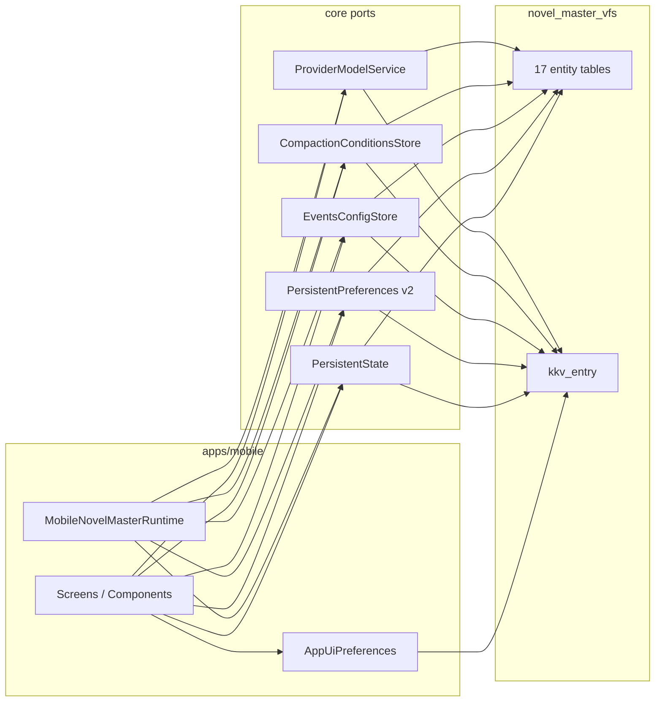
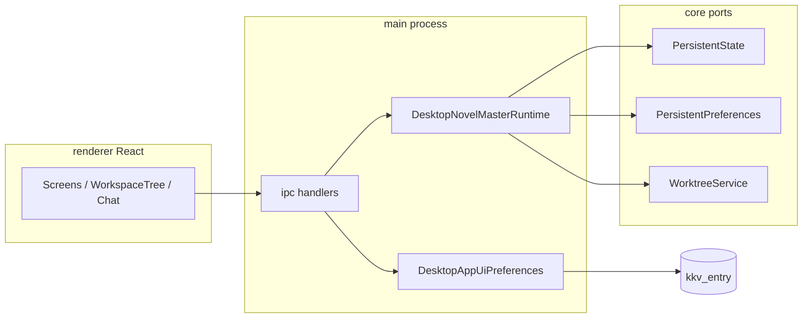
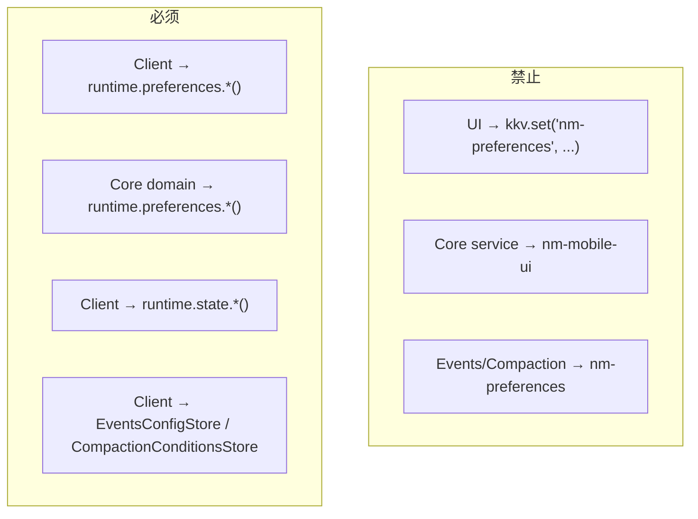
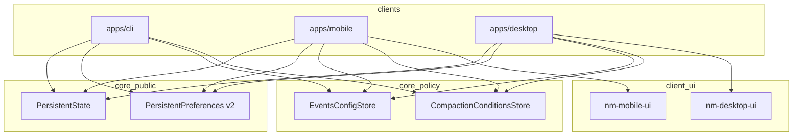

# Bootstrap 存储层对齐 技术规格（SPEC）

> **PRD**：[prd.md](./prd.md)  
> **调研基线**：`packages/core/src/bootstrap` + `apps/mobile` + `apps/desktop`（2026-06-06 代码复核）  
> **用户确认**：Preferences v2 上收（2026-06-06）；`external_uri` 保留预留；`checkpointRetention` 进 core 非 app KKV  
> **Core 抽取评审**：四层边界、v2 范围、port 契约、迁移规则见 PRD §Core 抽取原则；本节 §Core 抽取实现要点 为 SPEC 侧补充  

---

## 设计目标

1. **四层持久化模型**（取代「表 vs KKV vs app」模糊分界）：

  | 层               | 端口                                             | KKV module                       | 内容                                    |
  | --------------- | ---------------------------------------------- | -------------------------------- | ------------------------------------- |
  | **State**       | `PersistentState`                              | `nm-workspace-state`             | app 权威指针 + CLI 专用 `currentProviderId` |
  | **Preferences** | `PersistentPreferences` v2                     | `nm-preferences`                 | 跨端工作区**行为**配置                         |
  | **Policy**      | 专用 Store                                       | `nm-events` 等                    | JSON 策略文档                             |
  | **Client UI**   | `AppUiPreferences` / `DesktopAppUiPreferences` | `nm-mobile-ui` / `nm-desktop-ui` | 纯客户端呈现与回滚 flag                        |

2. **单一事实来源**：行为配置只存在于 `nm-preferences`；Client UI module 不得再存 LLM/SessionFs 语义。
3. **读写对称**：表列与 KKV key 无长期「只写不读」或「有 key 无消费者」。
4. **可渐进迁移**：bootstrap inline 迁移 Client UI 行为 key → `nm-preferences`；破坏性 DDL 走 pragma 探测。
5. **产品权威在 app**：Preferences v2 与 model/project/session 等指针以 mobile/desktop 为准；`currentProviderId` 为 CLI 专用，app 不 set。

---

## 客户端存储全景

### Mobile（`apps/mobile`）

Mobile **无独立 schema**；持久化 = core 表 + core KKV + `nm-mobile-ui` + 内存 Map。




### A. SQLite 表（经 core services，mobile 不直写 SQL）


| 域         | 表                                 | mobile 主要消费者                   |
| --------- | --------------------------------- | ------------------------------ |
| Chat      | `chat_project/session/message`    | ChatTab、ProjectDrawer、Agent 运行 |
| VFS       | `vfs_entry`                       | 三域文件管理器、fileEditor             |
| SessionFs | `session_*`                       | 回滚、文件保存 execute                |
| Worktree  | `worktree_*`                      | VFS 行规则 Sheet                  |
| Provider  | `llm_provider`, `llm_saved_model` | Providers、ModelPicker、Sampling |
| Agent     | `agent_definition`                | Agent 管理/编辑/运行                 |
| Regex     | `regex_group/rule`                | 正则栈                            |
| SKSP      | `sksp_secrets`                    | Provider API Key               |


### B. Core KKV（mobile 经 runtime 端口）


| Module                     | Key(s)                            | mobile 读写                                            | 状态                 |
| -------------------------- | --------------------------------- | ---------------------------------------------------- | ------------------ |
| `nm-workspace-state`       | project/session/model/agent/regex | `mobile-scope`、Picker 屏                              | ✅                  |
| `nm-workspace-state`       | `currentProviderId`               | app **不 set**；delete provider 时 reset                | **WONTFIX CLI 专用** |
| `nm-preferences`           | v1: `session-fs.versionCheck`     | **零调用**                                              | ⚠️ → **v2 全面接入**   |
| `nm-preferences`           | v2: 见 §Preferences v2             | Profile、Workspace 读写 `checkpointRetention` 等 v2 key | **待实现**            |
| `nm-events`                | `config`                          | `EventsConfigScreen`                                 | ✅                  |
| `nm-compaction-conditions` | `policy`                          | `CompactionConditionsScreen`                         | ✅                  |
| `nm-model-suggestions`     | `{providerId}`                    | `FetchModelsSheet`                                   | ✅                  |
| `nm-model-retry`           | `policy`                          | agent/provider 内部                                    | ✅                  |


### C. `nm-mobile-ui`（当前 9 key → v2 后 5–6 key）


| Key                        | 现读写                        | v2 归属                              | 处置                                                 |
| -------------------------- | -------------------------- | ---------------------------------- | -------------------------------------------------- |
| `llmStream`                | Profile R/W、ChatComposer 读 | → `chat.llmStream`                 | **迁入 preferences**                                 |
| `showFullToolParams`       | ChatTab 只读                 | → `chat.showFullToolParams`        | **迁入 + Profile 写**                                 |
| `checkpointRetention`      | 无消费者                       | → `session-fs.checkpointRetention` | **迁入 + Profile/Workspace 写**；Core SessionFs FIFO 后续消费（当前仅设置项） |
| `chatRichText`             | Profile R/W、ChatTab 读      | 暂留 app                             | **P2**；CLI 无富文本则不上收                                |
| `theme`                    | ThemeProvider R/W          | 留 app                              | ✅                                                  |
| `app.lastRunVersion`       | version-guard R/W          | 留 app                              | ✅                                                  |
| `app.richRenderEpoch`      | version-guard R/W          | 留 app                              | ✅                                                  |
| `chatTranscriptEngine`     | ChatTab 只读                 | 留 app                              | 回滚 flag                                            |
| `vfsMarkdownPreviewEngine` | VFS 预览只读                   | 留 app                              | 回滚 flag                                            |


### D. 内存（非 KKV）

`chat-composer-draft.ts`、scroll/view cache — 会话级临时态，不落库。

### Desktop（`apps/desktop`，Mix worktree 完整实现）

Desktop **无独立 schema**；主进程 `createDesktopNovelMasterRuntime` + IPC 暴露 core 能力；Renderer 不直连 SQLite。




**关键文件**（Mix worktree）：


| 路径                                                     | 职责                                                    |
| ------------------------------------------------------ | ----------------------------------------------------- |
| `src/main/runtime/create-desktop-runtime.ts`           | 与 mobile 同构的 core wiring                              |
| `src/main/storage/app-ui-prefs.ts`                     | `nm-desktop-ui`（`theme`, `llmStream`, `chatRichText`） |
| `src/main/ipc/handlers/preferences.ts`                 | `session-fs.versionCheck` IPC ✅                       |
| `src/main/ipc/handlers/app-ui.ts`                      | Client UI get/set                                     |
| `renderer/features/settings/WorkspaceSettingsView.tsx` | 工作区默认 + 聊天偏好 + versionCheck                           |
| `renderer/features/chat/ChatComposer.tsx`              | 读 `llmStream` via `ipcAppUiGet`                       |
| `renderer/features/workspace/WorkspaceTree.tsx`        | worktree + VFS explorer                               |


#### Desktop Core KKV 接入


| Module                                     | Key(s)                            | desktop 读写                   | 状态                 |
| ------------------------------------------ | --------------------------------- | ---------------------------- | ------------------ |
| `nm-workspace-state`                       | project/session/model/agent/regex | scope IPC、Workspace Picker   | ✅                  |
| `nm-workspace-state`                       | `currentProviderId`               | app **不 set**；delete 时 reset | **WONTFIX CLI 专用** |
| `nm-preferences`                           | `session-fs.versionCheck`         | `WorkspaceSettingsView`      | ✅ **领先 mobile**    |
| `nm-preferences`                           | v2 keys                           | 待 IPC 扩展                     | **待实现**            |
| `nm-events` / `nm-compaction-conditions` 等 | —                                 | Settings 栈 IPC               | ✅                  |
| `nm-desktop-ui`                            | 见下表                               | ThemeProvider、Workspace、Chat | 见 v2               |


#### `nm-desktop-ui`（当前 3 key → v2 后 1–2 key）


| Key                                          | 现读写                                  | v2 归属              | 处置                                                                        |
| -------------------------------------------- | ------------------------------------ | ------------------ | ------------------------------------------------------------------------- |
| `llmStream`                                  | WorkspaceSettings R/W、ChatComposer 读 | → `chat.llmStream` | **迁入 preferences**                                                        |
| `chatRichText`                               | Workspace + ConversationPanel        | 暂留 app             | **P2**                                                                    |
| `theme`                                      | ThemeProvider R/W                    | 留 app              | ✅                                                                         |
| `showFullToolParams` / `checkpointRetention` | **无**                                | → preferences      | v2 新增设置项；`checkpointRetention` 仅 Profile/Workspace 偏好（Core FIFO 后续） |


#### Mobile vs Desktop 对照（Preferences v2 前）


| 能力                           | Mobile                | Desktop                   |
| ---------------------------- | --------------------- | ------------------------- |
| Runtime                      | in-process React      | Electron main + IPC       |
| Client UI module             | `nm-mobile-ui`（9 key） | `nm-desktop-ui`（3 key）    |
| `llmStream` 存储               | ❌ app KKV             | ❌ app KKV                 |
| `session-fs.versionCheck`    | ❌ 未接 UI               | ✅ Workspace 设置            |
| `showFullToolParams`         | 半实现（只读）               | 未实现                       |
| `checkpointRetention`        | 半实现（无消费者）             | 未实现                       |
| Worktree UI                  | VFS 行 Sheet           | Explorer 树 + IPC worktree |
| Provider `currentProviderId` | app 不 set             | CLI `nm provider use`     |


---

## 工作区指针：app 以 model 为权威（定案 2026-06-06）

与 PRD §工作区指针 一致；实现约束如下。


| 指针                  | mobile / desktop                                | CLI                                          |
| ------------------- | ----------------------------------------------- | -------------------------------------------- |
| `currentModelId`    | Model Picker `**setCurrentModelId`** — **产品权威** | `nm model use`                               |
| `currentProviderId` | **不调用 `setCurrentProviderId`**                  | `nm provider use` + `resolve-provider-scope` |
| 其余 `current*`       | 正常读写                                            | 正常读写                                         |


**App 删除 provider 时**：保留现有 `resetCurrentProviderId` + 按 provider 前缀 `resetCurrentModelId`（清理数据一致性），**不**视为「补齐 provider 指针 SET」。

**Core port**：`PersistentState` 保留 `currentProviderId` API 供 CLI；在 `persistent-state.port.ts` JSDoc 标注 **CLI-scoped**（本迭代文档 + 可选注释，非 breaking）。

**非目标**：CLI 从 `currentModelId` 自动推导 provider（可后续优化 CLI，不要求 app 写 provider 指针）。

---

### 定案（用户确认 2026-06-06）

Mobile + Desktop 产品已验证；**行为类配置沉淀到 core**，填满 `PersistentPreferences`。

**不上收到 core 的判据**：仅影响单端渲染皮肤、安装升级、功能回滚 flag → 留各 Client UI module。

### `nm-preferences` key 映射


| 新 key（权威）                        | 类型         | 默认      | 原 Client UI key                                | 说明                |
| -------------------------------- | ---------- | ------- | ---------------------------------------------- | ----------------- |
| `session-fs.versionCheck`        | boolean    | `true`  | —                                              | v1 已有；desktop 已接  |
| `chat.llmStream`                 | boolean    | `true`  | `nm-mobile-ui` / `nm-desktop-ui` → `llmStream` | Agent/LLM SSE     |
| `chat.showFullToolParams`        | boolean    | `false` | `nm-mobile-ui` → `showFullToolParams`          | 工具卡/日志            |
| `session-fs.checkpointRetention` | int string | `"100"` | `nm-mobile-ui` → `checkpointRetention`         | SessionFs FIFO 上限 |


**命名规则**：`<域>.<camelCase>`，与 `session-fs.versionCheck` 一致。

### `PersistentPreferences` v2 接口（扩展）

在 `persistent-preferences.port.ts` 增加显式方法（禁止 UI 层裸用 `setPreference` 写上述 key，CLI 除外）：

```typescript
export interface PersistentPreferences {
  // --- v1 ---
  getSessionFsVersionCheck(): Promise<boolean>;
  setSessionFsVersionCheck(enabled: boolean): Promise<void>;
  resetSessionFsVersionCheck(): Promise<void>;

  // --- v2: chat ---
  getLlmStreamEnabled(): Promise<boolean>;
  setLlmStreamEnabled(enabled: boolean): Promise<void>;
  resetLlmStreamEnabled(): Promise<void>;

  getShowFullToolParams(): Promise<boolean>;
  setShowFullToolParams(enabled: boolean): Promise<void>;
  resetShowFullToolParams(): Promise<void>;

  // --- v2: session-fs ---
  /** Positive integer; default 100 when unset. @throws PreferencesError INVALID_VALUE */
  getCheckpointRetention(): Promise<number>;
  setCheckpointRetention(count: number): Promise<void>;
  resetCheckpointRetention(): Promise<void>;

  list(): Promise<ReadonlyArray<{ key: string; value: string }>>;
  getPreference(key: string): Promise<string | undefined>;
  setPreference(key: string, value: string): Promise<void>;
}
```

实现：`DefaultPersistentPreferences` + 现有 `formatBoolean` / `parseBoolean`；retention 用 `parseInt` 校验 `1..9999`（与 mobile UI 范围一致）。

### Bootstrap 迁移：`migrateClientUiBehaviorPrefsToPreferences`

在 `novel-master-bootstrap.ts` 事务内、`seedBuiltinProviders` 之前调用（详见 §Core 抽取实现要点 §4）：

```
FOR EACH (fromModule, fromKey, toKey) IN CLIENT_UI_BEHAVIOR_PREF_MIGRATIONS:
  IF kkv.get(fromModule, fromKey) EXISTS AND kkv.get('nm-preferences', toKey) NOT_EXISTS:
    kkv.set('nm-preferences', toKey, copiedValue)
  IF kkv.get(fromModule, fromKey) EXISTS:
    kkv.delete(fromModule, fromKey)  // 幂等；无 old key 则跳过
```


| fromModule      | fromKey               | to (`nm-preferences`)            |
| --------------- | --------------------- | -------------------------------- |
| `nm-mobile-ui`  | `llmStream`           | `chat.llmStream`                 |
| `nm-mobile-ui`  | `showFullToolParams`  | `chat.showFullToolParams`        |
| `nm-mobile-ui`  | `checkpointRetention` | `session-fs.checkpointRetention` |
| `nm-desktop-ui` | `llmStream`           | `chat.llmStream`                 |
| `nm-desktop-ui` | `showFullToolParams`  | `chat.showFullToolParams`        |
| `nm-desktop-ui` | `checkpointRetention` | `session-fs.checkpointRetention` |


**不迁移**：各 module 的 `theme`、`chatRichText`、mobile 版本/引擎 key。

> 同一 `toKey` 多源：若 mobile 与 desktop 旧 key 同时存在且 new 不存在，**先 copy 任一非空值**（实现顺序 deterministic：先 mobile 后 desktop）；冲突时仍以 **new 已存在则不覆盖** 为准。

### Mobile 改动清单


| 文件                                   | 变更                                                            |
| ------------------------------------ | ------------------------------------------------------------- |
| `ProfileTabScreen.tsx`               | 流式 / 完整工具参数 / 检查点条数 → `runtime.preferences`                   |
| `ChatComposer.tsx`                   | `preferences.getLlmStreamEnabled()`                           |
| `ChatTabScreen.tsx`                  | `showFullToolParams` → `preferences`；`chatRichText` 仍 `appUi` |
| Profile / Workspace 设置                    | `getCheckpointRetention()` / `setCheckpointRetention()` 读写    |
| `storage/llm-stream-pref.ts` 等       | **删除**                                                        |
| `app-ui-keys.ts` / `app-ui-prefs.ts` | 移除已迁 key                                                      |


### Desktop 改动清单


| 文件                                                     | 变更                                                                    |
| ------------------------------------------------------ | --------------------------------------------------------------------- |
| `shared/ipc-types.ts`                                  | 新增 `preferences/getLlmStream` 等 channel（或泛化 get/set v2 key）           |
| `src/main/ipc/handlers/preferences.ts`                 | 扩展 v2 typed handlers（与现有 versionCheck 并列）                             |
| `renderer/features/settings/WorkspaceSettingsView.tsx` | 流式 / versionCheck 改读 preferences IPC；可选加 retention、showFullToolParams |
| `renderer/features/chat/ChatComposer.tsx`              | 流式改 `ipcPreferences`*，不再 `ipcAppUiGet("llmStream")`                   |
| `renderer/features/chat/ConversationPanel.tsx`         | `showFullToolParams` 若新增则走 preferences                                |
| `src/main/storage/app-ui-prefs.ts`                     | 移除 `DESKTOP_UI_KEY_LLM_STREAM` 等已迁常量                                  |
| `src/main/ipc/handlers/providers.ts`                   | **P0** provider 选用时 `setCurrentProviderId`（与 mobile 同修）               |


### CLI 改动清单

扩展 `apps/cli/src/preferences-cmd/commands.ts`：

```text
nm preferences get chat.llmStream
nm preferences set chat.llmStream true|false
nm preferences reset chat.llmStream

nm preferences get chat.showFullToolParams
nm preferences set session-fs.checkpointRetention 100
...
```

`list` 输出全部 `nm-preferences` 条目（已有行为不变）。

### Core FIFO 后续衔接

Core 实现 SessionFs checkpoint FIFO 时：

- 读 `preferences.getCheckpointRetention()`（或内聚注入 `CompactionConditions`/SessionFs 配置对象）；
- **不**再读 Client UI module；
- Profile/Workspace 设置与 Core 淘汰逻辑共用同一 key（无独立会话日志 UI）。

---

## Core 抽取实现要点（评审补充 2026-06-06）

与 PRD §Core 抽取原则 对应；本节只约束 **packages/core** 及 bootstrap，不展开各客户端 wiring。

### 1. 端口边界（禁止混层）




| 反模式                                        | 处置                                            |
| ------------------------------------------ | --------------------------------------------- |
| UI 裸写 v2 key                               | ESLint/评审拒绝；仅 CLI commands 可调 `setPreference` |
| Core 读 Client UI 行为 key                    | v2 后 grep 清零                                  |
| 把 `nm-events` 等 policy JSON 并入 preferences | **WONTFIX**；Policy Store 独立                   |


### 2. `PersistentPreferences` 实现结构（建议）

```
packages/core/src/service/persistent-preferences/
  persistent-preferences.port.ts          # v2 显式方法 + JSDoc 默认值
  impl/persistent-preferences.service.ts  # DefaultPersistentPreferences
  impl/preference-keys.ts                 # 新增：chat.llmStream 等常量，单点定义
  impl/preference-value-codec.ts          # 可选：boolean / positive-int 编解码，供 impl + CLI 共用
```

- **Key 常量集中**：`preference-keys.ts` 导出 `PREF_KEY_CHAT_LLM_STREAM` 等，bootstrap 迁移表、CLI、`list()` 共用，避免字符串漂移。
- **错误模型**：非法 retention（非整数、≤0、>9999）抛 `PreferencesError` / `INVALID_VALUE`；boolean 仅接受 `formatBoolean` 可解析值。
- `**list()` 行为不变**：仍列出 DB 中已持久化条目；未写入的默认值 **不必**  synthetic 进 list（与 v1 `session-fs.versionCheck` 一致）。

### 3. 不上收项的实现约定


| 项                                     | core 侧要求                                                       |
| ------------------------------------- | -------------------------------------------------------------- |
| `chatRichText`                        | core **无** port；P2 前不新增 key                                    |
| `theme` / 版本 guard / 引擎 flag          | core **不** 引用；bootstrap **不** 迁移                               |
| `tokenCounter.mode`（`nm-preferences`） | P0 **删公开读路径**（`read-token-counter-mode-pref.ts` 等）；与 v2 **无关** |
| `tokenCounterMode`（saved model）       | 保持 `ProviderModelService` / 表字段；**不** 迁入 preferences           |


### 4. Bootstrap 迁移：泛化 Client UI 源

函数建议命名 `**migrateClientUiBehaviorPrefsToPreferences`**（取代仅含 mobile 字样的命名），职责不变：

```typescript
/** 语义 oldKey → newKey；fromModule 允许多行（历史 Client UI 命名空间） */
type ClientUiPrefMigration = {
  fromModule: string;
  fromKey: string;
  toKey: string;
};

const CLIENT_UI_BEHAVIOR_PREF_MIGRATIONS: ClientUiPrefMigration[] = [
  { fromModule: "nm-mobile-ui", fromKey: "llmStream", toKey: "chat.llmStream" },
  { fromModule: "nm-mobile-ui", fromKey: "showFullToolParams", toKey: "chat.showFullToolParams" },
  { fromModule: "nm-mobile-ui", fromKey: "checkpointRetention", toKey: "session-fs.checkpointRetention" },
  { fromModule: "nm-desktop-ui", fromKey: "llmStream", toKey: "chat.llmStream" },
  { fromModule: "nm-desktop-ui", fromKey: "showFullToolParams", toKey: "chat.showFullToolParams" },
  { fromModule: "nm-desktop-ui", fromKey: "checkpointRetention", toKey: "session-fs.checkpointRetention" },
];
```

**算法**（与 PRD 一致）：

1. 对每个 `(fromModule, fromKey, toKey)`：若 `from` 有值且 `nm-preferences`/`toKey` **无**值 → copy。
2. 若 `from` 有值 → **delete** `(fromModule, fromKey)`（即使未 copy，避免残留；new 已存在则不覆盖 new）。
3. 事务内执行；单测覆盖：old-only、new-only、both（new 赢）、无 old key。

文件：`bootstrap/preferences/migrate-client-ui-behavior-prefs.ts`（或等价路径）。

### 5. Core 单测补充（Phase 2）


| ID  | 场景                                                         |
| --- | ---------------------------------------------------------- |
| C1  | 各 v2 getter 缺 key 时返回 PRD 默认                               |
| C2  | retention 边界：`1`、`9999` OK；`0`、`10000`、非数字 → INVALID_VALUE |
| C3  | reset* 删除 key 后 getter 回默认                                 |
| C4  | bootstrap 迁移：old-only → new 有值 + old 删                     |
| C5  | bootstrap 迁移：new 已存在 → old 仍删、new 不变                       |
| C6  | 迁移后 `list()` 含新 key（若曾 copy）                               |


### 6. 明确不做的 core 抽取

- **不** 合并 `nm-events` / `nm-compaction-conditions` 进 preferences。
- **不** 把 `current`* 指针迁入 preferences（仍在 `PersistentState`）。
- **不** 要求 app 调用 `setCurrentProviderId`（CLI 专用指针）。
- **不** 为 Client UI 建 core 侧统一 module 名或共享 npm package。
- **不** 在 v2 实现 SessionFs FIFO 算法（仅定 storage + port；FIFO 后续读 `getCheckpointRetention()`）。

### 7. Phase 2 core 交付物检查清单

- `persistent-preferences.port.ts` v2 方法 + JSDoc
- `DefaultPersistentPreferences` 实现 + C1–C3
- `preference-keys.ts`（或等价）单点 key 常量
- `migrateClientUiBehaviorPrefsToPreferences` + C4–C5
- `novel-master-bootstrap.ts` 挂接迁移
- grep：Client UI module 行为 key 在 **core** 内仅出现在 migration 表；**apps/mobile** 与 **apps/desktop** 不再读写已迁 key

---

## 差距矩阵（结构修复，与 v2 正交）

### 表字段


| 表.字段                                      | 处置                          |
| ----------------------------------------- | --------------------------- |
| `vfs_entry.external_uri` / `storage_kind` | **WONTFIX 预留**              |
| `agent_definition.model` / `runtime_json` | **P0** 删列或停写                |
| `chat_message.hidden`                     | **P0** ADD COLUMN migration |
| `worktree_dir_rule.fill_policy='full'`    | **P1** 默认改 `hidden` + 回填    |


### KKV / 端口（v2 未覆盖项）


| 项                             | 处置                            |
| ----------------------------- | ----------------------------- |
| `currentProviderId` app 不 set | **WONTFIX** — CLI 专用；见 §工作区指针 |
| `tokenCounter.mode`           | **P0** 删公开读路径                 |
| `global-config.`*             | **P2** 可选 purge               |
| `runtime.preferences` 悬空      | **由 Preferences v2 解决**       |
| `createKkvService` 公开导出       | **P1** 收敛                     |


---

## 目标架构（v2 落地后）




---

## 最终项目结构

```
packages/core/src/
  bootstrap/
    novel-master-bootstrap.ts                        # + migrateClientUiBehaviorPrefsToPreferences
    preferences/migrate-client-ui-behavior-prefs.ts  # 新增
    chat/migrate-chat-message-hidden.ts
  service/persistent-preferences/
    persistent-preferences.port.ts         # v2 API
    impl/persistent-preferences.service.ts
  domain/agent/...                         # 冗余列清理

apps/cli/src/preferences-cmd/commands.ts   # v2 keys

apps/mobile/src/
  screens/tabs/ProfileTabScreen.tsx
  screens/stack/ProvidersScreen.tsx
  components/chat/ChatComposer.tsx
  storage/app-ui-keys.ts

apps/desktop/src/main/
  ipc/handlers/preferences.ts           # v2 IPC
  storage/app-ui-prefs.ts                 # 瘦身
  ipc/handlers/providers.ts               # 保持 delete 时 reset；不增 set
apps/desktop/renderer/
  features/settings/WorkspaceSettingsView.tsx
  features/chat/ChatComposer.tsx
apps/desktop/shared/ipc-types.ts
```

---

## 详细实现步骤

### Phase 0 — 文档（已完成）

- 差距矩阵 + 客户端存储全景 + Preferences v2
- 用户确认 v2 方向

### Phase 1 — P0 结构（分支 `fix/storage-schema-alignment-p0`）

1. `agent_definition` 冗余列
2. `chat_message.hidden` migration
3. `tokenCounter.mode` 死路径清理
4. （文档）`persistent-state.port.ts` 标注 `currentProviderId` CLI-scoped

---

## Spec 完善度审计（2026-06-06 代码复核）

`git pull` 后 desktop 已在 `**apps/desktop**`（完整 Electron + IPC + React）。下列为复核结论。

### 与代码一致 ✅


| 项                                    | 证据                                              |
| ------------------------------------ | ----------------------------------------------- |
| mobile `nm-mobile-ui` 9 key          | `apps/mobile/src/storage/app-ui-keys.ts`        |
| desktop `nm-desktop-ui` 3 key        | `apps/desktop/src/main/storage/app-ui-prefs.ts` |
| 行为 key 应在 preferences                | 两端均用 appUi 存 `llmStream`                        |
| desktop 已接 `session-fs.versionCheck` | `WorkspaceSettingsView` + `preferences.ts`      |
| mobile `preferences` 悬空              | runtime wiring 有，UI 零调用                         |
| core v2 未实现                          | `persistent-preferences.port.ts` 仍 v1           |


### spec 需修正 / 补充 ⚠️


| 缺口                               | 说明                                                                      | 建议                                                         |
| -------------------------------- | ----------------------------------------------------------------------- | ---------------------------------------------------------- |
| **`checkpointRetention` 消费者**     | 无独立会话日志 UI；desktop 已移除未使用的 `listBatches` IPC | **Profile/Workspace 偏好 only**；Core FIFO 后续读同一 key |
| `**currentProviderId`**          | 已定案 app 不 set                                                           | **WONTFIX**；非缺口                                            |
| **desktop 布局**                   | `useColumnSplitters` 不持久化                                               | 不纳入 v2                                                     |
| **desktop `fillPolicy: 'full'`** | `ipc-types.ts` DTO 仍含 `'full'`                                          | 并入 P1 worktree 回填                                          |
| **typed preferences IPC**        | desktop 仍 `ipcAppUiGet(string)`                                         | v2 增 `preferences/*` typed channels                        |


### 结论

**架构与 v2 范围可实施**。`checkpointRetention` 先供 Profile/Workspace 设置；Core FIFO 不阻塞 v2。

### Phase 2 — Preferences v2（分支 `feature/preferences-v2`，可紧接 Phase 1）

1. **Core**：扩展 port + impl + 单测（defaults、INVALID_VALUE、round-trip）
2. **Bootstrap**：`migrateClientUiBehaviorPrefsToPreferences` + 单测（old-only、new-only、both 冲突以 new 为准）
3. **CLI**：`preferences` 子命令扩展 + e2e
4. **Mobile**：Profile / Chat 改 preferences（`showFullToolParams` 等）
5. **Desktop**：typed preferences IPC + WorkspaceSettings + ChatComposer
6. **（后续）** Core SessionFs FIFO 读 `getCheckpointRetention()` — 非 v2 阻塞项
7. **文档**：`persistent-state-and-preferences/spec.md` 注记 v2

### Phase 3 — P1/P2 技术债

1. `vfs_entry.entry_kind` migration
2. `fill_policy` 默认 + 回填
3. bootstrap JSDoc 更新
4. mobile 暴露 `session-fs.versionCheck`（**desktop 已有**，mobile 对齐 Workspace 设置）
5. `chatRichText` 是否上收（视 CLI 需求）
6. `KkvService` 导出收敛
7. `global-config` purge、legacy chat 代码等

---

## 测试策略


| ID  | 场景                                                        |
| --- | --------------------------------------------------------- |
| T1  | agent 冗余列                                                 |
| T2  | `hidden` migration                                        |
| T3  | app 选 model 仅写 `currentModelId`（无 `setCurrentProviderId`） |
| T4  | **v2** preferences defaults + set/get/reset               |
| T5  | **v2** bootstrap 从 Client UI module 迁移 + 旧 key 删除         |
| T6  | **v2** CLI `nm preferences` 新 key                         |
| T7  | mobile/desktop Profile/Workspace retention 读写           |
| T7b | desktop Workspace 流式 → preferences IPC                    |
| T8  | 迁移后 `nm-mobile-ui` / `nm-desktop-ui` 无已迁行为 key            |
| T9  | `tokenCounter.mode` 无公开路径                                 |
| T10 | `npm run build`                                           |


---

## 风险与回滚


| 风险                          | 缓解                             |
| --------------------------- | ------------------------------ |
| 迁移覆盖用户已设 Client UI 行为 key   | 仅当 new key 不存在时复制；迁移后删 old key |
| mobile / CLI 不同 DB 文件       | 语义对齐即可，不强制值相同                  |
| Core FIFO 晚于 v2             | retention 先供 UI；Core 后续读同一 key |
| 删 `llm-stream-pref.ts` 遗漏引用 | grep + 测试                      |


回滚 v2：恢复 appUi 读写 + 停止 bootstrap 删 old key（需 revert commit）。

---

## 附录：KKV module 清单（v2 目标态）

### Core

- `nm-workspace-state` — app 指针（project/session/model/agent/regex）+ CLI 可选 `currentProviderId`
- `nm-preferences` — versionCheck + **chat.llmStream + chat.showFullToolParams + session-fs.checkpointRetention**
- `nm-events`, `nm-compaction-conditions`, `nm-model-retry`, `nm-model-suggestions`

### Mobile-only（瘦身后）

- `nm-mobile-ui` — `theme`, `chatRichText`（P2）, 版本 guard, 引擎回滚 flag

### Desktop-only（瘦身后）

- `nm-desktop-ui` — `theme`, `chatRichText`（P2）

### 已废弃（v2 后从 Client UI module 删除）

- `llmStream`, `showFullToolParams`, `checkpointRetention` on `**nm-mobile-ui` 与 `nm-desktop-ui`**

### 历史已废弃

- `global-config`, `nm-model-sampling`, `llm_model_suggestion` 表, `default_model_id` 列

