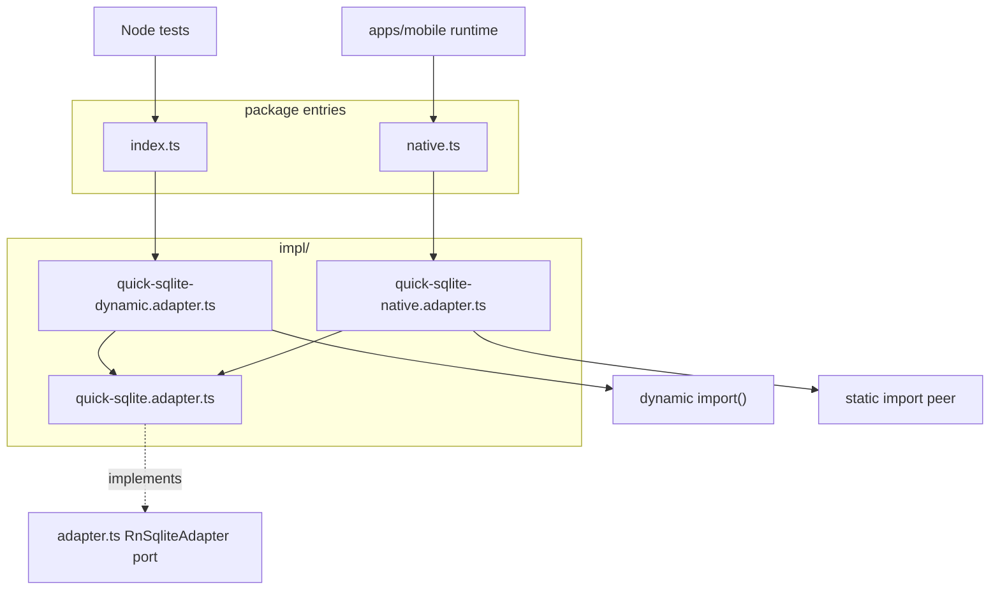

# tdbc-driver-rn `/native` 入口 技术规格（SPEC）

## 设计目标

- 新增 **`@novel-master/tdbc-driver-rn/native`** 子路径，供 RN App / Metro **静态** 绑定 `react-native-quick-sqlite`。
- **删除** `apps/mobile/src/vfs/device-sqlite-adapter.ts`，消除与 driver 包重复的 adapter 实现。
- **主入口** `@novel-master/tdbc-driver-rn` 行为不变：`registerRnDriver()` 默认仍用 **动态 import** 的 `QuickSqliteAdapter`；Node conformance 测试 **不** 加载 native 子路径。
- 与 **`@novel-master/core` VFS 分层一致**：**port**（`RnSqliteAdapter`）+ **`impl/`** 实现；共享一份 quick-sqlite 核心 impl，避免多处漂移。

---

## 现状与约束（代码探索）

| 项 | 现状 | 影响 |
|----|------|------|
| `adapter.ts` | 已定义 **`RnSqliteAdapter` port** + `QuickSqliteResult` | **保留为 port**；不新增第二层 port |
| `apps/mobile/.../device-sqlite-adapter.ts` | 静态 import，实现 `RnSqliteAdapter` | **待删除** |
| `quick-sqlite-adapter.ts`（根下） | 动态 `import()` | **迁入** `impl/quick-sqlite-dynamic.adapter.ts` |
| `index.ts` / `native.ts` | 注册入口 | 分别从 impl 选用 dynamic / native 默认 adapter |
| Node 测试 | `MockRnSqliteAdapter` 在 `test/` | **不** import `impl/quick-sqlite-native.adapter.ts` 或 `native.ts` |
| Metro | 消费 `dist/native.js` | native impl 内静态 import quick-sqlite |

---

## 总体方案

### 分层（port + impl，对齐 core）

```text
adapter.ts                          # port: RnSqliteAdapter, QuickSqliteResult
impl/
  quick-sqlite.adapter.ts           # 共享核心 impl（bindings 注入，不 import peer）
  quick-sqlite-dynamic.adapter.ts   # QuickSqliteAdapter — 动态 load bindings
  quick-sqlite-native.adapter.ts    # NativeQuickSqliteAdapter — 静态 import peer
driver.ts / connection.ts           # TDBC 驱动（不变）
```

**依赖规则（与 core VFS 同族）：**

- `adapter.ts`（port）**不** import `impl/`。
- `impl/*` 依赖 `adapter.ts` port；**不** export 给 package 主入口以外的深层路径（除 `native.ts`  re-export `NativeQuickSqliteAdapter`）。
- `index.ts` / `native.ts` 为 **组装点**（注册 driver + 默认 adapter）。

### 双入口架构



### 文件职责

#### `impl/quick-sqlite.adapter.ts`（共享核心）

- 导出 **`QuickSqliteBindings`** 类型：`{ open, QuickSQLite }`（构造参数，**非** port）。
- 导出 **`QuickSqliteAdapter`** 类（或命名 **`DefaultQuickSqliteAdapter`**，SPEC 定稿用 **`QuickSqliteAdapter`** 作为核心类名会与 dynamic 导出类名冲突——见下）。

**命名定稿（避免 QuickSqliteAdapter 重名）：**

| 文件 | 导出类 | 说明 |
|------|--------|------|
| `impl/quick-sqlite.adapter.ts` | **`BaseQuickSqliteAdapter`** | 共享 open/close/execute |
| `impl/quick-sqlite-dynamic.adapter.ts` | **`QuickSqliteAdapter`** | 对外 API 不变；动态 import 后 `new BaseQuickSqliteAdapter(bindings)` |
| `impl/quick-sqlite-native.adapter.ts` | **`NativeQuickSqliteAdapter`** | `extends BaseQuickSqliteAdapter`，构造传入静态 bindings |

`BaseQuickSqliteAdapter` **不 export** 自 `index.ts`（仅 impl 内部）；主入口仍 export `QuickSqliteAdapter` 类名。

#### `impl/quick-sqlite-dynamic.adapter.ts`

- 从原 `quick-sqlite-adapter.ts` 迁入。
- `loadQuickSqlite()` 动态 `import()`；`open()` 时 lazy 创建 `BaseQuickSqliteAdapter` 并委托。

#### `impl/quick-sqlite-native.adapter.ts`

```typescript
import { open, QuickSQLite } from "react-native-quick-sqlite";
import { BaseQuickSqliteAdapter } from "./quick-sqlite.adapter.js";

/** Metro-safe; static peer import. */
export class NativeQuickSqliteAdapter extends BaseQuickSqliteAdapter {
  constructor() {
    super({ open, QuickSQLite });
  }
}
```

#### `native.ts`

```typescript
import { registerDriver } from "@novel-master/core";
import { RnDriver } from "./driver.js";
import { NativeQuickSqliteAdapter } from "./impl/quick-sqlite-native.adapter.js";
import type { RnSqliteAdapter } from "./adapter.js";

export type { RnSqliteAdapter, QuickSqliteResult } from "./adapter.js";
export { RN_DRIVER_NAME } from "./driver.js";
export { NativeQuickSqliteAdapter } from "./impl/quick-sqlite-native.adapter.js";

export function registerRnDriver(adapter?: RnSqliteAdapter): void {
  registerDriver(new RnDriver(adapter ?? new NativeQuickSqliteAdapter()));
}
```

#### `index.ts`（改 import 路径）

```typescript
export { QuickSqliteAdapter } from "./impl/quick-sqlite-dynamic.adapter.js";
// registerRnDriver 默认 new QuickSqliteAdapter() — 行为不变
```

**删除** 根目录 `src/quick-sqlite-adapter.ts`（逻辑已迁入 `impl/`）。

### `registerRnDriver` 默认行为

| 导入自 | 无参默认 adapter |
|--------|------------------|
| `@novel-master/tdbc-driver-rn` | `QuickSqliteAdapter`（dynamic impl） |
| `@novel-master/tdbc-driver-rn/native` | `NativeQuickSqliteAdapter`（native impl） |

---

## 最终项目结构

```text
packages/tdbc-driver-rn/
  package.json
  README.md
  src/
    adapter.ts                      # port（不变）
    index.ts                        # 主入口；export QuickSqliteAdapter from impl
    native.ts                       # 【新增】子路径入口
    driver.ts
    connection.ts
    row-mapper.ts
    impl/
      quick-sqlite.adapter.ts       # 【新增】BaseQuickSqliteAdapter + bindings 类型
      quick-sqlite-dynamic.adapter.ts   # 【迁入】QuickSqliteAdapter
      quick-sqlite-native.adapter.ts    # 【新增】NativeQuickSqliteAdapter
  dist/
    native.js
    impl/quick-sqlite.adapter.js
    impl/quick-sqlite-native.adapter.js
    ...

apps/mobile/
  src/vfs/runtime.ts                # from '…/native'
  （删除 device-sqlite-adapter.ts）
```

---

## 变更点清单

| 路径 | 操作 |
|------|------|
| `src/impl/quick-sqlite.adapter.ts` | **新增** |
| `src/impl/quick-sqlite-dynamic.adapter.ts` | **新增**（自原 `quick-sqlite-adapter.ts`） |
| `src/impl/quick-sqlite-native.adapter.ts` | **新增** |
| `src/quick-sqlite-adapter.ts` | **删除** |
| `src/native.ts` | **新增** |
| `src/index.ts` | **改** import 路径 |
| `package.json` | **改** `exports["./native"]` |
| `README.md` | **改** |
| `test/quick-sqlite.adapter.test.ts` | **可选新增**（测 `BaseQuickSqliteAdapter` + mock bindings） |
| `apps/mobile/src/vfs/runtime.ts` | **改** |
| `apps/mobile/src/vfs/device-sqlite-adapter.ts` | **删除** |
| `apps/mobile/README.md`、`.apm/kb/docs/monorepo.md` | **改** |

---

## 详细实现步骤

### 步骤 1：port + 共享 impl（M1）

1. 新增 `impl/quick-sqlite.adapter.ts`：`QuickSqliteBindings` + **`BaseQuickSqliteAdapter`** implements `RnSqliteAdapter`。
2. 逻辑从 `device-sqlite-adapter.ts` 原样提取（`location ?? 'default'`，execute 优先 `executeAsync`）。

### 步骤 2：dynamic impl（M1）

1. 新增 `impl/quick-sqlite-dynamic.adapter.ts`，迁入原 `QuickSqliteAdapter` 动态 import 行为。
2. 删除 `src/quick-sqlite-adapter.ts`。
3. 更新 `index.ts` export 路径。

### 步骤 3：native impl + 子路径（M1）

1. 新增 `impl/quick-sqlite-native.adapter.ts`、`native.ts`。
2. `package.json` 增加 `exports["./native"]`。
3. `npm run build -w @novel-master/tdbc-driver-rn`；确认 `dist/impl/quick-sqlite-native.adapter.js` 含静态 peer import。

### 步骤 4：Mobile（M2）

```typescript
import { registerRnDriver } from '@novel-master/tdbc-driver-rn/native';
registerRnDriver();
```

删除 `device-sqlite-adapter.ts`。

### 步骤 5：文档 + 验证（M3）

README / monorepo 说明 port + impl 布局与 `/native` 用法；跑测试与 Android 冒烟。

---

## 测试策略

### 自动化

| ID | 内容 | 期望 |
|----|------|------|
| T-N1 | `npm test -w @novel-master/tdbc-driver-rn` | 全绿 |
| T-N2 | `npm test`（根） | 全绿 |
| T-N3 | `npm run build -w @novel-master/tdbc-driver-rn` | `dist/native.js`、`dist/impl/*.js` 存在 |
| T-N4 | `test/quick-sqlite.adapter.test.ts`（推荐） | mock bindings 测 `BaseQuickSqliteAdapter` |

**禁止：** `test/**` import `native.ts` 或 `impl/quick-sqlite-native.adapter.ts`。

### 手工（Android）

M-B1–B3：与 PRD 相同（Write/Read/List/Glob/Replace/Delete）。

---

## 兼容性与迁移

- **对外 API 类名不变**：`QuickSqliteAdapter`、`NativeQuickSqliteAdapter`（新增）、`RnSqliteAdapter` port。
- **内部结构变**：根下 `quick-sqlite-adapter.ts` → `impl/`；无 consumer 应 deep-import impl 文件。

---

## 风险与回滚

| 风险 | 缓解 |
|------|------|
| Metro / exports 子路径 | 同前 SPEC；必要时 Metro alias |
| `BaseQuickSqliteAdapter` 与 device 行为漂移 | 从 device 文件提取；冒烟验证 |
| impl 目录被 Node 测试误拉 native | 测试只 import `index.ts` 与 mock |

**回滚：** revert 迭代；或恢复 mobile 侧 device adapter。

---

## 实现计划

| 序 | 任务 | 验收 |
|----|------|------|
| 1 | `impl/` 三文件 + 删旧 adapter | T-N1 |
| 2 | `native.ts` + exports + build | T-N3、A1 |
| 3 | mobile 切换 | C1 |
| 4 | 文档 + `quick-sqlite.adapter.test.ts` | T-N4、C3 |
| 5 | 真机冒烟 | M-B1–B3 |
