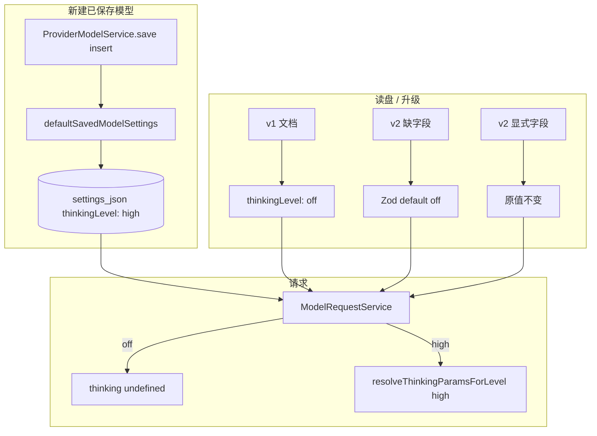

# 思考强度默认「高」（新模型）技术规格（SPEC）

> **PRD**：[prd.md](./prd.md)  
> **前置**：[thinking-level/spec.md](../thinking-level/spec.md)、[model-generation-params/spec.md](../model-generation-params/spec.md)  
> **建议分支**：`fix/thinking-default-high` 或 `feature/thinking-default-high`  
> **范围**：`packages/core/**`（主改动）；**不**改 Desktop/Mobile UI 源码（加载 persisted 即可）

## 设计目标

1. **新建路径默认高**：`ProviderModelService.save` / `create` 首次 `insert` 时 `thinkingLevel === "high"`。
2. **读盘/升级不变**：v1 映射、v2 缺字段 Zod default 仍为 `"off"`。
3. **最小 diff**：仅改 `defaultSavedModelSettings` 一处常量 + 测试契约；不触 preset、adapter、UI 控件。
4. **可验证**：单测覆盖新建默认、读盘缺字段仍为 off、off 请求不传 thinking。

---

## 现状与约束

| 路径 | 当前行为 | 本迭代 |
|------|----------|--------|
| `defaultSavedModelSettings()` | `thinkingLevel: "off"` | → `"high"` |
| `saved-model-settings.schema.ts` Zod `.default("off")` | 缺字段 → off | **不变** |
| v1 transform L101 | `thinkingLevel: "off"` | **不变** |
| `ProviderModelService.save` insert L199 | 用 `defaultSavedModelSettings` | 自动获得 high |
| `resetContextWindowToDefault` L387 | 只 patch `contextWindowTokens` | **不变**（不重置 thinking） |
| Desktop/Mobile 设置页 | `load()` 读 `generation.thinkingLevel` | **不变**（新模型 DB 已是 high） |
| UI `useState<ThinkingLevel>("off")` | 加载前占位 | **不变**（加载后覆盖） |

**新建模型唯一入口（已确认）**：

```199:199:packages/core/src/service/provider/impl/provider-model.service.ts
      settings: defaultSavedModelSettings(normalizedVendorModelId),
```

`resetContextWindowToDefault` 虽调用 `defaultSavedModelSettings`，但 `updateSettings` 仅传入 `contextWindowTokens`，**不会**把 thinking 改为 high（PRD 回归要求保持）。

---

## 总体方案



### 设计决策

| 项 | 选择 | 理由 |
|----|------|------|
| 改动点 | **仅** `default-saved-model-settings.ts` | PRD 单源；读盘 default 与新建 default 语义分离 |
| 不拆两个函数 | 不新增 `defaultThinkingLevelForNewModel()` | 过度抽象；`defaultSavedModelSettings` 本就只用于新建/seed |
| UI | 不改 | 已从 persisted settings 加载 |
| schema Zod default | 保持 `"off"` | 老 v2 缺字段、升级兼容 |
| 测试 | 更新依赖「新建=off」的用例，显式写 off | 避免误改语义 |

---

## 最终项目结构

```
packages/core/
  src/domain/provider/model/
    default-saved-model-settings.ts     # thinkingLevel: "off" → "high"
  test/provider/
    saved-model-settings.schema.test.ts # 写盘默认期望 → high
    model-request-thinking.test.ts      # off 用例显式 thinkingLevel: "off"
    provider-model.service.test.ts      # + 新建默认 thinkingLevel high
```

**不修改文件**（显式列出防误改）：

- `saved-model-settings.schema.ts`
- `thinking-level-presets.ts` / `resolve-thinking-wire.ts`
- `model-request.service.ts`
- `apps/desktop/**` / `apps/mobile/**`

---

## 变更点清单

### 1. `default-saved-model-settings.ts`

```typescript
generation: {
  sampling: { enabled: false },
  thinkingLevel: "high",  // 原 "off"
},
```

更新文件头注释：说明新建已保存模型默认「高」，读盘缺字段仍为 off。

### 2. 测试更新

| 文件 | 变更 |
|------|------|
| `saved-model-settings.schema.test.ts` | `写盘仅输出 v2`：L67 期望 `"high"`；可选重命名用例描述 |
| `model-request-thinking.test.ts` | `thinkingLevel 为 off 时不向 adapter 传 thinking`：settings 显式 `{ ...defaultSavedModelSettings(), generation: { sampling: { enabled: false }, thinkingLevel: "off" } }` |
| `provider-model.service.test.ts` | 新增 `new saved model defaults thinkingLevel to high`（mirror tokenCounterMode 测试 L132–137） |
| （可选）`model-request-thinking.test.ts` | 新增 `新建默认 settings 为 high 时传给 adapter` 用例 |

**保持不变**：

- `v1 文档读入后…thinkingLevel 默认关`
- `v2 缺 thinkingLevel 时默认为 off`
- dev-only `thinking.enabled` 映射

---

## 详细实现步骤

### 步骤 1 — Core 默认值

1. 修改 `default-saved-model-settings.ts` 中 `thinkingLevel` 为 `"high"`。
2. 补充中文模块/函数注释（新建 vs 读盘语义）。

### 步骤 2 — 测试契约

1. 更新 `saved-model-settings.schema.test.ts` 写盘断言。
2. 修复 `model-request-thinking.test.ts` off 用例（显式 off）。
3. 在 `provider-model.service.test.ts` 增加 create 默认 high 集成测试。
4. （推荐）增加 `model-request-thinking`：默认 settings 请求带 `reasoning_effort: "high"`（openai）。

### 步骤 3 — 验证

```powershell
cd packages/core
npm run build
node ..\..\node_modules\tsx\dist\cli.mjs --experimental-test-module-mocks --tsconfig tsconfig.test.json --test test/provider/saved-model-settings.schema.test.ts test/provider/model-request-thinking.test.ts test/provider/provider-model.service.test.ts
```

### 步骤 4 — 提交

- 中文 commit message，例如：`feat(core): 新建已保存模型默认思考强度为 high`

---

## 测试策略

### 测试用例

| ID | 场景 | 期望 |
|----|------|------|
| T1 | `defaultSavedModelSettings("gpt-4o")` | `thinkingLevel === "high"` |
| T2 | `savedModelSettingsToJson(defaults)` | JSON `generation.thinkingLevel === "high"` |
| T3 | v1 读入 | `thinkingLevel === "off"` |
| T4 | v2 缺 `thinkingLevel` | `thinkingLevel === "off"` |
| T5 | `providerModels.create(...)` | 返回 settings `thinkingLevel === "high"` |
| T6 | settings 显式 `off` → `ModelRequestService.request` | `thinking === undefined` |
| T7 | settings 默认（high）→ openai request | `thinking.openai.reasoning_effort === "high"` |
| T8 | `resetContextWindowToDefault` 后 | thinkingLevel **不变**（可加回归测或依赖现有 updateSettings 行为） |

### 手工验收（可选）

1. Desktop/Mobile：新建已保存模型 → 打开模型设置 → 显示「高」。
2. 已有老模型（off）→ 仍显示「关」。

---

## 兼容性与迁移

- **无 DB 迁移脚本**；已有 row 不更新。
- **升级用户**：v1 / 缺字段 v2 → 行为与改前一致（off）。
- **新用户**：首次 save 模型 → high。
- **与 thinking-level PRD 关系**：supersede「新建默认关」；读盘/升级「默认关」条款仍有效。

---

## 风险与回滚

| 风险 | 缓解 |
|------|------|
| 单测误用 `defaultSavedModelSettings` 假设 off | 步骤 2 显式梳理；off 场景写死 `thinkingLevel: "off"` |
| 新用户 token 成本上升 | PRD 已接受；用户可改关 |
| 非 reasoning 模型无效 | 与手动选 high 相同；不在本迭代修 |
| `dist/` 未 rebuild | CI/本地 build core 后再跑 apps 测试 |

**回滚**：revert 单文件 `default-saved-model-settings.ts` + 测试；无 schema 变更。

---

## 不在本 spec 内

- Anthropic budget 钳制 bug
- 模型能力检测 UI
- 「恢复默认」按钮重置 thinking
- 批量迁移已有模型为 high
