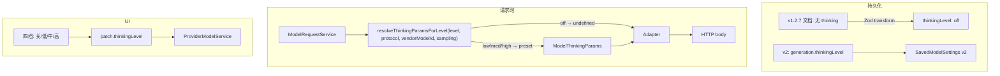

# 思考强度档位（关 / 低 / 中 / 高）技术规格（SPEC）

> **PRD**：[prd.md](./prd.md)  
> **前置**：[model-generation-params/spec.md](../model-generation-params/spec.md)  
> **发布基线**：`v1.2.7`（无 thinking 配置）  
> **建议分支**：在 `main` 上直接改，或 `feature/thinking-level`；可与 `feature/project-agent-config` 等工作 **并行**（改动文件几乎不重叠）  
> **范围**：`packages/core/**`（schema、resolve preset）；`apps/desktop/**`、`apps/mobile/**` 模型设置 UI；**不**改 agent-runner、transcript 展示

## 设计目标

1. **持久化简化**：`generation.thinkingLevel: "off" | "low" | "medium" | "high"`，默认 `"off"`；**不落盘** `ModelThinkingParams`。
2. **运行时不变**：`LlmChatRequest.thinking?: ModelThinkingParams` 与三协议 `apply-*-thinking-to-body` **保留**；由 `resolveThinkingParamsForLevel` 由档位 + 协议生成。
3. **替换未发布 Switch**：Desktop `ModelSamplingView`、Mobile `ModelSamplingScreen` 四档控件；IPC/runtime patch 字段 `thinkingLevel`。
4. **兼容 `v1.2.7`**：v1 文档读入 → v2 且 `thinkingLevel: "off"`；行为与 tag 一致。
5. **无用户迁移**：未发布的 `thinking.enabled` 实现 **原地重写**；可选 dev-only 解析兼容（见下文）。

---

## 总体方案

### 架构（相对 model-generation-params 的增量）



### 设计决策

| 项 | 选择 | 理由 |
|----|------|------|
| 持久化字段 | **`generation.thinkingLevel` 标量枚举** | 比 `{ enabled, params? }` 更简单；用户语义即四档 |
| `ModelThinkingParams` | **仅运行时**；不写入 `settings_json` | PRD 不暴露预算；避免双源真相 |
| 关闭 | `thinkingLevel === "off"` → `thinking` **undefined** | 与 `v1.2.7` 一致 |
| OpenAI | preset → `reasoning_effort: low \| medium \| high` | 与 API 1:1 |
| Gemini 3.x | preset → `thinkingLevel: low \| medium \| high` | 沿用现有 `geminiUsesThinkingLevel` 启发式 |
| Gemini 2.5 | preset → 固定 `thinkingBudget` 常数（低/中/高） | 中档可用 `-1`（动态）与现默认一致 |
| Anthropic | preset → 固定 `budget_tokens` 常数，再 `min(budget, effective_max_tokens - 1)` | 无官方档位 API；内部 convention |
| 未发布 `enabled` JSON | **不保证**读兼容；可选 dev transform：`enabled:false→off`，`enabled:true→medium` | 无真实用户；减少包袱 |
| Agent | 不改 `agent-runner` | 仍经 `ModelRequestService` |
| 能力检测 | 首版 **不设** `capabilities.reasoning` 列；不支持模型 UI 禁用 + 请求失败可理解 | 与 model-generation-params 一致，避免 scope 膨胀 |

### 内部 Preset 表（初值，实现可调）

| `thinkingLevel` | OpenAI `reasoning_effort` | Gemini 3.x `thinkingLevel` | Gemini 2.5 `thinkingBudget` | Anthropic `budget_tokens`（钳制前） |
|-----------------|----------------------------|----------------------------|-----------------------------|-----------------------------------|
| `off` | — | — | — | — |
| `low` | `low` | `low` | `4096` | `4096` |
| `medium` | `medium` | `medium` | `-1` | `8192` |
| `high` | `high` | `high` | `16384` | `16384` |

Anthropic 写入前：`budget_tokens = min(preset, resolveEffectiveMaxTokens(sampling, "anthropic") - 1)`（复用现有 `resolve-effective-max-tokens` 逻辑）。

实现位置建议：`packages/core/src/domain/provider/logic/thinking-level-presets.ts`（新文件），由 `resolve-thinking-wire.ts` 调用或合并。

---

## 数据模型

### TypeScript（v2 内存与 JSON canonical）

```typescript
export type ThinkingLevel = "off" | "low" | "medium" | "high";

export interface SavedModelGenerationSettings {
  readonly sampling: SavedModelSamplingSettings;
  readonly thinkingLevel: ThinkingLevel;
}

export interface SavedModelSettings {
  readonly schemaVersion: 2;
  readonly internal: SavedModelInternalSettings;
  readonly generation: SavedModelGenerationSettings;
}
```

**默认**（`defaultSavedModelSettings`）：

```typescript
generation: {
  sampling: { enabled: false },
  thinkingLevel: "off",
}
```

### 删除 / 替换（相对 main 未发布实现）

| 移除 | 替换为 |
|------|--------|
| `SavedModelThinkingSettings`（`enabled` + `params?`） | `thinkingLevel` |
| `savedModelThinkingSettingsSchema` | `thinkingLevelSchema = z.enum(["off","low","medium","high"])` |
| IPC / patch `thinking?: { enabled }` | `thinkingLevel?: ThinkingLevel` |
| UI `thinkingEnabled` state + Switch | `thinkingLevel` state + SegmentedControl / 单选 |

**保留**：`model-thinking-params.ts`、`apply-thinking-to-body.ts`、adapter 内 thinking 合并逻辑。

### v1 → v2 读 transform（面向 `v1.2.7`）

```typescript
// v1 扁平文档
generation: {
  sampling: doc.sampling,
  thinkingLevel: "off",
}
```

### 可选：dev-only v2 旧形态（未发布 `thinking.enabled`）

若实现选择兼容本地 dev 库，可在 Zod preprocess 将：

```json
{ "thinking": { "enabled": true } }  → thinkingLevel: "medium"
{ "thinking": { "enabled": false } } → thinkingLevel: "off"
```

**不写入** spec 验收必选项；PRD 无用户迁移义务。

---

## 最终项目结构（增量）

```
packages/core/src/domain/provider/
  model/saved-model-settings.ts          # thinkingLevel 字段
  model/saved-model-settings.schema.ts   # 替换 thinking 小节 schema
  model/default-saved-model-settings.ts
  logic/thinking-level-presets.ts        # NEW: 四档 → ModelThinkingParams
  logic/resolve-thinking-wire.ts         # 改为 level 入口；删 enabled 路径

packages/core/test/provider/
  thinking-level-presets.test.ts         # NEW
  resolve-thinking-wire.test.ts          # 改写：四档矩阵
  saved-model-settings.schema.test.ts    # v1→off；v2 四档
  model-request-thinking.test.ts         # level → adapter

apps/desktop/
  shared/ipc-types.ts                    # thinkingLevel on patch
  renderer/features/settings/ModelSamplingView.tsx

apps/mobile/
  src/screens/stack/ModelSamplingScreen.tsx
```

---

## 变更点清单

### Core

| 文件 | 变更 |
|------|------|
| `saved-model-settings.ts` | `SavedModelGenerationSettings.thinkingLevel`；patch `thinkingLevel?`；删 `SavedModelThinkingSettings` |
| `saved-model-settings.schema.ts` | `generation.thinkingLevel` 默认 `off`；v1 transform 设 `off` |
| `saved-model-settings-from-json.ts` | toJson 写 `thinkingLevel` |
| `default-saved-model-settings.ts` | `thinkingLevel: "off"` |
| `provider-model.service.ts` | merge `thinkingLevel` patch |
| `thinking-level-presets.ts` | **NEW** `thinkingLevelToModelThinkingParams(...)` |
| `resolve-thinking-wire.ts` | 入口改为 level；删 `resolveThinkingWireDefaults` 单一 medium 默认或改为 medium preset |
| `model-request.service.ts` | 读 `generation.thinkingLevel` 而非 `thinking.enabled` |
| `public/provider.ts` | export `ThinkingLevel`；allowlist 更新 |

### Desktop

| 文件 | 变更 |
|------|------|
| `ipc-types.ts` | `ProviderModelsUpdateSettingsRequest.thinkingLevel?`；移除 `thinking.enabled` |
| `provider-models.ts` | 透传 `thinkingLevel` |
| `ModelSamplingView.tsx` | Switch → 四档（可用 `SegmentedControl` 或 `Settings` 单选行）；load/save `thinkingLevel` |

### Mobile

| 文件 | 变更 |
|------|------|
| `ModelSamplingScreen.tsx` | `FormSwitchRow` → 四档 `SegmentedControl` 或等效；`updateSettings({ thinkingLevel })` |

### 不改

- `agent-runner.ts`、`content-block`、流式 UI
- `llm_saved_model` 表 DDL
- `project-agent-config` 相关

---

## 详细实现步骤

### 阶段 1 — Schema 与 preset（可独立验收）

1. 新增 `ThinkingLevel` 类型与 `thinkingLevelSchema`。
2. 替换 `SavedModelGenerationSettings`；更新 `defaultSavedModelSettings`、v1 transform。
3. 新增 `thinking-level-presets.ts` + 单测（三协议 × 四档，off 返回 undefined）。
4. 改写 `resolve-thinking-wire.ts` / `resolveThinkingParamsForLevel`；更新 `model-request.service`。
5. 跑 `saved-model-settings.schema.test.ts`、`resolve-thinking-wire.test.ts`。

### 阶段 2 — 替换未发布 UI + IPC

1. Desktop IPC 类型与 handler：`thinkingLevel` patch。
2. `ModelSamplingView` 四档 UI + 保存/加载。
3. Mobile `ModelSamplingScreen` 同步。
4. 删/改原 `thinkingEnabled` 相关测试。

### 阶段 3 — 回归

1. 更新 `public-provider-allowlist.json`（若 export 变更）。
2. `npm test -w @novel-master/core` 相关子集；desktop/mobile 模型设置相关测。
3. 手工：v1.2.7 升级模型默认关；四档请求 body 快照；双端档位一致。

---

## 测试策略

### 单元测试

| 文件 | 用例 |
|------|------|
| `thinking-level-presets.test.ts` | off→undefined；openai low/med/high；gemini 2.5 vs 3.x 分支；anthropic budget 钳制 |
| `saved-model-settings.schema.test.ts` | v1 读入 `thinkingLevel: off`；v2 各档解析；缺字段默认 off |
| `resolve-thinking-wire.test.ts` | 委托 preset；与 sampling max_tokens 联动 |
| `model-request-thinking.test.ts` | saved `medium` → mock adapter 收到 thinking；`off` → undefined |
| `anthropic/openai/gemini-thinking-body.test.ts` | 按档位更新 body 快照（替换原 enabled on 快照） |
| `provider-model.service.test.ts` | patch `{ thinkingLevel: "high" }` 持久化 v2 JSON |

### 手工验收（PRD）

| 场景 | 预期 |
|------|------|
| 新装 / v1.2.7 升级未改设置 | 档位为关，请求无 thinking |
| Anthropic 设为高 | 有思考输出，body 含 thinking |
| Desktop 设中 → Mobile 查看 | 显示中 |
| 不支持模型 | 仅关或禁用 + 说明 |

---

## 风险与回滚方案

| 风险 | 缓解 | 回滚 |
|------|------|------|
| Anthropic preset 与质量/成本不匹配 | 常数集中 `thinking-level-presets.ts`，易调 | 改表 + 单测 |
| OpenAI 代理不支持 low | ProviderError 上浮；UI 说明 | 用户选关或中 |
| 与 `project-agent-config` 同分支冲突 | thinking 文件与 project-agent **几乎不交**；可分支分开 | revert thinking 提交 |
| 未发布 `enabled` 本地数据 | 可选 dev transform 或清库 | 无用户影响 |

**回滚**：还原 schema 与 UI 至 Switch 版（`main` 当前）；或仅将默认档位全映射为 off。

---

## 与当前分支的关系

- **`main` 已含** `model-generation-params`（v2、adapter、Switch）但 **未发版**；本 spec **原地重写** thinking 小节即可，**不损失** v2 分层、adapter、采样等其他变动。
- **`feature/project-agent-config`** 与 thinking 改动 **文件不交叠**；可在同一分支追加 thinking-level 提交，或单独分支合入 `main`。
- **无需** 面向 `v1.2.7` 用户的 thinking 迁移；验收基线为 tag **`v1.2.7`**。
