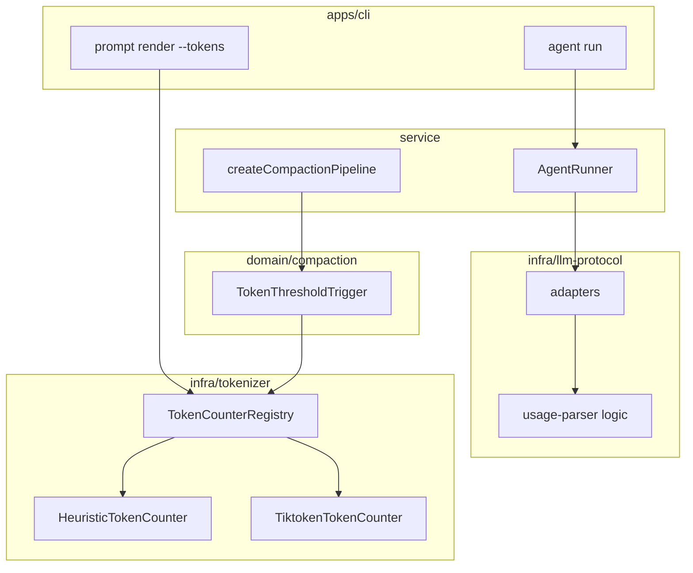

# Token 统计基础能力 技术规格（SPEC）

## 设计目标

- 在 **`infra/tokenizer/`** 建立 adapter 型模块（port + impl + logic），符合 `packages/core/ARCHITECTURE.md` 约定。
- **Compaction** 通过注入 `TokenCounter` 计数，计数口径首期仍为可见消息 `messageBodyText`（与现网一致）。
- **CLI** `prompt render --tokens` 统计完整 **`buildPromptLlmInput`**（system + messages），可选 `--model` 启用 tiktoken。
- **LLM adapter** 解析 `usage` 写入 `LlmChatResult.usage`；Agent `ModelRoundSummary` 透传。
- **不**改移动端；**不**持久化 message token_count；**不**引入 Claude/Llama tokenizer。

---

## 现状与约束（代码探索）

| 模块 | 现状 | 本迭代 |
|------|------|--------|
| `domain/compaction/logic/token-estimate.ts` | `Math.floor(chars/4)`，`messageBodyText` 累加 | 保留；内部改调 `HeuristicTokenCounter` 或标记 `@deprecated` re-export |
| `TokenThresholdTrigger` | 直接 `estimateTokens(visible)` | 构造注入 `TokenCounter` |
| `createCompactionPipeline` | 无 token 依赖 | 新增 `tokenCounters: TokenCounterRegistry`；按 `workspaceModelId` 动态解析 |
| `CompactionTrigger.shouldCompact` | 仅 `session` | 扩展为 `(session, modelContext)` 或等价传 modelId |
| `apps/cli/src/prompt/commands.ts` | 仅 stdout 渲染文本 | 增加 `--tokens`、`--model` |
| `LlmChatResult` | `{ assistantText, blocks, raw }` | 增加可选 `usage` |
| `ModelRoundSummary` | step / hadToolUse / finished | 增加可选 `usage` |
| OpenAI/Anthropic/Gemini adapter | 不解析 usage | 非流式 + 流式完成时填充 `usage` |
| `packages/core/package.json` | 无 tokenizer 依赖 | 新增 `tiktoken` |
| `global-compaction-policy` SPEC | 「token 估算仍为 estimateTokens」 | ** supersede **：改为 registry 默认 heuristic 等价 |

**架构约束（`core-package-structure/spec.md`）**：

- `chars/4` 作为 compaction **业务 fallback** 合理；真实 tokenizer 属于 **infra 技术能力**。
- domain 可 import infra；domain 不得 import service。
- `TokenThresholdTrigger`（domain）可依赖 `TokenCounter` port（infra）。

**Compaction 计数范围（首期刻意不变）**：

- 仍只数 `session.list()` 可见消息的 body，**不含** system、abstract、worktree。
- 原因：避免本迭代改变全局 compression 触发时机；完整 prompt 计数留给 CLI 与后续「prompt 预算」迭代。

---

## 总体方案

### 架构



### 核心类型（定稿）

```ts
/** infra/tokenizer/ports/token-counter.port.ts */
export interface TokenCounter {
  /** Plain text token count. */
  countText(text: string): number;
  /** Uses messageBodyText per message (skips thinking). */
  countMessages(messages: readonly ChatMessage[]): number;
}

/** infra/tokenizer/ports/token-counter-registry.port.ts */
export interface TokenCounterRegistry {
  /** Default heuristic counter (always available). */
  readonly heuristic: TokenCounter;
  /**
   * Resolve counter for applicationModelId.
   * Loads provider.protocol from DB; openai → tiktoken; else heuristic.
   * Model not saved / provider missing → heuristic.
   */
  forApplicationModel(applicationModelId: string): TokenCounter;
  /** Tests: skip DB, pass protocol explicitly. */
  forVendorModel(vendorModelId: string, protocol: LlmProtocolKind): TokenCounter;
}

/** infra/llm-protocol/ports/adapter.port.ts — extend */
export interface LlmTokenUsage {
  readonly promptTokens?: number;
  readonly completionTokens?: number;
  readonly totalTokens?: number;
}

export interface LlmChatResult {
  readonly assistantText: string;
  readonly blocks: readonly ContentBlock[];
  readonly raw: unknown;
  readonly usage?: LlmTokenUsage;
}
```

### TokenCounter 匹配规则（定稿 — 用户确认）

**不是**「`vendorModelId` 里含 `gemini` 就走 Gemini tokenizer、含 `gpt` 就走 GPT」这种单维子串规则。

**两层决策**：

```text
applicationModelId (= workspaceModelId for compaction)
  → parseApplicationModelId → providerId + vendorModelId
  → ProviderRepository.findById(providerId) → protocol   // 权威来源
  → if protocol !== "openai" → HeuristicTokenCounter       // gemini/anthropic 本迭代
  → if protocol === "openai" → TiktokenTokenCounter(vendorModelId 映射)
```

| 层级 | 输入 | 输出 |
|------|------|------|
| L1 协议 | DB 中 `provider.protocol` | `openai` → 进入 L2；`anthropic` / `gemini` → **heuristic** |
| L2 模型名 | `vendorModelId`（小写后） | tiktoken `encoding_for_model` 名；**按顺序匹配，先长后短** |

**L2 有序子串表**（仅 `protocol === "openai"`；`includes` 检测，命中即停）：

| 顺序 | vendorModelId 子串条件 | tiktoken model |
|------|------------------------|----------------|
| 1 | `gpt-3.5-turbo-0301` | `gpt-3.5-turbo-0301` |
| 2 | `gpt-4o` 或 `chatgpt-4o` | `gpt-4o` |
| 3 | `gpt-4.1` 或 `gpt-4.5` | `gpt-4o` |
| 4 | `gpt-4-32k` | `gpt-4-32k` |
| 5 | `o1-preview` / `o1-mini` / `o3-mini` / `o4-mini` | `o1` |
| 6 | `o1` / `o3`（独立词边界或前缀，避免误匹配 `foo-o1-bar` 可选收紧） | `o1` |
| 7 | `gpt-4` | `gpt-4` |
| 8 | `gpt-3.5-turbo` | `gpt-3.5-turbo` |
| 9 | （无命中） | `gpt-3.5-turbo`（openai 协议默认 encoding） |

**反例（避免误解）**：

- Provider 为 **gemini**，`vendorModelId = "gemini-2.0-flash"` → **heuristic**（不是 tiktoken）。
- Provider 为 **openai**，`vendorModelId = "meta-llama/Llama-3-70b"`（OpenRouter 网关）→ 走 L2 表，通常落默认 `gpt-3.5-turbo` encoding 或 **可选** 显式落 heuristic（SPEC 实现选：**无 gpt/o 子串时用默认 turbo encoding**，并在 debug 注明「非 OpenAI 模型名，计数仅供参考」）。
- `vendorModelId = "gpt-4o-mini"` → 命中 `gpt-4o` 规则（子串 `gpt-4o`），与 SillyTavern 一致。

映射逻辑：`infra/tokenizer/logic/tiktoken-model-map.ts`；单元测试锁定表项 + gemini protocol 必为 heuristic。

**Compaction 接线**：

- `maybeCompact(..., modelContext)` 内：`counter = registry.forApplicationModel(modelContext.workspaceModelId)`。
- Registry 需 **`ProviderRepository` + `SavedModelRepository`**（或注入 `resolveProtocol(applicationModelId)` 回调）以读 protocol；**不能**仅凭 modelId 字符串猜协议。

### OpenAI messages overhead（tiktoken countMessages）

对 `ChatMessage[]` 转为 OpenAI chat 计费用格式（参考 SillyTavern `/openai/count`）：

- 每条 message：`+3` tokens（0301 版本为 `+4`）
- 每条 message 的 `name` 字段：`+1`（0301 为 `-1`，首期 **不** 支持 name 字段消息，可跳过）
- 对所有 `messageBodyText(m)` encode 累加
- 末尾 `+3` padding
- 0301 模型额外 `+9`（若映射到 0301）

首期 `ChatMessage` 无 `name` 字段，实现可简化。

### Prompt CLI 计数对象

```ts
function serializePromptLlmInput(input: PromptLlmInput): string {
  const parts: string[] = [];
  if (input.system) parts.push(input.system);
  for (const m of input.messages) {
    parts.push(`${m.role}: ${messageBodyText(m)}`);
  }
  return parts.join("\n\n");
}
```

放在 `infra/tokenizer/logic/serialize-prompt-input.ts`；CLI 与测试共用。

---

## 最终项目结构

```text
packages/core/src/
├── infra/
│   ├── tokenizer/
│   │   ├── ports/
│   │   │   ├── token-counter.port.ts
│   │   │   └── token-counter-registry.port.ts
│   │   ├── impl/
│   │   │   ├── heuristic-token-counter.ts
│   │   │   └── tiktoken-token-counter.ts
│   │   ├── logic/
│   │   │   ├── tiktoken-model-map.ts
│   │   │   ├── openai-message-token-count.ts
│   │   │   ├── serialize-prompt-input.ts
│   │   │   └── create-default-registry.ts
│   │   └── index.ts
│   └── llm-protocol/
│       ├── logic/
│       │   └── usage-parser.ts          # NEW
│       ├── impl/
│       │   ├── openai.adapter.ts        # populate usage
│       │   ├── anthropic.adapter.ts
│       │   └── gemini.adapter.ts
│       └── ports/
│           └── adapter.port.ts          # LlmTokenUsage
├── domain/
│   └── compaction/
│       ├── logic/
│       │   └── token-estimate.ts          # delegates to HeuristicTokenCounter
│       └── triggers/
│           └── token-threshold.trigger.ts # inject TokenCounter
├── service/
│   └── compaction/
│       └── create-compaction-pipeline.ts  # + tokenCounter dep
└── domain/agent/model/
    └── agent-run-result.ts                # ModelRoundSummary.usage

apps/cli/src/
└── prompt/
    └── commands.ts                        # --tokens, --model

packages/core/test/
├── infra/tokenizer/
│   ├── heuristic-token-counter.test.ts
│   ├── tiktoken-token-counter.test.ts
│   ├── registry.test.ts
│   └── serialize-prompt-input.test.ts
├── infra/llm-protocol/
│   └── usage-parser.test.ts
└── compaction/
    └── token-threshold-trigger.test.ts    # mock counter injection
```

---

## 变更点清单

| 文件 | 变更 |
|------|------|
| `infra/tokenizer/**` | **新增** 模块 |
| `infra/llm-protocol/logic/usage-parser.ts` | **新增** |
| `infra/llm-protocol/ports/adapter.port.ts` | `LlmTokenUsage`、`LlmChatResult.usage` |
| `infra/llm-protocol/impl/*.adapter.ts` | 解析 usage |
| `domain/compaction/triggers/token-threshold.trigger.ts` | 构造 `(threshold, tokenCounter)` |
| `domain/compaction/logic/token-estimate.ts` | 委托 heuristic |
| `service/compaction/create-compaction-pipeline.ts` | deps + `tokenCounter` |
| `domain/agent/model/agent-run-result.ts` | `ModelRoundSummary.usage` |
| `service/agent/impl/agent-runner.ts` | rounds 写入 `result.usage` |
| `packages/core/src/index.ts` | export 新符号 |
| `packages/core/package.json` | `tiktoken` dependency |
| `apps/cli/src/prompt/commands.ts` | flags |
| `apps/cli/src/agent/commands.ts` | 传入 `createDefaultTokenCounterRegistry()` |
| `apps/cli/src/runtime.ts`（若集中 factory） | 可选：runtime 持有 registry |
| `packages/core/test/compaction/*.test.ts` | 传入 heuristic counter |
| `packages/core/test/agent/agent-runner.test.ts` | compaction deps 更新 |

---

## 详细实现步骤

### Step 1 — Infra tokenizer 模块骨架

1. 新增 port 与 `HeuristicTokenCounter`（`countText` = `floor(len/4)`；`countMessages` 累加 `messageBodyText`）。
2. 新增 `serialize-prompt-input.ts`。
3. 新增 `create-default-registry.ts` 返回仅 heuristic 的 registry（测试可先绿）。

### Step 2 — Tiktoken 实现

1. `pnpm/npm` 在 `packages/core` 添加 `tiktoken`。
2. 实现 `TiktokenTokenCounter`：
   - `countText`：`encoding.encode(text).length`
   - `countMessages`：调 `openai-message-token-count.ts`
3. `tiktoken-model-map.ts` + 懒加载 encoding（模块级 cache，避免重复 `encoding_for_model`）。
4. `DefaultTokenCounterRegistry` 构造依赖 `ProviderRepository`（+ 可选 `SavedModelRepository` 校验 model 已 save）：
   - `forApplicationModel(id)`：`parseApplicationModelId` → `providers.findById` → L1/L2 规则。
   - CLI `--model` 与 compaction 共用同一 registry（runtime 注入 DB repos）。

**Tiktoken 加载失败**：catch 并回退 heuristic，`console.debug` 一次。

### Step 3 — Compaction 注入

1. `TokenThresholdTrigger` 改为：
   ```ts
   constructor(
     private readonly tokenThreshold: number,
     private readonly tokenCounters: TokenCounterRegistry,
     private readonly modelIdForCount: () => string, // workspaceModelId from compaction ctx
   ) {}
   // shouldCompact:
   //   const counter = tokenCounters.forApplicationModel(modelIdForCount());
   //   counter.countMessages(visible) > threshold
   ```
   实现上可将 `modelContext` 传入 `shouldCompact(session, modelContext)`（扩展 port），避免闭包。
2. `createCompactionPipeline(deps)` 增加 `tokenCounters: TokenCounterRegistry`；`CompositeTrigger` / `TokenThresholdTrigger` 在 `maybeCompact` 时拿到 `modelContext.workspaceModelId`。
3. `estimateTokens` 改为：
   ```ts
   const _heuristic = new HeuristicTokenCounter();
   export function estimateTokens(messages) {
     return _heuristic.countMessages(messages);
   }
   ```
4. 更新所有 `createCompactionPipeline({...})` 调用点传入 `createDefaultTokenCounterRegistry({ providers, savedModels })`。

**Compaction 策略（定稿 — 用户确认）**：

- `TokenThresholdTrigger` / `CompositeTrigger.shouldCompact` 扩展入参 `modelContext`，使用  
  `tokenCounters.forApplicationModel(modelContext.workspaceModelId).countMessages(visible)`。
- **openai 协议** workspace：tiktoken，阈值触发时机可能早于/晚于旧 heuristic（预期）。
- **gemini / anthropic** workspace：与旧 `estimateTokens` **数值一致**。
- 扩展 `CompactionTrigger` port：`shouldCompact(session, modelContext)`。

### Step 4 — Usage 解析

1. `usage-parser.ts`:
   - `parseOpenAiUsage(raw): LlmTokenUsage | undefined`
   - `parseAnthropicUsage(raw): ...` — `usage.input_tokens`, `output_tokens`
   - `parseGeminiUsage(raw): ...` — `usageMetadata.promptTokenCount` 等
2. 各 adapter 在 `chatNonStream` / stream `done` 路径调用 parser，赋值 `usage`。
3. 流式 OpenAI：最终 chunk 或合并后的 raw 若含 usage，解析（OpenAI stream 可能在 last chunk 带 usage）。

### Step 5 — Agent round usage

1. `ModelRoundSummary` 增加 `usage?: LlmTokenUsage`。
2. `agent-runner.ts` 在 `modelRequests.request` 后：
   ```ts
   rounds.push({ step, hadToolUse, finished, usage: result.usage });
   ```
3. `NM_AGENT_VERBOSE=1` 的 JSON 增加 `rounds[].usage`。

### Step 6 — CLI prompt render

1. `parseCliArgs` 已有 flags；增加 `--tokens` boolean、`--model` string。
2. 流程：
   ```ts
   const input = buildPromptLlmInput(blocks, ctx);
   if (flags.has("tokens")) {
     const text = serializePromptLlmInput(input);
     const modelId = flags.get("model");
     const counter =
       typeof modelId === "string"
         ? registry.forApplicationModel(modelId)
         : registry.heuristic;
     const tokenCount = counter.countText(text);
     console.error(JSON.stringify({ tokenCount, model: modelId ?? null, counter: "..." }));
   }
   ```
3. Usage 字符串更新。

**Runtime 接线**：在 `NovelMasterRuntime` 增加 `tokenCounters: TokenCounterRegistry`（`createDefaultTokenCounterRegistry()`），或在 commands 内联 factory。

### Step 7 — Public exports & docs

1. `index.ts` export：
   - `createDefaultTokenCounterRegistry`
   - `HeuristicTokenCounter`
   - types: `TokenCounter`, `TokenCounterRegistry`, `LlmTokenUsage`
   - keep `estimateTokens` with `@deprecated` JSDoc pointing to registry
2. 更新 `ARCHITECTURE.md` infra 表增加 `tokenizer/` 行。

### Step 8 — 测试

见下节。

---

## 测试策略

### 单元测试

| ID | 描述 |
|----|------|
| H1 | Heuristic `countText` / `countMessages` 与旧 `estimateTokens` 一致 |
| H2 | 空 messages → 0 |
| T1 | Tiktoken 固定字符串 token 数（英文、中文各 1） |
| T2 | OpenAI message overhead：单条 user message 计数 > 纯 text 计数 |
| R1 | Registry 未知模型 → heuristic |
| R2 | Registry `gpt-4o` vendor → tiktoken 路径（长度 < heuristic 或 != heuristic 至少可区分） |
| S1 | `serializePromptLlmInput` 含 system + 两条 message |
| U1 | parseOpenAiUsage 标准 JSON |
| U2 | parseAnthropicUsage |
| U3 | parseGeminiUsage（minimal fixture） |
| C1 | TokenThresholdTrigger + mock counter 边界 |
| C2 | createCompactionPipeline 仍通过 compaction-pipeline T1/T2（heuristic counter） |

### 集成 / CLI

| ID | 描述 |
|----|------|
| CLI1 | `prompt render --tokens` stderr 含 JSON `tokenCount` |
| CLI2 | 无 `--tokens` 时 stderr 无 token 行 |

### 回归

- 全量 `packages/core/test/**/*.test.ts`
- `apps/cli/test` 中与 prompt render 相关用例更新

---

## 风险与回滚方案

| 风险 | 缓解 |
|------|------|
| `tiktoken` native/WASM 在某些环境安装失败 | registry catch → heuristic；CI 必须能 install |
| Tiktoken 改变 openai 模型 compaction 触发频率 | 文档说明；gemini/anthropic 仍 heuristic |
| Usage 字段在各网关格式不一致 | parser 防御性 optional；测 OpenAI/Anthropic 官方形状 |
| CLI `--model` 未 save 的 model | 抛清晰错误或回退 heuristic（SPEC：**回退 heuristic + stderr warning**） |

**回滚**： revert `infra/tokenizer` + adapter usage 改动；compaction 恢复直接 `estimateTokens`；移除 `tiktoken` dependency。

---

## 与 PRD 范围对齐说明

| PRD 条目 | SPEC 定稿 |
|----------|-----------|
| Compaction 用 tiktoken | **`workspaceModelId` + DB protocol**；仅 openai → tiktoken |
| 匹配规则 | **非** gemini 子串 → gemini tokenizer；**先 protocol，再 vendorModelId 有序子串** |
| CLI 完整 prompt 计数 | `serializePromptLlmInput` + `--tokens` JSON stderr |
| API usage | adapter + `ModelRoundSummary.usage` |
| `tiktoken` dependency | 用户已确认 |
| 无移动端 | 无 `examples/mobile` 改动 |

---

## 用户确认记录（2026-05-31）

- Compaction：**本迭代按 `workspaceModelId` 走 registry**（openai → tiktoken）。
- CLI `--tokens` JSON stderr：**可以**。
- `tiktoken` core dependency：**可以**。

**编码可开始**（以本 SPEC 为准）。
