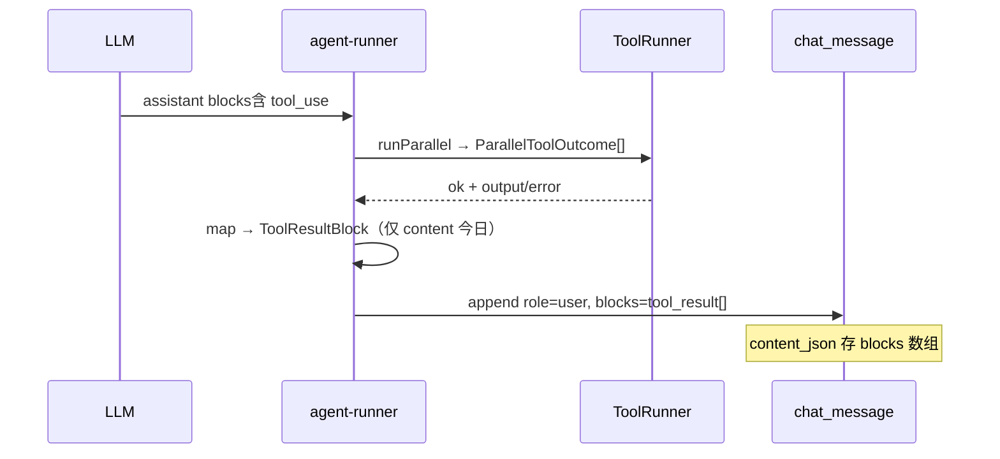

# ToolResultBlock 显式成败（ok）技术规格（SPEC）

> **PRD**：[prd.md](./prd.md)  
> **平台**：Core + Mobile / Desktop  
> **关联迭代**：`tool-system-v2`、`chat-tool-turn-phase-ui`  
> **前置修复（已落地未提交可选）**：Mobile/Desktop `toolStatusFromResult` 改为仅认 `Error:` 前缀（缓解 terrors 误报）

---

## 设计目标

1. **持久化层**：`ToolResultBlock` 增加显式 `ok`（+ 可选 `summary`），写入 `content_json`，**不**改 `chat_message` 表 DDL。
2. **LLM 层**：adapter / prompt 仍只读 `content` 字符串；`ok`/`summary` 不参与 token 计数与 API 序列化。
3. **UI 层**：工具卡片成败 **优先读 `ok`**；legacy 无 `ok` 时回退 `Error:` 前缀。
4. **单点组装**：`buildToolResultBlock()` 替代 `agent-runner` 内联 map，避免 Mobile/Desktop/CLI 各自推断。

---

## 现状（代码探索）

### 数据模型与存储

| 模块 | 路径 | 现状 |
|------|------|------|
| Block 类型 | `packages/core/src/domain/chat/model/content-block.ts` | `ToolResultBlock { type, toolUseId, content }` |
| 表结构 | `packages/core/src/bootstrap/chat/chat-schema.ts` | `chat_message.content_json TEXT`；**无** tool 专用列 |
| 解析 | `packages/core/src/domain/chat/content/parse-message-content.ts` L120–124 | 只解析 `toolUseId` + `content` |
| 消息模型 | `packages/core/src/domain/chat/model/message.ts` | `ChatMessage.content.blocks[]` |

**如何判断「工具调用」**：不靠 message 表字段，靠 `content_json.blocks[].type`：

- `tool_use` → 在 **assistant** 消息里，表示模型发起的调用
- `tool_result` → 通常在 **user** 消息里（仅含 result blocks），由 agent-runner 写入

配对：`tool_result.toolUseId === tool_use.id`（见 Mobile `buildToolResultByUseId`）。

### 执行与落库链路



| 模块 | 路径 | 现状 |
|------|------|------|
| 结构化结果 | `packages/core/src/domain/tool/logic/tool-runner.ts` L22–25 | `ParallelToolOutcome { ok, output \| error }` |
| 落库组装 | `packages/core/src/service/agent/impl/agent-runner.ts` L304–314 | 内联 map；只写 `content` |
| LLM 成功格式化 | `packages/core/src/domain/tool/logic/format-tool-output.ts` | `formatToolOutputForLlm` |
| LLM 失败格式化 | 同上 | `formatToolErrorForLlm` → `Error: …` 前缀 |
| Prompt 预览 | `packages/core/src/domain/chat/content/message-body-text.ts` L23–26 | 用 `content`，经 `formatToolResultContentForDisplay` |

### LLM 协议（不改动行为）

| Adapter | 路径 | tool_result 用法 |
|---------|------|------------------|
| OpenAI | `openai-content-mapper.ts` | `role: tool`, `content: tr.content` |
| Anthropic | `anthropic-content-mapper.ts` | user 消息内 tool_result block |
| Gemini | `gemini-content-mapper.ts` L98–108 | `functionResponse.response.output = block.content` |

三端 **均不读取** 将新增的 `ok`/`summary`。

### UI 成败判定

| 端 | 路径 | 现状 |
|----|------|------|
| Mobile | `apps/mobile/src/components/chat/message-blocks.ts` L158–167 | **已改**：`content.trimStart().startsWith('Error:')`；未读 `ok` |
| Desktop | `apps/desktop/renderer/features/chat/message-blocks.ts` L131–142 | 同上 |
| 配对 | 两端 `buildToolResultByUseId` / `toolCallViewFromUse` | 扫全 session blocks，hidden 的 tool_result 也参与 |

### 关联 PRD 约束

- `tool-system-v2`：`read` 成功时 `content` 常为 **大段 JSON + 文件正文**，子串误判风险上升。
- `chat-tool-turn-phase-ui`：终态卡片依赖 `ToolCallView.status`；本 SPEC 只改 status 数据源，不改 turn phase 状态机。

---

## 总体方案

### 分层职责

```
ParallelToolOutcome (内存，已有 ok)
        ↓ buildToolResultBlock()
ToolResultBlock { toolUseId, ok, summary?, content }
        ↓ SQLite content_json
        ├─→ LLM adapters：只用 content
        ├─→ prompt/token：只用 content（message-body-text）
        └─→ UI：ok 优先 + summary 可选
```

### 扩展后的 `ToolResultBlock`

```ts
export interface ToolResultBlock {
  readonly type: "tool_result";
  readonly toolUseId: string;
  readonly content: string;      // LLM 正文（不变）
  readonly ok?: boolean;         // 新：true=runner 成功，false=捕获失败
  readonly summary?: string;     // 新：UI 短摘要，可选
}
```

**语义约定**

| 字段 | 写入方 | 消费者 | 说明 |
|------|--------|--------|------|
| `ok` | agent-runner | UI | 新消息 **必填**；`undefined` = legacy |
| `content` | formatToolOutput/Error | LLM + 预览 | 不在此包 JSON 信封 |
| `summary` | buildToolResultBlock | UI 卡片（可选） | 不进入 adapter |

**Legacy 回退（UI）**

```ts
function resolveToolResultOk(block: ToolResultBlock): boolean {
  if (block.ok === false) return false;
  if (block.ok === true) return true;
  return !block.content.trimStart().startsWith("Error:");
}
```

不再使用 `content.includes("error")` / `includes("failed")`。

### Core：`buildToolResultBlock`

**新文件**（推荐）：`packages/core/src/domain/tool/logic/build-tool-result-block.ts`

```ts
export function buildToolResultBlock(
  toolUseId: string,
  outcome: ParallelToolOutcome,
  meta?: { readonly toolName?: string },
): ToolResultBlock;
```

**逻辑**

| outcome | ok | content | summary（可选） |
|---------|-----|---------|----------------|
| `{ ok: true, output }` | `true` | `formatToolOutputForLlm(output)` | `summarizeToolSuccess(meta.toolName, output)` |
| `{ ok: false, error }` | `false` | `formatToolErrorForLlm(error)` | 去掉 `Error:` 前缀的短 msg |

`summarizeToolSuccess` 首期可实现最小集（可后续迭代）：

| toolName | summary 示例 |
|----------|----------------|
| `read` | `30 lines` / `truncated · 2000/5000 lines` |
| `write` / `edit` / fs 变更 | `ok` / `3 replacements` |
| `fs` + ls | `12 entries` |
| `grep` / `glob` / `chat_grep` | `5 matches` |
| 默认 | 省略（UI 仍用 input.path 等） |

**agent-runner 改动**：L304–314 替换为：

```ts
const toolResults = toolUses.map((tu, i) =>
  buildToolResultBlock(tu.id, parallelOutcomes[i]!, { toolName: tu.name }),
);
```

### 解析与校验

**`parse-message-content.ts`**

- `tool_result` case：可选读取 `ok`（boolean）、`summary`（string）
- 非法类型 → 现有 `chatInvalidArgument` 风格报错
- **不**强制 legacy 行补 `ok`

**可选一致性校验**（`assertMessageContent` 或 parse 时 warn-only）：

- `ok === false` 且 content 不以 `Error:` 开头 → parse 仍接受（不丢数据），UI 以 `ok` 为准

### 导出

`packages/core/src/index.ts` 导出：

- `buildToolResultBlock`
- `resolveToolResultOk`（供 UI 或测试；Mobile/Desktop 可内联相同逻辑）

---

## 最终项目结构

```
packages/core/src/domain/
  chat/model/content-block.ts          # +ok, +summary on ToolResultBlock
  chat/content/parse-message-content.ts # 解析可选字段
  tool/logic/
    build-tool-result-block.ts         # 新增
    format-tool-output.ts              # 不变（或 extract summarize 辅助）
  service/agent/impl/agent-runner.ts   # 调用 buildToolResultBlock

packages/core/test/
  tool/build-tool-result-block.test.ts # 新增
  chat/content-blocks.test.ts          # +round-trip ok/summary
  agent/agent-runner.test.ts           # 断言落库 block 含 ok

apps/mobile/src/components/chat/message-blocks.ts   # resolveToolResultOk
apps/desktop/renderer/features/chat/message-blocks.ts
apps/mobile/__tests__/message-blocks.test.ts        # terrors + ok 字段
```

**不改动**

- `chat-schema.ts`（DDL）
- `openai-content-mapper.ts` / anthropic / gemini
- `normalize-orphan-tool-results-for-llm.ts`（仍替换 orphan tool_result；可携带 ok 原样复制）
- Tool 实现（`vfs-tools.ts` 等）

---

## 变更点清单

| 文件 | 变更 |
|------|------|
| `content-block.ts` | `ToolResultBlock` +`ok?` +`summary?` |
| `build-tool-result-block.ts` | **新建** 组装逻辑 |
| `agent-runner.ts` | 使用 `buildToolResultBlock` |
| `parse-message-content.ts` | 解析/序列化可选字段 |
| `index.ts` | 导出 |
| `message-blocks.ts` (Mobile/Desktop) | `toolStatusFromResult` 读 `ok` |
| 测试 | 见下表 |

---

## 详细实现步骤

### Step 1：类型与解析（Core）

1. 扩展 `ToolResultBlock` 接口。
2. `parse-message-content.ts`：`ok` boolean 可选；`summary` string 可选。
3. `content-blocks.test.ts`：round-trip 含 `{ ok: true, summary: "30 lines" }`。

### Step 2：`buildToolResultBlock`（Core）

1. 实现 success/error 两路径，复用现有 format 函数。
2. 实现最小 `summarizeToolSuccess`（可放在同文件或 `format-tool-output.ts` 末尾）。
3. 单测：read 成功 + terrors 正文 → `ok: true`，content 含 terrors；失败 → `ok: false`，content `Error: …`。

### Step 3：agent-runner 接入

1. 替换内联 map。
2. `agent-runner.test.ts`：mock 工具返回后，断言 DB/message list 中 `tool_result` 块含 `ok: true/false`。

### Step 4：UI

1. 抽取 `resolveToolResultOk(block)`（或各端 3 行 inline）。
2. `toolStatusFromResult` → `resolveToolResultOk ? 'success' : 'error'`。
3. （可选）`ToolCallCard` 在 `summary` 存在时显示副标题。
4. Mobile 测试：JSON content 含 terrors + `ok: true` → success。

### Step 5：构建与文档

1. `npm run build -w @novel-master/core`
2. Mobile `message-blocks.test.ts` 全绿
3. 在 `tool-system-v2/spec.md` 末尾加一行交叉引用（可选）

---

## 测试策略

### 自动化

| ID | 文件 | 断言 |
|----|------|------|
| R1 | `build-tool-result-block.test.ts` | success → `ok: true`；error → `ok: false` + `Error:` content |
| R2 | `build-tool-result-block.test.ts` | read 输出含 `terrors` 时 `ok` 仍为 true |
| R3 | `content-blocks.test.ts` | JSON parse/round-trip `ok` + `summary` |
| R4 | `agent-runner.test.ts` | 落库 tool_result 含 `ok` |
| R5 | `message-blocks.test.ts` (Mobile) | `ok: true` + terrors content → 卡片 success |
| R6 | `message-blocks.test.ts` (Mobile) | 无 `ok`，`Error:` 前缀 → error；无前缀 → success |
| R7 | `openai-content-mapper.test.ts` | 回归：history 含带 `ok` 的 tool_result，POST body 仍仅 content |

运行：

```bash
npm run build -w @novel-master/core
npm test -w @novel-master/core -- test/tool/build-tool-result-block.test.ts test/chat/content-blocks.test.ts
npm test -w @novel-master/mobile -- message-blocks.test.ts
```

### 手工

1. Mobile：Agent `read /poem.txt`（乌鸦诗）→ 工具卡 **成功**。
2. Mobile：故意 read 不存在路径 → **失败**，真提示词里仍为 `Error: …`。
3. 打开旧会话（V2 之前无 `ok`）→ 卡片仍正常（legacy 回退）。

---

## 兼容性与迁移

| 场景 | 行为 |
|------|------|
| 旧 `tool_result` 无 `ok` | UI 用 `Error:` 前缀回退；**不**扫正文子串 |
| Fork / 复制 session | `content_json` 原样复制，`ok` 一并保留 |
| LLM 历史 | adapter 忽略 `ok`，行为与现网一致 |
| DB migration | **不需要**；新字段在 JSON 内 |
| 外部手写 tool_result | 允许缺 `ok`；建议失败仍用 `Error:` 前缀 |

**刻意不做**

- 离线 backfill 历史 `ok`
- `content` 内 JSON 信封 `{ success, data, msg }`
- 第二列/第二表存 tool 元数据

---

## 风险与回滚方案

| 风险 | 缓解 | 回滚 |
|------|------|------|
| `ok` 与 content 不一致（手工改库） | UI 以 `ok` 为准；文档说明 | 移除 `ok` 写入，UI 回退 Error 前缀 |
| summary 与工具输出不同步 | summary 可选，缺省不影响 | 停止写入 summary |
| Core/UI 版本 skew | Mobile 依赖 core build；回退逻辑兼容无 ok | revert agent-runner + UI 三文件 |
| 增加 content_json 体积 | 仅多 1 boolean + 短 string/条 | 停写 summary |

**预估改动量**：Core ~120 行 + 测试 ~80 行；Mobile/Desktop 各 ~15 行。

**建议合并**：独立小 PR，基于 `feature/tool-system-v2` 或 `main`；与 V2 无硬依赖，但建议在 V2 工具联调前合入以减少误报。

---

## 实现顺序与里程碑

| 阶段 | 交付 | 可验证 |
|------|------|--------|
| M1 | Step 1–2 Core 类型 + buildToolResultBlock | R1–R3 绿 |
| M2 | Step 3 agent-runner | R4 绿 |
| M3 | Step 4 UI | R5–R6 绿 + 手工 poem |
| M4 | Step 5 build + adapter 回归 R7 | 全量 build |

---

## 与 tool-system-v2 的关系

- V2 改变 **工具名与 output 形状**，不改变 message 表结构。
- 本 SPEC **补全 tool_result 元数据**，解决 V2 长 output 暴露的 UI 误判问题。
- 可并行开发；合并顺序建议：**先合入本 SPEC（M1–M3），再继续 V2 手工验收**。
