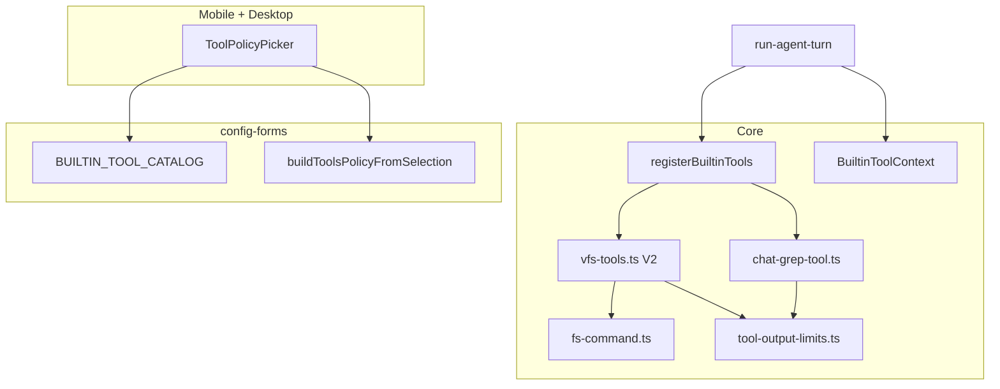

# Tool System V2 技术规格（SPEC）

> **PRD**：[prd.md](./prd.md)  
> **平台**：Core + Mobile / Desktop / CLI（工具展示与 Agent 配置 UI）  
> **类型**：破坏性重构  
> **关联迭代**：`tool-system`（V1）、`agent-system`  
> **参考**：OpenCode `packages/opencode/src/tool/read.ts`、`truncate.ts`、`grep.ts`

---

## 设计目标

1. **工具集 V2**：`replace`→`edit`；`delete`/`move`/`copy`/`mkdir`/`list`→`fs`；新增 `chat_grep`；旧名无别名。
2. **输出可控**：`read`/`grep`/`glob`/`chat_grep`/`fs ls` 统一截断常量（50KB / 2000 行 / 100 条 / 单行 2000 字符）。
3. **`fs` command 解析**：严格 grammar，单条命令映射 VFS 操作，拒绝 shell 注入。
4. **工具策略 UI**：Mobile / Desktop Agent 编辑器用可搜索多选 + 标签条，移除文本输入。
5. **VFS 端口不变**：`VfsService` 与 `nm vfs` CLI 子命令保持独立（CLI 仍 `read/write/replace/...`，不受 Agent 内置工具重命名影响）。

---

## 现状（代码探索）

| 模块 | 路径 | 现状 |
|------|------|------|
| 内置工具 | `packages/core/src/domain/tool/builtin/vfs-tools.ts` | 10 工具：`read/write/replace/delete/list/mkdir/glob/grep/move/copy`；`VfsToolContext = { vfs, projectId, sessionId }` |
| 工具注册 | `registerVfsTools(registry)` | 仅 VFS 工具；`run-agent-turn.ts`、`AgentEditorForm` 用 `ToolRegistry` probe 列名 |
| Agent 策略 | `resolve-agent-tool-registry.ts` | `allow`/`deny` 过滤；`normalizeAgentToolPolicyName` 剥 `vfs.` 前缀 |
| 策略校验 | `validate-agent-tool-policy.ts` | 引用名须在 `registeredToolNames` 中 |
| 变更类工具 | `MUTATING_FILE_TOOL_NAMES` | `write/replace/delete/mkdir/move/copy` → checkpoint |
| 文件预览打开 | `FILE_OPEN_TOOL_NAMES` | `read/write/replace` |
| read 实现 | `vfs-tools.ts` L89–102 | 无 offset/limit；`vfs.read()` 全量返回 |
| grep 实现 | `vfs.service.ts` L170–198 | 子串 `indexOf`（非正则）；无条数/字节上限 |
| glob 实现 | `vfs.service.ts` L152–167 | 全量路径数组；无上限 |
| 消息全文 | `message-body-text.ts` | `messageBodyText(m)` 提取 text/tool_use/tool_result（跳过 thinking） |
| 会话消息 | `sqlite-message.repository.ts` | `listBySession` 含 `hidden` 列 |
| Agent 运行 | `run-agent-turn.ts` L166–197 | `registerVfsTools` + `toolCtx` 仅 VFS；`listAllSessionMessages` 已注入 runner 但未用于工具 |
| 表单序列化 | `config-forms/agent-editor-state.ts` | `toolsList: string` 逗号文本 → `buildToolsPolicy` |
| Mobile 编辑器 | `AgentEditorForm.tsx` L430–457 | `FormTextInput` 多行逗号输入 |
| Desktop 编辑器 | `AgentEditorView.tsx` L344–367 | `<textarea>` 逗号输入 |
| LLM 输出格式化 | `format-tool-output.ts` | `replace` 的 `{version, replacements}` → `ok (N replacements)` |
| 测试 | `vfs-tools.test.ts` | 覆盖 write/replace/delete/mkdir/move/copy/list/glob/grep |
| CLI vfs | `apps/cli/src/main.ts` | `nm vfs read/write/replace/...` **独立于** ToolRegistry |

**根因 / 约束**

- 截断应在 **Tool `run()` 层** 实现，不修改 `VfsService`（CLI 与 Agent 行为可分离；CLI 保持全量）。
- `chat_grep` 需会话消息，必须扩展 tool context（不能只靠 `VfsService`）。
- `config-forms` 无 React，工具多选 UI 放各端，**目录与序列化逻辑共享**。

---

## 总体方案



### V2 内置工具清单（7 个）

| 工具 | 类型 | 说明 |
|------|------|------|
| `read` | 读 | 分页 + 截断 |
| `write` | 写 | 不变 |
| `edit` | 写 | 原 `replace` |
| `fs` | 读/写 | command 字符串（`ls` 只读；`rm`/`mv`/… 变更） |
| `glob` | 读 | 加条数/字节截断 |
| `grep` | 读 | 加条数/字节/行宽截断 |
| `chat_grep` | 读 | 会话消息搜索 |

### 共享截断常量（`tool-output-limits.ts`）

```ts
export const TOOL_OUTPUT_MAX_LINES = 2000;
export const TOOL_OUTPUT_MAX_LINE_LENGTH = 2000;
export const TOOL_OUTPUT_MAX_BYTES = 50 * 1024;
export const TOOL_OUTPUT_MAX_MATCHES = 100; // grep / glob paths / chat_grep
export const TOOL_OUTPUT_LINE_TRUNCATED_SUFFIX =
  `... (line truncated to ${TOOL_OUTPUT_MAX_LINE_LENGTH} chars)`;
```

提供纯函数：

- `truncateLine(text, maxLen)` → `{ line, truncated }`
- `sliceLinesFromOffset(lines, offset1Based, limit)` → `{ slice, totalLines, nextOffset? }`
- `capUtf8Bytes(lines, maxBytes)` → `{ lines, truncated, bytesUsed }`
- `capMatchList<T>(items, maxItems, formatItem)` → `{ items, total, truncated }`

### `fs` 命令 grammar（严格 tokenizer）

输入：`{ command: string }`（trim 后非空，**单条**命令）。

| 命令模式 | 映射 |
|----------|------|
| `rm <path>` | `vfs.delete(path, { recursive: false })` |
| `rm -r <path>` | `vfs.delete(path, { recursive: true })` |
| `rmdir <path>` | `vfs.delete(path, { recursive: false })` + 目录非空则 `VfsError` |
| `mv <from> <to>` | `moveVfsPath(vfs, from, to)` |
| `cp <from> <to>` | `copyVfsPath(vfs, from, to)` |
| `cp -r <from> <to>` | `copyVfsPath(vfs, from, to, { recursive: true })` |
| `mkdir <path>` | `vfs.mkdir(path)` |
| `ls [dir]` | `vfs.list(dir ?? "/", { recursive: false })` → 格式化输出 + 50KB 截断 |
| `ls -r <dir>` | `vfs.list(dir, { recursive: true })` → 格式化输出 + 50KB 截断 |

**`ls` 输出**（只读子命令）

```ts
{ entries: VfsListEntry[]; total: number; truncated: boolean; omitted?: number }
```

条目格式：`path<TAB>file|directory` 每行一条，经 `capUtf8Bytes` 截断。

**变更 vs 只读**：新增 `isMutatingFsCommand(command): boolean`——`ls` 返回 `false`；`rm`/`mv`/`cp`/`mkdir`/`rmdir` 返回 `true`。`MUTATING_FILE_TOOL_NAMES` 仍含 `fs`（工具级），checkpoint / UI 若需细粒度可调用 `isMutatingFsCommand` 解析 `input.command`。

**解析规则**

- 按空白拆分 token；路径含空格 **不支持**（与 VFS 逻辑路径惯例一致）。
- 拒绝：`&&`、`|`、`;`、多余 token、未知子命令。
- 返回 `{ ok: true }` 或抛 `ToolError(INVALID_ARGUMENT, ...)` 含原始 command。

实现文件：`packages/core/src/domain/tool/logic/fs-command.ts`（`parseFsCommand` + `executeFsCommand`）。

### `read` 输出 schema（扩展）

```ts
// input
{ path: string; offset?: number; limit?: number }  // offset 1-based, limit default 2000

// output
{
  path: string;
  content: string;       // 可能截断后的文本（带行号前缀可选，见实现）
  version: number;
  mtimeMs: number;
  offset: number;        // 实际起始行（1-based）
  limit: number;         // 请求 limit
  totalLines: number;
  returnedLines: number;
  truncated: boolean;
  nextOffset?: number;   // truncated 时建议下次 offset
}
```

**实现要点**

1. `vfs.read(path)` 取全量，按 `\n` 拆行（保留 VFS 语义）。
2. `offset > totalLines`（且 totalLines > 0）→ 错误。
3. 空文件 + `offset > 1` → 错误；`offset` 默认 1。
4. 每行 `truncateLine`；拼接后 `capUtf8Bytes`。
5. `formatToolOutputForLlm`：truncated 时追加人类可读提示（含 `nextOffset`），参考 OpenCode `read.txt`。

### `grep` / `glob` 截断

在各自 `run()` 内：

- **grep**：调用 `vfs.grep` 后 `capMatchList(100)` + 行宽截断 excerpt + 总字节 cap；输出包装：

```ts
{ matches: VfsGrepMatch[]; total: number; truncated: boolean }
```

- **glob**：`vfs.glob` 后取前 100 路径 + 字节 cap：

```ts
{ paths: string[]; total: number; truncated: boolean }
```

（`list` 已并入 `fs ls`，见上。）

### `chat_grep` 工具

**Context 扩展**：`BuiltinToolContext`

```ts
export type BuiltinToolContext = {
  readonly vfs: VfsService;
  readonly projectId: string;
  readonly sessionId: string;
  readonly listSessionMessages: () => Promise<readonly ChatMessage[]>;
};
```

**输入**：`{ pattern: string; options?: { role?: string } }`（`role` 可选过滤 user/assistant/tool）

**执行**

1. `messages = await listSessionMessages()`（含 hidden，不过滤 `hidden`）。
2. 对每条消息：`text = messageBodyText(m)`（复用 `message-body-text.ts`）。
3. 按行搜索：`pattern` 先尝试 `new RegExp(pattern)`，失败则退化为子串 `indexOf`（与 VFS grep 一致）。
4. 收集 `{ messageId, seq, role, line, column, excerpt, hidden }`。
5. `capMatchList(100)` + 行宽 + 字节 cap。

**输出**

```ts
{
  matches: Array<{
    messageId: string;
    seq: number;          // 楼层 / 会话内顺序
    role: string;
    line: number;
    column: number;
    excerpt: string;
    hidden: boolean;
  }>;
  total: number;
  truncated: boolean;
}
```

**注册**：`registerBuiltinTools(registry)` = VFS 工具 + `chat_grep`；`registerVfsTools` 标记 `@deprecated` 别名指向 `registerBuiltinTools`（一版后删除）。

### 工具策略多选 UI

**config-forms 新增**（纯 TS，无 UI）：

```ts
// agent-tool-catalog.ts
export const BUILTIN_TOOL_CATALOG: ReadonlyArray<{
  readonly name: string;
  readonly label: string;
  readonly description: string;
}> = [ /* 与 FILE_TOOL_NAMES 同步 */ ];

export function buildToolsPolicyFromSelection(
  mode: ToolsMode,
  selected: readonly string[],
): AgentToolPolicy | undefined;

export function toolsSelectionFromDefinition(def: AgentDefinition): {
  mode: ToolsMode;
  selected: readonly string[];
};
```

**表单输入迁移**：`AgentEditorFormInput.toolsList: string` → `toolsSelected: string[]`

- `formSnapshotJson` / `buildAgentDefinitionFromForm` 使用 `toolsSelected`。
- 保留 `parseToolsList` **仅用于** YAML 导入兼容（import 时解析为 `selected[]`）。

**各端组件**（结构对称）：

| 端 | 文件 |
|----|------|
| Desktop | `apps/desktop/renderer/features/settings/ToolPolicyPicker.tsx` |
| Mobile | `apps/mobile/src/components/agent/ToolPolicyPicker.tsx` |

**交互**

```
┌ 已选: [read ×] [grep ×] [edit ×]     ← 标签条，点击 × 移除
├ 🔍 搜索工具…                          ← filter
├ ☑ read     读取工作区文件
├ ☐ write    写入或覆盖文件
├ ☑ grep     在工作区文件中搜索
└ …
```

- 数据源：`BUILTIN_TOOL_CATALOG`（保存时仍用 `ToolRegistry` + `registerBuiltinTools` 校验可选）。
- `toolsMode === 'default'` 时隐藏 picker，显示 hint「未配置时使用全部内置工具（7 个）」。

---

## 最终项目结构

```text
packages/core/src/domain/tool/
  logic/
    tool-output-limits.ts          # NEW
    fs-command.ts                  # NEW
    format-tool-output.ts          # UPDATE (edit/fs/read truncated)
  builtin/
    vfs-tools.ts                   # REFACTOR V2
    chat-grep-tool.ts              # NEW
    register-builtin-tools.ts      # NEW (registerBuiltinTools)
    builtin-tool-context.ts        # NEW (type + re-export)

packages/core/test/tool/
  tool-output-limits.test.ts       # NEW
  fs-command.test.ts               # NEW
  vfs-tools.test.ts                # MIGRATE V2 names
  chat-grep-tool.test.ts           # NEW

packages/config-forms/src/agent/
  agent-tool-catalog.ts            # NEW
  agent-editor-state.ts            # UPDATE toolsSelected

apps/desktop/renderer/features/settings/
  ToolPolicyPicker.tsx             # NEW
  AgentEditorView.tsx                # UPDATE

apps/mobile/src/components/agent/
  ToolPolicyPicker.tsx             # NEW
  AgentEditorForm.tsx                # UPDATE

apps/mobile/__tests__/message-blocks.test.ts   # replace → edit
packages/config-forms/test/agent-editor-state.test.ts  # UPDATE
```

**不改动**

- `packages/core/src/service/vfs/**`（VfsService 实现）
- `apps/cli/src/vfs/**`（`nm vfs` 子命令名保持）

---

## 变更点清单

| 文件 | 变更 |
|------|------|
| `vfs-tools.ts` | 移除 replace/delete/mkdir/move/copy/list；新增 edit/fs；read/grep/glob 加截断；`FILE_TOOL_NAMES` 更新；`MUTATING_*` / `FILE_OPEN_*` 更新 |
| `fs-command.ts` | 含 `ls`/`ls -r` 解析与截断输出；`isMutatingFsCommand` |
| `register-builtin-tools.ts` | `registerBuiltinTools` 注册 VFS + chat_grep |
| `chat-grep-tool.ts` | 新工具定义 |
| `builtin-tool-context.ts` | `BuiltinToolContext`；`VfsToolContext` type alias 过渡期保留 |
| `fs-command.ts` | 解析 + 执行 |
| `tool-output-limits.ts` | 共享常量与纯函数 |
| `format-tool-output.ts` | edit 替换计数；fs `ok`；read/grep/glob/chat_grep 截断摘要 |
| `run-agent-turn.ts` | `registerBuiltinTools`；`toolCtx` 加 `listSessionMessages` |
| `create-agent-runner.ts` | `ToolRegistry<BuiltinToolContext>` |
| `events/.../run-agent.handler.ts` | 同上 |
| `index.ts` | 导出新 API；deprecated 旧名 |
| `agent-tool-catalog.ts` | 目录 + 中文说明 |
| `agent-editor-state.ts` | `toolsSelected[]` |
| `ToolPolicyPicker.tsx` ×2 | 新 UI |
| `AgentEditorForm/View` | 接入 picker；更新 hint 文案 |
| Mobile/Desktop tool 展示 | `ToolCallGroupCard` 等显示 V2 名（通常直接读 `block.name`） |
| 测试/fixtures | 所有 `replace`/`delete`/… 工具调用改为 V2 |

---

## 详细实现步骤

### Step 1：截断基础设施

1. 新增 `tool-output-limits.ts` + 单元测试（行切片、字节 cap、match cap）。
2. 无行为变更，纯函数可独立合并。

### Step 2：`fs` 命令解析器

1. 新增 `fs-command.ts` + `fs-command.test.ts`（覆盖 PRD 验收用例：mv/rm -r/rmdir 非空/非法命令）。
2. 仍不接入工具。

### Step 3：VFS 工具 V2 重构

1. 重命名 `replace` → `edit`（schema/description 更新）。
2. 删除 delete/move/copy/mkdir/list 工具定义。
3. 新增 `fs` 工具，内部调 `executeFsCommand`（含 `ls`/`ls -r`）。
4. 增强 `read` input/output schema + `run()` 分页截断。
5. 包装 `grep`/`glob` 输出为带 `truncated` 的结构。
6. 更新 `FILE_TOOL_NAMES`、`MUTATING_FILE_TOOL_NAMES`、`FILE_OPEN_TOOL_NAMES`。
7. 迁移 `vfs-tools.test.ts` 至 V2（`replace`→`edit`，delete 等→`fs` command）。

### Step 4：`chat_grep` + 上下文扩展

1. 新增 `builtin-tool-context.ts`。
2. 新增 `chat-grep-tool.ts` + 集成测试（hidden 消息命中、100 条截断）。
3. 新增 `register-builtin-tools.ts`；`registerVfsTools` → deprecated 转发。
4. 更新 `run-agent-turn.ts`、`run-agent.handler.ts`、`AgentEditorForm` probe、`agent-yaml.service` 等所有 `registerVfsTools` 调用点。
5. `create-agent-runner.ts` / `DefaultAgentRunner` 泛型上下文改为 `BuiltinToolContext`。

### Step 5：格式化与导出

1. 更新 `format-tool-output.ts` / `format-tool-output.test.ts`。
2. 更新 `packages/core/src/index.ts` 导出。
3. 全仓 grep `replace`/`MUTATING_FILE`/`FILE_TOOL_NAMES` 引用并修复。

### Step 6：config-forms 工具目录与表单

1. 新增 `agent-tool-catalog.ts`（7 项与 `FILE_TOOL_NAMES` 一致）。
2. `agent-editor-state.ts`：`toolsSelected: string[]`；`buildToolsPolicyFromSelection`；`toolsSelectionFromDefinition`。
3. YAML import 路径：`parseToolsList` 仅 import 时用，写入 `selected`。
4. 更新 `agent-editor-state.test.ts`。

### Step 7：Mobile / Desktop ToolPolicyPicker

1. Desktop `ToolPolicyPicker`：搜索 input + checkbox 列表 + 标签条。
2. Mobile 对称实现（`FormTextInput` 搜索 + `Pressable` 行 + chip 标签）。
3. 替换 `AgentEditorView` / `AgentEditorForm` 中文本框。
4. 更新默认 hint 文案（7 个 V2 工具名列表）。

### Step 8：全端回归与文档

1. 跑 Core tool 测试 + config-forms 测试。
2. `npm run build`。
3. 更新 `.apm/kb` 中 `tool-system` 交叉引用（可选 note：V2 supersede 工具名）。

---

## 兼容性与迁移

### 破坏性变更（无别名）

| 旧工具名 | V2 |
|----------|-----|
| `replace` | `edit` |
| `delete` | `fs`（`rm` / `rm -r`） |
| `move` | `fs`（`mv`） |
| `copy` | `fs`（`cp` / `cp -r`） |
| `mkdir` | `fs`（`mkdir`） |
| `list` | `fs`（`ls` / `ls -r`） |

### Agent 配置迁移

- 存量 `AgentDefinition.tools.allow/deny` 含旧名 → `validateAgentToolPolicy` **失败**，错误信息列出 V2 工具全集与迁移提示。
- **不自动 DB 迁移**；提供文档说明手动更新 YAML/编辑器。
- `normalizeAgentToolPolicyName` 继续剥 `vfs.` 前缀（历史配置 `vfs.read` → `read`），**不**映射 `replace`→`edit`。

### CLI 与 VFS

- `nm vfs read/write/replace/delete/...` **保持不变**（直接调 `VfsService`，非 ToolRegistry）。
- 仅 Agent 内置工具集变更。

### API 过渡

- `registerVfsTools` → `@deprecated`，内部 `registerBuiltinTools`。
- `VfsToolContext` → type alias `BuiltinToolContext`（一版后删 alias）。

---

## 测试策略

### 自动化

| ID | 文件 | 断言 |
|----|------|------|
| T1 | `tool-output-limits.test.ts` | 2000 行切片、50KB cap、100 match cap |
| T2 | `fs-command.test.ts` | ls/ls -r/mv/rm -r/rmdir/mkdir/cp -r；非法命令；非空 rmdir 失败；ls 50KB 截断 |
| T3 | `vfs-tools.test.ts` | edit 等价原 replace；fs 等价原 delete/move/copy/mkdir/list；旧名 NOT_FOUND |
| T2b | `fs-command.test.ts` | `isMutatingFsCommand('ls /')` false；`isMutatingFsCommand('rm x')` true |
| T4 | `vfs-tools.test.ts` | read 5000 行默认 2000 + truncated + nextOffset |
| T5 | `vfs-tools.test.ts` | read offset 越界错误；长行截断 |
| T6 | `vfs-tools.test.ts` | grep/glob >100 截断 |
| T7 | `chat-grep-tool.test.ts` | 命中 seq/role/line；hidden 纳入；截断 |
| T8 | `agent-editor-state.test.ts` | `toolsSelected` round-trip allow/deny |
| T9 | `agent-tool-policy.test.ts` | 旧名 `replace` 校验失败 |
| T10 | `format-tool-output.test.ts` | edit/fs/read truncated 格式化 |

运行：

```bash
npm run build -w @novel-master/core
npm test -w @novel-master/core -- --test-path-pattern=tool
npm test -w @novel-master/config-forms
npm run build
```

### 手工

1. Desktop Agent 编辑器：白名单多选 `read`+`grep`，保存重开，标签一致。
2. Mobile 同上。
3. Agent 对话：`fs` `mv` 移动文件；`read` 大文件分页；`chat_grep` 搜历史用户消息。
4. 工具卡片显示 `edit`/`fs`，无 `replace`/`delete`。

---

## 风险与回滚方案

| 风险 | 缓解 | 回滚 |
|------|------|------|
| 存量 Agent 工具策略失效 | 校验错误信息含迁移指引；发布说明列出旧→新映射 | 恢复旧 `vfs-tools.ts` 并 re-export 旧名（单文件 revert） |
| `fs` 命令注入 | 严格 token grammar，拒绝 shell 元字符 | 禁用 `fs`，临时恢复独立工具（不推荐） |
| `chat_grep` 长会话慢 | 首期全量扫描；文档注明；后续索引 |  feature flag 隐藏 `chat_grep` |
| 截断导致 Agent 误判文件末尾 | read 输出明确 `nextOffset` 提示 | 调大常量（需 PRD 变更） |
| Mobile/Desktop UI 分叉 | 共享 `BUILTIN_TOOL_CATALOG` + 相同 props 契约 | 仅 revert UI 组件 |

**建议合并顺序**：Step 1–5（Core）单 PR → Step 6–7（forms + UI）可同 PR 或跟进 PR。

**预估改动量**：Core ~800 行，config-forms ~120 行，UI ~300 行/端，测试 ~500 行。

---

## 实现顺序与里程碑

| 阶段 | 交付 | 可验证 |
|------|------|--------|
| M1 | Step 1–3 Core 工具 V2 | `vfs-tools.test.ts` 全绿 |
| M2 | Step 4 chat_grep + 上下文 | `chat-grep-tool.test.ts` 全绿 |
| M3 | Step 5–6 forms + 导出 | config-forms 测试全绿 |
| M4 | Step 7 UI picker | 手工 Agent 编辑器验收 |
| M5 | Step 8 全量 build + 手工对话 | PRD 验收清单 |
