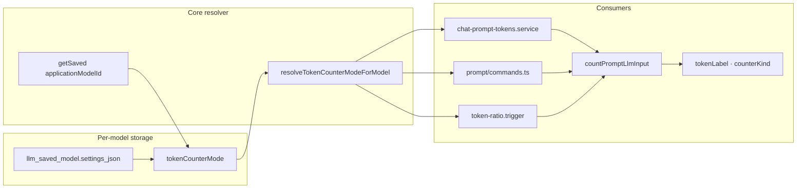

# UI 优化 — Token 计数器随模型配置 技术规格（SPEC）

> **PRD**：[prd.md](./prd.md)  
> **分支**：`feature/ui-optimization`  
> **性质**：非破坏性 schema 扩展（`settings_json` 增字段）；全局 `tokenCounter.mode` 配置路径删除。

---

## 设计目标

1. **Per-model 唯一源**：`SavedModelSettings.tokenCounterMode` 存入已有 `llm_saved_model.settings_json`，默认 `auto`。
2. **计数口径一致**：Chat 顶栏、CLI `prompt render --tokens`、压缩 `TokenRatioConditionTrigger` 均通过同一 resolver 读取 per-model override，经 `countPromptLlmInput({ tokenizerOverride })` 传入。
3. **可观测**：Chat meta token 行后缀 ` · {counterKind}`（与 PRD 一致）。
4. **删除全局配置**：Mobile Profile、App UI KKV、CLI `nm preferences tokenCounter.mode`、runtime `getTokenizerOverride` 读全局路径全部移除。
5. **零 DDL**：不修改 `provider-schema.ts`。

---

## 代码探索结论（现状）

### 存储

| 位置 | 现状 |
|------|------|
| `SavedModelSettings` | `schemaVersion: 1` + `contextWindowTokens` + `sampling`（`saved-model-settings.ts`） |
| `llm_saved_model.settings_json` | 已由 `SqliteSavedModelRepository` 读写 |
| 全局 Mobile | `APP_UI_KEY_TOKEN_COUNTER_MODE` → `token-counter-pref.ts` |
| 全局 CLI/Core | `TOKEN_COUNTER_MODE_PREF_KEY` → `read-token-counter-mode-pref.ts` |

### 计数链路

```
countPromptLlmInput(params)
  tokenizerOverride ?? registry.getTokenizerOverride?.() ?? "auto"
  → resolveTokenizerFamily(vendorModelId, override)
```

驱动实现：`packages/tokenizer-driver-node|rn/src/count-prompt-llm-input.ts`。

**调用方（须统一传入 per-model override）**：

| 调用方 | 文件 |
|--------|------|
| Mobile Chat meta | `apps/mobile/src/services/chat-prompt-tokens.service.ts` |
| CLI prompt tokens | `apps/cli/src/prompt/commands.ts` |
| 压缩 token ratio | `packages/core/src/domain/compaction-conditions/triggers/token-ratio.trigger.ts` |

### UI

| 组件 | 现状 |
|------|------|
| 全局配置 | `ProfileTabScreen.tsx` L238–272 Alert 选择 mode |
| 模型设置 | `ModelSamplingScreen.tsx` — context window + sampling |
| Chat 展示 | `ChatMetaBar.tsx` — `modelLabel` + `tokenLabel` 分行 |

### CLI 模型设置

- `nm provider model edit --contextWindowTokens N` 已走 `updateSettings`
- `nm provider model sampling` 子命令独立读写 sampling
- **无** token counter 相关 flag

---

## 总体方案



1. 扩展 `SavedModelSettings` + Zod schema（缺省 `auto`）。
2. 新增 Core helper `resolveTokenCounterModeForModel(providerModels, applicationModelId)`；`ProviderModelService` 增加 `getTokenCounterMode` 薄封装（对称 `getContextWindow`）。
3. 所有 `countPromptLlmInput` 产品路径显式传 `tokenizerOverride`；runtime **不再**注册 `getTokenizerOverride`。
4. Mobile：Profile 移除项；`ModelSamplingScreen` 增加 picker；`chat-prompt-tokens` 返回带 counterKind 后缀的 label。
5. CLI：`preferences` 移除 tokenCounter 键；`provider model edit` 增加 `--tokenCounterMode`。
6. 压缩：`TokenRatioConditionTrigger` 增加 `resolveTokenizerOverride` 回调（与 `resolveContextWindow` 同模式）。

---

## 最终项目结构

```
packages/core/src/
  domain/provider/model/
    saved-model-settings.ts              # +tokenCounterMode
    saved-model-settings.schema.ts       # Zod + default auto
    saved-model-settings-from-json.ts    # serialize 含 tokenCounterMode
    default-saved-model-settings.ts      # default auto
    token-counter-mode-options.ts        # NEW: 合法 mode 列表（UI/CLI 共用）
  service/provider/
    provider-model.port.ts               # +getTokenCounterMode
    impl/provider-model.service.ts       # patch merge + validation
    logic/resolve-token-counter-mode-for-model.ts  # NEW
  domain/compaction-conditions/triggers/
    token-ratio.trigger.ts               # +resolveTokenizerOverride
  service/compaction-conditions/
    create-compaction-condition-evaluator.ts  # wire providerModels
  infra/tokenizer/logic/
    read-token-counter-mode-pref.ts      # 保留 parseTokenCounterModePref；删除 preferences 读路径 export 可选

apps/mobile/src/
  screens/tabs/ProfileTabScreen.tsx      # 删除 Token 计数器
  screens/stack/ModelSamplingScreen.tsx  # +Token 计数器 picker
  services/chat-prompt-tokens.service.ts # per-model override + counterKind suffix
  runtime/create-mobile-runtime.ts       # 移除 getTokenizerOverride
  storage/token-counter-pref.ts          # DELETE
  storage/app-ui-keys.ts                 # 移除 TOKEN_COUNTER_MODE key
  utils/format-token-count.ts            # +appendCounterKindSuffix (optional)

apps/cli/src/
  runtime.ts                             # 移除 getTokenizerOverride
  preferences-cmd/commands.ts            # 仅 versionCheck
  provider/model/commands.ts             # edit + --tokenCounterMode
  prompt/commands.ts                     # pass tokenizerOverride

packages/core/test/
  provider/saved-model-settings.schema.test.ts   # NEW
  provider/provider-model.service.test.ts        # +tokenCounterMode cases
  provider/resolve-token-counter-mode.test.ts    # NEW
  compaction-conditions/token-ratio-trigger.test.ts  # +override case

apps/mobile/__tests__/
  chat-prompt-tokens.test.ts             # NEW or extend
```

---

## 变更点清单

### Core — 领域模型

**`saved-model-settings.ts`**

```typescript
import type { TokenizerOverride } from "@/infra/tokenizer/logic/resolve-tokenizer-family.js";

export interface SavedModelSettings {
  readonly schemaVersion: 1;
  readonly contextWindowTokens: number;
  readonly sampling: SavedModelSamplingSettings;
  readonly tokenCounterMode: TokenizerOverride;
}

export interface SavedModelSettingsPatch {
  readonly contextWindowTokens?: number;
  readonly sampling?: SavedModelSamplingSettings;
  readonly tokenCounterMode?: TokenizerOverride;
}
```

**`saved-model-settings.schema.ts`**

- 新增 `tokenCounterMode` 字段：复用 `parseTokenCounterModePref` 校验逻辑，Zod 使用 `z.string().transform(parseTokenCounterModePref).default("auto")` 或等价 enum union。
- 保持 `.strict()`；旧 JSON 无该键 → 解析为 `auto`。

**`default-saved-model-settings.ts`**

```typescript
tokenCounterMode: "auto",
```

**`saved-model-settings-from-json.ts`**

- `savedModelSettingsToJson` 写入 `tokenCounterMode`（始终写出，便于 diff）。

**`token-counter-mode-options.ts`（新）**

```typescript
export const TOKEN_COUNTER_MODE_OPTIONS = [
  "auto", "heuristic", "tiktoken", "claude", "gemma", "llama3", "mistral",
] as const satisfies readonly TokenizerOverride[];
```

与现 Profile Alert 列表对齐（`llama`/`yi` 等可按 `VALID_FAMILIES` 补全，或直接从 `read-token-counter-mode-pref.ts` 的 `VALID_FAMILIES` 导出 `USER_SELECTABLE_TOKEN_COUNTER_MODES`）。

### Core — Service

**`provider-model.port.ts` / `provider-model.service.ts`**

```typescript
getTokenCounterMode(applicationModelId: string): Promise<TokenizerOverride>;
// implementation:
return (await this.getSaved(applicationModelId))?.settings.tokenCounterMode ?? "auto";
```

**`updateSettings` patch merge** 增加 `tokenCounterMode`；非法值 → `ProviderError INVALID_ARGUMENT`（经 `parseTokenCounterModePref`）。

**`resolve-token-counter-mode-for-model.ts`（新）**

```typescript
export async function resolveTokenCounterModeForModel(
  providerModels: Pick<ProviderModelService, "getTokenCounterMode">,
  applicationModelId: string | null | undefined,
): Promise<TokenizerOverride> {
  if (applicationModelId == null || applicationModelId === "") {
    return "auto";
  }
  return providerModels.getTokenCounterMode(applicationModelId);
}
```

导出自 `@novel-master/core` index。

### Core — 压缩

**`token-ratio.trigger.ts`**

```typescript
export interface TokenRatioTriggerOptions {
  readonly tokenRatio: number;
  readonly resolveContextWindow: (evaluation: CompactionEvaluationContext) => Promise<number | null>;
  readonly resolveTokenizerOverride: (evaluation: CompactionEvaluationContext) => Promise<TokenizerOverride>;
}
```

`shouldTrigger` 内：

```typescript
const tokenizerOverride = await this.options.resolveTokenizerOverride(evaluation);
const { tokenCount } = await countPromptLlmInput({
  blocks: evaluation.blocks,
  ctx: evaluation.ctx,
  applicationModelId: evaluation.modelContext.applicationModelId,
  registry: this.tokenCounters,
  tokenizerOverride,
});
```

**`create-compaction-condition-evaluator.ts`**

```typescript
resolveTokenizerOverride: async (evaluation) =>
  deps.providerModels.getTokenCounterMode(
    evaluation.modelContext.applicationModelId,
  ),
```

### Mobile

**删除**

- `storage/token-counter-pref.ts`
- `ProfileTabScreen` 中 `tokenCounterMode` state、`refreshTokenCounterPref`、ProfileMenuItem「Token 计数器」
- `create-mobile-runtime.ts` 中 `readTokenCounterModeFromPreferences` / `readTokenCounterModeFromAppUi` 及 `getTokenizerOverride`
- `app-ui-keys.ts` 中 `APP_UI_KEY_TOKEN_COUNTER_MODE` 及 defaults 条目

**`ModelSamplingScreen.tsx`**

- 新增 state `tokenCounterMode`；load 时从 `saved.settings.tokenCounterMode` 读取。
- 新增 `FormSectionCard`「Token 计数器」：`ProfileMenuItem` 风格或 `Pressable` + `Alert.alert` 选项列表（复用 `TOKEN_COUNTER_MODE_OPTIONS`）。
- `handleSave` patch 增加 `tokenCounterMode`。

**`chat-prompt-tokens.service.ts`**

```typescript
function formatChatTokenLabel(
  result: { tokenCount: number; estimated: boolean; counterKind: TokenCounterKind },
  contextWindow: number | undefined,
): string {
  const base = formatPromptTokenUsageLabel(result.tokenCount, contextWindow, {
    estimated: result.estimated,
  });
  return `${base} · ${result.counterKind}`;
}
```

- 主路径：`tokenizerOverride = await resolveTokenCounterModeForModel(runtime.providerModels, applicationModelId)`
- fallback（无 model / build 失败）：heuristic 计数 + 后缀 ` · heuristic`
- `loadChatPromptTokenLabelResilient` 行为不变（仍 catch fallback）

**`ChatMetaBar.tsx`**：无需改结构（后缀已并入 `tokenLabel`）。

### CLI

**`runtime.ts`**

```typescript
const tokenCounters = createDefaultTokenCounterRegistry({});
```

**`preferences-cmd/commands.ts`**

- 移除所有 `TOKEN_COUNTER_MODE_PREF_KEY` 分支；usage 仅 `session-fs.versionCheck`。
- `list` 仍可列出 DB 中遗留 key（只读），但无 get/set 入口。

**`provider/model/commands.ts` — edit**

```
--tokenCounterMode <auto|heuristic|tiktoken|...>
```

校验经 `parseTokenCounterModePref`；调用 `updateSettings({ tokenCounterMode })`。

**`prompt/commands.ts`**

```typescript
const tokenizerOverride = applicationModelId
  ? await rt.providerModels.getTokenCounterMode(applicationModelId)
  : "auto";
const result = await countPromptLlmInput({
  ...,
  tokenizerOverride,
});
```

### 保留但不用于产品的 Core API

| API | 处理 |
|-----|------|
| `parseTokenCounterModePref` | **保留** — schema 校验 + CLI flag 校验 |
| `TOKEN_COUNTER_MODE_PREF_KEY` | **保留常量** — 测试/文档引用；产品路径不读写 |
| `readTokenCounterModeFromPreferences` | **删除 export** 或标记 internal（CLI/Mobile 无引用） |
| `TokenCounterRegistry.getTokenizerOverride` | port **保留**（驱动 fallback）；产品 runtime 不注入 |

---

## 兼容性与迁移

| 场景 | 行为 |
|------|------|
| 旧 `settings_json` 无 `tokenCounterMode` | Zod `.default("auto")` — 无需 bootstrap 迁移 |
| 旧 KKV `tokenCounter.mode` / preferences | **忽略**，不读取、不迁移 |
| 未 saved 的 applicationModelId | `getTokenCounterMode` → `"auto"` |
| `schemaVersion` | 保持 `1`（增 optional→default 字段，非 breaking） |

---

## 详细实现步骤

### Step 1 — Core 模型与 schema（M1）

1. 扩展 `SavedModelSettings` / `Patch` / `defaultSavedModelSettings` / schema / from-json。
2. 新增 `token-counter-mode-options.ts`（或从 `read-token-counter-mode-pref` 导出选项列表）。
3. `ProviderModelService.getTokenCounterMode` + `updateSettings` patch。
4. 新增 `resolveTokenCounterModeForModel` 并 export。
5. 单元测试：`saved-model-settings.schema.test.ts`、`provider-model.service.test.ts`。

### Step 2 — 计数链路（M2）

1. 更新 `token-ratio.trigger.ts` + `create-compaction-condition-evaluator.ts`。
2. 更新 `chat-prompt-tokens.service.ts`（override + label 后缀）。
3. 更新 `apps/cli/src/prompt/commands.ts`。
4. 测试：`token-ratio-trigger.test.ts`、mobile `chat-prompt-tokens` test。

### Step 3 — 移除全局配置（M3）

1. Mobile：删 Profile 项、`token-counter-pref.ts`、`create-mobile-runtime` global override。
2. CLI：删 `runtime.ts` override + `preferences-cmd` tokenCounter 分支。
3. 清理 `app-ui-keys.ts`、`mobile/test-utils/core-shim.ts` 无用 import。

### Step 4 — Mobile / CLI UI（M4）

1. `ModelSamplingScreen` Token 计数器 section。
2. CLI `provider model edit --tokenCounterMode`。
3. 手工验收：切换模型 A/B 不同 mode，Chat 后缀变化。

---

## 测试策略

### 测试用例

| ID | 类型 | 描述 |
|----|------|------|
| T1 | core unit | 旧 JSON `{}` 缺字段 → `tokenCounterMode === "auto"` |
| T2 | core unit | 非法 `tokenCounterMode` in JSON → parse 抛 `ProviderError` |
| T3 | core unit | `updateSettings({ tokenCounterMode: "gemma" })` 持久化 round-trip |
| T4 | core unit | `getTokenCounterMode` 未 saved model → `"auto"` |
| T5 | core unit | `TokenRatioConditionTrigger` 使用 saved model `heuristic` 时 `counterKind === "heuristic"` |
| T6 | mobile unit | `loadChatPromptTokenLabel` 返回 `… · gemma` 格式 |
| T7 | mobile unit | fallback 路径返回 `… · heuristic` |
| T8 | cli integration | `nm preferences set tokenCounter.mode x` → Error |
| T9 | cli integration | `nm provider model edit --tokenCounterMode claude` 后 `prompt render --tokens` stderr JSON `counter: "claude"`（或 family 解析结果） |

### 运行命令

```bash
npm test -w @novel-master/core -- --test-path-pattern="saved-model-settings|provider-model|token-ratio|resolve-token-counter"
npm test -w @novel-master/mobile -- --test-path-pattern="chat-prompt-tokens"
npm test -w @novel-master/cli -- --test-path-pattern="preferences|provider/model"  # 若有
```

---

## 风险与回滚方案

| 风险 | 缓解 |
|------|------|
| 压缩阈值与顶栏 token 不一致 | 统一 `getTokenCounterMode` + 同一 `countPromptLlmInput` 参数；T5 覆盖 |
| 旧用户依赖全局 heuristic | 默认 auto；需 per-model 手动设（产品决策：不迁移） |
| `TokenRatioTrigger` 接口变更 | 仅 factory 构造处更新；单测覆盖 |
| Chat 行过长 | `ChatMetaBar` 已有 `numberOfLines={1}` + `flexShrink`；counterKind 短字符串 |

**回滚**：revert 分支；旧 `settings_json` 多出的 `tokenCounterMode` 键对旧版无害（strict schema 旧版会 reject — **注意**：旧版 app 若 strict 无此字段会 **失败解析**)。

**schema 兼容说明**：旧版 Core 使用 `.strict()` 且无 `tokenCounterMode` 字段时，**新 JSON 含该字段会导致旧 app 解析失败**。这是可接受的 forward-only 扩展（用户需同步升级 Mobile/Core）。Zod 对**读**旧 JSON（无字段）兼容；**写**新 JSON（有字段）仅新 app 可读。与 PRD「保持 schemaVersion 1」一致。

若需旧 app 可读新数据，须 bump `schemaVersion: 2` 或 relax strict — **本 SPEC 按 PRD 保持 v1 + optional default**，接受 forward-only 写入。

---

## 验收对照（PRD → SPEC）

| PRD 验收项 | SPEC 覆盖 |
|------------|-----------|
| 新建 saved model 默认 auto | Step 1 + T1 |
| 旧 JSON 无键 → auto | T1 |
| Profile 无 Token 计数器 | Step 3 |
| 忽略全局 preferences | Step 3 + T8 |
| 模型 A/B 切换 counterKind 变化 | Step 4 + T6 |
| 精确/估算 label 格式 | T6/T7 |
| CLI model edit + prompt tokens | Step 4 + T9 |

---

**请确认本 SPEC 后再进入编码实现。**
