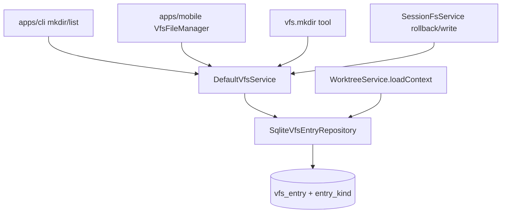

# VFS 目录节点 技术规格（SPEC）

## 设计目标

- 在 `vfs_entry` 持久层区分 **file / directory**，支持 **空目录** 独立存在；`list` 返回直接子目录 + 直接子文件。
- Core 新增 **`mkdir`**、**`ensureParentDirectories`**（写/回滚写文件副作用）；目录路径 **`read` / `write` / `replace` 失败**。
- **去掉** 移动端 `.keep` 新建目录 workaround；存量 `.keep` **保留为普通文件**，不做批量迁移。
- CLI 三域、`vfs.mkdir` Agent 工具、移动端文件管理器与 Core 行为一致。
- Worktree **规则引擎不改**；`loadContext` / 文件管理器 **合并 VFS 显式空目录** 到列表。
- **不** 扩展 session execute / snapshot 录制 `mkdir`；**不** 做 ZIP 空目录语义（见 [vfs-zip-io-agent-tool-policy PRD](../vfs-zip-io-agent-tool-policy/prd.md)）。

---

## 现状与约束（代码探索）

| 项 | 现状 | 本迭代 |
|----|------|--------|
| `vfs_entry` DDL | `path, content, version, mtime_ms, storage_kind, external_uri`；**无** `entry_kind` | 增加 `entry_kind TEXT NOT NULL DEFAULT 'file'`（`'file' \| 'directory'`） |
| `SqliteVfsEntryRepository.list` | 仅返回 **文件路径**；非递归时过滤 `relative` 不含 `/` | 同时返回 **直接子 directory 行**；递归含子目录行 |
| `delete` | `LIKE prefix/%` 判断非空；可删 **文件行**；目录仅作为路径前缀隐式存在 | 目录行非 recursive 时子项含 **文件 + 子目录行**；recursive 删子树含目录行 |
| `grep` / `scanContents` | 扫描全部行的 `content` | **仅** `entry_kind = 'file'` |
| `glob` / `listAllPaths` | 全部 path | **仅 file**（目录不参与 glob） |
| `DefaultVfsService` | 无 `mkdir`；`write` 不建父目录行 | 增加 `mkdir`；`write`/`insert` 前 `ensureParentDirectories` |
| `vfs-errors` | 无 `IS_DIRECTORY` / `ALREADY_EXISTS` | 新增 |
| `createVfsDirectory`（mobile） | `write …/.keep` | 调用 `vfs.mkdir` |
| `VfsFileManager.reload` | `vfs.list` ∪ worktree `buildListRows` 子目录 | `list` 项带 **kind**；未知路径用 `mapVfsListEntry` |
| `buildWorktreeDirSet` | 由 **文件路径 + 规则路径** 推导目录 | **额外**并入 `vfs.list`（递归收集 scope 下 directory 行） |
| `vfs-tools` | `read/write/replace/list/glob/grep`；变更走 `sessionFs.execute` | 增加 **`vfs.mkdir`**（**直连** `vfs.mkdir`，不进批次） |
| `session-fs` rollback | `vfs.write` / `vfs.delete` 仅文件 logicalPath | `write` 经 ensure 父链；**不** delete 无关空目录 |
| `copyVfsTree` / `replaceVfsSubtree` | 仅 `scanContents` 文件行 | 复制/删除 **directory 行**（与文件一并镜像） |
| CLI `nm vfs` / `project vfs` / `session vfs` | 无 `mkdir`；`list` 只打 path | 增加 `mkdir`；`list` 输出 `DIR\t` / `FILE\t` 前缀 |
| Bootstrap | 仅 `CREATE IF NOT EXISTS` | **幂等** `migrateVfsEntryKind`（`PRAGMA` + `ALTER`） |
| 迁移 | — | **不** 从 `.keep` 反推空目录；**不** 为旧文件路径批量 materialize 父目录（仅 **新 write / mkdir / rollback write** 产生目录行） |

**关键代码锚点**

| 模块 | 路径 |
|------|------|
| DDL | `packages/core/src/bootstrap/vfs/vfs-schema.ts` |
| Repository | `packages/core/src/domain/vfs/repositories/impl/sqlite-vfs-entry.repository.ts` |
| Service | `packages/core/src/service/vfs/impl/vfs.service.ts` |
| Port | `packages/core/src/domain/vfs/ports/vfs-service.port.ts` |
| Agent 工具 | `packages/core/src/domain/tool/builtin/vfs-tools.ts` |
| Session 回滚 | `packages/core/src/service/session-fs/impl/session-fs.service.ts` |
| Worktree 列表 | `packages/core/src/service/worktree/impl/worktree.service.ts`（`loadContext`） |
| 树拷贝 | `packages/core/src/domain/vfs/logic/vfs-tree-copy.ts` |
| Mobile 新建目录 | `apps/mobile/src/services/vfs-operations.service.ts` |
| 文件管理器 | `apps/mobile/src/components/vfs/VfsFileManager.tsx` |
| CLI 路由 | `apps/cli/src/main.ts`、`project/vfs.ts`、`session/commands.ts` |

---

## 总体方案

### 架构



### 数据模型

**`vfs_entry.entry_kind`**

| 值 | `content` | `version` | 说明 |
|----|-----------|-----------|------|
| `file` | UTF-8 文本 | 乐观锁递增 | 与现网一致 |
| `directory` | `''`（空串，NOT NULL 满足 DDL） | 固定 `1`（不用于目录冲突检测） | 无用户正文；不参与 grep |

**虚拟根 `/`**

- **不** 持久化 `path='/'` 行；`mkdir` 的父路径为 `/` 时视为父存在。
- `list('/')` 返回直接子项；`delete('/')` → `INVALID_PATH` 或 `NOT_FOUND`（与现网「无根行」一致，SPEC 选 **`INVALID_PATH`**）。

### API 变更（`VfsService`）

```typescript
export type VfsEntryKind = "file" | "directory";

export interface VfsListEntry {
  readonly path: string;
  readonly kind: VfsEntryKind;
}

export interface VfsService {
  list(
    dir: string,
    options?: { recursive?: boolean; maxDepth?: number },
  ): Promise<VfsListEntry[]>;  // 破坏性变更：由 string[] 改为带 kind

  mkdir(path: string): Promise<void>;
  // read/write/replace/delete/glob/grep 签名不变
}
```

**错误码（`VfsErrorCode` 扩展）**

| code | 场景 |
|------|------|
| `IS_DIRECTORY` | 对 directory 行 `read` / `write` / `replace` |
| `ALREADY_EXISTS` | `mkdir` 目标已存在（file 或 directory） |
| `NOT_A_DIRECTORY` | `mkdir` 父路径存在且为 **file** 行 |
| `PARENT_NOT_FOUND` | `mkdir` 父路径不存在（且父 ≠ `/`） |

保留现有 `NOT_FOUND`、`DIRECTORY_NOT_EMPTY`、`CONFLICT` 等。

### 核心语义

#### `mkdir(path)`

1. `normalizePath`；禁止 `path === '/'`。
2. 父路径 `parent = parentDir(path)`；若 `parent !== '/'` 则父必须存在且 `entry_kind === 'directory'`（**若父不存在** → `PARENT_NOT_FOUND`；父为 file 行 → `NOT_A_DIRECTORY`）。
3. 目标不存在 → `insertDirectory`；已存在 → `ALREADY_EXISTS`。
4. **不** `parents: true`（本迭代 PRD 默认）；多级需多次 `mkdir` 或先 `write` 深路径文件触发 ensure。

#### `ensureParentDirectories(path)`（内部，repo 或 domain 纯函数）

- 对文件路径 `path`，自顶向下（`/a` → `/a/b`）对每一级父路径：若无行则 `insertDirectory`；若已有 **file** 行 → `NOT_A_DIRECTORY`；若已有 directory → 跳过。
- 在 **`repo.insert`（新文件）** 与 **`DefaultVfsService.write`**（新建文件分支）之前调用；**不在** `mkdir` 内隐式创建父级（与 PRD 一致）。

#### `list(dir, options)`

- 查询 `path LIKE dir/%`（与现网相同 ESCAPE）。
- **非递归**：返回 `relative` 不含 `/` 的 **file 行 + directory 行**。
- **递归**：返回所有后代 **file + directory** 行（`maxDepth` 按相对段数，与现网文件深度一致，directory 计 1 段）。
- **不** 为「仅有文件、无 directory 行」的旧数据推导隐式父目录（list 仅反映 DB 行）。

#### `read` / `write` / `replace`

- `findByPath` 为 directory → `IS_DIRECTORY`。
- `write` 目标为 file 或 NOT_FOUND：ensure 父链后 insert/update。

#### `delete(path, { recursive })`

- 目标为 **directory 行**：非 recursive 时存在任意 `path LIKE dir/%` 后代（**含子目录行**）→ `DIRECTORY_NOT_EMPTY`；recursive 删除 `dir` 及全部后代行。
- 目标为 **file 行**：行为与现网一致（非 recursive 仅删该 path）。
- 目标 **NOT_FOUND**：`NOT_FOUND`（不因隐式前缀删子文件）。

#### `grep` / `glob`

- SQL / 过滤 `entry_kind = 'file'`。

#### Session FS / Agent

| 操作 | 路径 |
|------|------|
| `vfs.write` / `vfs.replace` | 仍经 `sessionFs.execute`；底层 `write` 触发 ensure |
| `vfs.mkdir` | **直接** `ctx.vfs.mkdir`；**不** 写 execute / snapshot |
| `records rollback` | 仅文件 checkpoint；**不** 删显式空目录；rollback `write` 缺父时 ensure |

#### Worktree 适配

`loadContext` 在构建 `fileSet` 后：

```typescript
// 伪代码：物理前缀下所有 directory 行 → 逻辑路径并入 allDirs
const dirPaths = await repo.listDirectoriesUnderPrefix(physicalPrefix);
for (const p of dirPaths) {
  allDirs.add(toLogicalPath(scope, p));
}
```

- `fileSet` / `scanContents` / `contentByPath`：**仅 file 行**。
- `walkDir` / `evaluateFileDisplay` / 规则算法：**不改**。

#### `.keep`

- 存量与普通文件相同；**grep 可命中**。
- 新建目录 **禁止** 写 `.keep`（mobile / CLI / Agent 均走 `mkdir`）。

#### `copyVfsTree` / `deleteVfsPrefix`

- `listAllPaths` 或专用 `listAllEntries` 含 directory；拷贝时 directory 用 `insertDirectory`，文件用 `insert`/`update`。
- `deleteVfsPrefix`：recursive 删除前缀下 **全部行**（含 directory）。

---

## 最终项目结构

```
packages/core/src/
  bootstrap/vfs/
    vfs-schema.ts              # DDL + entry_kind 迁移语句
    migrate-vfs-entry-kind.ts  # PRAGMA + ALTER（新建）
  domain/vfs/
    model/vfs-entry.ts         # + entryKind
    model/vfs-list-entry.ts    # VfsListEntry（新建）
    logic/ensure-parent-dirs.ts # 纯函数（新建）
    repositories/vfs-entry.port.ts
    repositories/impl/sqlite-vfs-entry.repository.ts
    ports/vfs-service.port.ts
  errors/vfs-errors.ts
  service/vfs/impl/vfs.service.ts
  domain/tool/builtin/vfs-tools.ts
  service/worktree/impl/worktree.service.ts
  domain/vfs/logic/vfs-tree-copy.ts
  bootstrap/novel-master-bootstrap.ts  # 调用 migrate

packages/core/test/vfs/
  directory-nodes.test.ts      # PRD 验收集中测试（新建）
  default-vfs.service.test.ts  # list 返回形状更新
  sqlite-vfs-entry.repository.test.ts

apps/cli/src/vfs/commands/
  mkdir.ts                     # 新建
  list.ts                      # DIR/FILE 前缀输出

apps/mobile/src/
  services/vfs-operations.service.ts
  components/vfs/vfs-row-mapper.ts
  components/vfs/VfsFileManager.tsx

apps/mobile/__tests__/
  vfs-row-mapper.test.ts
  vfs-operations.test.ts       # 可选：mkdir 不调 write（新建）
```

---

## 变更点清单

| # | 文件 | 变更 |
|---|------|------|
| 1 | `vfs-schema.ts` | `CREATE TABLE` 增加 `entry_kind`；导出 `VFS_ENTRY_KIND_MIGRATION` |
| 2 | `migrate-vfs-entry-kind.ts` | `PRAGMA table_info` 无列则 `ALTER TABLE … ADD COLUMN entry_kind TEXT NOT NULL DEFAULT 'file'` |
| 3 | `novel-master-bootstrap.ts` | DDL 循环后调用 `migrateVfsEntryKind(tx)` |
| 4 | `vfs-entry.ts` | `entryKind: 'file' \| 'directory'` |
| 5 | `vfs-entry.port.ts` | `insertDirectory`, `listDirectoriesUnderPrefix?`, `list` → `VfsListEntry[]` |
| 6 | `sqlite-vfs-entry.repository.ts` | 全面适配 kind；实现 `mkdir` 持久化 |
| 7 | `ensure-parent-dirs.ts` | 父链补齐 |
| 8 | `vfs.service.ts` | `mkdir`、kind 守卫、write 前 ensure |
| 9 | `vfs-service.port.ts` + `scoped-vfs.service.ts` | 透传 `mkdir`；`list` 映射逻辑路径 |
| 10 | `vfs-errors.ts` | 新 code + 工厂函数 |
| 11 | `vfs-tools.ts` | `vfs.mkdir` tool |
| 12 | `worktree.service.ts` | `loadContext` 合并 directory 行 |
| 13 | `vfs-tree-copy.ts` | 拷贝 directory 行 |
| 14 | `index.ts` | 导出 `VfsListEntry`, `VfsEntryKind`（若对外） |
| 15 | `apps/cli/.../mkdir.ts` + 三处 `*_VFS_COMMANDS` | 注册 `mkdir`；更新 usage 字符串 |
| 16 | `list.ts` | 打印 `DIR\tpath` / `FILE\tpath` |
| 17 | `vfs-operations.service.ts` | `createVfsDirectory` → `vfs.mkdir`；删除 `DIR_PLACEHOLDER` |
| 18 | `vfs-row-mapper.ts` | `mapVfsListEntry(entry: VfsListEntry)` |
| 19 | `VfsFileManager.tsx` | `reload` 使用 `VfsListEntry` |
| 20 | `renameVfsDirectory` | 递归 list 含目录行；重命名 directory 行（或 delete+mkdir 空目录） |
| 21 | 测试文件 | 见下节 |

---

## 详细实现步骤

### M1 — Schema + Repository + Service（Core）

1. **DDL + 迁移**  
   - 新库：`vfs_entry` 含 `entry_kind TEXT NOT NULL DEFAULT 'file'`。  
   - 旧库：`migrateVfsEntryKind` 幂等 ADD COLUMN。  
   - 文档注释：已有库无列时需迁移或重建（与 chat `hidden` feature 策略一致）。

2. **Repository**  
   - `rowToEntry` 读 `entry_kind`（缺列迁移前仅测试新库）。  
   - `insert` → 仅 `file`；新增 `insertDirectory(path)`。  
   - `list` → `VfsListEntry[]`（SQL 选 `path, entry_kind`）。  
   - `findByPath` 返回完整 `VfsEntry`。  
   - `scanContents` / `listAllPaths`：`WHERE entry_kind = 'file'`。  
   - `delete`：directory 行与非 recursive 子项检测含子目录行。  
   - 新增 `listDirectoryPathsUnderPrefix(physicalPrefix: string): Promise<string[]>` 供 worktree。

3. **`ensure-parent-dirs.ts`**  
   - 输入 `repo` + 文件 `path`；自 `parentDir(path)` 向上至 `/` 逆序创建（实现时从根向下迭代更简单）。

4. **`DefaultVfsService`**  
   - `mkdir` 编排校验 + `repo.insertDirectory`。  
   - `read`/`write`/`replace`：directory 守卫。  
   - `write`：新文件 insert 前 `ensureParentDirectories`；update 不 ensure。  
   - `list` 返回 `VfsListEntry[]`。

5. **`ScopedVfsService`**  
   - 透传 `mkdir`；`list` 映射 logical path + kind。

6. **单测** `directory-nodes.test.ts`：覆盖 PRD §验收（mkdir、空目录 list、delete、IS_DIRECTORY、ensure 父链、grep 跳过目录）。

### M2 — Worktree + 树拷贝

1. `worktree.service.ts` `loadContext`：合并 directory 行到 `allDirs`。  
2. `vfs-tree-copy.ts`：遍历 file + directory；`deleteVfsPrefix` 依赖 recursive delete。  
3. `packages/core/test/worktree/`：空目录 mkdir 后 `buildListRows` 可见 dir 行（可选最小用例）。

### M3 — CLI

1. `apps/cli/src/vfs/commands/mkdir.ts`：`mkdir <path>`，错误映射 `formatCliError`。  
2. `GLOBAL_VFS_COMMANDS` / `PROJECT_VFS_COMMANDS` / `SESSION_VFS_COMMANDS` 增加 `mkdir`。  
3. Usage 字符串：`list|read|write|…|mkdir`。  
4. `list.ts`：TSV 两列或 `DIR`/`FILE` 前缀（脚本可 `awk`）。  
5. CLI e2e（可选）：`nm session vfs mkdir` + `list` 见 `DIR`。

### M4 — Mobile

1. `createVfsDirectory` → `vfs.mkdir`。  
2. `mapVfsListEntry`；`VfsFileManager.reload` 遍历 `VfsListEntry`。  
3. `renameVfsDirectory`：对 `list(..., { recursive: true })` 中 `kind==='directory'` 的路径做重命名（空目录 rename：移动 directory 行 path）。  
4. 手工/单元：`vfs-row-mapper` 增加 directory 映射用例。

### M5 — Agent

1. `vfs-tools.ts` 增加 `vfs.mkdir`（`z.object({ path })`）。  
2. `registerVfsTools` 自动包含。  
3. Core 测试：tool run 后 `list('/')` 含目录项。

### M6 — Session 回滚回归

1. 扩展 `session-fs.service.test.ts`：  
   - mkdir `/drafts` + 批次 write/delete `/drafts/a.md` → rollback 后 `/drafts` 仍在。  
   - 无 `/drafts` 行时 rollback write → 创建 `/drafts` directory。  
   - mkdir `/empty` 不受其它批次 rollback 影响。  
2. **不** 改 execute 表结构。

### M7 — 文档

- CLI help / `nm vfs` usage 一行说明：目录不可 read/write。  
- （可选）`.apm/kb` 交叉链接 vfs-zip-io：空目录 ZIP 不在本迭代。

---

## 测试策略

### 自动化

| 包 | 命令 | 范围 |
|----|------|------|
| core | `npm test -w packages/core` | vfs + session-fs + worktree 相关 |
| cli | `npm test -w apps/cli` | 若有 vfs e2e |
| mobile | `npm test -w apps/mobile` | vfs-row-mapper、vfs-operations |

### 测试用例（映射 PRD 验收）

| ID | 场景 | 断言 |
|----|------|------|
| T1 | `mkdir /drafts` | `list /` 含 `{path:'/drafts',kind:'directory'}`；无 `.keep` |
| T2 | 仅空目录 | `list /drafts` 为 `[]` |
| T3 | `delete /drafts` 非 recursive | 成功；`list /` 无 `/drafts` |
| T4 | `/drafts/a.md` 存在 | 非 recursive delete `/drafts` → `DIRECTORY_NOT_EMPTY`；recursive → 子树清空 |
| T5 | directory 上 read/write | `IS_DIRECTORY` |
| T6 | 存量 `/foo/.keep` file | 升级迁移后 read/list 不变 |
| T7 | `vfs.mkdir` tool | Agent 路径创建目录 |
| T8 | rollback 保留 mkdir 目录 | session-fs 测试 |
| T9 | rollback write ensure 父链 | 无 `/drafts` 行时 write 成功并创建 directory |
| T10 | grep | directory 行无匹配；`.keep` 文件可匹配 |
| T11 | glob | 不匹配 directory path |
| T12 | `mkdir` 父不存在 | `PARENT_NOT_FOUND` |
| T13 | worktree `buildListRows` | 显式空目录出现在 dir 行 |

---

## 风险与回滚方案

| 风险 | 缓解 |
|------|------|
| `list` 返回类型由 `string[]` → `VfsListEntry[]` 破坏内部调用方 | 单仓内 grep `vfs.list` 全量改完；Agent tool outputSchema 同步 |
| 旧 DB 无 `entry_kind` | `migrateVfsEntryKind`；测试 `:memory:` 走完整 bootstrap |
| 旧数据无父 directory 行，list 不见中间目录 | PRD 接受；用户 `mkdir` 或 rewrite 文件触发 ensure |
| worktree 双源目录（推导 + 显式）重复 | `allDirs` 用 `Set`；同 path 不重复插入 |
| `renameVfsDirectory` 漏移 directory 行 | 单测：空目录 rename 后 list 新路径 |
| session rollback 误删空目录 | 回滚仅 `delete` 文件 logicalPath；不 `delete` 父目录 |

**回滚（实现迭代）**

1. 还原代码发布。  
2. DB：**不强制**删 `entry_kind` 列；旧代码忽略未知列需评估——若回滚代码版本不识 `entry_kind`，应保留迁移列（SQLite 可留空列）。安全回滚为 **恢复代码 + 目录行可留 DB**（旧版 list 仍把 directory 行当 file 读 content='' 可能异常）→ 生产建议 **前向修复** 而非删列。  
3. 移动端若已去掉 `.keep`，回滚版本会再次写 `.keep`（仅影响新目录）。

---

## 与 vfs-zip-io 迭代的接口

- 本迭代结束后，ZIP SPEC 再定义：空 directory 行是否写入 ZIP、导入是否 `mkdir` materialize。  
- 本迭代 **导出** 行为不变（尚无 ZIP）；目录行对 zip-io **无代码依赖**。

---

## 已确认口径（2026-06-01）

| # | 口径 | SPEC 落点 |
|---|------|-----------|
| 1 | `list` 返回 `VfsListEntry[]`（含 `kind`），单仓内同步 CLI / Mobile / Agent | §API 变更、`list` 语义、变更点 #9/#16/#18 |
| 2 | 旧库仅 `migrateVfsEntryKind` 加列；**不**批量 materialize 父目录、**不**从 `.keep` 反推空目录 | §现状迁移行、M1 DDL、§风险 |
| 3 | `mkdir` **不** `parents: true`；父须已存在（根 `/` 虚拟存在） | §`mkdir` 语义 |

**Session 文件回滚（产品，非发布回滚）**：`records rollback` 不撤销显式 `mkdir` 的空目录；rollback `write` 缺父时 `ensureParentDirectories`；不连带删除无关空目录（与 PRD「文件回滚与目录节点」一致）。

---

## 实现检查清单（编码前）

- [x] 已读 `prd.md`  
- [x] 已探索 Core / CLI / Mobile / Agent / Worktree / SessionFs  
- [x] **用户确认本 SPEC**（口径 1–3，2026-06-01）后再进入 M1 编码
