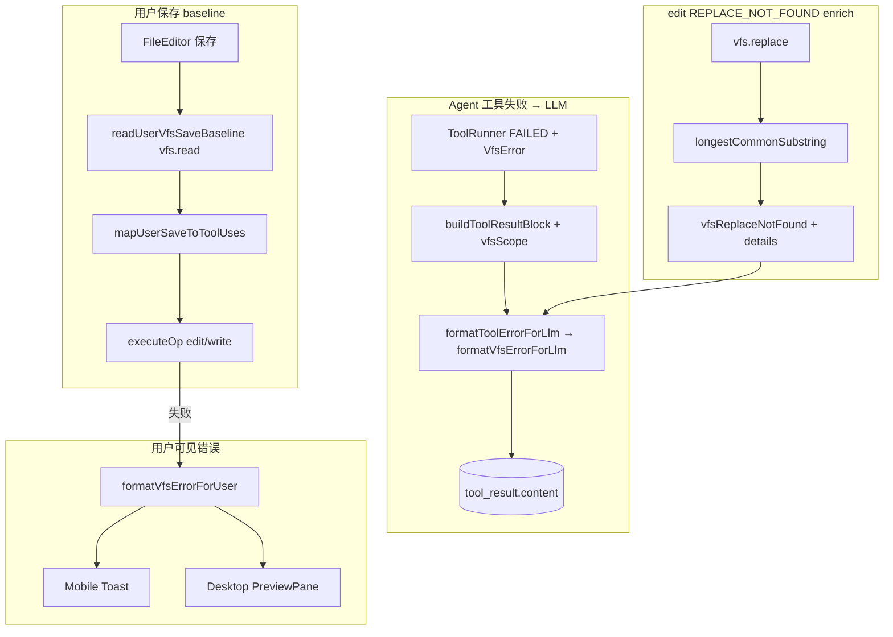

# VFS 工具错误诊断与保存失败修复 技术规格（SPEC）

> **PRD**：`.apm/kb/docs/Iterations/vfs-tool-error-diagnostics/prd.md`  
> **前置**：`chat-rollback-vfs-tool-fixes/spec.md`（`formatToolErrorForLlm` 单点）、`vfs-user-ops-unified-tool-turn/spec.md`（user ops 两阶段）、`mobile-user-ops-logging-project-workspace-back/spec.md`（诊断日志，本期行为修复）  
> **建议分支**：`fix/vfs-tool-error-diagnostics`

## 设计目标

- **LLM 路径脱敏**：Agent 工具失败写入历史的 `tool_result.content` 使用**逻辑路径**，不含 `/projects/{id}/sessions/{id}/` 物理前缀。
- **write 失败可分类**：LLM 可见文案含明确失败类别（`NOT_FOUND`、`CONFLICT`、`IS_DIRECTORY` 等）与关键上下文（版本号等）。
- **edit 失败可定位**：`REPLACE_NOT_FOUND` 时附带 **最长公共子串**（Longest Common Substring，连续可搜片段）、出现次数；低于阈值时提示「几乎无匹配，建议 read 后重试」。
- **保存 baseline 双端一致**：Mobile 与 Desktop 均在保存瞬间以**磁盘当前内容**作为 `mapUserSaveToToolUses` 的 baseline。
- **保存失败中文反馈**：user VFS turn execute 失败时，Mobile Toast / Desktop 编辑器展示可理解中文说明；Desktop 补齐当前静默失败缺口。
- **Agent 工具卡语义对齐**：终态失败卡片摘要与 LLM `content` 同源（逻辑路径 + 分类语义）。

## 现状与约束（代码探索）

| 模块 | 现状 | 本迭代改动 |
|------|------|------------|
| `formatToolErrorForLlm` | 透传 `VfsError.message`；无 code、无 scope | 新增 `formatVfsErrorForLlm`；接收 `VfsScope` |
| `buildToolResultBlock` | 调用 formatter 无 scope | 扩展 meta 传入 `vfsScope` |
| `agent-runner` | 落库 tool result 无 scope | 传入 `{ kind:"session", projectId, sessionId }` |
| `ScopedVfsService` | 成功路径 `toLogicalPath`；异常原样上浮 | 不改（格式化层统一处理） |
| `revision-aware-vfs` / `vfs.service` `replace` | `vfsReplaceNotFound(path)` 无诊断 | enrich details + 共享 helper |
| `vfs-errors.ts` | `REPLACE_NOT_FOUND` 仅 path | 可选 `details` 字段 |
| Mobile `sessionSaveVfsFile` | baseline = 调用方 `savedContent` | 保存前 `vfs.read` |
| Desktop `handleVfsWrite` | `readBaselineContent` 内联于 IPC | 下沉 Core helper |
| Mobile `format-error` | VfsError 直接英文 message | 接入 `formatVfsErrorForUser` |
| Desktop `PreviewPane.save` | `!result.ok` 无 UI | Toast + 中文错误 |
| Mobile/Desktop `message-blocks` | 失败卡未读 `summary` | 优先 `summary` 或等价格式化 |

**关键代码位置**

```
packages/core/src/domain/tool/logic/format-tool-output.ts
packages/core/src/domain/tool/logic/build-tool-result-block.ts
packages/core/src/service/agent/impl/agent-runner.ts
packages/core/src/errors/vfs-errors.ts
packages/core/src/domain/vfs/logic/vfs-path-mapper.ts
packages/core/src/domain/vfs/logic/longest-common-substring.ts          (新建)
packages/core/src/domain/vfs/logic/read-user-vfs-save-baseline.ts       (新建)
packages/core/src/domain/vfs/logic/format-vfs-error-for-user.ts         (新建)
packages/core/src/service/vfs/impl/revision-aware-vfs.service.ts
packages/core/src/service/vfs/impl/vfs.service.ts
apps/mobile/src/services/vfs-operations.service.ts
apps/mobile/src/screens/stack/FileEditorScreen.tsx
apps/mobile/src/errors/format-error.ts
apps/desktop/src/main/ipc/handlers/vfs.ts
apps/desktop/renderer/layout/PreviewPane.tsx
apps/mobile/src/components/chat/message-blocks.ts
apps/desktop/renderer/features/chat/message-blocks.ts
```

## 总体方案



### 1. LLM 错误格式化（路径脱敏 + write 分类 + edit 子串）

**单点扩展**：在 `format-tool-output.ts` 新增内部函数 `formatVfsErrorForLlm(vfsError: VfsError, scope: VfsScope): string`，由 `formatToolErrorForLlm(error, options?)` 调用。

**路径**：优先 `vfsError.path` + `toLogicalPath(scope, path)`；若 `path` 缺失且 `scope` 亦不可用，则从 `message` 中 strip 已知物理前缀（兜底，不尝试解析 UUID）：

```typescript
// format-vfs-error-for-llm 内部兜底（path 缺失时）
const SESSION_PHYSICAL_PREFIX =
  /\/projects\/[^/]+\/sessions\/[^/]+(?=\/|$)/g;
const PROJECT_TEMPLATE_PREFIX =
  /\/projects\/[^/]+\/template(?=\/|$)/g;
const GLOBAL_TEMPLATE_PREFIX = /\/template(?=\/|$)/g;

function stripKnownPhysicalPrefixes(message: string): string {
  return message
    .replace(SESSION_PHYSICAL_PREFIX, "")
    .replace(PROJECT_TEMPLATE_PREFIX, "")
    .replace(GLOBAL_TEMPLATE_PREFIX, "");
}
```

**write / 通用 VfsError 文案模板**（英文，便于 LLM 解析；`Error:` 前缀仍由外层添加）。码表与 `packages/core/src/errors/vfs-errors.ts` 中 `VfsErrorCode` **一一对应**；未单独列出的码走默认行：

| `VfsError.code` | 输出形态（示例） |
|---------------|------------------|
| `NOT_FOUND` | `[NOT_FOUND] Path not found: /foo.md` |
| `CONFLICT` | `[CONFLICT] Version conflict for /foo.md: expected 1, actual 2` |
| `IS_DIRECTORY` | `[IS_DIRECTORY] Path is a directory: /dir` |
| `INVALID_PATH` | `[INVALID_PATH] Invalid path /foo: reason` |
| `NOT_A_DIRECTORY` | `[NOT_A_DIRECTORY] Not a directory: /parent` |
| `PARENT_NOT_FOUND` | `[PARENT_NOT_FOUND] Parent not found: /parent/child.md` |
| `DIRECTORY_NOT_EMPTY` | `[DIRECTORY_NOT_EMPTY] Directory not empty: /dir` |
| `ALREADY_EXISTS` | `[ALREADY_EXISTS] Path already exists: /foo.md` |
| `REPLACE_NOT_FOUND` | 见 §1.1 |
| `INVALID_ARGUMENT`（ToolError） | 保持现有 zod issues 分支 |
| **其他 / 未列码** | `[{code}] {stripKnownPhysicalPrefixes(message)}` |

**传参链**：

```typescript
// build-tool-result-block.ts
type BuildToolResultBlockMeta = {
  toolName?: string;
  vfsScope?: VfsScope;  // 新增
};

// agent-runner.ts — toolResults 映射处（与 run() 顶部 `const { sessionId, projectId } = options` 一致）
buildToolResultBlock(tu.id, parallelOutcomes[i]!, {
  toolName: tu.name,
  vfsScope: { kind: "session", projectId, sessionId },
});
```

global / project scope Agent 若存在，按 `toolCtx` 构造对应 `VfsScope`（本期验收以 session 为主，project scope 同样传入 `{ kind:"project", projectId }`）。

#### 1.1 edit REPLACE_NOT_FOUND 文案

当 `vfsError.details` 含 LCS 诊断时：

```
[REPLACE_NOT_FOUND] Replace string not found in /foo.md.
Longest matching substring in file (length=N, occurrences=M): "<snippet>"
Use this substring to locate the edit region and adjust oldString (e.g. whitespace/newlines).
```

- `occurrences`：`countOccurrences(fileContent, substring)`。
- `M > 1` 时追加：`Substring appears M times; ensure oldString is unique or include more context.`

**低匹配阈值**：`MIN_LCS_LENGTH = 4`（常量，放 `longest-common-substring.ts`）。当最长公共子串长度 `< 4`：

```
[REPLACE_NOT_FOUND] Replace string not found in /foo.md.
Almost no matching text in file (longest common substring length=L). Re-read the file with read, then retry edit.
```

**子串展示上限**：`MAX_LCS_SNIPPET_CHARS = 200`；超出截断并追加 `…`。

#### 1.2 最长公共子串算法

新建 `packages/core/src/domain/vfs/logic/longest-common-substring.ts`：

```typescript
export type LongestCommonSubstringResult = {
  readonly substring: string;
  readonly length: number;
};

export function longestCommonSubstring(a: string, b: string): LongestCommonSubstringResult;
export function countOccurrences(haystack: string, needle: string): number;
```

- 算法：标准 DP 或后缀数组；对 edit 场景文件 ≤ 50KB read 上限，性能可接受。
- **并列最长**时取**在 fileContent 中首次出现位置最靠前**的子串（确定性 tie-break）。

#### 1.3 replace 层 enrich

抽取 `packages/core/src/domain/vfs/logic/compute-replace-not-found-error.ts`：

```typescript
export function buildReplaceNotFoundError(
  path: string,
  fileContent: string,
  oldString: string,
): VfsError;
```

`revision-aware-vfs.service.ts` 与 `vfs.service.ts` 的 `replace` 在 `indexOf === -1` / `includes === false` 时调用，替代直接 `vfsReplaceNotFound(path)`。

扩展 `vfs-errors.ts`：

```typescript
export type VfsReplaceNotFoundDetails = {
  readonly oldStringLength: number;
  readonly longestCommonSubstring: string;
  readonly lcsLength: number;
  readonly lcsOccurrences: number;
};

export function vfsReplaceNotFound(
  path: string,
  details?: VfsReplaceNotFoundDetails,
): VfsError;
```

`VfsError` 增加可选 `details?: unknown`（或 typed union）；`formatVfsErrorForLlm` 读取 `REPLACE_NOT_FOUND` + details。

### 2. 用户保存 baseline 对齐

#### 2.1 Core helper

新建 `readUserVfsSaveBaseline(vfs: VfsService, path: string): Promise<string | null>`：

```typescript
export async function readUserVfsSaveBaseline(
  vfs: VfsService,
  path: string,
): Promise<string | null>;
```

**语义（与 Desktop 现行 `readBaselineContent` 意图对齐，但修正错误吞没）**：

| 结果 | 行为 |
|------|------|
| `vfs.read` 成功 | 返回 `content` |
| `VfsError` 且 `code === "NOT_FOUND"` | 返回 `null`（新文件 → write 路径） |
| 其他任何错误（含 `CONFLICT`、`REPLACE_NOT_FOUND` 等） | **原样抛出**，由上层 UI / IPC 展示 |

Desktop `apps/desktop/src/main/ipc/handlers/vfs.ts` 内联 `readBaselineContent`（L81–91）现行 `catch { return null }` 会吞掉非 `NOT_FOUND` 错误；**本期删除该函数**，`handleVfsWrite` 直接调用 Core helper（或一行薄包装转发，不得恢复全 catch）。

#### 2.2 Mobile 改动

`sessionSaveVfsFile` 签名调整：

```typescript
export async function sessionSaveVfsFile(
  runtime: MobileNovelMasterRuntime,
  sessionId: string,
  vfs: VfsService,           // 新增：保存前读盘
  path: string,
  content: string,
  versionOptions?: UserVfsSaveVersionOptions,
  lastKnownContent?: string | null,  // 可选：仅 §2.3 漂移日志，不作 baseline
): Promise<void>
```

- 内部：`const baseline = await readUserVfsSaveBaseline(vfs, path)`。
- **移除** `baseline` 入参；`FileEditorScreen` 传 `savedContent` 作 `lastKnownContent`（若启用漂移日志），**不得**再作 mapping baseline。
- 成功路径不变：更新 `savedContent`、`vfs.read` 刷新 version。

#### 2.3 并发改文件策略（PRD 验收 4）

**本期采用策略 A（与 Desktop 现行一致）**：

- baseline = 保存瞬间磁盘内容 **B**。
- 用户目标全文 **C** 来自编辑器。
- `mapUserSaveToToolUses(B, C)` → edit / write；执行时将磁盘 **B** 改为 **C**。
- **含义**：用户保存会覆盖编辑期间 Agent 对同一文件的改动（与 Desktop 今日行为一致）。

**可选增强（非 blocking）**：若编辑器持有的「上次读盘快照」`lastKnownContent !== baseline`（磁盘已被外部修改），保存成功前记 `[user-vfs-turn] external_drift_detected`；**不阻塞保存**。触发点：

| 模块 | 触发时机 |
|------|----------|
| Mobile `sessionSaveVfsFile` | `readUserVfsSaveBaseline` 返回 `baseline` 后，若调用方传入的 `lastKnownContent`（仅漂移检测，**不作** mapping baseline）`!== baseline`，`console.info` |
| Desktop `handleVfsWrite` | 同上：`readUserVfsSaveBaseline` 后，若 IPC 请求可选字段 `lastKnownContent`（PreviewPane 传 `savedContent`）`!== baseline`，`console.info` |

**不在本期**：弹窗确认覆盖 Agent 改动（策略 B）、强制 abort（策略 C）。

#### 2.4 多 hunk 串行

baseline 对齐后，若仍出现第二 hunk `REPLACE_NOT_FOUND`（相邻锚点破坏），本期 **不** 改 `user-vfs-save-mapping` 算法；记录为已知限制。若单测复现则加 `T-MAP-08` 回归用例备查。

### 3. 用户可见错误（中文）

新建 `format-vfs-error-for-user.ts`，与 LLM formatter **分离**：

```typescript
import type { VfsScope } from "../vfs/logic/vfs-path-mapper.js";

/** 终端用户可见中文文案；与 formatVfsErrorForLlm 分离。 */
export function formatVfsErrorForUser(error: unknown, scope?: VfsScope): string;
```

**行为**：

1. **ToolError unwrap**：若 `error` 为 `ToolError` 且 `cause` 为 `VfsError`，按 `VfsError` 分支处理（与 `formatToolErrorForLlm` 一致）。
2. **VfsError 分支**：按码表映射中文；路径优先 `vfsError.path` + `toLogicalPath(scope, path)`。
3. **`scope` 缺省**：不做路径 remap；使用 `vfsError.path` 原值，或从 `message` 经 `stripKnownPhysicalPrefixes`（§1 同款 regex）清理后作为展示片段。
4. **IPC 形态**：Desktop renderer 收到 `IpcErrorPayload`（`{ code, message }`）时，可构造等价 `VfsError` 再传入，或扩展 helper 识别 `{ code: string; message: string }` 形态（实现择一，须产出中文）。

| `VfsError.code` | 用户文案（中文） |
|-----------------|------------------|
| `REPLACE_NOT_FOUND` | 文件内容已变更，无法应用本次修改。请刷新文件后重新编辑。 |
| `CONFLICT` | 文件版本冲突，请刷新后重试。 |
| `NOT_FOUND` | 文件不存在或已被删除。 |
| 其他 | 操作失败：{逻辑路径或 strip 后的简短原因} |

**Mobile**：`format-error.ts` 的 `VfsError` 分支改为调用 Core `formatVfsErrorForUser`（经 `@novel-master/core` export），不再直接返回英文 `error.message`。

**Desktop**：

- `PreviewPane.save`：`showToast` 签名为 `showToast(message: string)`（见 `apps/desktop/renderer/components/ui/toast-bus.ts`），**不得**使用 `{ title, message }` 对象形态。
- `result.error` 为 `IpcErrorPayload`（非 Zod JSON 字符串）；**不得**复用 renderer 侧 Zod 专用 `formatUserError(message: string)`（`apps/desktop/renderer/utils/format-user-error.ts`）。
- 推荐伪代码：

```typescript
import { formatVfsErrorForUser } from "@novel-master/core";
import { showToast } from "@/components/ui/show-toast";
import { vfsScope } from "@/ipc/client";

// PreviewPane.save
if (!result.ok) {
  const scope = vfsScope(previewFile.workspaceScope, projectId, sessionId);
  const msg = formatVfsErrorForUser(
    { code: result.error.code, message: result.error.message },
    scope,
  );
  showToast(`保存失败：${msg}`);
}
```

- IPC `formatIpcError` 仍返回英文 `message` 供日志；用户可见中文由 renderer 侧 `formatVfsErrorForUser` 生成。

### 4. Agent 工具卡与 LLM 一致

`buildToolResultBlock` 失败路径已写 `summary = summarizeToolError(content)`（去 `Error:` 截断 120 字）；成功路径写 `summarizeToolSuccess`。持久化字段为 `ToolResultBlock.summary`。

**双端 `message-blocks.ts` 触点（Mobile + Desktop 结构对称）**：

1. **`ToolCallView` 扩展** — 新增可选字段：

```typescript
export interface ToolCallView {
  readonly toolUseId: string;
  readonly name: string;
  readonly input: Record<string, unknown>;
  readonly status: ToolCallStatus;
  readonly resultContent?: string;
  readonly summary?: string;   // 新增：来自 tool_result.summary
}
```

2. **`toolCallViewFromUse`** — 配对 `tool_result` 时传入 `summary`：

```typescript
return {
  toolUseId: use.id,
  name: use.name,
  input: use.input,
  status: toolStatusFromResult(result),
  resultContent: result.content,
  ...(result.summary != null ? { summary: result.summary } : {}),
};
```

3. **`toolCallSummary`** — 失败卡副标题优先 persisted summary（与 LLM 诊断同源），再 fallback 至 input 路径 / `resultContent` 截断：

```typescript
export function toolCallSummary(tool: ToolCallView): string {
  if (tool.status === "error" && tool.summary) {
    return tool.summary;
  }
  const fromInput = summarizeToolInput(tool.name, tool.input);
  if (fromInput) {
    return fromInput;
  }
  if (tool.resultContent) {
    const t = tool.resultContent.trim();
    return t.length > 120 ? `${t.slice(0, 117)}…` : t;
  }
  return "";
}
```

- `ToolCallCard` 已通过 `toolCallSummary(tool)` 渲染副标题，无需改组件 props；成功路径仍展示 input 路径 / 成功 summary。

## 最终项目结构

```
packages/core/src/
  domain/
    vfs/logic/
      longest-common-substring.ts          # 新建
      compute-replace-not-found-error.ts   # 新建
      read-user-vfs-save-baseline.ts       # 新建
      format-vfs-error-for-user.ts         # 新建
    tool/logic/
      format-tool-output.ts                # 扩展
      build-tool-result-block.ts           # 扩展 meta
  errors/
    vfs-errors.ts                          # details 扩展
  service/
    vfs/impl/
      revision-aware-vfs.service.ts        # replace enrich
      vfs.service.ts                       # replace enrich
    agent/impl/
      agent-runner.ts                      # 传 vfsScope

packages/core/test/
  vfs/longest-common-substring.test.ts     # 新建
  vfs/read-user-vfs-save-baseline.test.ts  # 新建
  vfs/save-baseline-parity.test.ts         # 新建
  tool/format-tool-output.test.ts          # 扩展
  agent/agent-runner.test.ts               # 扩展
  tool/build-tool-result-block.test.ts     # 扩展
  chat/user-vfs-turn.service.test.ts       # 扩展

apps/mobile/src/
  services/vfs-operations.service.ts
  screens/stack/FileEditorScreen.tsx
  errors/format-error.ts
  components/chat/message-blocks.ts

apps/mobile/__tests__/
  format-error.test.ts                     # 扩展
  vfs-save-baseline.test.ts                # 新建（可选）

apps/desktop/
  src/main/ipc/handlers/vfs.ts
  renderer/layout/PreviewPane.tsx
  renderer/features/chat/message-blocks.ts
```

## 变更点清单

| 文件 | 变更 |
|------|------|
| `longest-common-substring.ts` | 最长公共子串 + 出现次数 |
| `compute-replace-not-found-error.ts` | replace 失败统一 enrich |
| `vfs-errors.ts` | `VfsError.details`；`vfsReplaceNotFound` 签名 |
| `revision-aware-vfs.service.ts` / `vfs.service.ts` | replace 失败调用 helper |
| `format-tool-output.ts` | `formatVfsErrorForLlm`；`formatToolErrorForLlm(error, { vfsScope })` |
| `build-tool-result-block.ts` | meta.vfsScope → formatter |
| `agent-runner.ts` | 传入 session/project scope |
| `read-user-vfs-save-baseline.ts` | 保存 baseline 读盘；NOT_FOUND→null，其余抛出 |
| `format-vfs-error-for-user.ts` | `formatVfsErrorForUser(error, scope?)` 中文用户错误 |
| `packages/core/src/index.ts`（或子 path export） | export 用户 formatter + baseline helper |
| `vfs-operations.service.ts` | 读盘 baseline；签名变更；可选漂移日志 |
| `FileEditorScreen.tsx` | 适配新 `sessionSaveVfsFile`；传 `lastKnownContent` |
| `format-error.ts` | VfsError 分支接入 `formatVfsErrorForUser` |
| `vfs.ts` (Desktop IPC) | 删除 `readBaselineContent` 全 catch；改用 Core helper |
| `PreviewPane.tsx` | 保存失败 `showToast(\`保存失败：${...}\`)`；传 `lastKnownContent` |
| `message-blocks.ts` (双端) | `ToolCallView.summary`；`toolCallViewFromUse` / `toolCallSummary` |
| 测试文件 | 见测试策略 |

## 兼容性与迁移

- **`formatToolErrorForLlm(error)` 单参数调用**：保留；`vfsScope` 可选。无 scope 时 **不** 做路径 remap（CLI 测试场景）；Agent 路径 **必须** 传 scope。
- **`sessionSaveVfsFile` 签名破坏性变更**：仅 Mobile 内部调用方 `FileEditorScreen`；无外部 API。
- **`VfsError.details`**：新增可选字段，现有 `isVfsError` / `code` 判断不变。
- **chat-rollback 回归**：不得回退为 `Error: Tool failed: write`；现有 unwrap 行为保留。

## 详细实现步骤

- Step 1 — phase-lcs-algorithm — blocking: yes — qa: auto：实现 `longest-common-substring.ts` + `longest-common-substring.test.ts`（T-LCS-01～04）
- Step 2 — phase-replace-enrich — blocking: yes — qa: auto：实现 `compute-replace-not-found-error.ts`；扩展 `vfs-errors.ts`；改 `revision-aware-vfs.service.ts` 与 `vfs.service.ts` replace 分支
- Step 3 — phase-llm-error-format — blocking: yes — qa: auto：实现 `formatVfsErrorForLlm`；扩展 `formatToolErrorForLlm` / `buildToolResultBlock` / `agent-runner` 传 scope；更新 `format-tool-output.test.ts`（T-ERR-01～08）
- Step 4 — phase-agent-integration — blocking: yes — qa: auto：扩展 `agent-runner.test.ts` write CONFLICT、edit REPLACE_NOT_FOUND + LCS、无 `/projects/` 断言（T-AR-01～05）；升级 read 失败用例（T-AR-05 / R-AR-01）
- Step 5 — phase-baseline-helper — blocking: yes — qa: auto：实现 `readUserVfsSaveBaseline` + 单测（T-BL-03、T-BL-04）；Desktop `vfs.ts` 删除 `readBaselineContent` 全 catch，改用 helper
- Step 6 — phase-mobile-save — blocking: yes — qa: auto：改 `sessionSaveVfsFile` / `FileEditorScreen`；新增 `save-baseline-parity.test.ts`（T-BL-01～03）
- Step 7 — phase-user-error-format — blocking: yes — qa: auto：实现 `format-vfs-error-for-user.ts`；Mobile `format-error.ts` + 单测（T-M-TOAST-01～03）
- Step 8 — phase-desktop-save-ui — blocking: yes — qa: auto：`PreviewPane` 保存失败 Toast；IPC 错误路径复用 Core formatter
- Step 9 — phase-tool-card-summary — blocking: no — qa: auto：双端 `message-blocks.ts` 失败卡展示 `summary`；`build-tool-result-block.test.ts`（T-BTRB-01）
- Step 10 — phase-user-vfs-turn-test — blocking: no — qa: auto：`user-vfs-turn.service.test.ts` REPLACE_NOT_FOUND execute 失败不写 pending（T-UVT-01）
- Step 11 — phase-manual-acceptance — blocking: no — qa: manual_user：Mobile Android + Desktop 双端验收（M-01～06）

## 测试策略

### 单元 / 集成（auto）

| ID | 映射 Step | 描述 |
|----|-----------|------|
| T-LCS-01 | 1 | 空格差异：`hello { return 1` vs `hello {    return 1` → 非空子串 |
| T-LCS-02 | 1 | 几乎无关字符串 → length &lt; 4 |
| T-LCS-03 | 1 | 子串在 file 中出现 2 次 → countOccurrences=2 |
| T-LCS-04 | 1 | 超 200 字符截断 |
| T-ERR-01 | 3 | session scope 物理 path VfsError → 逻辑 path，无 `/projects/` |
| T-ERR-02 | 3 | CONFLICT 含 `[CONFLICT]` + expected/actual |
| T-ERR-03 | 3 | NOT_FOUND 含 `[NOT_FOUND]` |
| T-ERR-04 | 3 | REPLACE_NOT_FOUND + details → 含 LCS snippet + occurrences |
| T-ERR-05 | 3 | LCS &lt; 4 → almost no matching 文案 |
| T-ERR-06 | 3 | INVALID_ARGUMENT zod 回归（R-ERR-01） |
| T-ERR-07 | 3 | 无 cause ToolError 回归（R-ERR-02） |
| T-ERR-08 | 3 | unwrap VfsError 回归（R-ERR-03） |
| T-AR-01 | 4 | agent-runner edit 失败 tool_result 无物理前缀 |
| T-AR-02 | 4 | agent-runner write 版本冲突含 `[CONFLICT]` |
| T-AR-03 | 4 | edit 失败 content 含最长公共子串 |
| T-AR-04 | 4 | 不得等于 `Error: Tool failed: edit`（R-AR-01 扩展） |
| T-AR-05 | 4 | **替换** `agent-runner.test.ts` L861 弱断言：原 `includes("/missing.txt")` 改为断言 `[NOT_FOUND]` 分类 + 逻辑路径 `/missing.txt`，且 `content` 不含 `/projects/` |
| T-BL-01 | 6 | 磁盘 B、内存 A、content C：Mobile 新策略与 Desktop 映射结果一致 |
| T-BL-02 | 6 | 无外部写入：edit 路径不 REPLACE_NOT_FOUND |
| T-BL-03 | 5 | readUserVfsSaveBaseline NOT_FOUND → null |
| T-BL-04 | 5 | readUserVfsSaveBaseline 非 NOT_FOUND（如 CONFLICT）→ **抛出**，不得返回 null |
| T-M-TOAST-01 | 7 | REPLACE_NOT_FOUND → 中文含「刷新」 |
| T-M-TOAST-02 | 7 | CONFLICT → 中文版本冲突 |
| T-BTRB-01 | 9 | 失败 block summary 与 content 语义一致 |
| T-UVT-01 | 10 | executeOp edit 失败无 pending |

### 手工验收（manual_user，合并后用户执行）

| ID | 映射 Step | 描述 |
|----|-----------|------|
| M-01 | 11 | Mobile 会话 Agent：故意 edit 失败 → 下一轮模型上下文无 UUID 物理路径（查日志或 prompt 预览） |
| M-02 | 11 | Mobile 会话 Agent：edit 空格差异失败 → tool 卡/历史含相似片段提示 |
| M-03 | 11 | Mobile FileEditor：打开文件 → Agent 改同一文件 → 用户保存 → 不 REPLACE_NOT_FOUND |
| M-04 | 11 | Mobile FileEditor：故意触发保存失败 → Toast 中文可理解 |
| M-05 | 11 | Desktop 同上 M-03、M-04 |
| M-06 | 11 | Desktop Agent write 版本冲突 → tool result 含 `[CONFLICT]` |

### 回归清单

- R-ERR-01～03：`format-tool-output.test.ts` 现有 3 条
- R-AR-01：`agent-runner` read 失败用例 — **升级** L859–862：除 `includes("Error:")` 外，须断言 `[NOT_FOUND]` 与逻辑路径、无物理前缀（见 T-AR-05）
- R-VT-01：`vfs-tools` write 覆盖成功路径

## 风险与回滚方案

| 风险 | 缓解 | 回滚 |
|------|------|------|
| LCS 诊断 token 过长 | 200 字符截断 + 阈值 fallback | 关闭 details 渲染，仅保留 `[REPLACE_NOT_FOUND]` |
| 策略 A 覆盖 Agent 改动 | 与 Desktop 一致；日志 `external_drift_detected` | 恢复 Mobile 旧 baseline（不推荐） |
| `formatToolErrorForLlm` 签名变更 | scope 可选，默认行为兼容 CLI | revert formatter 提交 |
| 多 hunk 仍失败 | 文档已知限制；后续迭代改 mapping | — |
| Desktop Toast 依赖 IPC 错误形态 | 单测 + 手工 M-05 | revert PreviewPane 改动 |

**回滚顺序**：Step 9（UI 卡）→ Step 8（Desktop Toast）→ Step 6～7（Mobile）→ Step 3～4（LLM format）→ Step 2（replace enrich）→ Step 1（LCS）。

## Context Bundle

```yaml
iteration_name: vfs-tool-error-diagnostics
requirement_path: Iterations/vfs-tool-error-diagnostics/prd.md
spec_path: Iterations/vfs-tool-error-diagnostics/spec.md
explore_summary: |
  formatToolErrorForLlm 透传物理路径；Mobile baseline=savedContent vs Desktop read-at-save；
  replace 失败无 LCS；Desktop PreviewPane 保存失败无 UI
impact_files:
  - packages/core/src/domain/tool/logic/format-tool-output.ts
  - packages/core/src/service/agent/impl/agent-runner.ts
  - packages/core/src/service/vfs/impl/revision-aware-vfs.service.ts
  - apps/mobile/src/services/vfs-operations.service.ts
  - apps/desktop/renderer/layout/PreviewPane.tsx
constraints:
  - MIN_LCS_LENGTH=4, MAX_LCS_SNIPPET_CHARS=200
  - 保存并发策略 A（磁盘 baseline）
  - LLM 与用户错误 formatter 分离
blocking_steps: [1, 2, 3, 4, 5, 6, 7, 8]
```
