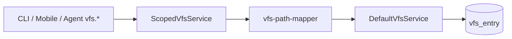

# VFS 统一根路径（对齐 ST-VFS）技术规格（SPEC）

## 设计目标

- **对外逻辑路径**：global / project / session 三域均使用以 `/` 为唯一根的绝对路径（如 `/readme.md`、`/ddd/love_message.txt`），不再要求 global/project 以 `/template/` 为逻辑前缀。
- **物理存储**：保留现有 `vfs_entry.path` 布局（global 挂载于 `/template/…`，project 挂载于 `/projects/{id}/template/…`，session 仍为 `/projects/{id}/sessions/{sid}/…`），通过 `vfs-path-mapper` 隐藏，用户与 Agent 不可见。
- **ZIP**：条目名为 `foo.md`、`dir/bar.md`（无域前缀、无 `template/` 形状差异）；三域 ZIP **路径形状一致**；导入仍为该域全量替换。
- **Worktree**：`worktree_*` 表内 `logical_path` 与统一逻辑路径对齐（**需数据迁移**）。
- **Breaking**：不双读旧逻辑路径 `/template/…`；旧路径输入显式报错并提示新规则。
- **边界**：不合并 `vfs-zip-io-agent-tool-policy` 发布；本迭代完成后 zip-io 文档/测试跟进即可。

## 现状与约束（代码探索）

| 模块 | 文件 | 现状 | 本迭代 |
|------|------|------|--------|
| 路径映射 | `packages/core/src/domain/vfs/logic/vfs-path-mapper.ts` | global/project `assertLogicalPathAllowed` 强制 `/template/`；`toLogicalPath` 对 project 返回 `/template/…` | 逻辑统一为 `/…`；物理映射不变 |
| Scoped VFS | `packages/core/src/service/vfs/impl/scoped-vfs.service.ts` | 入出参逻辑路径，委托 inner + mapper | 改用 `resolveLogicalPath`（支持相对输入） |
| 目录父路径 | `packages/core/src/domain/vfs/logic/parent-dir.ts` | `isStorageRootParent` 识别 `/template`、`*\/template` | 改为识别物理 scope 根（见下文） |
| ZIP 校验 | `packages/core/src/domain/vfs/logic/vfs-zip-validate.ts` | 调用 `assertLogicalPathAllowed` | 随 mapper 放开；补充垃圾条目过滤 |
| ZIP IO | `packages/core/src/service/vfs/impl/vfs-zip-io.service.ts` | `scopePhysicalPrefix` + `toLogicalPath` 导出 | 导出逻辑路径自然变为 `/…` |
| Worktree 根 | `packages/core/src/domain/worktree/logic/worktree-scope.ts` | `worktreeRootLogicalPath`：session `/`，其余 `/template` | 三域均为 `/` |
| Worktree 映射 | `packages/core/src/domain/worktree/logic/worktree-path-map.ts` | project↔session 剥离/加回 `/template` | 改为恒等 `normalizePath`（session 与 project 逻辑路径同形） |
| 模板拉取 | `packages/core/src/service/template/impl/template-pull.service.ts` | 物理前缀 `/template`、`/projects/{id}/template` | **不变**（仍操作物理子树） |
| Session 创建 | `packages/core/src/service/chat/impl/session.service.ts` | `copyVfsTree` 从 `/projects/{id}/template` → session | **不变** |
| Agent 工具 | `packages/core/src/domain/tool/builtin/vfs-tools.ts` | 路径原样传入 `VfsService` | 无改码；行为随 scoped VFS |
| CLI / 测试 | `apps/cli/test/*`、`vfs-e2e`、`vfs-zip-e2e` | 大量 `/template/…` | 改为 `/…` |
| Mobile | `worktree-operations.service.ts`、`ChatTabScreen`、`GlobalTemplateScreen` | `rootPath="/template"`、`vfsScopeRootPath` | 默认 `rootPath="/"` 或省略 |
| 参照 PRD | `chat-project-vfs/spec.md` 物理表 | 逻辑路径写死 `/template/` | **以本 SPEC 为准** |

**ST-VFS 对照（原则级）**

| 原则 | ST-VFS | Novel Master（本 SPEC） |
|------|--------|-------------------------|
| 逻辑路径 | `/` 根绝对路径 | 三域均为 `/…` |
| ZIP 条目名 | 去掉 leading `/` | `vfs-zip-path.ts` 已有，不变 |
| `..` / 绝对 ZIP 名 | 拒绝 | `vfs-zip-validate` 已有，不变 |
| 域前缀进 ZIP | 无 | 继续拒绝 `projects/` 等（已有） |
| 存储桶名进路径 | extensionSettings 等（不适用） | 物理 `template` 段仅内部，不进逻辑/ZIP |

---

## 总体方案

### 路径映射表（定稿）

| Scope | 对外逻辑路径 | 物理 `vfs_entry.path` | `scopePhysicalPrefix`（内部） |
|-------|--------------|------------------------|-------------------------------|
| `global` | `/seed/hello.md` | `/template/seed/hello.md` | `/template` |
| `project` | `/prompts/system.md` | `/projects/{projectId}/template/prompts/system.md` | `/projects/{projectId}/template` |
| `session` | `/ddd/love_message.txt` | `/projects/{projectId}/sessions/{sessionId}/ddd/love_message.txt` | `/projects/{projectId}/sessions/{sessionId}` |

**映射函数（目标行为）**

```typescript
// global
toPhysicalPath({ kind: "global" }, "/a.md")  → "/template/a.md"
toLogicalPath({ kind: "global" }, "/template/a.md") → "/a.md"

// project
toPhysicalPath({ kind: "project", projectId }, "/a.md")
  → "/projects/{projectId}/template/a.md"
toLogicalPath({ kind: "project", projectId }, physical)
  → physical.slice(`/projects/{projectId}/template`.length)  // "/a.md"

// session — 保持现有 slice 规则
```

**`assertLogicalPathAllowed`（目标）**

- 三域：规范化后必须为绝对路径 `/` 或 `/segment/...`（`normalizePath` / `resolveLogicalPath`）。
- **拒绝**以 `/template` 为根的**旧式**逻辑路径（精确 `/template` 或 `/template/...`），错误码 `INVALID_PATH`，中文提示：「逻辑路径以 `/` 为根，请勿使用 `/template/` 前缀」。
- 允许用户自行创建名为 `template` 的**子目录**（如 `/my-template/readme.md`），与旧前缀规则无关。
- 禁止 `..`、空段等（沿用 `normalizePath`）。

**相对路径输入**

```typescript
/** `notes/a.md` → `/notes/a.md`；已是绝对路径则 normalizePath */
export function resolveLogicalPath(input: string): string;
```

`ScopedVfsService` 所有路径入参先 `resolveLogicalPath`，再 `assertLogicalPathAllowed`。

**`isStorageRootParent`（parent-dir.ts）**

- 物理根目录行不需要 mkdir 父级：`/template`、`/projects/{id}/template`、`/projects/{id}/sessions/{sid}`。
- 逻辑层 list `dir === "/"` 时仍映射到上述物理根。

### 架构（不变）



Worktree / TemplatePull / Session 创建仍走**物理前缀**或 `copyVfsTree`；仅面向用户的 list/read/write/glob/grep/ZIP 走逻辑 `/`。

---

## 最终项目结构

无新包。主要 touched 路径：

```
packages/core/src/domain/vfs/logic/
  vfs-path-mapper.ts          # 核心变更
  parent-dir.ts
  vfs-zip-validate.ts         # 垃圾条目 + 测试
packages/core/src/domain/worktree/logic/
  worktree-scope.ts
  worktree-path-map.ts        # 简化为恒等映射
packages/core/src/bootstrap/  # 可选：worktree 路径迁移 SQL
packages/core/test/vfs/
  vfs-path-mapper.test.ts     # 新建
  scoped-vfs.service.test.ts  # 更新
  vfs-zip-io.test.ts          # 更新路径断言
packages/core/test/worktree/  # 更新 path-map / pull / list
apps/cli/test/                # e2e 路径更新
apps/mobile/src/
  services/worktree-operations.service.ts
  screens/tabs/ChatTabScreen.tsx
  screens/stack/GlobalTemplateScreen.tsx
  __tests__/vfs-row-mapper.test.ts
.apm/kb/docs/Iterations/
  vfs-unified-root/spec.md
  chat-project-vfs/spec.md    # 附录：指向本 SPEC（逻辑路径章节）
```

---

## 变更点清单

| # | 区域 | 改动 |
|---|------|------|
| 1 | `vfs-path-mapper.ts` | 重写 `assertLogicalPathAllowed`、`toPhysicalPath`、`toLogicalPath`；新增 `resolveLogicalPath`；导出 |
| 2 | `scoped-vfs.service.ts` | 路径入参统一 `resolveLogicalPath` |
| 3 | `parent-dir.ts` | 更新 `isStorageRootParent` 注释与判断 |
| 4 | `worktree-scope.ts` | `worktreeRootLogicalPath` 恒为 `/` |
| 5 | `worktree-path-map.ts` | `mapProjectWorktreePathToSession` / `mapSessionWorktreePathToProject` → `normalizePath`（恒等） |
| 6 | `vfs-zip-validate.ts` | 跳过 `__MACOSX/`、`.DS_Store` 等；可选拒绝 ZIP 顶层 `template/` 单段前缀（旧导出兼容策略见风险） |
| 7 | Worktree DB | 迁移 `logical_path`：`/template`→`/`，`/template/x`→`/x`（global + project scope） |
| 8 | `packages/core/src/index.ts` | 导出 `resolveLogicalPath`（若 CLI 需要） |
| 9 | Core / CLI / Mobile 测试与帮助文案 | `/template/…` → `/…` |
| 10 | Mobile UI | `rootPath="/"`；删除仅用于 `/template` 的导航假设 |
| 11 | 文档 | 更新 `chat-project-vfs/spec.md` 逻辑路径表；README/CLI help 如有 |

**不改动（刻意）**

- `template-pull.service.ts` 物理 `replaceVfsSubtree` 参数。
- `session.service.ts` 创建 session 的 `copyVfsTree` 源前缀。
- `vfs_entry` 表现有行（无物理路径 rewrite）。
- `vfs-zip-path.ts` 算法（逻辑 `/x` ↔ ZIP `x`）。

---

## 兼容性与迁移说明

### 策略：逻辑 breaking + 物理保留

| 数据 | 策略 |
|------|------|
| `vfs_entry.path` | **不迁移**；继续 `/template/…` 与 `…/projects/{id}/template/…` |
| `worktree_dir_rule.logical_path` | **必须迁移**（global、project scope） |
| `worktree_file_rule.logical_path` | **同上** |
| Session scope worktree | 已是 `/…`，一般无需改 |
| 用户脚本/文档 | 一次性说明；`/template/foo` 将 `INVALID_PATH` |

### Worktree 迁移 SQL（在 `bootstrapNovelMaster` 或专用 `migrate-worktree-unified-root.ts` 单次执行）

```sql
-- 示例：global scope
UPDATE worktree_dir_rule
SET logical_path = '/'
WHERE scope_key = 'global' AND logical_path = '/template';

UPDATE worktree_dir_rule
SET logical_path = substr(logical_path, length('/template'))
WHERE scope_key = 'global' AND logical_path LIKE '/template/%';

-- project scope：scope_key = 'project:' || id
UPDATE worktree_dir_rule
SET logical_path = '/'
WHERE scope_key LIKE 'project:%' AND logical_path = '/template';

UPDATE worktree_dir_rule
SET logical_path = substr(logical_path, length('/template'))
WHERE scope_key LIKE 'project:%' AND logical_path LIKE '/template/%';

-- worktree_file_rule：同上两套（global / project）
```

**开发环境**：允许「删库 + `bootstrapNovelMaster`」替代迁移（PRD 已确认不保留旧逻辑兼容）。

**生产/有数据环境**：执行上述 SQL + 校验脚本（list worktree 根规则为 `/`）。

### 旧 ZIP 导入

- **新导出**：条目 `ddd/love_message.txt` → 逻辑 `/ddd/love_message.txt`，任意域可导入（仅 `assertLogicalPathAllowed` + 域隔离）。
- **旧导出**（含 `template/seed.md`）：导入后逻辑为 `/template/seed.md`（合法路径，非「模板前缀要求」）；若产品要禁止，可在 `vfs-zip-validate` 对**顶层** `template/` 前缀报错（可选，见风险）。

---

## 详细实现步骤

### M1 — Core 路径与 Worktree（优先）

1. 实现 `resolveLogicalPath` + 更新 `vfs-path-mapper.ts`（含单元测试 `vfs-path-mapper.test.ts`）。
2. 更新 `scoped-vfs.service.ts` 使用 `resolveLogicalPath`。
3. 更新 `parent-dir.ts`、`worktree-scope.ts`、`worktree-path-map.ts`。
4. 添加 worktree 迁移（bootstrap 或 migration 脚本）；`npm run build -w @novel-master/core`。
5. 更新 `scoped-vfs.service.test.ts`、`worktree-path-map.test.ts`、`template-pull.test.ts`、`vfs-zip-io.test.ts` 路径断言。
6. 全量 `npm test -w @novel-master/core`。

### M2 — CLI 与 E2E

1. 批量替换 CLI 测试与示例路径：`/template/x` → `/x`（global/project scoped）。
2. 更新 `vfs-zip-e2e.test.ts`：session ZIP 导入 project 入口应成功；断言 ZIP 内无 `template/` 前缀条目（global 导出）。
3. `npm test -w @novel-master/cli`（或仓库既定 cli 测试命令）。

### M3 — Mobile 与文档

1. `vfsScopeRootPath` / `worktreeRootLogicalPath` 统一返回 `/`。
2. `VfsFileManager`：`rootPath` 默认 `/`；`ChatTabScreen` / `GlobalTemplateScreen` 去掉 `rootPath="/template"`。
3. 更新 `vfs-row-mapper.test.ts` 等 mobile 测试。
4. 修订 `chat-project-vfs/spec.md` 逻辑路径表（注明 superseded by vfs-unified-root）。
5. 手工验收：PRD 验收标准四条路径 + ZIP 两条。

### M4 — zip-io 跟进（独立提交，可同仓库）

- 确认 `vfs-zip-io-agent-tool-policy` 文档与测试描述与统一路径一致；无需合并 PR，仅对齐 main。

---

## 测试策略

### 自动化（Core，≥6 条，满足 PRD）

| ID | 用例 | 断言 |
|----|------|------|
| T1 | global `write` `/seed/hello.md` + `list` `/` | 列表含 `/seed/hello.md`，不含 `/template/seed/...` |
| T2 | global `write` `/template/legacy.md` | `INVALID_PATH` |
| T3 | project `write` `/prompts/system.md` + `read` |  round-trip 内容；物理行在 `.../template/prompts/...` |
| T4 | session 创建后 `list` | 复制自 project 的文件为 `/a.md` 非 `/template/a.md` |
| T5 | session 导出 ZIP → 同 session 导入 | `/ddd/love_message.txt` UTF-8 内容一致 |
| T6 | session ZIP → **project** 域 `import` confirmed | 成功；project `read` `/ddd/love_message.txt`；无 template 前缀错误 |
| T7 | global 导出 ZIP 解压条目名 | 无 `template/` 前缀（仅 `foo.md` 等） |
| T8 | `resolveLogicalPath('notes/a.md')` | `/notes/a.md` |
| T9 | worktree 迁移后 project 根规则 | `getDirRule('/')` 存在且 enabled |

### CLI E2E

- 更新现有 `vfs-e2e`、`vfs-zip-e2e`、`worktree-e2e`、`template-pull-e2e` 路径。
- 新增或扩展：**session ZIP 导入 project 模板域** 一条（PRD 手工场景自动化）。

### Mobile

- `vfs-row-mapper` / 组件测试：面包屑根为 `/`。
- 手工：会话工作区、项目模板、全局模板三入口路径展示一致。

---

## 风险与回滚方案

| 风险 | 缓解 | 回滚 |
|------|------|------|
| Worktree 迁移漏改 scope | 迁移前后 SQL 计数；测试 T9 | 从备份恢复 DB；或反向 SQL（不推荐） |
| 用户仍输入 `/template/...` | 明确错误文案 + 发布说明 | 回滚 mapper 提交（不推荐，违背 PRD） |
| 旧 ZIP 含 `template/` 顶层 | 文档说明重新导出；可选校验拒绝 | 关闭可选校验 |
| `isStorageRootParent` 与 mkdir 回归 | `directory-nodes` / mkdir 单测 | 回滚 `parent-dir.ts` |
| 与 zip-io 文档漂移 | M4 跟进任务 | 仅文档，无运行时影响 |
| Mobile `rootPath` 改错导致 list 空 | 默认 `vfsScopeRootPath(scope)` | 恢复 `rootPath` prop |

**回滚策略**：本迭代为 breaking；回滚 = revert 整个 `vfs-unified-root` merge commit + 恢复 DB 备份。不做运行时双读开关。

---

## 待 SPEC 落地后关闭的 PRD 项

| PRD 风险项 | 本 SPEC 决策 |
|------------|--------------|
| 物理路径迁移方式 | **不迁** `vfs_entry`；仅 mapper + worktree 逻辑路径迁移 |
| Worktree / snapshot | Worktree **迁移**；session-fs snapshot 存物理路径，**无** `/template` 逻辑路径依赖 |
| zip-io 跟进 | M4 文档/测试对齐，不合并发布 |

---

**编码前请确认本 SPEC。** 确认后按 M1→M2→M3 实施；M4 可与 main 上 zip-io 文档并行。
