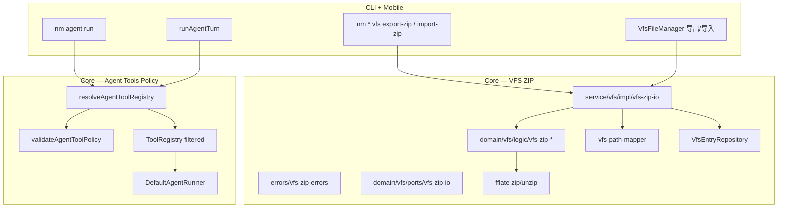

# VFS ZIP 导入导出与 Agent 工具名单 技术规格（SPEC）

## 设计目标

- 在 `@novel-master/core` 实现**三域独立** VFS ZIP **导出 / 导入**（global / project / session），内容为域内**当前可见** UTF-8 文本文件树快照；导入语义为**全量替换**（ZIP 即真相源）。
- 导入采用**先内存校验、后写入**；校验失败或写入失败时域内状态**不被污染**（事务回滚）。
- 在 **Agent 定义（YAML/JSON）** 中支持工具 **allowlist / denylist 二选一**；默认未配置 = ToolRegistry 全部已注册工具可用；暴露给 LLM 的工具集与运行时可执行集一致。
- **CLI（`nm`）** 与 **RN 移动端** 调用同一 Core API，行为可判定一致（入口可不同）。
- 迭代完成时 `npm test`（core + cli）与移动端相关用例通过；三域各 ≥1 条 ZIP 往返用例；Agent 工具策略 ≥6 条可判定用例。

---

## 现状与约束（代码探索）

| 模块 | 现状 | 本迭代影响 |
|------|------|------------|
| 三域 VFS | `createScopedVfsService` + `ScopedVfsService` + `vfs-path-mapper.ts`（`VfsScope`、`scopePhysicalPrefix`、`toLogicalPath`） | ZIP IO 在 scope 边界操作，ZIP 内路径 = **逻辑路径** |
| 域路径规则 | global/project 仅 `/template/…`；session 任意 `/…`（`normalizePath` 拒绝 `..`） | 导入校验复用 `assertLogicalPathAllowed` |
| 批量树操作 | `copyVfsTree` / `deleteVfsPrefix` / `replaceVfsSubtree`（`vfs-tree-copy.ts`，repository 级） | 导入写入可复用 `deleteVfsPrefix` + 批量 insert |
| `VfsEntryRepository` | `scanContents` / `listAllPaths` **仅 file 行**（`entry_kind = 'file'`）；含 `storage_kind` | 导出 scan file；导入 `insert` + **`ensureParentDirectories`**（见 [vfs-directory-nodes](../vfs-directory-nodes/spec.md)） |
| `vfs_entry` | `entry_kind: file \| directory`；`storage_kind: inline \| external` | 导出/import 仅 **file + inline UTF-8**；`directory` / `external` 行不参与 ZIP |
| Core 分层 | `ARCHITECTURE.md` / [core-package-structure](../core-package-structure/spec.md)：`errors/` 包级；`domain/*/ports` 放契约 | 本 SPEC 结构与之对齐（见下） |
| 事务 | `TdbcConnection.transaction(fn)` | 导入写入阶段包在单事务内 |
| ZIP 库 | **无**（全仓库未引用 jszip/fflate 等） | Core 新增 **`fflate`**（纯 JS，Node + RN 可用） |
| CLI VFS | `nm vfs …`（global）、`nm project vfs …`、`nm session vfs …`（list/read/write/…） | 各域 vfs 子命名空间增加 `export-zip` / `import-zip` |
| 移动端 VFS | `VfsFileManager`（global / project template / session 三入口）；`vfs-operations.service.ts` 仅 CRUD | `moreMenu` 增加导出/导入；需新增**文件选择 / 分享**依赖 |
| `ToolRegistry` | 全量 register；`toolsFromRegistry` 映射全部工具到 LLM | 新增 **policy 解析 + 过滤 registry** |
| `DefaultAgentRunner` | 构造时注入 `registry`；`toolsFromRegistry(registry)` + `ToolRunner(registry)` | **调用方**注入已过滤 registry（Runner 本身不改签名） |
| `AgentDefinition` | `name` / `prompts` / `model?` / `runtime?`；Zod strict；**无 tools 字段** | 扩展可选 `tools` 块；校验互斥与工具名 |
| Agent 加载 | `validateAgentDefinition` 仅校验 model pin | 扩展校验 tools policy + 注册名存在性 |
| 移动端 Agent 编辑 | `AgentEditorForm` 编辑 name/prompts/model/maxSteps | 增加 allow/deny 编辑并写回 YAML 字段 |

**兼容性原则**

- `tools` 为 Agent 定义**可选新字段**，`schemaVersion: 1` 不变；未配置 tools 的 Agent 行为与现网一致。
- ZIP IO 为**新增 API**，不改动现有 `VfsService` 端口签名。
- 导入**不**触及 worktree 规则、session execute 记录、snapshot、KKV、消息等（PRD 明确排除）；导入后 worktree 展示可能与 VFS 不一致，属预期——用户可在移动端/CLI 另行维护规则，或后续迭代做联动（**本迭代不做**）。

---

## 总体方案

### 架构总览



### VFS ZIP — 路径与内容约定

| 项 | 约定 |
|----|------|
| ZIP 范围 | **单域**；一条 ZIP 只对应一个 `VfsScope` |
| 条目路径 | ZIP entry 名 = 域内**逻辑路径**去掉 leading `/`（例：逻辑 `/notes.md` → `notes.md`；`/dir/b.md` → `dir/b.md`）。导入时 `normalizePath('/' + entryName)` 还原 |
| 目录条目 | ZIP 中纯目录 entry **忽略**；导入后由 **`ensureParentDirectories`** 为文件路径补齐 `directory` 行（不写空目录进 ZIP，与 PRD「仅文本文件」一致） |
| 文本编码 | 条目 body 必须为 **UTF-8**；非法 UTF-8 → **整包拒绝** |
| 二进制 | 任一 entry 解码非 UTF-8 文本 → **整包拒绝**（不做部分导入） |
| 非法路径 | `..`、空名、`\`、Windows 绝对盘符路径、`/projects/…` 等跨域前缀 → **整包拒绝** |
| 域路径合法性 | 还原逻辑路径后调用 `assertLogicalPathAllowed(scope, logical)` |
| 重复路径 | 同一逻辑路径在 ZIP 中出现多次 → **整包拒绝** |
| 导出排除 | `storage_kind !== 'inline'` 的行；worktree / snapshot / execute 元数据（不在 `vfs_entry` 中，自然排除） |
| 存量 `.keep` | 若 DB 中仍有 `.keep` **file** 行，随其它文本文件一并导出/导入；**不**为显式空目录单独写 ZIP 目录 entry（[vfs-directory-nodes](../vfs-directory-nodes/spec.md) 后新建目录不再产生 `.keep`） |
| 压缩 | DEFLATE；无密码；无分卷 |

**默认资源上限（可常量配置，SPEC 定稿）**

| 常量 | 值 | 超限行为 |
|------|-----|----------|
| `VFS_ZIP_MAX_UNCOMPRESSED_BYTES` | 32 MiB | 校验阶段拒绝，错误码 `PAYLOAD_TOO_LARGE` |
| `VFS_ZIP_MAX_ENTRY_COUNT` | 5_000 | 同上 |
| `VFS_ZIP_MAX_ENTRY_PATH_LEN` | 512 | 同上 |

### VFS ZIP — 导出流程

1. `physicalPrefix = scopePhysicalPrefix(scope)`
2. `rows = repo.scanContents(physicalPrefix)`
3. 若任一 row 对应 entry 的 `storage_kind === 'external'`（需在 scan 时 JOIN 或二次查询）→ 抛 `VfsZipError('EXTERNAL_NOT_SUPPORTED')`
4. 将每条 `physical path` → `toLogicalPath(scope, physical)`，写入 ZIP（entry 名去 leading `/`）
5. 返回 `Uint8Array`（CLI 写文件；移动端写 cache + Share）

### VFS ZIP — 导入流程（两阶段）

**阶段 A — 内存解析与校验（无 DB 写）**

1. `fflate` 解压至 `Map<string, Uint8Array>`（entry 名 → bytes）
2. 逐项：路径合法、UTF-8、域规则、`assertLogicalPathAllowed`、去重、累计大小/条数
3. 构建 `Map<logicalPath, content>` 待写入集
4. 任一失败 → 抛 `VfsZipError`，**不触碰 DB**

**阶段 B — 事务全量替换（需 `confirmed: true`）**

1. 若 `confirmed !== true` → `VfsZipError('NOT_CONFIRMED')`（CLI 无 `--yes` / 移动端未确认对话框）
2. `conn.transaction(async (tx) => { … })`：
   - `repoTx = new SqliteVfsEntryRepository(tx)`
   - `await deleteVfsPrefix(repoTx, physicalPrefix)`
   - 对每个 `(logical, content)`：`ensureParentDirectories` + `insert` file 行（`versionCheck: false`）；**不** `mkdir` 空目录占位
3. 事务失败 → SQLite 回滚，域内与导入前一致

> **说明**：阶段 B 依赖 TDBC 事务覆盖 `delete` + 批量 `insert`；实现时在 core 单测用故意 mid-batch 失败 hook 验证回滚。

### Agent 工具策略

**配置形态（Agent 定义 wire / domain）**

```yaml
schemaVersion: 1
name: read-only-analyst
prompts:
  blocks:
    c: { type: chat }
tools:
  allow: [vfs.read, vfs.grep]
# 或（二选一）：
# tools:
#   deny: [vfs.write]
```

Domain 类型扩展：

```typescript
export interface AgentToolPolicy {
  readonly allow?: readonly string[];
  readonly deny?: readonly string[];
}

export interface AgentDefinition {
  // ...existing...
  readonly tools?: AgentToolPolicy;
}
```

**语义（与 PRD 对齐）**

| 配置 | LLM tools | ToolRunner 可执行 |
|------|-----------|-------------------|
| 未配置 `tools` | Registry 全部 | 全部 |
| `allow: […]` | 仅列表内 | 仅列表内 |
| `allow: []` | 空（不传 tools） | 无工具可执行 |
| `deny: […]` | 全部 − deny | 同上 |
| `deny: []` 或缺省 deny | 等同未配置 | 全部 |
| 同时 `allow` + `deny` | — | 加载/保存报错 |
| 含未注册工具名 | — | 加载/保存报错 |

**实现策略**

- 新增 `resolveAgentToolRegistry(baseRegistry, definition): ToolRegistry`（`domain/agent/logic/resolve-agent-tool-registry.ts`）：
  - 解析 policy → 计算 `allowedNames: Set<string>`
  - 从 `baseRegistry` 克隆允许的工具到新 `ToolRegistry`（复用现有 `register`）
- `validateAgentToolPolicy(def, registryNames)` 在 `validateAgentDefinition` / upsert 前调用；失败抛 **`AgentConfigError`**（`errors/agent-config-errors.ts`，可扩 code 如 `INVALID_TOOL_POLICY`）：
  - 互斥校验
  - allow/deny 中每个 name 必须 ∈ `registryNames`（由 host 注入 `registerVfsTools` 后的 list）
- `DefaultAgentRunner` **不修改**；`agent/commands.ts` / `agent-run.service.ts` 改为：

```typescript
const base = new ToolRegistry<VfsToolContext>();
registerVfsTools(base);
await validateAgentDefinition(def, { assertRegisteredTools: … }); // 已有 policy 校验
const registry = resolveAgentToolRegistry(base, def);
createAgentRunner({ …, registry });
```

- 模型幻觉调用被禁工具 → `ToolRunner` 抛 `ToolError NOT_FOUND` → runner 已有 `Error: …` 写回 tool_result（可判定）。

---

## 最终项目结构

遵循 `packages/core/ARCHITECTURE.md`（[core-package-structure](../core-package-structure/spec.md)）：

- **错误**：`packages/core/src/errors/`（禁止 `domain/**/errors/`）
- **契约**：`domain/<ctx>/ports/`（与 `VfsService` 在 `domain/vfs/ports/vfs-service.port.ts` 一致）
- **编排**：`service/<ctx>/impl/` + `create-*.ts`；`service/vfs/vfs.port.ts` 可 re-export 域端口

```
packages/core/src/
  errors/
    vfs-zip-errors.ts            # VfsZipError + VfsZipErrorCode

  domain/vfs/
    ports/
      vfs-zip-io.port.ts         # VfsZipIoService 契约 + import options DTO
    logic/
      vfs-zip-path.ts            # ZIP entry ↔ logical path
      vfs-zip-validate.ts        # UTF-8 / 大小 / 重复 / 域规则（纯函数）
      vfs-zip-build.ts           # Map → ZIP bytes（fflate）
      vfs-zip-parse.ts           # ZIP bytes → Map

  service/vfs/
    vfs.port.ts                  # 可选：re-export VfsZipIoService（与 VfsService 同模式）
    create-vfs-zip-io-service.ts
    impl/
      vfs-zip-io.service.ts      # DefaultVfsZipIoService：export/import + transaction

  domain/agent/
    logic/
      validate-agent-tool-policy.ts   # 纯校验；失败由调用方抛 AgentConfigError
      resolve-agent-tool-registry.ts
    model/
      agent-definition.ts        # + tools?: AgentToolPolicy
      agent-definition.schema.ts

apps/cli/src/
  vfs/commands/
    export-zip.ts
    import-zip.ts
  project/vfs.ts               # 分发 export-zip / import-zip
  session/commands.ts          # 同上
  main.ts                      # global vfs 子命令注册

apps/mobile/src/
  services/
    vfs-zip.service.ts         # 调 core + RN 文件 IO
  components/vfs/
    VfsFileManager.tsx         # moreMenu 导出/导入
  components/agent/
    AgentEditorForm.tsx        # tools allow/deny UI

packages/core/test/
  vfs/vfs-zip-io.test.ts
  agent/agent-tool-policy.test.ts
  agent/agent-runner-tool-policy.test.ts  # 或合入 agent-runner.test.ts

apps/cli/test/
  vfs-zip-e2e.test.ts

apps/mobile/__tests__/
  vfs-zip.service.test.ts      # mock core，测路径/确认流
  agent-tool-policy-form.test.ts  # 可选，表单序列化
```

**依赖**

| 包 | 新增依赖 |
|----|----------|
| `@novel-master/core` | `fflate` |
| `@novel-master/mobile` | `@react-native-documents/picker`（或等价 document picker）；导出用 `react-native` `Share` + 写 cache 文件（无额外依赖） |

---

## 变更点清单

### Core — 新增

| 文件 | 职责 |
|------|------|
| `errors/vfs-zip-errors.ts` | `VfsZipError` / `VfsZipErrorCode`：`INVALID_ZIP`, `INVALID_PATH`, `INVALID_UTF8`, `DUPLICATE_PATH`, `PAYLOAD_TOO_LARGE`, `NOT_CONFIRMED`, `EXTERNAL_NOT_SUPPORTED`, `IMPORT_FAILED` |
| `domain/vfs/logic/vfs-zip-path.ts` | `zipEntryNameFromLogical` / `logicalFromZipEntryName` |
| `domain/vfs/logic/vfs-zip-validate.ts` | 纯函数校验 + 聚合错误信息 |
| `domain/vfs/logic/vfs-zip-build.ts` / `vfs-zip-parse.ts` | fflate 封装 |
| `domain/vfs/ports/vfs-zip-io.port.ts` | `VfsZipIoService`：`export` / `import` 签名 |
| `service/vfs/impl/vfs-zip-io.service.ts` | `DefaultVfsZipIoService` 编排 + transaction |
| `service/vfs/create-vfs-zip-io-service.ts` | factory |
| `domain/agent/logic/validate-agent-tool-policy.ts` | 互斥、空 allow、未知工具名（返回错误或供 `AgentConfigError` 包装） |
| `domain/agent/logic/resolve-agent-tool-registry.ts` | 过滤 registry |

### Core — 修改

| 文件 | 改动 |
|------|------|
| `domain/agent/model/agent-definition.ts` | `tools?: AgentToolPolicy` |
| `domain/agent/model/agent-definition.schema.ts` | Zod `tools: { allow?, deny? }.strict().optional()`；encode/decode |
| `domain/agent/logic/validate-agent-definition.ts` | 可选 `registeredToolNames` → 调用 tool policy；失败 **`AgentConfigError`** |
| `errors/agent-config-errors.ts` | 如需新增 `INVALID_TOOL_POLICY` 等 code |
| `domain/vfs/repositories/impl/sqlite-vfs-entry.repository.ts` | `scanContents` 返回 `storage_kind`（仅 file 行，与现网 directory 迭代一致） |
| `service/vfs/vfs.port.ts` | 可选 re-export `VfsZipIoService` |
| `index.ts` | 导出 `createVfsZipIoService`、`VfsZipIoService`、`VfsZipError`、`resolveAgentToolRegistry` 等 |

### CLI — 修改

| 位置 | 改动 |
|------|------|
| `vfs/commands/export-zip.ts` | `--out <path>` |
| `vfs/commands/import-zip.ts` | `--file <path>`；默认交互确认；`--yes` 跳过 |
| `project/vfs.ts` / `session/commands.ts` | 注册 `export-zip` / `import-zip` |
| `main.ts` | global `nm vfs export-zip` / `import-zip` |
| `agent/commands.ts` | `resolveAgentToolRegistry` |

### Mobile — 修改

| 位置 | 改动 |
|------|------|
| `vfs-zip.service.ts` | `exportVfsZip(scope, vfsRuntime)` / `importVfsZip(...)` |
| `VfsFileManager.tsx` | moreMenu：`导出 ZIP` / `导入 ZIP`；导入前 `Alert` 确认 |
| `AgentEditorForm.tsx` | 模式切换：默认 / 白名单 / 黑名单；多选或逗号分隔工具名 |
| `agent-run.service.ts` | filtered registry |
| `package.json` | document picker 依赖 |

---

## 详细实现步骤

### M1 — Core VFS ZIP（export/import + 单测）

1. 添加 `fflate` 依赖；实现 `vfs-zip-path` / `parse` / `build` / `validate` 纯函数及单元测试（不碰 DB）。
2. 扩展 repository scan 以识别 `storage_kind`（最小改动：`scanContents` SELECT 增加列，返回类型向后兼容扩展 optional 字段）。
3. 实现 `DefaultVfsZipIoService`（`service/vfs/impl/`）：
   - `export`：`scanContents`（仅 file）→ logical map → zip bytes
   - `import`：parse/validate → `confirmed` → transaction：`deleteVfsPrefix` + 逐文件 `ensureParentDirectories` + `insert`
4. `packages/core/test/vfs/vfs-zip-io.test.ts`：
   - 三域 export 后 unzip 路径与内容一致
   - import 全量替换（旧文件删除）
   - 非法 UTF-8 / `../` ZIP → 域内不变
   - 模拟 transaction 内失败 → 域内不变

### M2 — CLI 三域命令 + e2e

1. 实现 `export-zip` / `import-zip` 命令（复用 `createNovelMasterRuntime` + `createVfsZipIoService`）。
2. 帮助文本：
   - `nm vfs export-zip --out ./global-template.zip`
   - `nm vfs import-zip --file ./global-template.zip [--yes]`
   - `nm project vfs export-zip --project P --out …`
   - `nm session vfs import-zip --project P --session S --file … [--yes]`
3. `apps/cli/test/vfs-zip-e2e.test.ts`：export → 篡改 → import → `list`/`read` 与 ZIP 一致（三域至少各 1 条，可 parametrize scope）。

### M3 — Agent 工具策略（Core + CLI + Mobile 编辑）

1. 扩展 Agent schema/model；`validateAgentToolPolicy` + `resolveAgentToolRegistry`。
2. 更新 `agent-definition*.test.ts`、`agent-tool-policy.test.ts`（≥6 条 PRD 用例）。
3. CLI `agent run` / mobile `runAgentTurn` 接入 filtered registry。
4. `AgentEditorForm` 增加 tools 编辑；保存走 `agentRegistry.upsert`（YAML 真相源唯一）。

### M4 — 移动端 VFS ZIP + 联调

1. 添加 document picker 依赖；实现 `vfs-zip.service.ts`。
2. `VfsFileManager` 三入口（global template / project template / session worktree）共用导出/导入菜单项。
3. 导入确认文案明确「将完全替换当前工作区文件」。
4. 手工验收：移动端 export → CLI import 同 session，路径集合一致（PRD 三端用例）。

---

## 测试策略

### 单元测试（Core）

- ZIP 纯函数：路径往返、UTF-8 边界（BOM 允许）、重复 entry、超大小。
- Import 校验失败不调用 `deleteVfsPrefix`（mock repo 断言）。
- Tool policy：6 条 PRD 场景 + 互斥 + 未知工具名。

### CLI e2e

- 三域 export → modify zip → import → list 一致。
- import 无 `--yes` 在非 TTY 测试环境下应失败或需显式 flag（与现有 CLI 确认模式一致）。

### Mobile

- `vfs-zip.service`：mock `VfsZipIoService`，断言 `confirmed` 传递。
- Agent 表单：buildDefinition 序列化 `tools.allow` / `tools.deny`。

### 测试用例

| ID | Given | When | Then |
|----|-------|------|------|
| Z1 | session 有 `/a.md`、`/dir/b.md` | export | ZIP 含 `a.md`、`dir/b.md`，内容与 read 一致 |
| Z2 | global `/template/x.md` | export | ZIP 不含 `projects/` 前缀 |
| Z3 | session 有 `/old.md` | import 仅含 `new.md` 且 confirmed | 仅 `/new.md` 存在 |
| Z4 | ZIP 含非法 UTF-8 | import | 报错；域内与导入前一致 |
| Z5 | 校验通过但 transaction 失败 | import | 域内与导入前一致 |
| Z6 | 未 confirmed | import | 报错；域无变化 |
| Z7 | 同一 session ZIP | CLI import vs mobile import | list 路径集合相同 |
| T1 | 无 `tools` | load + run | LLM tools = 全部 vfs.* |
| T2 | `allow: [vfs.read, vfs.grep]` | run | LLM 仅两项；write 不可执行 |
| T3 | `allow: []` | run | tools 为空 |
| T4 | `deny: [vfs.write]` | run | 除 write 外可用 |
| T5 | 同时 allow + deny | load/save | AgentConfigError |
| T6 | allow 含 `vfs.nope` | load | AgentConfigError |

---

## 风险与回滚方案

| 风险 | 缓解 | 回滚 |
|------|------|------|
| 大 ZIP 内存峰值 | 32 MiB / 5000 条上限；CLI 文档说明 | 调低常量或后续 streaming ZIP |
| `fflate` RN 兼容性 | M4 真机验证；纯 JS 无 native | 换 `jszip` 或平台分包 |
| 导入后 worktree 规则与 VFS 不一致 | 文档明确排除；UI 提示 | 后续迭代 import 后可选清理规则 |
| 事务未覆盖全部 SQL | M1 失败注入单测 | 修复 transaction 边界 |
| 工具 Registry 增删名 | 加载时校验未知名；文档说明人工更新 YAML | 无自动迁移 |
| document picker 权限/平台差异 | 仅 import 使用；失败 toast | 暂仅 CLI 导入 |

**功能回滚**：未使用的 ZIP / tools 字段对旧 Agent 无影响；若需禁用，不注册 CLI 子命令即可，Core API 可保留。

---

## 不在本迭代（明确边界）

- 单 ZIP 多域混装；增量/差异导入；导入预览逐文件勾选。
- 导出 worktree 规则、session snapshot/execute 记录、消息、KKV。
- Agent 工具名单 Registry/UI 覆盖层（非 YAML）。
- Web 端；云同步。
