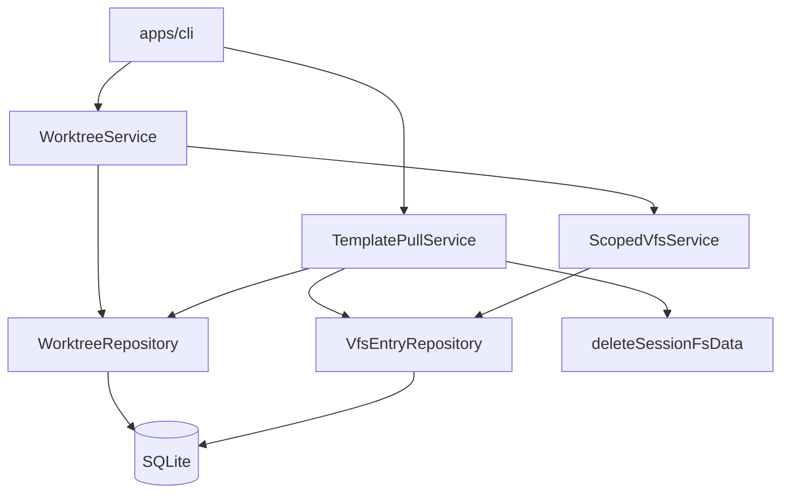

# 虚拟工作树（Virtual Worktree）技术规格（SPEC）

## 设计目标

- 在 `@novel-master/core` 新增 **worktree 配置持久化**、**显示状态计算**、**`<file>` 文本渲染**，以及 **template pull / 创建时继承** 能力。
- CLI 扩展：`nm vfs|project|session worktree …` 与 `nm project|session template pull`；复用现有 **scoped VFS**、`CliScopeResolver`、`bootstrapNovelMaster`。
- **不修改** `infra/tdbc`、`infra/sql-template`；**不修改** `apps/mobile`；repository **不导出**（与 chat-project-vfs 一致）。
- `template pull`：**先清空目标 VFS 子树再镜像**；session pull 额外调用已有 **`deleteSessionFsData`**。

## 现状与约束（代码探索）

| 项 | 现状 | 本迭代 |
|----|------|--------|
| `SessionService.create` | `copyVfsTree`：`/projects/P/template` → `/projects/P/sessions/S`（物理相对路径已去掉 `template/` 段） | 同事务内增加 **worktree 配置复制**（逻辑路径映射） |
| `copyVfsTree` | 仅 upsert，**不删**目标孤儿 | 新增 **`replaceVfsSubtree`**：`deleteVfsPrefix` + `copyVfsTree` |
| `deleteVfsPrefix` | `session.delete` / `project.delete` 已用 | pull 复用 |
| `deleteSessionFsData` | 删 `session_vfs_snapshot` + execute 表 | **session template pull** 复用 |
| `vfs_entry` | `path, content, version, mtime_ms`；**无** `created_by` | `<file>` 的 `updatedBy` 固定 **`user`**；`createdAt`/`updatedAt` 均格式化为 **`mtime_ms`**（SPEC 锁定） |
| `nm vfs` | global scoped，`list/read/write/...` | 增加子路由 **`worktree`** |
| `nm project` / `nm session` | `vfs` 子命令 + scope resolver | 增加 **`worktree`**、**`template pull`** |
| worktree | **不存在** | 新 domain + service + DDL |

**PRD 对齐（已确认）**

- 三域 worktree **运行期独立**；同步仅 via **session 创建快照** 或 **`template pull`**。
- pull **直接覆盖**；session pull **清除全部 session-fs**；**不删 message**。
- global CLI：**不新增** `nm global`；使用 **`nm vfs worktree`**（与现有全局入口一致）。

---

## 总体方案

### 架构



- **`WorktreeService`**：读写目录/文件规则、计算显示状态、`list` 视图模型、`renderDisplay`。
- **`TemplatePullService`**（或挂在 `ProjectService` / `SessionService` 上的方法）：编排 VFS replace + worktree replace +（session）session-fs purge。
- **纯函数模块**：`worktree-eval.ts`（优先级、头尾优先集）、`worktree-display.ts`（`<file>` + Front Matter）、`worktree-path-map.ts`（project↔session 逻辑路径映射）。

### Worktree 作用域键（`WorktreeScope`）

| PRD 域 | `WorktreeScope` | 存储键 `scope_key` |
|--------|-----------------|-------------------|
| global | `{ kind: "global" }` | `global` |
| project | `{ kind: "project"; projectId }` | `project:{uuid}` |
| session | `{ kind: "session"; projectId; sessionId }` | `session:{uuid}` |

每个 scope **独立一张配置集合**；不与其它 scope 共享行。

### 逻辑路径

与 `VfsScope` 相同校验（`assertLogicalPathAllowed`）：

- global / project：仅 `/template/…`（含 `/template` 目录节点）。
- session：任意逻辑路径（`/` 为根）。

worktree 配置中的 `logical_path` 均存**逻辑路径**（非物理路径）。

### 路径映射（project → session）

与 session 创建时 VFS 拷贝一致（`vfs-path-mapper` + 现有 `copyVfsTree` 物理前缀）：

```typescript
/** project 逻辑路径 → session 逻辑路径 */
export function mapProjectWorktreePathToSession(logical: string): string {
  const n = normalizePath(logical);
  if (n === "/template") return "/";
  if (n.startsWith("/template/")) return n.slice("/template".length);
  throw new Error(`not a project template path: ${logical}`);
}

/** session → project（pull 源路径反查，可选） */
export function mapSessionWorktreePathToProject(logical: string): string {
  const n = normalizePath(logical);
  if (n === "/") return "/template";
  return `/template${n}`;
}
```

### 数据模型（枚举，SQLite `TEXT` 存储）

| 概念 | DB 值 | CLI / list 展示文案 |
|------|-------|---------------------|
| 规则状态 | `rule_on` / `rule_off` | `规则·开` / `规则·关` |
| 纳入方式 | `auto` / `show` / `hide` | `自动` / `展示` / `隐藏` |
| 显示状态 | `hidden` / `full` / `header` / `filename` | `不展示` / `全内容` / `文件头` / `文件名` |
| 排序字段 | `name` / `created` / `updated` | — |
| 排序方向 | `asc` / `desc` | — |
| 填充策略 | `hidden` / `filename` / `header` | 对应 PRD 不展示/文件名/文件头 |

**默认值（未配置行时）**

| 节点 | 默认 |
|------|------|
| 根目录 `/`（session）或 `/template`（global/project） | **规则·开**，不可通过 CLI 关闭 |
| 其它目录 | **规则·关**；无目录规则字段 |
| 文件 | 纳入方式 **`auto`** |
| 目录规则字段（仅当显式 `worktree dir` 保存后存在） | `sort=name`, `order=asc`, `head=0`, `tail=0`, `fill=hidden`；保存后目录 **规则·开** |

### 显示状态计算（`evaluateFileDisplay`）

对单个文件，输入：纳入方式、父目录规则状态、父目录目录规则（若有）、文件在父目录直接子文件排序列表中的索引。

优先级（与 PRD 一致）：

1. `hide` → `hidden`
2. `show` → `full`
3. `auto` + 父目录 `rule_off` → `hidden`
4. `auto` + 父目录 `rule_on`：在 `headTailSet` → `full`；否则 `fill`（`header` 且扩展名非 `.md`/`.markdown` → `hidden`）

**头尾优先集**：对父目录下所有 **`auto`** 直接子**文件**排序后，取前 N ∪ 后 M（去重）。

**排序键**：`name` = 逻辑路径 basename；`created`/`updated` = `vfs_entry.mtime_ms`（当前表无 created，二者相同）。

### 树遍历顺序（`list` / `display`）

- DFS：先目录后文件；同级目录按**该目录的目录规则**排序（无规则则用 `name` + `asc`）。
- 同级文件按**父目录目录规则**排序（用于 list 展示顺序；与头尾计算使用同一排序）。
- `display` 仅输出 `display !== hidden` 的文件，顺序与 DFS 一致。

### `<file>` 渲染（`renderDisplay`）

- 属性转义：`& " <` → XML 实体。
- 时间：`formatLocal(mtimeMs)` → `yyyy-MM-dd HH:mm:ss`（本地时区，`Intl` 或手写补零）。
- `updatedBy="user"`（固定，直至 VFS 扩展列）。
- 正文行：`${lineNo}|${lineContent}`；`full` 为全文；`filename` 为 `1|{basename}`；`header` 走 `parseMarkdownFrontMatter`（`domain/worktree/front-matter.ts`）。
- 块间 **一个空行**。

### Template pull 编排

**`projectTemplatePull(projectId)`**（单事务）：

1. `replaceVfsSubtree(vfsRepo, from="/template", to="/projects/P/template")`
2. `replaceWorktreeScope(worktreeRepo, from=global, to=project)` — 逻辑路径 **不变**（仍为 `/template/…`）

**`sessionTemplatePull(sessionId)`**（单事务）：

1. 解析 `projectId`
2. `deleteSessionFsData(conn, sessionId)`
3. `replaceVfsSubtree(vfsRepo, from="/projects/P/template", to="/projects/P/sessions/S")`（无 mapPath，与 create 一致）
4. `replaceWorktreeScope(from=project, to=session, mapPath=mapProjectWorktreePathToSession)`

**`replaceVfsSubtree`**（`vfs-tree-copy.ts`）：

```typescript
export async function replaceVfsSubtree(
  repo: VfsEntryRepository,
  fromPrefix: string,
  toPrefix: string,
  options?: { mapPath?: (relative: string) => string },
): Promise<void> {
  await deleteVfsPrefix(repo, toPrefix);
  await copyVfsTree(repo, fromPrefix, toPrefix, options);
}
```

**`replaceWorktreeScope`**：删除 `to` scope 全部 worktree 行；扫描 `from` scope 全部行，按 `mapLogicalPath` 插入。

**`SessionService.create`**（扩展）：

```typescript
await copyVfsTree(...);
await copyWorktreeScope(worktreeRepo, {
  from: { kind: "project", projectId },
  to: { kind: "session", projectId, sessionId: session.id },
  mapLogicalPath: mapProjectWorktreePathToSession,
});
```

---

## 最终项目结构

```text
packages/core/src/
  bootstrap/worktree/worktree-schema.ts      # 新增 DDL
  bootstrap/novel-master-bootstrap.ts        # 并入 WORKTREE_SCHEMA
  domain/worktree/
    model/                                   # 枚举与 DTO
    repositories/
      worktree.port.ts
      impl/sqlite-worktree.repository.ts
    worktree-path-map.ts
    worktree-eval.ts
    worktree-display.ts
    front-matter.ts
  service/worktree/
    worktree.port.ts
    impl/worktree.service.ts
    create-worktree-service.ts
  service/template/
    template-pull.port.ts                    # 或并入 chat impl
    impl/template-pull.service.ts
  service/chat/impl/session.service.ts       # create + pullTemplate
  service/chat/impl/project.service.ts       # pullTemplate
  domain/vfs/vfs-tree-copy.ts                # replaceVfsSubtree
  index.ts                                   # 导出 WorktreeService, pull API

packages/core/test/worktree/
  worktree-eval.test.ts
  worktree-display.test.ts
  template-pull.test.ts

apps/cli/src/
  vfs/worktree.ts                            # global: nm vfs worktree
  project/worktree.ts
  project/template.ts                          # template pull
  session/worktree.ts
  session/template.ts
  main.ts                                    # 路由
  runtime.ts                                 # createWorktreeService, templatePull

apps/cli/test/
  worktree-e2e.test.ts
  template-pull-e2e.test.ts
```

---

## 变更点清单

| 文件 | 变更 |
|------|------|
| `bootstrap/worktree/worktree-schema.ts` | **新增** 表 `worktree_dir_rule`、`worktree_file_rule` |
| `novel-master-bootstrap.ts` | 追加 worktree DDL |
| `vfs-tree-copy.ts` | **新增** `replaceVfsSubtree` |
| `sqlite-worktree.repository.ts` | CRUD、按 scope 删除/复制、listByScope |
| `worktree.service.ts` | dir/file 设置、list 视图、display 渲染 |
| `template-pull.service.ts` | project/session pull 事务 |
| `session.service.ts` | `create` 复制 worktree；**新增** `pullTemplate(sessionId)` |
| `project.service.ts` | **新增** `pullTemplate(projectId)` |
| `apps/cli/main.ts` | `vfs worktree`；`project|session` 下 `worktree`、`template` |
| `index.ts` | 导出公共 factory / 类型 |
| `.apm/kb/docs/monorepo.md` | CLI 命令表（实现后） |

**明确不改**

- `vfs-test-sync`、`createVfsService` 无范围工厂
- `apps/mobile`
- `message` 表与 session pull 无关

**延期（非本 SPEC 验收）**

- `project.copy` / `session.copy` 是否复制 worktree：建议 **session.copy** 在实现时 **复制 worktree 行**（与 VFS 拷贝对称）；**project.copy** 复制 project scope worktree — 可在阶段 4 顺手做，不写入首期验收。

---

## 数据表（DDL 草案）

```sql
CREATE TABLE IF NOT EXISTS worktree_dir_rule (
  scope_key TEXT NOT NULL,
  logical_path TEXT NOT NULL,
  rule_enabled INTEGER NOT NULL DEFAULT 1,  -- 1=rule_on, 0=rule_off
  sort_field TEXT NOT NULL DEFAULT 'name',
  sort_order TEXT NOT NULL DEFAULT 'asc',
  head_count INTEGER NOT NULL DEFAULT 0,
  tail_count INTEGER NOT NULL DEFAULT 0,
  fill_policy TEXT NOT NULL DEFAULT 'hidden',
  PRIMARY KEY (scope_key, logical_path)
);

CREATE TABLE IF NOT EXISTS worktree_file_rule (
  scope_key TEXT NOT NULL,
  logical_path TEXT NOT NULL,
  inclusion_mode TEXT NOT NULL DEFAULT 'auto',  -- auto|show|hide
  PRIMARY KEY (scope_key, logical_path)
);

CREATE INDEX IF NOT EXISTS idx_worktree_dir_scope ON worktree_dir_rule(scope_key);
CREATE INDEX IF NOT EXISTS idx_worktree_file_scope ON worktree_file_rule(scope_key);
```

- 根目录规则行：首次 `worktree dir` 保存或 pull 后由上级复制带入；根目录 `rule_enabled` 恒为 1，CLI `dir --rule off` 对根路径 **拒绝**。
- `scope_key` 由 `worktreeScopeKey(scope)` 纯函数生成。

---

## CLI 规格

### 命令树（锁定）

```text
nm vfs worktree <display|dir|file|list> ...
nm project worktree <display|dir|file|list> ...
nm project template pull [--project <id>]
nm session worktree <display|dir|file|list> ...
nm session template pull [--project <id>] [--session <id>]
```

上下文：`project` / `session` 使用 `CliScopeResolver`（flag > config > error）。

### `worktree dir <logicalPath>`

| Flag | 说明 |
|------|------|
| `--rule on\|off` | 规则状态（根目录不可 `off`） |
| `--sort name\|created\|updated` | 排序字段 |
| `--order asc\|desc` | 排序方向 |
| `--head <0-1000>` | 头部数量 |
| `--tail <0-1000>` | 尾部数量 |
| `--fill hidden\|filename\|header` | 填充策略 |

- 保存后该目录 `rule_enabled=1`（若传 `--rule off` 则 0，根目录除外）。
- 路径须为**目录**（存在为目录：逻辑路径在 VFS 中为前缀或 `list` 可推断；若不存在允许预配规则 — **允许**对不存在的目录预写规则，list 时仍显示目录节点需由 VFS 树与规则行并集生成 — **SPEC 锁定：list 树 = VFS 文件树 ∪ 配置中出现的路径的父链**）。

### `worktree file <logicalPath>`

| Flag | 说明 |
|------|------|
| `--mode auto\|show\|hide` | 纳入方式（必填其一） |

### `worktree list`

- 输出：**TSV**，UTF-8，stdout。
- 表头（首行）：`kind\tpath\trule_state\tinclusion_mode\tdisplay_state`
- `kind`：`dir` | `file`
- 目录行：`rule_state` 有值；`inclusion_mode`、`display_state` 为空。
- 文件行：`rule_state` 为空；`inclusion_mode`、`display_state` 为中文文案（见上表）。
- 行顺序：DFS + 目录排序规则。

### `worktree display`

- stdout：`<file>…</file>` 串，无额外前缀。
- stderr：不写（除非错误）。

### `template pull`

- 无额外 flag；执行即覆盖。
- 成功：退出码 0，无输出（与 `use` 一致）或一行摘要（**锁定：无输出**）。

---

## 详细实现步骤

### 阶段 1：DDL + repository + path map

1. 新增 `worktree-schema.ts`，并入 `NOVEL_MASTER_SCHEMA_STATEMENTS`。
2. 实现 `SqliteWorktreeRepository`：`upsertDirRule`、`upsertFileRule`、`deleteScope`、`listDirRules`、`listFileRules`、`copyScope`。
3. 单元测试：`worktree-path-map` 双向映射。

### 阶段 2：评估与 display 纯函数

1. `worktree-eval.ts`：头尾集、优先级、按目录排序文件列表。
2. `front-matter.ts`：解析 `---` … `---`；失败返回 PRD 降级单行文案。
3. `worktree-display.ts`：单文件块 + 多文件 join。
4. 单测：PRD 验收用例（hide/show/auto/head-tail/fill/header 非 md）。

### 阶段 3：WorktreeService + CLI worktree

1. `DefaultWorktreeService`：依赖 `VfsEntryRepository` + `WorktreeRepository` + `VfsScope`。
2. `buildTreeListing(scope)`：合并 VFS 与规则路径 → 计算状态 → TSV 行。
3. CLI：`vfs/project/session/worktree.ts` 解析 flags，调用 service。
4. `runtime.ts` 暴露 `worktree(scope)` factory。

### 阶段 4：Template pull + session 创建继承

1. `replaceVfsSubtree` in `vfs-tree-copy.ts`。
2. `TemplatePullService` + `ProjectService.pullTemplate` / `SessionService.pullTemplate`（或直接在 service 内）。
3. 扩展 `SessionService.create` 复制 worktree。
4. CLI `template pull` + e2e。

### 阶段 5：文档与 monorepo

1. 更新 `.apm/kb/docs/monorepo.md` 命令表。
2. 全量 `npm test`。

---

## 测试策略

### 单元（core）

| 用例 | 断言 |
|------|------|
| hide / show / auto+rule_off | 显示状态 |
| head=2 tail=1 去重 | 优先集大小与 full |
| fill=header + `.txt` | hidden |
| Front Matter 合法/非法 | display 正文行 |
| XML 转义路径 | 属性可解析 |
| mapProjectWorktreePathToSession | `/template/a` → `/a` |

### 集成（core）

| 用例 | 断言 |
|------|------|
| session create | worktree 行数与 project 映射一致 |
| project pull | 删 orphan vfs；worktree 与 global 一致 |
| session pull | orphan 删除；`deleteSessionFsData`；snapshot/execute 为空 |
| pull 后 message 仍在 | `messages.listBySession` 条数不变 |

### CLI e2e

| ID | 场景 |
|----|------|
| T1 | global template + worktree dir → project pull → project list 一致 |
| T2 | project template + worktree → session create → session list 映射一致 |
| T3 | session 改 vfs + snapshot → session pull → vfs 恢复、snapshot 空 |
| T4 | worktree file hide → display 无块 |
| T5 | worktree display 含 `<file path=` 与行号 |

---

## 风险与回滚方案

| 风险 | 缓解 |
|------|------|
| `deleteVfsPrefix` 误删 | 仅允许固定 `scopePhysicalPrefix`；pull 在事务内 |
| session pull 误删 message | pull 实现 **禁止** 调用 `messages.deleteBySession`；代码评审 + e2e |
| list 树与 VFS 不一致 | 并集算法单测 |
| `mtime` 无 created | PRD 已接受；未来可加列迁移 |
| 大 template 树 pull 慢 | 首期接受；与 `copyVfsTree` 同量级 |

**回滚**：新表可闲置；不调用 pull/worktree 即无行为变化。若需代码回滚，删除 worktree 模块与 CLI 路由即可；DB 表保留无害。

---

## 与 PRD 差异说明

| PRD 表述 | SPEC 锁定 |
|----------|-----------|
| `nm global worktree` | **`nm vfs worktree`** |
| `updatedBy` 来自元数据 | 固定 **`user`**（`vfs_entry` 无列） |
| `list` 格式未定义 | **TSV + 中文状态列** |
| `project.copy` worktree | **延期**，建议 follow-up |
