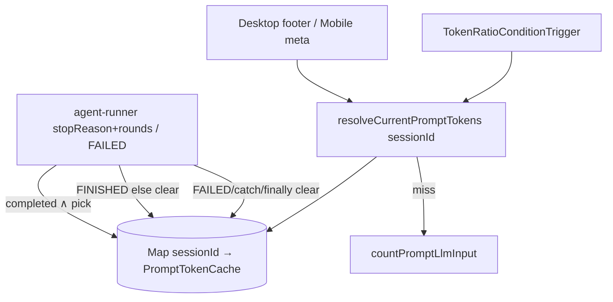

# chat-token-api-overlay 技术规格（SPEC）

> **PRD**：[prd.md](./prd.md)  
> **父级**：[../../prd.md](../../prd.md)  
> **相关**：[model-aware-token-counting/spec.md](../../../model-aware-token-counting/spec.md)（本地 tokenizer 一口径；本 feature **增量** API 优先，不废除本地）

## 设计目标

1. **唯一读口** `resolveCurrentPromptTokens`：展示与压缩消费同一结果。  
2. 有可用 API `promptTokens`（`!= null`，含合法 `0`）则用；否则本地 `countPromptLlmInput`。  
3. **不**新增 `tokenCounterMode: api`。  
4. Desktop 回合结束后页脚**必须**刷新。  
5. 多轮 tool：**取该 run 中最后一个 `usage.promptTokens != null` 的 round**（末轮可用 prompt）。  
6. 进程内缓存按 **sessionId** 分桶；resolve / trigger 调用链**必带** sessionId（见「sessionId 定案」）。

## 现状与约束

| 模块 | 现状 | 本 feature |
|------|------|------------|
| Desktop/Mobile `chat-prompt-tokens` | 只 `countPromptLlmInput` | 改调 `resolveCurrentPromptTokens`（传入 `sessionId`） |
| `TokenRatioConditionTrigger` | 只本地 count；`evaluation` **无** `sessionId` | 同调统一入口；读 `evaluation.sessionId` |
| `CompactionEvaluationContext` / `AgentSession` | **均无** `sessionId` 字段 | **定案①**：仅 evaluation 增 `sessionId`（**不**改 `AgentSession` port） |
| `agent-runner` | `rounds[].usage` 已写；发 `EVENT_AGENT_RUN_FINISHED`（`completed` / `cancelled` / `max_steps` 均会发）；**非 Abort 异常**发 `EVENT_AGENT_RUN_FAILED` 后 `throw`，**不到达** FINISHED；无缓存 | 仅 `stopReason==="completed"` 且 pick 有值时 set；FINISHED 旁路 else clear；**FAILED / catch / finally 必 `clear(sessionId)`**（见「写/清缓存定案」） |
| Desktop `WorkspaceFooter` | 换会话才 reload；`useWorkspaceFooterReload` **零引用** | 接通 reload：`agent.run.finished` + messages changed |
| Desktop `agent/run` IPC | 只 `{ started: true }` | **不得**依赖 renderer 解析 rounds；缓存写在 core |
| 压缩时机 | **每步 LLM 前**评估 | 见下方时序定案 |
| kkv | 无 token 域 | **不**用 kkv；进程内 `Map<sessionId, …>` |

### sessionId 定案（写死 · 推荐①）

**问题**：缓存按 session 分桶，但现网 `CompactionEvaluationContext` 与 `AgentSession` 均无 `sessionId`，trigger 无法从 `_session` 取 key。

**定案：方案① — evaluation 增 `sessionId`，runner 填入。禁止方案②（不给 `AgentSession` 加 `sessionId`）。**

| 变更点 | 类型 / 签名改动 |
|--------|-----------------|
| `CompactionEvaluationContext` | **新增** `readonly sessionId: string` |
| `AgentSession` port | **不改**（不加 `sessionId`） |
| `agent-runner` 构造 evaluation 处 | 填入本 run 已有的 `sessionId`（与 `EVENT_AGENT_RUN_*` / compaction emit 同源） |
| `resolveCurrentPromptTokens` | **必带** `sessionId: string`（首参或 options 字段，实现任选，签名不可省略） |
| `TokenRatioConditionTrigger.shouldTrigger` | 调 resolve 时用 `evaluation.sessionId`；不得从 `AgentSession` 猜 |
| `CompactionConditionEvaluator.shouldRequestCompaction` | 透传含 `sessionId` 的 evaluation（签名若已收 `evaluation` 则无额外参数） |
| Desktop/Mobile `chat-prompt-tokens` | 已有 `scope.sessionId` → 传入 resolve |
| cache API | `get/set/clear/invalidate(sessionId: string, …)` |

**禁止**：无 sessionId 的全局单槽缓存；从 `AgentSession` 鸭子类型读隐式 id。

### 时序定案（写死）

- **Run 进行中（步间）**：压缩评估仍走 `resolveCurrentPromptTokens(sessionId, …)`；若本 run 尚未写入「completed 级」缓存，则用本地（或上一 completed 缓存）。  
- **产品选定**：缓存**仅**在 run **正常完成**时用「末轮可用 promptTokens」覆盖写入（见「写/清缓存定案」）；步间压缩**不**读取半成品中间 round。  
- **含义**：同一用户可见回合内，步间压缩与回合末展示可能短暂仍用「上一 completed 缓存或本地」；**completed 写缓存后**展示刷新与**下一**次压缩评估必须同读新缓存。验收以「回合成功后展示=下一次压缩决策源」为准。

### 写/清缓存定案（写死 · FINISHED + FAILED）

现网 `bus.publish(EVENT_AGENT_RUN_FINISHED, { …, stopReason })` 在 **`completed` / `cancelled` / `max_steps`**（及同路径结束）都会发，**不能**把「收到 FINISHED」当成「可写 API 缓存」。

现网 **非 Abort** 异常：`catch` 内发 `EVENT_AGENT_RUN_FAILED` 后 **`throw`，不到达 FINISHED**。因此**不能**只在 FINISHED 旁路 clear——否则旧 API 缓存会残留。

**写死清缓存义务**（三选一或组合均可，语义等价；实现不得漏）：

1. **`finally`**：凡离开 `run`（含 throw）均对 `sessionId` 执行清/写决策；或  
2. **FAILED 路径**：在发布 `EVENT_AGENT_RUN_FAILED` 处（或紧邻）必 `clear(sessionId)`；且 FINISHED 旁路仍按 stopReason+pick set/clear；或  
3. **`catch` 内**：非 Abort 分支在 throw 前必 `clear(sessionId)`（Abort → `cancelled` 走 FINISHED 旁路 clear）。

在 `agent-runner` 发布 FINISHED **之后**（或紧邻 return 前、已有 `rounds` + `stopReason` 处）执行 set/clear；FAILED / throw 路径另按上表义务 **必 clear**：

```ts
// 伪代码 — 写死语义（FINISHED 可达路径）
const picked = pickLastPromptUsage(rounds);
if (stopReason === "completed" && picked !== undefined) {
  sessionApiPromptTokenCache.set(sessionId, { promptTokens: picked, updatedAt: Date.now() });
} else {
  sessionApiPromptTokenCache.clear(sessionId); // cancelled / max_steps / pick 无值
}

// 伪代码 — 写死语义（FAILED / 非 Abort catch；不到达 FINISHED）
// 在 EVENT_AGENT_RUN_FAILED 旁路、catch 非 Abort 分支、或外层 finally 中：
sessionApiPromptTokenCache.clear(sessionId);
```

| 条件 | 动作 |
|------|------|
| `stopReason === "completed"` **且** `pickLastPromptUsage(rounds)` 有值（含合法 `0`） | **set** 本 session 缓存 |
| FINISHED 路径其他一切（含 `cancelled`、`max_steps`、completed 但 pick 无值） | **clear** 本 session 缓存 |
| `EVENT_AGENT_RUN_FAILED` / 非 Abort 异常 throw（不到达 FINISHED） | **必 clear** 本 session 缓存（finally / FAILED 旁路 / catch 内，见上义务） |

**禁止**：仅凭 FINISHED 事件、忽略 `stopReason` 就 set；`cancelled`/`max_steps`/FAILED 保留旧 API 缓存；假设「FAILED 总会另有清缓存点」而不写死挂点。

## 总体方案



### 类型（概念）

```ts
type PromptTokenSource = "api" | "local";

interface ResolvedPromptTokens {
  tokenCount: number;
  source: PromptTokenSource;
  /**
   * source==="api" → 必须 estimated:false、counterKind:"api"（双端一致）。
   * source==="local" → 透传 countPromptLlmInput 的 estimated / counterKind。
   */
  estimated: boolean;
  counterKind: string;
}

interface SessionApiPromptTokenCache {
  promptTokens: number;
  updatedAt: number;
  // 可选：savedModelId / agentId 用于失效比对
}

/** 增量字段 — 钉在 CompactionEvaluationContext 上 */
interface CompactionEvaluationContext {
  readonly sessionId: string; // NEW
  readonly modelContext: CompactionConditionModelContext;
  readonly promptInput: PromptLlmInput;
  readonly layout: AgentPromptLayout;
  readonly ctx: PromptRenderContext;
}

// 概念签名（实现文件路径见结构）
function resolveCurrentPromptTokens(
  sessionId: string,
  params: /* 与本地 count 所需 layout/ctx/savedModelId/… 对齐 */,
): Promise<ResolvedPromptTokens>;
```

### API source 元数据定案（写死 · P2）

当 resolve 命中 session 缓存（`source: "api"`）时，返回值**固定**：

| 字段 | 值 |
|------|-----|
| `estimated` | `false` |
| `counterKind` | `"api"`（字面量；**不是**本地族名） |

Desktop `PromptChatTokenStatsResponse` / Mobile label 后缀均消费上述字段，**两端一致**（页脚 `counterKind` 展示 `api`；Mobile `· api`）。本地回退路径不改现有 estimated/kind 语义。

### 可用性

```ts
function pickLastPromptUsage(rounds: ModelRoundSummary[]): number | undefined {
  for (let i = rounds.length - 1; i >= 0; i--) {
    const p = rounds[i]?.usage?.promptTokens;
    if (typeof p === "number" && Number.isFinite(p)) return p;
  }
  return undefined;
}
```

**禁止**：`totalTokens` 冒充 prompt；用「全 0 = 不支持」；累加 completion。

### 失效

| 事件 | 动作 |
|------|------|
| run 结束且 `stopReason==="completed"` 且 pick 有值 | set cache |
| run 结束且不满足上条（含 cancelled / max_steps / pick 无） | **clear** 本 session 缓存 |
| run 失败（`EVENT_AGENT_RUN_FAILED` / 非 Abort throw，不到达 FINISHED） | **clear** 本 session 缓存（finally / FAILED / catch，见写/清缓存定案） |
| 见下方 **失效 call-site 清单** | `invalidate` / `clear(sessionId)` |

#### 失效 call-site 清单（写死）

凡会改变「当前可见 prompt」或模型绑定、且应丢弃陈旧 API 占用的路径，成功后必须 `sessionApiPromptTokenCache.clear(sessionId)`（或等价 `invalidate(sessionId)`）。

| # | 场景 | 建议挂点（现网模块；实现可微调但不得漏场景） |
|---|------|-----------------------------------------------|
| I1 | 编辑 / 删除 / 隐藏消息 | Desktop/Mobile 消息变更成功路径（与 chat 消息写口对齐） |
| I2 | rollback（含 undo_send / rewind） | session FS / message rollback 成功返回后 |
| I3 | 置位 visible floor | set-floor / hideRange 成功路径 |
| I4 | 压缩成功（hide 历史消息） | compaction orchestrator action 成功后 |
| I5 | 切换模型 | `ipcModelSetCurrent` / Mobile 等价 setCurrent 成功后 |
| I6 | 切换 Agent | `ipcAgentSetCurrent` / Mobile 等价成功后 |
| I7 | run 非 completed 结束或 completed 但 pick 无 | `agent-runner` FINISHED 旁路（见上定案）——**clear** |
| I8 | run 失败（非 Abort；发 FAILED 后 throw） | `agent-runner`：**finally / FAILED 旁路 / catch 非 Abort 分支必 `clear(sessionId)`**——不得依赖 FINISHED |

**说明**：I1–I6 可在 **core 写口**集中 invalidate（优先），或在双端 UI 成功回调各调一次；若选 UI，Desktop+Mobile **不得**只接一端。I7–I8 必须在 runner（core）完成。

### Desktop Footer 刷新接线（写死）

现状：`WorkspaceFooter` 仅 `useEffect([reload])`（会话切换时）；`useWorkspaceFooterReload` 已导出但**零引用**；`ExplorerPane` 直接挂 `<WorkspaceFooter />`，无 `footerKey`。

**定案接线**（三源刷新，缺一不可验收）：

1. **`agent.run.finished`（`EVENT_AGENT_RUN_FINISHED`）**  
   - 在 Desktop renderer 对当前 `sessionId` 订阅（可复用 `useAgentStream` 的 `onRunFinished`，或 Footer/Explorer 独立 `onAgentStream`）。  
   - 收到后对**当前会话**调用 `reloadFooter()` / 直接 `reload()`（刷新 token IPC）。  
   - **不**要求解析 rounds；缓存已在 core 写好，Footer 只重读 resolve。

2. **messages changed**  
   - Conversation 侧已有 `reloadMessages` / `onMessagesChanged`：在消息列表变更成功后**额外**触发 Footer reload（与 Mobile `refreshChatTokenLabel` 对称）。  
   - 覆盖：发送后 flush、编辑/删、rollback、置位、压缩后 reload 等凡改消息列表的路径。

3. **`useWorkspaceFooterReload`**  
   - 在 `ExplorerPane`（或持有 Footer 的父级）调用 hook，将 `footerKey` 传给 `WorkspaceFooter`（`key={footerKey}` 或显式 `reloadToken`），保证外部 `reloadFooter()` 能强制重挂载/重拉。  
   - 上述 1、2 均汇入同一 `reloadFooter`（或 Footer 内 `reload`），禁止只写注释不接线。

Mobile：现有 `refreshChatTokenLabel` 在 messages changed / run 结束路径已较完整；本 feature 改数据源即可，**不**强制 Desktop 同构 hook 名。

## 最终项目结构

```
packages/core/src/
  domain/compaction-conditions/ports/
    compaction-condition-trigger.port.ts  # CompactionEvaluationContext +sessionId
  infra/tokenizer/logic/ 或 service/ 邻域
    resolve-current-prompt-tokens.ts   # NEW；签名含 sessionId
    session-api-prompt-token-cache.ts  # NEW 进程内 Map<sessionId, …>
  domain/compaction-conditions/triggers/token-ratio.trigger.ts
  service/agent/impl/agent-runner.ts   # 填 sessionId；completed 写/否则清；FAILED 必清
apps/desktop/
  main/services/chat-prompt-tokens.service.ts
  renderer/features/chat/WorkspaceFooter.tsx
  renderer/layout/ExplorerPane.tsx     # useWorkspaceFooterReload 接线
  renderer/features/chat/ConversationPanel.tsx  # messages changed → reloadFooter
  （agent.run.finished → reloadFooter）
apps/mobile/
  services/chat-prompt-tokens.service.ts
  （现有 refreshChatTokenLabel 继续，改 resolve + api 元数据）
```

## 变更点清单

| 文件 / 符号 | 变更 |
|-------------|------|
| `compaction-condition-trigger.port.ts` | `CompactionEvaluationContext.sessionId: string` |
| `AgentSession` | **不改** |
| 新 `session-api-prompt-token-cache.ts` | `Map`；get/set/clear(sessionId) |
| 新 `resolve-current-prompt-tokens.ts` | 签名**必带** sessionId；api → `estimated:false`, `counterKind:"api"` |
| `agent-runner.ts` | evaluation 填 `sessionId`；FINISHED 旁路按 stopReason+pick set/clear；**FAILED/catch/finally 必 clear** |
| `token-ratio.trigger.ts` | `resolveCurrentPromptTokens(evaluation.sessionId, …)` |
| Desktop/Mobile `chat-prompt-tokens` | 调 resolve；展示 api 元数据 |
| Desktop Footer / ExplorerPane / ConversationPanel | `useWorkspaceFooterReload` + `agent.run.finished` + messages changed |
| 失效 call-site I1–I8 | 见上表 |
| 测试 | pick；completed-only set；非 completed clear；**FAILED clear → resolve local**；sessionId 缺失编译失败；Footer 订阅；api 元数据 |

## 详细实现步骤

- Step 1 — phase-token-cache — blocking: yes — qa: auto：cache（按 sessionId）+ `pickLastPromptUsage` + `resolveCurrentPromptTokens`；api 元数据单测。  
- Step 2 — phase-token-runner — blocking: yes — qa: auto：`CompactionEvaluationContext.sessionId`；runner 填入；**仅 completed∧pick set，否则 clear**；**FAILED/catch/finally 必 clear**；trigger 改 resolve。  
- Step 3 — phase-token-ui — blocking: yes — qa: auto：双端 chat-prompt-tokens；失效 call-site；Desktop Footer 三源刷新接线。  
- Step 4 — phase-token-manual — blocking: no — qa: manual_user：发一轮看顶栏/页脚与压缩阈值；取消回合不清错用旧 API；断 usage 回退本地。

## 测试策略

### 测试用例

- T-T1 — blocking: yes — Step 1：rounds 末轮无 prompt、中间轮有 → pick 中间最后有值者。  
- T-T2 — blocking: yes — Step 1：`promptTokens: 0` 视为可用。  
- T-T3 — blocking: yes — Step 1：usage 全缺 → resolve 走 local。  
- T-T4 — blocking: yes — Step 2：`stopReason==="completed"` 且 pick 有值 → set 后 trigger 与 resolve 同值。  
- T-T5 — blocking: yes — Step 2：`stopReason==="cancelled"`（或 `max_steps`）→ **clear**，resolve 回退 local（不保留旧 API）。  
- T-T5b — blocking: yes — Step 2：先 set 旧 API 缓存 → 模拟非 Abort 异常（发 `EVENT_AGENT_RUN_FAILED` 后 throw、不到达 FINISHED）→ **必 clear**；随后 `resolveCurrentPromptTokens` **回退 local**（不得命中旧 API）。  
- T-T6 — blocking: yes — Step 2：invalidate 后回退 local。  
- T-T7 — blocking: yes — Step 1/2：resolve / evaluation **缺 sessionId 不可编译**（类型约束）。  
- T-T8 — blocking: yes — Step 3：Desktop Footer 在 `agent.run.finished` 后发起 token IPC；messages changed 亦触发；`useWorkspaceFooterReload` 有引用。  
- T-T9 — blocking: yes — Step 1/3：`source==="api"` ⇒ `estimated===false && counterKind==="api"`（Desktop stats + Mobile label）。  
- T-T10 — blocking: no — Step 4：无 `api` 配置项（手工）。

## 兼容性 / 迁移

- 无 DB 迁移；重启丢缓存 → 回退本地，可接受。  
- `TOKEN_COUNTER_MODE_OPTIONS` 不变。  
- `CompactionEvaluationContext` 为破坏性字段新增：一切构造 evaluation 的测试 fixture 须补 `sessionId`。

## 风险与回滚方案

| 风险 | 缓解 | 回滚 |
|------|------|------|
| Anthropic 流式丢 input_tokens | clear 回退本地；双端一致 | 可选另修 SSE merge |
| 步间压缩 vs 回合末缓存 | 仅 completed∧pick 写入；验收盯回合后一致性 | — |
| FINISHED 误写缓存 | T-T5 钉 cancelled/max_steps clear | — |
| FAILED 残留旧 API 缓存 | T-T5b 钉 FAILED/throw 后 clear → resolve local | — |
| Desktop 刷新遗漏 | T-T8 + manual | revert Footer 接线 |
| evaluation 漏填 sessionId | 类型必填 + runner 单测 | — |

**回滚**：移除 resolve 旁路，恢复直接 `countPromptLlmInput`；删 cache；可保留或回退 `sessionId` 字段（无缓存时字段无害，也可一并 revert）。
