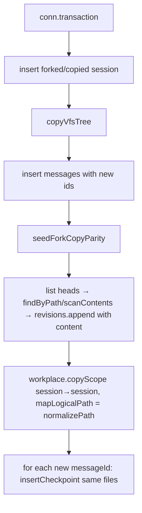

# fork-snapshot-and-rules 技术规格（SPEC）

> **PRD**：[prd.md](./prd.md)  
> **父级**：[../../prd.md](../../prd.md) · [../../spec.md](../../spec.md)

## 设计目标

1. `fork` / `session.copy` 在同一事务内：`copyVfsTree` → **插入消息取得新 ids** → helper 内 **种带 content 的 `vfs_revision`**、**session→session `copyScope` 规则**、对**每条**新消息 **`insertCheckpoint` 同一活树头指针**。  
2. **不**复制 `session_kkv`；不插 seq0 基线；首条 plain user `undo_send` 清空可接受。  
3. 行为改动集中在 Core；三端入口无需产品改 UI。

## 现状与约束

| 模块 | 现状 | 本 feature |
|------|------|------------|
| `DefaultMessageService.fork` | 新 session + `copyVfsTree` + 截断消息 | 消息 id 生成后调 helper（revision / checkpoint / copyScope） |
| `DefaultSessionService.copy` | 同上（全量消息）；注释拒 kkv | 与 fork **同合同** helper |
| `copyVfsTree` | 只写 `vfs_entry`，head 从 1，**不种 revision** | helper 内显式 `revisions.append`（须带 content） |
| `listSessionFileHeads` | 仅返回 `{ logicalPath, headVersion }`，**无 content** | 种 revision 前必须再 `findByPath` / `scanContents` 取 content |
| `MessageCheckpointService.capture` | 自开事务 | **禁止**嵌进已开事务；内联 `listSessionFileHeads` + `insertCheckpoint` |
| `reposFor`（message/session） | 无 workplace / checkpoint / revision | 扩展为 tx 绑定 repo |
| `initializeSessionWorkspace` | create 时 project→session copyScope | fork/copy 用 session→session + `(p) => normalizePath(p)` |
| 测试 `chat.services.test.ts` | 仅消息+VFS | 扩规则 parity + 回滚不清空 |

**约束**：

- 嵌套事务会失败；checkpoint 指针必须对齐**目标**会话 `head_version`（通常为 1），勿抄源 revision 版本号。  
- **`revisions.append` 合同**：`VfsRevisionAppendInput` **必须**含 `content`（及 path / version / status / mtimeMs / storageKind）。`listSessionFileHeads` **不**提供 content → helper **禁止**只调 list heads 后直接 append。  
- **禁止**「只挂 checkpoint、指望 rollback 路径的 `backfillMissingRevisionIfNeeded`」作为 fork/copy 的种树手段；backfill 仅是 restore 容错，**不是**本 feature 的播种策略。

## 总体方案



**顺序钉死**：`VFS → MSG(ids) → helper(REV + RULE + CK)`。  
- MSG **必须**早于 helper：CK 依赖新消息 id。  
- RULE / REV **不**依赖消息 id，但本 feature **统一放进 helper**（在 MSG 之后），避免与「消息 id 之后调 helper」合同分叉；**禁止**再画成 `RULE → MSG` 或 `REV → MSG` 的主路径。

### 共享 helper（建议）

`packages/core/src/domain/chat/logic/` 或 `domain/message-checkpoint/logic/`：

```ts
async function seedForkCopyParity(txRepos, {
  sourceSessionId, targetSessionId, newMessages: { id }[],
}): Promise<void>
```

内部顺序（钉死）：

1. `listSessionFileHeads(entryRepo, projectId, targetSessionId)` → 得到 `{ logicalPath, headVersion }[]`（**无 content**）。  
2. **取 content 再 append**（每条 head，禁止跳过）：  
   - 将 `logicalPath` 解析为目标会话 **physical** 路径；  
   - 用 `entryRepo.findByPath(physical)`（或等价地对目标前缀 `scanContents` 再按 path 索引）读取 live entry 的 `content` / `storageKind` 等；  
   - `revisions.append({ path: physical, version: headVersion, content, status: "active", mtimeMs, storageKind })`；  
   - entry 缺失或非 file：按产品约定跳过或记 deleted revision——**仍不得**省略本步、指望日后 backfill。  
3. `workplace.copyScope(workplaceScopeKey(session:source), workplaceScopeKey(session:target), (p) => normalizePath(p))`  
   - `normalizePath`：`@/domain/vfs/repositories/impl/normalize-path.js`（与 `mapSessionWorkplacePathToProject` / `mapProjectWorkplacePathToSession` 的 identity 语义一致；session→session 直接传 `(p) => normalizePath(p)` 即可）。  
4. 若 `files.length > 0`：对每个 `newMessages[].id` 调用 `insertCheckpoint(sessionId, messageId, files)`。  
5. 空树：跳过 revision append 与 checkpoint（与 `capture` no-op 一致）。

`fork` / `copy` 在**消息 id 生成之后**调用 helper；**仍不**读写 kkv。

## 最终项目结构

```
packages/core/src/
  service/chat/impl/
    message.service.ts          # fork + reposFor
    session.service.ts          # copy + reposFor
  domain/.../
    seed-fork-copy-parity.ts    # NEW（或等价命名）
  domain/workplace/...          # copyScope 复用
  domain/message-checkpoint/... # listSessionFileHeads / insertCheckpoint
  domain/vfs/repositories/impl/normalize-path.js  # copyScope mapLogicalPath
packages/core/test/chat/
  chat.services.test.ts         # 扩展
  fork-copy-parity.test.ts      # NEW 可选
```

## 变更点清单

| 文件 | 变更 |
|------|------|
| `message.service.ts` | `fork`：VFS→MSG 后调 helper；`reposFor` + workplace/checkpoints/revisions/entries |
| `session.service.ts` | `copy` 同调；`reposFor` 同上 |
| 新 helper | list heads → **取 content** → append revision；`copyScope(..., (p) => normalizePath(p))`；批量同树 checkpoint |
| `chat.services.test.ts` / 新测 | 规则、非首条 undo、首条允许空、无 kkv 复制；revision **有 content** 断言 |

Desktop / Mobile / CLI：**无需**改调用方（行为跟随 Core）。

## 详细实现步骤

- Step 1 — phase-fork-helper — blocking: yes — qa: auto：实现 `seedForkCopyParity`（或等价）；单测覆盖「同 files 指针 × N 消息 + revision 存在且 **content 非靠 backfill**」。  
- Step 2 — phase-fork-wire — blocking: yes — qa: auto：`fork` / `copy` 事务内按 `VFS → MSG → helper` 接线；扩展 `reposFor`。  
- Step 3 — phase-fork-tests — blocking: yes — qa: auto：规则 parity；fork 后非首条 `undo_send` / rewind 不清空；首条 undo 允许空；断言无 `session_kkv` 行从源复制。  
- Step 4 — phase-fork-manual — blocking: no — qa: manual_user：Desktop/Mobile 分叉后 Explorer 规则灯与回滚手测。

## 测试策略

### 测试用例

- T-F1 — blocking: yes — Step 1/2：fork 后目标路径存在 `vfs_revision`，`content` 与活树一致（或非空文件有明确 content），且 checkpoint 指向该 version；**不得**仅有 checkpoint 而行缺失、依赖 restore backfill。  
- T-F2 — blocking: yes — Step 2/3：源 session 自定义 inclusion/sort → fork/copy 后新 session 规则一致。  
- T-F3 — blocking: yes — Step 3：fork 后对**第二条** plain user `undo_send` → 文件仍在（对齐活树快照）。  
- T-F4 — blocking: yes — Step 3：fork 后对中间 assistant `rewind` → 不清空。  
- T-F5 — blocking: yes — Step 3：仅一条 plain user 的新会话 `undo_send` → 允许工作区空（标注可接受）。  
- T-F6 — blocking: yes — Step 3：fork/copy 后源/目标 `session_kkv` 不因复制而相同（目标可空或仅首次拼装产生）。

## 兼容性 / 迁移

- 无 schema 迁移。  
- 旧 fork 出的会话无 checkpoint → 行为与现网相同；新 fork/copy 起生效。  
- 保持 attachment-unified「不复制 kkv」合同。

## 风险与回滚方案

| 风险 | 缓解 | 回滚 |
|------|------|------|
| 只挂 checkpoint 不种 revision / 不写 content → rollback 抛错或靠 backfill | 同事务：list heads 后 **findByPath/scanContents 取 content 再 append**；禁止以 backfill 为播种策略 | revert helper |
| N 消息重复 checkpoint 行膨胀 | PRD 接受；可后续优化共享 | — |
| copy/fork 合同漂移 | 强制共享 helper | — |

**回滚**：revert Core helper 接线即可；无数据迁移回滚问题。
