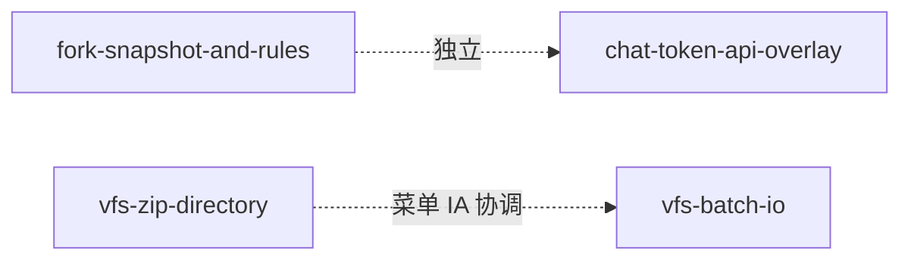

# workspace-chat-vfs-upgrade 技术规格（SPEC）

> **PRD**：[prd.md](./prd.md)  
> **结构**：本文件为**父级编排 SPEC**；实现细节以各 feature SPEC 为准。  
> **Feature SPEC**：  
> - [fork-snapshot-and-rules](./features/fork-snapshot-and-rules/spec.md)  
> - [chat-token-api-overlay](./features/chat-token-api-overlay/spec.md)  
> - [vfs-zip-directory](./features/vfs-zip-directory/spec.md)  
> - [vfs-batch-io](./features/vfs-batch-io/spec.md)

## 设计目标

1. 四个 feature **可独立合入与验收**，共享父 PRD 术语与「不包含」边界。  
2. 推荐交付顺序降低互相踩脚：Core fork → Token 引擎 → ZIP 子树 → 批量 IO（ZIP 入口改挂可与 batch 菜单同 PR 协调）。  
3. 不引入跨 feature 的共享 DB 迁移；ZIP / batch 仅扩 API 与 UI。

## 总体方案



| Feature | 主改动面 | 依赖 |
|---------|----------|------|
| fork-snapshot-and-rules | `packages/core` chat + checkpoint + workplace | 无 |
| chat-token-api-overlay | core tokenizer/compaction + Desktop/Mobile 展示刷新 | 无（与 fork 正交） |
| vfs-zip-directory | core `VfsZipIoService` + 三端入口改挂 | 先于或并行 batch；菜单文案勿抢 |
| vfs-batch-io | 新建 batch 编排 + Desktop DnD + Mobile 更多 | 与 ZIP 入口同屏协调 |

## 最终项目结构

```
workspace-chat-vfs-upgrade/
├── readme.md
├── prd.md
├── spec.md                          ← 本文件
└── features/
    ├── fork-snapshot-and-rules/{prd,spec}.md
    ├── chat-token-api-overlay/{prd,spec}.md
    ├── vfs-zip-directory/{prd,spec}.md
    └── vfs-batch-io/{prd,spec}.md
```

## 变更点清单

父级无独立代码变更；全部落在四个 feature SPEC 的「变更点清单」。

## 详细实现步骤

- Step 1 — phase-parent-order — blocking: no — qa: auto：按推荐顺序排期：F1 → F2 → F3 → F4（F3/F4 可并行，合并前对齐 Mobile「更多」菜单项）。  
- Step 2 — phase-parent-docs — blocking: no — qa: auto：四个 feature SPEC 均已落盘且与父 PRD 无矛盾。  
- Step 3 — phase-parent-release-notes — blocking: no — qa: manual_user：发版说明覆盖分叉、token、子树 ZIP、批量拖入/导出（合并后用户/维护者执行）。

## 测试策略

父级不新增测试套件；以各 feature 的 `T-*` 用例与验收矩阵为准。跨 feature 冒烟（可选）：fork 后工作区 ZIP 子树导入仍正常。

### 测试用例

- T-P1 — blocking: no — 四个 feature 目录均有 `spec.md`，Front Matter `date` 齐全。  
- T-P2 — blocking: no — Mobile「更多」菜单项在 F3+F4 合入后无重复「导入」语义冲突（手工对照 IA）。

## 风险与回滚方案

| 风险 | 缓解 | 回滚 |
|------|------|------|
| F3/F4 同时改 `VfsFileManager` 菜单冲突 | 先合 F3 入口改挂，F4 只加批量项；或同 PR 一次改齐 | 按 feature revert |
| Token 与 fork 并行改 core | 文件面几乎不重叠 | 独立 revert |
| 子树 ZIP 破坏旧 CLI 脚本 | `directoryPath` 默认 `/` 保持旧行为 | 仅 UI 改挂可单独回退 |
