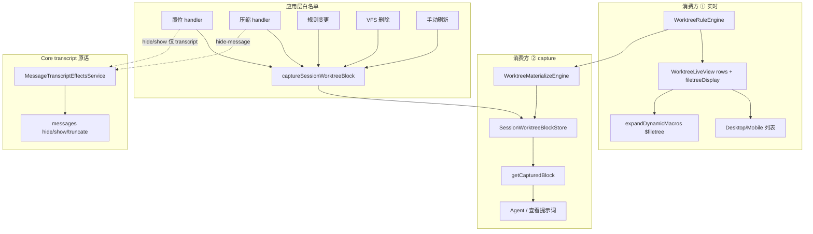

# Worktree 架构收敛 技术规格（SPEC）

> **PRD**：[prd.md](./prd.md)  
> **建议分支**：`feature/worktree-engine-convergence`  
> **代码基线**：`main` @ `dd70d549`（2026-07-12）

## 需求来源

- PRD：`.apm/kb/docs/Iterations/worktree-engine-convergence/prd.md`
- 前置：`virtual-worktree`、`worktree-vfs-ui-refresh-fix`、`message-worktree-refresh-tighten`、`message-set-floor`、`agent-worktree-block-ui`

## 设计目标

1. **双轨语义落地**：消费方 ①（规则视图实时）与消费方 ②（提示词文件块 capture）代码与命名一致。
2. **capture 替代 markDirty**：主动物化 + 写入快照；读路径 `getCapturedBlock` 不再懒加载。
3. **capture 仅应用层白名单**：Core `hide/show/truncate` 纯 transcript；置位、压缩、规则、删 VFS、手动刷新各自显式 capture。
4. **引擎拆分**：RuleEngine（不算正文）+ MaterializeEngine（产出块文本）+ Worktree 门面。
5. **Presentation 分离**：列表 API 输出 enum；中文标签仅在展示层。

## 总体方案

### 架构（目标态）



### API 迁移（Core）

| 现网 | 目标 | 说明 |
|------|------|------|
| `SessionWorktreeSnapshotStore` | `SessionWorktreeBlockStore` | 端口重命名；实现类同步 |
| `markDirty` / `invalidateSessionWorktreeSnapshot` | **删除** | — |
| `getOrRefresh(projectId, sessionId, render)` | `capture(projectId, sessionId)` | 门面内调 `materializePersistBlock` 并写入 |
| `get()` + dirty 逻辑 | `getCapturedBlock(projectId, sessionId)` | 只读；**无条目**时返回 `undefined`（**不**自动 capture）；已 capture 条目即使 `worktreeDisplay === ''` 也返回空字符串 |
| `markSessionWorktreeDirty` | **删除** | — |
| `MessageTranscriptEffectsService` + `worktreeSnapshot` | 移除 snapshot 依赖 | hide/show/setFloor/truncate 无 capture |

**首次读策略（锁定）**：

- `getCapturedBlock` **无条目**时，**不**自动 capture，返回 `undefined`。
- `buildSessionPromptInput` / `run-agent-turn` 等 **run / 预览读路径**：miss 时 **显式 `capture` 一次**（等价现网 `getOrRefresh` miss，但语义为主动 capture）。
- 物化结果为空字符串时，`capture` **仍写入空块**（`{ worktreeDisplay: '' }`）；**不得**以返回 `undefined` 代替 capture。

**capture 执行**：同步 `await`（阻塞 handler 直至物化完成）；规则保存/手动刷新可显示 loading（非 blocking qa）。

### 设计决策（锁定）

| 决策 | 口径 |
|------|------|
| **压缩 capture 范围** | **仅**用户可见压缩入口 capture：Desktop `handleCompactionManual`、Mobile `handleCompactSession`（`trigger: "manual"`）。Agent-runner **condition 压缩**（`trigger: "condition"`）**不** capture；提示词块保持 run 开始快照直至白名单业务或 run 前显式 capture。 |
| **压缩 UI token** | manual / condition 压缩成功后均 **不** `notifyWorkspaceMutated` / `bumpWorktreeUiToken`（与现网一致；仅置位仍 bump 消费方 ①）。 |
| **Desktop 置位落点** | `captureSessionWorktreeBlock` 在 main `handleMessagesSetFloor`（effects 成功后）；`notifyWorkspaceMutated` **留 renderer**（`ConversationPanel` 置位确认链，消费方 ①）。 |
| **M1 原子交付** | Step 3（effects 解耦）+ Step 5（置位 capture）+ Step 6（压缩 capture）**同 PR 或同一 feature flag 下不可拆分上线**；否则会出现 hide 不 dirty 但业务入口尚未 capture 的窗口期。 |
| **双端命名** | 领域层与共享 helper **同名**；五类白名单 **统一业务动词**（见下节）；平台壳（IPC handler / hook）与 UI 刷新原语 **允许不同**，以对照表为准。**不**追求结构镜像（Mobile 伪 IPC 等）。 |

### 双端命名对照（锁定）

**分层原则**

| 层级 | 统一要求 | 说明 |
|------|----------|------|
| **领域层**（Core store + 共享 helper） | **必须同名** | 维护者只认 `capture` / `getCapturedBlock` / `captureSessionWorktreeBlock` |
| **应用层业务动词** | **统一动词** | 五类白名单均经 `captureSessionWorktreeBlock`；入口可用场景薄包装（见下表「统一动词」列） |
| **平台壳**（IPC handler / React hook） | **可查即可** | Desktop main IPC 与 Mobile hook 命名惯例可不同，须在本表能一一对照 |
| **UI 刷新原语**（消费方 ①） | **不强制同名** | `notifyWorkspaceMutated` ↔ `bumpWorktreeUiToken` 为平台级原语，职责映射见下表 |

**领域层（禁止对外残留旧名）**

| 概念 | 统一名称 | 禁止对外 |
|------|----------|----------|
| 写入快照 | `capture` / `captureSessionWorktreeBlock` | `markDirty`、`invalidate*`、`getOrRefresh` |
| 读快照 | `getCapturedBlock` | 懒物化读路径 |
| Store | `SessionWorktreeBlockStore` | `SessionWorktreeSnapshotStore` |
| Mobile 封装模块 | `worktree-block.service.ts` | `worktree-snapshot.service.ts` |
| Desktop 共享 helper 模块 | `resolve-vfs-scope.ts` 导出 `captureSessionWorktreeBlock` | `invalidateSessionWorktreeSnapshot` |

**应用层 capture 白名单 — 统一动词与双端落点**

| 业务 | 统一动词（共享实现） | Desktop 壳 | Mobile 壳 | Core 需移除 |
|------|---------------------|-----------|-----------|-------------|
| 置位 | `captureSessionWorktreeBlock`（effects 成功后内联调用） | main `handleMessagesSetFloor` | `useChatTabMessages.runSetFloor` | `setMessageFloorAtMessage` L118 markDirty |
| 压缩（manual） | 同上（`emit` 成功后内联调用） | `handleCompactionManual` | `handleCompactSession` | `hideMessagesInRange` L47 markDirty |
| 规则 | 同上（规则保存成功后内联调用） | `handleWorktreeSetDirRule` / `handleWorktreeSetFileRule` | `VfsFileManager.reloadAfterRuleChange` 等 | `invalidate*` |
| VFS 删 | 同上（规则清理后内联调用） | `handleVfsDelete` | `cleanupWorktreeAfterVfsDelete` | `invalidate*` |
| 手动 | `captureSessionWorktreeBlockOnManualRefresh` → 委托 `captureSessionWorktreeBlock` | main `handleWorktreeCaptureSessionBlock`（IPC）；renderer 调 `ipcWorktreeCaptureSessionBlock` | `useChatTabController.handleCapturePromptFileBlock` | `invalidate*`、`handleRefreshWorktree`、`handleWorktreeInvalidateSessionSnapshot` |

**消费方 ① UI 刷新 — 对照（不统一函数名）**

| 语义 | Desktop | Mobile | 何时调用 |
|------|---------|--------|----------|
| 刷新工作区列表（不经 block store） | `notifyWorkspaceMutated` | `bumpWorktreeUiToken` | **仅置位**成功后 |
| 不刷新列表 | — | — | manual/condition 压缩、手动 capture、规则变更（各端按现网局部 reload / notify） |

**Desktop IPC channel（M1 重命名）**

| 新 channel | 旧 channel（deprecated alias 保留一版） | handler |
|------------|----------------------------------------|---------|
| `WORKTREE_CAPTURE_SESSION_BLOCK` | `WORKTREE_INVALIDATE_SESSION_SNAPSHOT` | `handleWorktreeCaptureSessionBlock` |

### 应用层 capture 白名单（精确落点）

> 落点与上表「双端命名对照」一致；实现时 **禁止** 新增对外 `invalidate*` / `markDirty` 命名。

**不 capture**：truncate、rollback、VFS write/mkdir/rename（本迭代不扩 rename）、pullTemplate、Agent 写盘、裸 hide/show IPC/CLI、**condition 压缩**（`trigger: "condition"`）。

**压缩细分**：`hide-message.handler` / Core `hideMessagesInRange` 单独执行 **永不** capture；仅 manual IPC/hook 在 emit 成功后 capture（见设计决策表）。

**UI token 分离（锁定）**：
- **置位**成功后仍 `notifyWorkspaceMutated` / `bumpWorktreeUiToken`（仅消费方 ①，与现网一致）。
- **manual 压缩**（Desktop `runCompaction` / Mobile `handleCompactSession`，`trigger: "manual"`）成功后 **不** bump 消费方 ① UI token（与现网一致；仅 `reloadMessages` / token label 刷新）。
- **condition 压缩**（`trigger: "condition"`，agent-runner 内自动触发）同样 **不** bump UI token。

---

## 最终项目结构

```
packages/core/src/
├── domain/worktree/
│   ├── logic/
│   │   ├── worktree-eval.ts              # 保留；RuleEngine 复用
│   │   ├── worktree-rule-engine.ts       # 新增：evaluateRuleView
│   │   ├── worktree-materialize-engine.ts # 新增：materializeBlockFromView
│   │   ├── worktree-labels.ts            # M2 后仅 Presentation/CLI 可选使用
│   │   ├── worktree-display.ts
│   │   └── worktree-file-tree.ts
│   └── model/
│       ├── worktree-types.ts             # M2：WorktreeRuleRow enum DTO
│       └── worktree-rule-view.ts         # 新增
├── service/worktree/
│   ├── worktree.port.ts                  # 门面扩展 capture 委托
│   └── impl/worktree.service.ts          # 委托 RuleEngine + MaterializeEngine
├── service/prompt/
│   ├── session-worktree-block.port.ts    # 重命名自 snapshot.port
│   └── impl/session-worktree-block-store.service.ts
└── service/chat/
    └── impl/message-transcript-effects.service.ts  # 无 block store

apps/desktop/src/main/
├── ipc/handlers/{worktree,messages,compaction,vfs}.ts
└── services/session-prompt-input.service.ts

apps/mobile/src/
├── services/{worktree-block.service.ts, session-prompt-input.service.ts}  # 重命名 snapshot
└── screens/tabs/chat-tab/useChatTabMessages.ts
```

---

## 变更点清单

### M1 — capture 替代 markDirty

| 文件 | 变更 |
|------|------|
| `session-worktree-snapshot.port.ts` → `session-worktree-block.port.ts` | API 重写 |
| `session-worktree-snapshot-store.service.ts` → `session-worktree-block-store.service.ts` | 去掉 dirty Map 条目 |
| `mark-session-worktree-dirty.ts` | **删除** |
| `message-transcript-effects.service.ts` | 移除 snapshot 依赖与 3 处 markDirty |
| `create-message-transcript-effects.ts` | 工厂签名 |
| `message-transcript-effects.port.ts` | 注释更新 |
| `public/worktree.ts` / `public/chat.ts` | export + allowlist |
| `agent-runner.ts` / `run-agent-turn.ts` | `getCapturedBlock`；run 前缺失则 capture |
| `session-prompt-input.service.ts`（双端 + CLI） | 同上 |
| `resolve-vfs-scope.ts` | `captureSessionWorktreeBlock` 替代 invalidate |
| `worktree-snapshot.service.ts` → `worktree-block.service.ts` | Mobile 封装 |
| `handlers/worktree.ts` | 规则 → capture；`handleWorktreeInvalidateSessionSnapshot` → `handleWorktreeCaptureSessionBlock` |
| `handlers/messages.ts` | 置位 → capture |
| `handlers/compaction.ts` | 压缩 → capture |
| `handlers/vfs.ts` | 删除 → capture |
| `useChatTabMessages.ts` | 置位/压缩 → capture |
| `VfsFileManager.tsx` | 规则 → capture |
| `vfs-operations.service.ts` | 删除 → capture |
| `useChatTabController.ts` | `handleRefreshWorktree` → `handleCapturePromptFileBlock`；内调 `captureSessionWorktreeBlockOnManualRefresh` |
| `apps/desktop/renderer/App.tsx` | 手动刷新按钮文案 + Toast（PRD 验收 D：「刷新提示词文件块」/「已更新提示词文件块快照」，非「刷新工作树」/「工作树已刷新」） |
| `apps/mobile/src/components/chrome/SessionActionsDrawer.tsx` | 抽屉入口文案「刷新工作树」→「刷新提示词文件块」（与 PRD 验收 D 双端对齐） |
| `ipc-types.ts` | 新增 `WORKTREE_CAPTURE_SESSION_BLOCK` + `handleWorktreeCaptureSessionBlock`；`WORKTREE_INVALIDATE_SESSION_SNAPSHOT` deprecated alias 一版 |
| `worktree-block.service.ts` | 导出 `captureSessionWorktreeBlock`、`captureSessionWorktreeBlockOnManualRefresh` |
| `message-rollback.service.ts` | 移除未用 snapshot 依赖 |
| 三端 `create-*-runtime.ts` | 注入 `worktreeBlockStore` |

### M2 — RuleEngine + 结构化视图

| 文件 | 变更 |
|------|------|
| `worktree-rule-engine.ts` | 从 service 抽出 metadata + DFS + enum rows |
| `worktree-types.ts` | `WorktreeRuleRow`；`WorktreeListRow` 改为 enum 或 deprecated alias |
| `worktree.service.ts` | `materializeLiveView` 委托 RuleEngine |
| `ipc-types.ts` `WorktreeListRowDto` | enum 字段 |
| `vfs-row-mapper.ts` / `vfs-tree-utils.ts` | Presentation 映射 |
| `DirectoryRuleSheet.tsx` / `DirectoryRuleModal.tsx` | ruleEnabled 初值对齐 |

### M3 — MaterializeEngine + 门面

| 文件 | 变更 |
|------|------|
| `worktree-materialize-engine.ts` | 从 RuleView 读正文拼块 |
| `worktree.service.ts` | `materializePersistBlock` 委托 |
| `captureSessionWorktreeBlock` | 统一经 `WorktreeService` 或 session 门面 |

### M4 — 清债

| 文件 | 变更 |
|------|------|
| `worktree.service.ts` | 删除/deprecated `materialize()` |
| 过时 SPEC 引用 `SessionMacroCache` | kb 归档注释 |
| grep 门禁 | 无对外 markDirty/getOrRefresh |

---

## 详细实现步骤

### Milestone M1 — capture 替代 markDirty + 应用层白名单

> **原子交付**：Step 3 + Step 5 + Step 6 须同 PR 或同一 feature flag 一并上线（见设计决策表）。
- Step 1 — phase-block-store — blocking: yes — qa: auto：新增 `SessionWorktreeBlockStore` 端口与实现：`capture` 写入 `{ worktreeDisplay, capturedAtMs }`（`worktreeDisplay` 允许 `''`）；`getCapturedBlock` 只读，有条目即返回（含空串），无条目返回 `undefined`；删除 dirty 字段与 `markDirty/isDirty/getOrRefresh/clear` 对外语义（`clear` 可保留测试用）。
- Step 2 — phase-block-store — blocking: yes — qa: auto：新增 `captureSessionWorktreeBlock(scope, runtime)` 共享 helper（Desktop `resolve-vfs-scope.ts`、Mobile `worktree-block.service.ts`）：session scope 校验 → `wt.materializePersistBlock()` → `store.capture`。
- Step 3 — phase-effects-decouple — blocking: yes — qa: auto：`MessageTranscriptEffectsService` 移除 `worktreeSnapshot` 依赖；删除 `hide/show/setFloor` 内 `markSessionWorktreeDirty`；更新 `create-message-transcript-effects` 与 `public/chat` allowlist。
- Step 4 — phase-effects-decouple — blocking: yes — qa: auto：更新 `message-transcript-effects.test.ts`：T-WEC1/2/3（hide/show/置位 **不** dirty）；supersede T-SF5 dirty 断言。
- Step 5 — phase-app-capture-setfloor — blocking: yes — qa: auto：Desktop main `handleMessagesSetFloor`、Mobile `runSetFloor` 在 effects 成功后调用 `captureSessionWorktreeBlock`；renderer `ConversationPanel` 仅 `notifyWorkspaceMutated` + Toast（**不**在 renderer capture）；更新 T-SF14 → T-WEC4。**须与 Step 3 同批交付**（见设计决策 M1 原子交付）。
- Step 6 — phase-app-capture-compaction — blocking: yes — qa: auto：Desktop `handleCompactionManual`、Mobile `handleCompactSession`（`trigger: "manual"`）在 `eventOrchestrator.emit` 成功后 capture；**不** `notifyWorkspaceMutated` / `bumpWorktreeUiToken`（与现网一致）；`hide-message.handler` / condition 压缩路径测 T-WEC12 无 capture、无 UI token bump。**须与 Step 3 同批交付**。
- Step 7 — phase-app-capture-rules — blocking: yes — qa: auto：Desktop worktree IPC setDirRule/setFileRule、Mobile `VfsFileManager` 规则路径：`invalidate` → capture（T-WEC6）。
- Step 8 — phase-app-capture-vfs-delete — blocking: yes — qa: auto：Desktop `handleVfsDelete`、Mobile `cleanupWorktreeAfterVfsDelete` capture（T-WEC7）。
- Step 9 — phase-app-capture-manual — blocking: yes — qa: auto：手动刷新改为立即 capture（Desktop main `handleWorktreeCaptureSessionBlock` / Mobile `handleCapturePromptFileBlock`，均经 `captureSessionWorktreeBlockOnManualRefresh`）；IPC channel `WORKTREE_CAPTURE_SESSION_BLOCK`（旧 `WORKTREE_INVALIDATE_SESSION_SNAPSHOT` deprecated alias 一版）；renderer 改调 `ipcWorktreeCaptureSessionBlock`；**Desktop UI 改 renderer** `App.tsx` 按钮「刷新提示词文件块」+ Toast「已更新提示词文件块快照」；**Mobile UI 改** `SessionActionsDrawer.tsx` 抽屉入口「刷新工作树」→「刷新提示词文件块」+ 成功 Toast 与 Desktop 对齐；capture **不在 renderer**；双端仍不 bump 消费方 ① 列表（T-WEC8；PRD 验收 D）。
- Step 10 — phase-read-path — blocking: yes — qa: auto：`agent-runner`、`run-agent-turn`、双端 `session-prompt-input`、CLI prompt：`getCapturedBlock`；run / 预览开始前无条目则显式 capture 一次；物化空串写入空块（T-WEC11 扩展断言）。
- Step 11 — phase-read-path — blocking: yes — qa: auto：删除 `mark-session-worktree-dirty.ts`；runtime 字段 `worktreeSnapshot` → `worktreeBlockStore`（三端）；更新 rollback 工厂去掉死依赖。
- Step 12 — phase-m1-cleanup — blocking: yes — qa: auto：grep 门禁：提示词路径无 `markDirty|getOrRefresh|invalidateSessionWorktreeSnapshot|handleRefreshWorktree|handleWorktreeInvalidateSessionSnapshot`（deprecated IPC alias 除外）；更新 `public-worktree-allowlist.json`。

---

## M2 DTO 契约（锁定）

> **开工门禁**：M2 编码前本节约束为字段级契约；实现不得偏离 enum 语义或在中文字符串与 enum 间 round-trip。  
> **现网基线**：`packages/core/src/domain/worktree/model/worktree-types.ts`（`RuleState` / `InclusionMode` / `DisplayState`）；`worktree-labels.ts`；`apps/mobile/.../vfs-row-mapper.ts`；`apps/desktop/.../vfs-tree-utils.ts`。

### 域枚举（复用现网，禁止重定义）

```typescript
// worktree-types.ts — 已存在，M2 直接引用
type RuleState = "rule_on" | "rule_off";
type InclusionMode = "auto" | "show" | "hide";
type DisplayState = "hidden" | "full" | "header" | "filename";
```

### `WorktreeRuleRow` / `WorktreeListRow`（M2 目标态）

RuleEngine 与列表 API **同源**；`WorktreeListRow` 为 `WorktreeRuleRow` 的对外别名（或同一 discriminated union，不保留 parallel 定义）。

```typescript
/** RuleEngine DFS 单行；dir / file 分支字段互斥，禁止用空 string 占位。 */
type WorktreeDirRuleRow = {
  readonly kind: "dir";
  readonly path: string;
  readonly ruleState: RuleState;
};

type WorktreeFileRuleRow = {
  readonly kind: "file";
  readonly path: string;
  readonly inclusionMode: InclusionMode;
  readonly displayState: DisplayState;
};

type WorktreeRuleRow = WorktreeDirRuleRow | WorktreeFileRuleRow;

/** 消费方 ① 列表行；与 WorktreeRuleRow 结构一致。 */
type WorktreeListRow = WorktreeRuleRow;
```

**与现网差异（breaking）**：

| 字段 | 现网 `WorktreeListRow` | M2 契约 |
|------|------------------------|---------|
| `ruleState` | `string`（`规则·开` / `规则·关` / `""`） | `RuleState`（仅 `kind: "dir"`） |
| `inclusionMode` | `string`（`跟随` / `展示` / `隐藏` / `""`） | `InclusionMode`（仅 `kind: "file"`） |
| `displayState` | `string`（`不展示` / `全内容` / … / `""`） | `DisplayState`（仅 `kind: "file"`） |

**禁止**：在 Core / IPC / 持久化路径以中文标签作为权威值；禁止 `label → enum` 反向解析作为业务逻辑（见下文 Presentation 迁移）。

### `WorktreeRuleView`（`evaluateWorktreeRuleView` 输出）

单次 metadata 加载 + DFS 的**纯规则视图**；不算文件正文、不写 block store。

```typescript
/** RuleEngine 输入：与现网 WorktreeService.loadContextMetadata 等价。 */
interface WorktreeRuleContext {
  readonly dirRuleMap: ReadonlyMap<string, WorktreeDirRule>;
  readonly fileRuleMap: ReadonlyMap<string, WorktreeFileRule>;
  readonly fileSet: ReadonlySet<string>;
  readonly mtimeByPath: ReadonlyMap<string, number>;
  readonly allDirs: ReadonlySet<string>;
}

/** evaluateWorktreeRuleView(ctx) → view */
interface WorktreeRuleView {
  /** DFS 顺序列表行（enum 字段，见 WorktreeRuleRow）。 */
  readonly rows: readonly WorktreeRuleRow[];
  /**
   * 各文件 path → 计算后 DisplayState。
   * 键集 = fileSet；供宏树 renderWorktreeFileTreeForMacro 与 MaterializeEngine 共用。
   * 与 rows 中 file 行的 displayState 一致（同一 evaluateFileDisplay 链路）。
   */
  readonly displayByPath: ReadonlyMap<string, DisplayState>;
}

/** 签名（packages/core/.../worktree-rule-engine.ts） */
declare function evaluateWorktreeRuleView(
  ctx: WorktreeRuleContext,
): WorktreeRuleView;
```

**派生关系（锁定）**：

- `WorktreeLiveView.listRows` ← `view.rows`（浅拷贝或 readonly 透传）。
- `WorktreeLiveView.filetreeDisplay` ← `renderWorktreeFileTreeForMacro({ …ctx, displayByPath: view.displayByPath })`。
- M3 `materializeBlockFromView(view, vfs)` 仅读 `view.displayByPath`，不对 `rows` 再跑 DFS。

### IPC `WorktreeListRowDto` — M1 / M2 分阶段 breaking 策略

| 阶段 | `WorktreeListRow`（Core） | `WorktreeListRowDto`（`apps/desktop/shared/ipc-types.ts`） | 说明 |
|------|---------------------------|-----------------------------------------------------------|------|
| **M1** | 保持现网 `string` 三字段 | 保持现网 `string` 三字段 | M1 可独立合并；不触发双端 Presentation 改造 |
| **M2** | 切换为 `WorktreeRuleRow` union | **同构 enum 字段**（与 Core 1:1） | Desktop main `handleWorktreeBuildListRows` 直传 `buildListRows()`；**无** IPC 层中文序列化 |

M2 目标态 DTO（与 Core 同构）：

```typescript
type WorktreeListRowDto =
  | {
      readonly kind: "dir";
      readonly path: string;
      readonly ruleState: RuleState;
    }
  | {
      readonly kind: "file";
      readonly path: string;
      readonly inclusionMode: InclusionMode;
      readonly displayState: DisplayState;
    };
```

**发布约束**：M2 PR **须双端同发**（Desktop IPC + renderer + Mobile 直连 Core）；不得出现「Core enum、IPC string」混跑窗口。

### Presentation 层与现网反向解析迁移

现网在 **Core 出口** 已调用 `worktree-labels.ts` 将 enum 编成中文，Presentation 再 **反向解析** 中文 — M2 拆除该双跳。

| 模块 | 现网行为 | M2 目标 |
|------|----------|---------|
| `worktree.service.ts` `walkDir` | `ruleStateLabel` / `inclusionModeLabel` / `displayStateLabel` 写入 `listRows` | RuleEngine **只写 enum**；labels **不**进入 `rows` |
| `worktree-labels.ts` | Core 列表 TSV / DFS 编标签 | **仅** Presentation / CLI / 宏树（`filetreeMacroLoadStateLabel` 保留在宏路径）调用 |
| Mobile `vfs-row-mapper.ts` | `row.ruleState === '规则·开'` → `ruleEnabled`；`row.inclusionMode === '隐藏'` 等匹配中文 badge | `kind === 'dir'` → `ruleState === 'rule_on'`；file badge 由 `inclusionMode` enum + `*Label()` 映射 |
| Desktop `vfs-tree-utils.ts` | `vfsEntryStatusText` 拼接中文字段；`inclusionModeFromLabel` 中文→enum | `vfsEntryStatusText` 接收 enum DTO，内部调用 `worktree-labels.ts` **正向**映射；**删除** `inclusionModeFromLabel` 及 `includes('开')` 启发式 |

**标签映射表（Presentation 唯一出处）** — 实现须与现网 `worktree-labels.ts` 一致：

| Enum | 列表 UI 标签（`ruleStateLabel` / `inclusionModeLabel` / `displayStateLabel`） |
|------|--------------------------------------------------------------------------------|
| `rule_on` / `rule_off` | `规则·开` / `规则·关` |
| `auto` / `show` / `hide` | `跟随` / `展示` / `隐藏` |
| `hidden` / `full` / `header` / `filename` | `不展示` / `全内容` / `文件头` / `文件名` |

**`ruleEnabled` 初值（Step 17 / PRD E）**：目录行以 `ruleState === 'rule_on'` 为准；无持久化 `WorktreeDirRule` 行时，根目录与其它目录的默认 `ruleState` 与现网 `resolveRuleState` 一致（根 `rule_on`，未配置目录 `rule_off`）。

---

### Milestone M2 — RuleEngine + 结构化视图

- Step 13 — phase-rule-engine — blocking: yes — qa: auto：新增 `evaluateWorktreeRuleView(ctx)` → **§ M2 DTO 契约** `WorktreeRuleView`；单次 metadata + DFS；单测 T-WEC13/15 断言 enum 字段与 `displayByPath` 一致性。
- Step 14 — phase-rule-engine — blocking: yes — qa: auto：`materializeLiveView` 改为 RuleEngine + `renderWorktreeFileTreeForMacro(displayByPath)`；`listRows` 来自 `view.rows`；保留 `liveViewInFlight` 合并。
- Step 15 — phase-presentation — blocking: yes — qa: auto：按 **§ IPC breaking 策略** 将 Core `WorktreeListRow` 与 `WorktreeListRowDto` 同步切 enum；Desktop `vfs-tree-utils`、Mobile `vfs-row-mapper` 改 **正向** `worktree-labels` 映射；删除 `=== '规则·开'`、`inclusionModeFromLabel` 及中文 `===` 分支。
- Step 16 — phase-presentation — blocking: yes — qa: auto：`expandDynamicMacros` / macro 测 T-WEC14：不调用 block store。
- Step 17 — phase-presentation — blocking: no — qa: auto：Mobile `DirectoryRuleSheet` 补目录规则开关；双端无持久化行时 ruleEnabled 初值与列表一致（PRD E）。

### Milestone M3 — MaterializeEngine + 门面

- Step 18 — phase-materialize-engine — blocking: yes — qa: auto：新增 `materializeBlockFromView(view, vfs)`：仅对非 hidden 且 full/header 档位 `findByPath`；单测 T-WEC16。
- Step 19 — phase-materialize-engine — blocking: yes — qa: auto：`materializePersistBlock` / `captureSessionWorktreeBlock` 经 MaterializeEngine；删除 persist 路径无效 listRows 构建。
- Step 20 — phase-facade — blocking: yes — qa: auto：`WorktreeService`（或 session 级 facade）统一对外 capture/getCapturedBlock/list/rule CRUD；外部禁止直调 store。

### Milestone M4 — 清债与文档

- Step 21 — phase-cleanup — blocking: no — qa: auto：deprecated `materialize()` / `WorktreeMaterialized`；合并双 DFS 剩余重复（若 M2 未完全消除）。
- Step 22 — phase-cleanup — blocking: no — qa: manual_user：双端置位/改规则/手动 capture 后打开「查看提示词」与 Explorer 对照（合并后用户验收）。

---

## 测试策略

### 原则

- M1 每个白名单入口至少一条 **capture 被调用** 集成测 + Core **hide 不 capture** 负向测。
- 消费方 ① 回归：`buildListRows` 不经 block store（保留现 `worktree-handlers` 测）。
- T-SF* 中与 snapshot 相关的 dirty 断言由 T-WEC* **supersede**（T-SF1–4、6、7、11、12、18 保留）。

### 测试用例

#### M1 — blocking

| ID | blocking | 映射 Step | 描述 |
|----|----------|-----------|------|
| T-WEC1 | yes | 3–4 | `hideMessagesInRange` 后 store 无 capture、`isDirty` 不存在 |
| T-WEC2 | yes | 3–4 | `showMessagesInRange` 同上 |
| T-WEC3 | yes | 3–4 | `setMessageFloorAtMessage` Core 路径不 capture |
| T-WEC4 | yes | 5 | Desktop 置位 IPC 成功后 capture；`getCapturedBlock` 非空 |
| T-WEC4b | yes | 5 | Mobile 置位链路与 T-WEC4 parity |
| T-WEC5 | yes | 6 | manual 压缩 emit 成功后 capture；condition 压缩 / hide handler 单独跑不 capture |
| T-WEC6 | yes | 7 | Desktop setDirRule/setFileRule 后 capture；列表仍不经 store |
| T-WEC7 | yes | 8 | VFS delete 后 capture；快照不含已删 path |
| T-WEC8 | yes | 9 | 手动刷新立即 capture；不触发 buildListRows 经 store |
| T-WEC9 | yes | 10 | Agent run 内 VFS write 后 `getCapturedBlock` 不变 |
| T-WEC10 | yes | 3 | truncate / rollback 不 capture（沿用现测） |
| T-WEC11 | yes | 1, 10 | `capture` 后 `getCapturedBlock` 返回同文本（含 `''` 空块）；无 lazy getOrRefresh；无条目仍为 `undefined` |
| T-WEC12 | yes | 6 | `runHideMessageAction` / condition 压缩路径 alone 不 capture |

#### M2 — blocking

| ID | blocking | 映射 Step | 描述 |
|----|----------|-----------|------|
| T-WEC13 | yes | 13–14 | `materializeLiveView` 并发 coalesce 仍单次 metadata |
| T-WEC14 | yes | 16 | `$filetree` 展开不调用 block store |
| T-WEC15 | yes | 13–15 | 列表行 enum 字段与 `displayByPath` 一致；Presentation 正向 label 映射（无中文反向解析） |

#### M3 — blocking

| ID | blocking | 映射 Step | 描述 |
|----|----------|-----------|------|
| T-WEC16 | yes | 18 | MaterializeEngine 仅 full/header 读正文 |
| T-WEC17 | yes | 20 | 白名单外路径无 store.capture 调用（grep/架构测） |
| T-WEC18 | yes | 12 | public allowlist 含新 API 无 markDirty |

#### 保留（不修改语义）

| ID | 说明 |
|----|------|
| T-SF1–3 | set-floor range 纯函数 |
| T-SF4, T-SF6, T-SF7, T-SF4b | transcript 行为 |
| T-SF11, T-SF12 | WebView 菜单资格 |
| T-SF18 | 置位幂等 Toast |
| T-WT4–9, T-WT16 | prompt 注入（mock 迁 getCapturedBlock） |

### CI 命令（M1 门禁）

```bash
npm run build -w @novel-master/core

npm run test:fast -w @novel-master/core -- \
  test/chat/message-transcript-effects.test.ts \
  test/chat/message-set-floor-range.test.ts \
  test/worktree/session-worktree-snapshot.test.ts \
  test/session-fs/rollback-to-message.test.ts \
  test/events/hide-message.handler.test.ts

npm run build:main -w @novel-master/desktop
npm test -w @novel-master/desktop -- \
  test/worktree-handlers.test.ts \
  test/messages-set-floor-handler.test.ts

npm test -w @novel-master/mobile -- \
  __tests__/worktree-snapshot.service.test.ts \
  __tests__/vfs-file-manager.session.integration.test.tsx
```

M2 追加：

```bash
npm run test:fast -w @novel-master/core -- \
  test/worktree/worktree-live-view.test.ts \
  test/prompt/worktree-file-tree-macro.test.ts
```

---

## 兼容性与迁移

| 项 | 策略 |
|----|------|
| `SessionWorktreeSnapshotStore` 重命名 | 类型 alias `@deprecated` 一版；allowlist 测试驱动 |
| `WorktreeListRow` 中文字段 | M1 保持 `string`；M2 按 **§ M2 DTO 契约** 切 enum discriminated union；IPC `WorktreeListRowDto` 与 Core 同构；双端同发 |
| Desktop IPC 手动 capture | 新 channel `WORKTREE_CAPTURE_SESSION_BLOCK` + handler `handleWorktreeCaptureSessionBlock`；旧 `WORKTREE_INVALIDATE_SESSION_SNAPSHOT` deprecated alias 一版；renderer 改调 `ipcWorktreeCaptureSessionBlock` 并同步 `App.tsx` 文案（PRD 验收 D） |
| Mobile 手动 capture 命名 | `handleRefreshWorktree` → `handleCapturePromptFileBlock`；经 `captureSessionWorktreeBlockOnManualRefresh` |
| Mobile 手动刷新入口 | `SessionActionsDrawer.tsx` 文案「刷新工作树」→「刷新提示词文件块」；成功 Toast 与 Desktop 对齐（PRD 验收 D） |
| 进程内 store | 无 DB 迁移；重启后快照空，run 前 capture 重建 |
| CLI hide/show | 本迭代不 capture；文档化；可选 follow-up |
| VFS rename | 本迭代不纳入白名单；后续迭代跟进 |

## 风险与回滚方案

| 风险 | 缓解 | 回滚 |
|------|------|------|
| capture 同步阻塞 UI | 规则/手动刷新可短 loading；大工作区物化耗时 | feature flag 或 revert M1 commit |
| 双端 capture 落点不一致 | Desktop 置位 capture 在 main `handleMessagesSetFloor`（`notifyWorkspaceMutated` 留 renderer）；Mobile 在 hook；T-WEC4/4b parity 测 | — |
| condition 压缩不 capture 与 agent 读块 | condition 路径不 capture；agent 同 run 内 `getCapturedBlock` 保持 run 开始快照；manual 压缩在 emit 后 capture | 文档化于设计决策表 |
| M2 enum breaking | 分 milestone 发布；M1 可独立合并 | revert M2 only |
| T-SF5/T-SF14 supersede | SPEC 与 message-set-floor spec 交叉引用说明 | — |

**回滚**：M1/M2/M3 分 commit；回滚 M1 恢复 markDirty 行为需 revert block store + effects + app handlers 整组。

---

## Context Bundle（供实现参考）

```yaml
iteration_name: worktree-engine-convergence
requirement_path: .apm/kb/docs/Iterations/worktree-engine-convergence/prd.md
spec_path: .apm/kb/docs/Iterations/worktree-engine-convergence/spec.md
base_sha: dd70d549
blocking_steps: [1,2,3,4,5,6,7,8,9,10,11,12,13,14,15,16,18,19,20]
explore_summary: |
  现网 markDirty 分散在 MessageTranscriptEffects（hide/show/置位）与应用层 invalidate（规则/删/手动）；
  压缩经 hide-message 间接 dirty。双轨 LiveView 已分离。WorktreeService 单体含双 DFS。
  目标：BlockStore capture/getCapturedBlock；effects 解耦；五类白名单应用层 capture；
  RuleEngine + MaterializeEngine + enum Presentation。
impact_files:
  - packages/core/src/service/prompt/
  - packages/core/src/service/chat/impl/message-transcript-effects.service.ts
  - packages/core/src/service/worktree/
  - packages/core/src/service/agent/
  - apps/desktop/src/main/ipc/handlers/
  - apps/desktop/renderer/App.tsx
  - apps/mobile/src/components/chrome/SessionActionsDrawer.tsx
  - apps/mobile/src/services/
  - apps/mobile/src/screens/tabs/chat-tab/useChatTabMessages.ts
constraints:
  - Agent run 内 VFS 写盘不 capture
  - condition 压缩（trigger:condition）不 capture
  - truncate/rollback 不 capture
  - filetree/列表不读 block store
  - hide/show Core 原语不 capture
  - 双端命名：领域层同名；白名单统一 capture 动词；平台壳与 UI 刷新原语见 §双端命名对照
```

---

**请确认本 SPEC 后再进入编码。** 本迭代已锁定：首次读策略（显式 capture + 空块写入）、Desktop 置位/手动刷新落点、manual-only 压缩 capture、M1 原子交付（Step 3+5+6）、**双端命名对照**（领域层同名，手动入口 `handleWorktreeCaptureSessionBlock` / `handleCapturePromptFileBlock`）。**开放跟进**：VFS rename 是否纳入后续白名单（本迭代不扩）。
