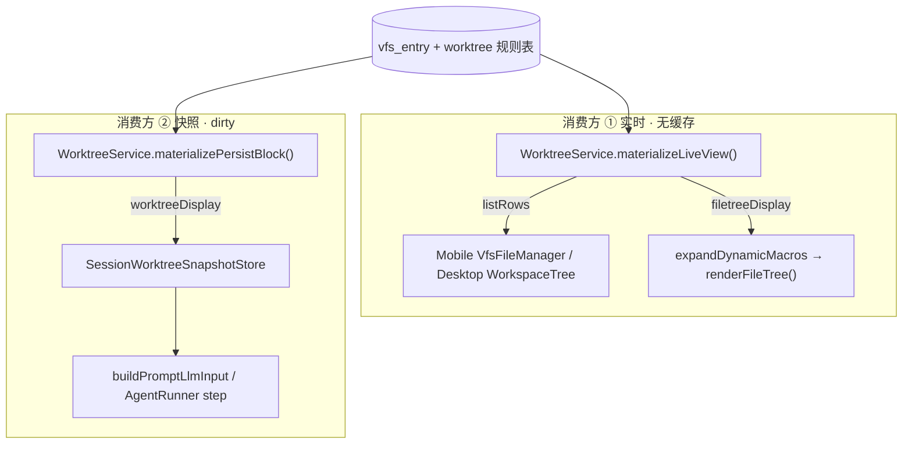

# Worktree / VFS 工作区展示与刷新修复 技术规格（SPEC）

> **PRD**：[prd.md](./prd.md)  
> **前置**：[message-delete-worktree-narrow-refresh/spec.md](../message-delete-worktree-narrow-refresh/spec.md)（窄刷新 `markDirty` 口径）、[vfs-directory-nodes/spec.md](../vfs-directory-nodes/spec.md)（目录规则语义）  
> **建议分支**：`feature/worktree-vfs-ui-refresh-fix`（worktree `novel-master-f4`）  
> **代码基线**：`main` @ `395032b4`（2026-06-21）  
> **审查**：2026-06-21 subagent 对照代码库复核并已吸收修正项

## 设计目标

1. **消费方分离**：消费方 ①（工作区 UI + `{{$filetree}}`）与消费方 ②（提示词持久 worktree 块）数据源彻底分开；① **禁止** 读 `SessionWorktreeSnapshotStore`。
2. **UI 与 `{{$filetree}}` 同链路**：二者必须经 **同一 Core 方法** `materializeLiveView()` 产出 `listRows` 与 `filetreeDisplay`；`buildListRows()` / `renderFileTree()` 均委托至该方法。
3. **修复写盘后 UI 错乱**：session UI 误用快照 `listRows` 是根因；改实时链路后 `mapVfsListEntry` 仅作防御性兜底。
4. **面板切换 / 用户查看工作区时刷新 ①**：Mobile `chat → workspace`；Desktop 用户与 Explorer 交互时 reload（**不** `markDirty`；**不在** Agent `vfsMutated` 自动刷新）。
5. **手动刷新 ②**：双端会话「更多」新增「刷新工作树」→ 仅 `markDirty` + toast。
6. **不扩大 dirty 面**：Agent / 用户 VFS 写盘仍 **不** `markDirty`（延续窄刷新 PRD）。

## 总体方案

### 双消费方架构



| 消费方 | Core API | 缓存 | dirty 触发 |
|--------|----------|------|------------|
| ① UI + `{{$filetree}}` | `materializeLiveView()` | 无 | 不适用 |
| ② 持久 worktree 块 | `materializePersistBlock()` → snapshot | `getOrRefresh` | 消息 hide/show/truncate、规则变更、**手动刷新** |

### Core：`materializeLiveView()`（统一实时链路）

```typescript
/** 消费方 ①：列表 + 宏树，单次元数据遍历 */
export interface WorktreeLiveView {
  readonly listRows: readonly WorktreeListRow[];
  readonly filetreeDisplay: string;
}

// worktree.port.ts
materializeLiveView(): Promise<WorktreeLiveView>;
materializePersistBlock(): Promise<{ readonly worktreeDisplay: string }>;
```

**实现要点**（`worktree.service.ts`）：

1. 提取私有方法 `buildDisplayByPath(ctx: TreeContextMetadata)`。
2. `materializeLiveView()` 流程：
   - 一次 `loadContextMetadata()`；
   - `buildDisplayByPath(ctx)`；
   - `walkDir(ctx, worktreeRootLogicalPath(scope), listRows, null)` → `listRows`；
   - `renderWorktreeFileTreeForMacro({ scope, allDirs, fileSet, dirRuleMap, mtimeByPath, displayByPath })` → `filetreeDisplay`。
3. **公开方法委托**（UI 与宏同链路）：
   - `buildListRows()` → `(await materializeLiveView()).listRows`
   - `renderFileTree()` → `(await materializeLiveView()).filetreeDisplay`
4. **并发合并（in-flight coalescing）**：`DefaultWorktreeService` 维护 `liveViewInFlight: Promise<WorktreeLiveView> | null`；并发/嵌套调用 `materializeLiveView()`（含 `buildListRows` + `renderFileTree` 同时触发）共享同一 Promise，保证 **单次** `loadContextMetadata`。顺序 await 两次公开方法仍可能扫两次——可接受；测试断言针对 **并发** 与 **单次 `materializeLiveView()`**。
5. `materializePersistBlock()`：单次 `loadContextMetadata()` + `walkDir(..., displayBlocks)` + `joinFileBlocks`；不构建 `filetreeDisplay`。
6. `renderDisplay()` → `(await materializePersistBlock()).worktreeDisplay`（不再经完整 `materialize()`）。
7. `materialize()`（向后兼容 / CLI）：**单次** `loadContextMetadata()` 后分叉——live 分支 `walkDir(null)` + macro；persist 分支 `walkDir(blocks)`；禁止 L135 再调 `renderFileTree()` 导致第三次元数据加载。

`expand-dynamic-macros.ts` **保持** `ctx.worktree.renderFileTree()`；经委托自动与 UI 同链路。

### 快照瘦身（消费方 ②）

```typescript
export interface SessionWorktreeSnapshot {
  readonly worktreeDisplay: string;
  readonly refreshedAtMs: number;
  // listRows 移除
}

// getOrRefresh render: () => Promise<{ worktreeDisplay: string }>
```

**调用方调整**（全仓 `rg "materialize\\(\\)"` / `snap.listRows` 清零）：

| 调用方 | 变更 |
|--------|------|
| `apps/mobile/.../worktree-snapshot.service.ts` | loader → `materializePersistBlock()` |
| `apps/mobile/.../session-prompt-input.service.ts` | loader → `materializePersistBlock()` |
| `apps/desktop/.../session-prompt-input.service.ts` L32–35 | loader → `materializePersistBlock()`（现 `materialize()` 浪费 live 计算） |
| `apps/cli/src/prompt/commands.ts` L59–62 | loader → `materializePersistBlock()` |
| `apps/cli/src/agent/commands.ts` L184–185 | 预暖 → `materializePersistBlock()` 或删除 |
| `agent-runner.ts` / `run-agent-turn.ts` | render → `materializePersistBlock()` |
| `worktree.ts` IPC `loadWorktreeRows` | session → `wt.buildListRows()`（实时，不经 snapshot） |

### Mobile 工作区

**`fetchWorktreeRows`**（session scope）：

```diff
- getOrRefreshSessionWorktreeSnapshot → snap.listRows
+ worktreeSvc.buildListRows()
```

**面板切换 reload**：

- `VfsFileManagerHandle` 增加 `reload(): Promise<void>`。
- `ChatConversationPanel`：`useEffect` 在 `conversationPanel === 'workspace'` 时 `workspaceVfsRef.current?.reload()`（覆盖工具卡片 → `openSessionFilePreview` 切 workspace）。
- **不** `invalidateSessionSnapshot`、**不** `bumpWorktreeUiToken`。

**规则 / inclusion 变更后的 markDirty**（窄刷新，须保留）：

| 路径 | markDirty | 列表刷新 |
|------|-----------|----------|
| 目录 rule toggle（`toggle-include` dir） | `invalidateSessionSnapshot()`（现 L512） | `reload()` 若在当前目录子树 |
| 目录规则 Sheet / 批量规则 | `reloadAfterRuleChange()`（invalidate + reload） | 保持 |
| 文件 inclusion toggle | **`invalidateSessionSnapshot()` 须在 file 分支显式调用** | `refreshVisibleRowsFromWorktree()` 仅 `buildListRows` + patch，**不再**在 helper 内 invalidate |

**`refreshVisibleRowsFromWorktree` 重构**：

```diff
  const refreshVisibleRowsFromWorktree = useCallback(async () => {
-   invalidateSessionSnapshot();
    const allRows = await fetchWorktreeRows();
    applyWorktreeRowsToVisibleList(allRows);
  }, [...]);
```

文件 toggle 调用处改为：

```typescript
await cycleFileInclusion(...);
invalidateSessionSnapshot();
await refreshVisibleRowsFromWorktree();
```

**`mapVfsListEntry`**：目录 `badge: dirRuleBadge(false)`（默认「关闭」），禁止「跟随」。

### Desktop 工作区

**`loadWorktreeRows`**：session / project 均 `wt.buildListRows()`。

**Explorer 刷新触发**（等价 Mobile「用户查看工作区」；**不**在 Agent `vfsMutated` / `onRunFinished` 自动刷）：

| 触发 | 行为 |
|------|------|
| `WorkspaceTree` 现有 `useEffect([reload, refreshToken])` | `sessionId` / scope 变更时已 reload；**不**重复在 `openSession` 加 refresh（冗余） |
| **`ExplorerPane`** 新增 | 用户对 `.explorer-tree` **pointer down**（从 Chat 列切到 Explorer）→ `refreshWorkspaceTrees()` |
| 消息 hide/show/delete、rollback、规则变更 | 现有 `refreshWorkspaceTrees()` 保持 |

> Desktop Explorer 常显，无 Mobile Tab；Agent write 后用户 **点击 Explorer** 即触发实时 IPC reload，满足 PRD「切入工作区」语义，且不违反 lazy（非 write 完成瞬间自动刷）。

### 会话「更多」— 刷新工作树

| 端 | 文件 | 行为 |
|----|------|------|
| Mobile | `SessionActionsDrawer.tsx`；handler 经 `ChatConversationPanel` props ← `ChatTabScreen` | `invalidateSessionWorktreeSnapshot(runtime, …)` + Toast |
| Desktop | `App.tsx` `#session-actions-menu` | 新 IPC → main `invalidateSessionWorktreeSnapshot` + Toast |

**Desktop IPC 新增**（现 renderer **无** invalidate 通道）：

| 层 | 变更 |
|----|------|
| `shared/ipc-types.ts` | `WORKTREE_INVALIDATE_SESSION_SNAPSHOT: "nm:worktree/invalidateSessionSnapshot"` + request `{ projectId, sessionId }` |
| `register-handlers.ts` | `handleWorktreeInvalidateSessionSnapshot` |
| `handlers/worktree.ts` | 调用 `invalidateSessionWorktreeSnapshot(rt, scope)` |
| `renderer/ipc/client.ts` | `ipcWorktreeInvalidateSessionSnapshot(req)` |

**明确不做**：手动「刷新工作树」不调用 `refreshWorkspaceTrees` / `bumpWorktreeUiToken`（消费方 ① 已实时）；VFS `⋯` 不加此项。

## 最终项目结构

```
packages/core/src/
  service/worktree/worktree.port.ts
  service/worktree/impl/worktree.service.ts
  service/prompt/session-worktree-snapshot.port.ts
  service/prompt/impl/session-worktree-snapshot-store.service.ts
apps/mobile/src/
  components/vfs/VfsFileManager.tsx
  components/vfs/vfs-row-mapper.ts
  components/chrome/SessionActionsDrawer.tsx
  screens/tabs/chat-tab/ChatConversationPanel.tsx
  screens/tabs/ChatTabScreen.tsx
  services/worktree-snapshot.service.ts
  services/session-prompt-input.service.ts
apps/desktop/
  shared/ipc-types.ts
  src/main/ipc/handlers/worktree.ts
  src/main/ipc/register-handlers.ts
  src/main/services/session-prompt-input.service.ts
  renderer/ipc/client.ts
  renderer/App.tsx
  renderer/layout/ExplorerPane.tsx
apps/cli/src/prompt/commands.ts
apps/cli/src/agent/commands.ts
```

## 变更点清单

| 文件 | 变更摘要 |
|------|----------|
| `worktree.service.ts` | `materializeLiveView` + in-flight coalesce；`materializePersistBlock`；`renderDisplay` 委托 persist；`materialize()` 单次 metadata 分叉 |
| `worktree.port.ts` / `public/worktree.ts` | 新型号与 API |
| `session-worktree-snapshot.port.ts` | 移除 `listRows` |
| `session-worktree-snapshot-store.service.ts` | 适配新形 |
| `agent-runner.ts`, `run-agent-turn.ts` | persist loader |
| 双端 `session-prompt-input` + `worktree-snapshot.service.ts` | persist loader |
| CLI `prompt/commands.ts`, `agent/commands.ts` | persist loader |
| `VfsFileManager.tsx` | session `buildListRows`；Handle.reload；file toggle 显式 invalidate；trim `refreshVisibleRowsFromWorktree` |
| `vfs-row-mapper.ts` | 目录 badge |
| `ChatConversationPanel.tsx` | workspace useEffect reload |
| `SessionActionsDrawer.tsx` + wiring | 刷新工作树 |
| Desktop IPC 四文件 + `App.tsx` | invalidate + 菜单 |
| `worktree.ts` IPC | session list 实时 |
| `ExplorerPane.tsx` | explorer pointer down → refresh |
| 测试 | 见 §测试策略 |

## 详细实现步骤

### Step 1 — Core `materializeLiveView`（P0）

1. 实现 `buildDisplayByPath`、`materializeLiveView`（含 in-flight coalesce）。
2. 委托 `buildListRows` / `renderFileTree` / `renderDisplay`。
3. 实现 `materializePersistBlock`；重构 `materialize()` 单次 metadata。
4. 新增 `worktree-live-view.test.ts`：
   - `materializeLiveView()` 单次 `listFileMetaUnderPrefix`；
   - `Promise.all([wt.buildListRows(), wt.renderFileTree()])` 仅 1 次 metadata（coalesce）；
   - parity 断言。

### Step 2 — 快照瘦身（P0）

1. 收窄类型 + store + 全表 loader 迁移（含 Desktop prompt、CLI）。
2. 更新 `worktree-materialize.test.ts`：L85 三次扫描 → 去重后 ≤2；L195 `listRows` 断言删除。
3. `session-worktree-snapshot.test.ts` 适配。

### Step 3 — Mobile（P0）

1. `fetchWorktreeRows` 改 `buildListRows()`。
2. Handle.reload + panel useEffect。
3. file/dir toggle markDirty 分流（见上表）。
4. `mapVfsListEntry` 修正。
5. **反转** `vfs-file-manager.session.integration.test.tsx` L149/L162：session **不得**调 snapshot 取 list。

### Step 4 — Desktop（P0）

1. IPC list 改实时。
2. `ExplorerPane` pointer down refresh。
3. 手工：Agent write → 点击 Explorer → 见新文件。

### Step 5 — 刷新工作树菜单 + IPC（P1）

1. Mobile drawer + handler。
2. Desktop IPC invalidate + `App.tsx` 菜单项。

### Step 6 — 回归（P1）

Core worktree/agent/prompt + Mobile vfs 测试；`apm kb index rebuild`。

## 测试策略

### Core

| 用例 | 断言 |
|------|------|
| `materializeLiveView` 单次扫描 | 直接调用 1 次 metadata |
| 并发 coalesce | `Promise.all([buildListRows(), renderFileTree()])` → 1 次 metadata |
| Parity | 委托方法与 `materializeLiveView` 字段一致 |
| `materialize()` | 不再 3 次 metadata（现 `worktree-materialize.test.ts` L85 需改） |
| 快照 | 无 `listRows`；dirty/clean 行为不变 |

### Mobile

| 用例 | 断言 |
|------|------|
| `vfs-file-manager.session.integration` | **不**调 `getOrRefreshSessionWorktreeSnapshot` 取 list |
| 面板切换 | workspace → `reload()` |
| file toggle | 调 `invalidateSessionWorktreeSnapshot` |
| `vfs-row-mapper` | 目录 badge ≠「跟随」（可扩展现有 test L143） |

### Desktop

| 用例 | 断言 |
|------|------|
| `loadWorktreeRows` session | 不 `getOrRefresh` |
| IPC invalidate handler | 单元或集成 smoke |

### 手工验收

1. Mobile：Agent write → 切 workspace → 新文件 + 正确 badge + toggle 有效。
2. Desktop：Agent write → **点击 Explorer** → 新文件可见。
3. 未手动刷新 → 持久块可旧；`{{$filetree}}` 动态区含新路径。
4. 「刷新工作树」→ 持久块更新；消息/规则 dirty 回归。

## 风险与回滚方案

| 风险 | 缓解 |
|------|------|
| 顺序 `buildListRows` + `renderFileTree` 仍可能 2 次 scan | in-flight coalesce 覆盖并发；UI 通常只调其一 |
| Desktop 无 Tab，依赖 Explorer 点击 | 文档 + ExplorerPane 交互触发 |
| 快照 `listRows` 移除 | 全仓 rg + CI |
| file toggle 漏 markDirty | 显式分支 + 单测 |
| `mobile-worktree-vfs-perf` UI 走 snapshot 表述 | **本迭代口径优先** |

**回滚**：恢复 session UI / IPC 读 snapshot `listRows`；Core `materializeLiveView` 可保留。

---

请确认本 SPEC 后进入实现（worktree：`D:\Dev\Js\novel-master-f4`）。
