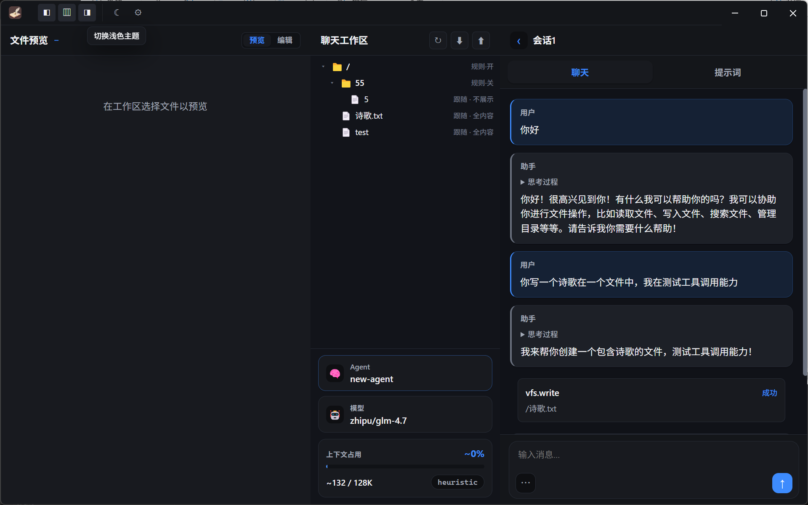
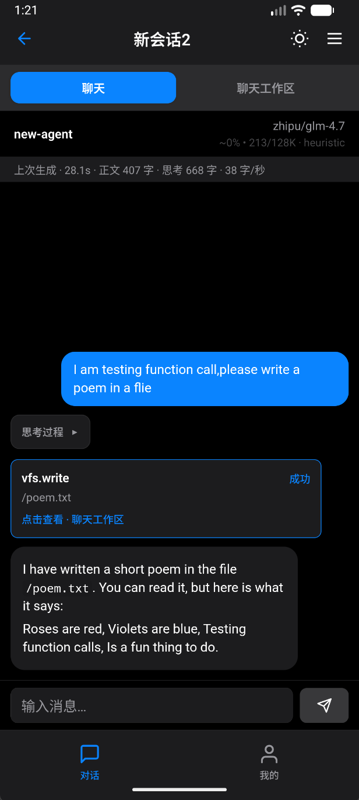

  

<h1 align="center">Novel Master</h1>

  专注<strong>长篇小说创作</strong>的 AI Agent 工作台

  
   
  桌面端 — 文件预览 · 会话工作区 · Agent 对话与工具调用

  
   
  移动端 — 流式对话 · Agent 工具调用 · 聊天工作区

把世界观、人设、卷纲、章节统统放进统一的虚拟文件树，Agent 直接读写你的文件，改稿与对话在同一个空间进行。上下文里放什么、怎么放，由你说了算。

当前交付：**Windows / macOS / Linux 桌面端** + **Android 移动端** + **`nm` 命令行**，三端共享同一 Core 领域层，行为一致。

## 亮点

- 🎛️ **上下文你说了算**：目录级规则控制每个文件在上下文中的展示档位（全文 / 头部 / 仅文件名）与排序——不动的设定常驻，改动的章节置顶
- 🤖 **多智能体分工**：只读分析、全权写作、资料整理各归其位，智能体可配置工具允许 / 拒绝名单，还能派子代理执行子任务，不再一个预设走天下
- 🧩 **Skill 标准**：技能遵循 `SKILL.md` 标准，社区现成 skill 打包导入即用，内置技能管理界面
- 💸 **缓存命中率优化**：工作区常驻前缀 + 回合内快照，不擅长搭配预设也能在连续对话中保持 90%+ 前缀缓存命中
- 📜 **长对话不失控**：按 token 自动压缩、手动置位锚定可见历史；划词批注定点改稿；写作变更批次执行、可回滚
- 📊 **内置用量统计**：token 消耗、缓存命中率、生成速率、首字延迟一页看清，按日 / 按服务商 × 模型多维筛选

## 它能做什么

### 项目与会话

- **项目**：一部作品或一个创作宇宙；可维护**项目模板**（默认文件树、目录规则）。
- **会话**：项目下的单次写作/对话线；新建会话时从项目模板复制工作区，之后与会话内改稿互不影响。
- **会话智能体**：每个会话绑定一个智能体（提示词、工具策略、模型 pin），可按会话覆盖模型。

### 三层工作区（VFS）

所有文件在逻辑上都以 **`/` 为根**（例如 `/notes/设定.md`、`/chapters/01.md`），路径在全局模板、项目模板、会话工作区中**形状一致**，便于备份、迁移和 Agent 理解。

| 范围 | 用途 |
|------|------|
| **全局模板** | 跨项目共用的种子内容（世界观、通用提示词等） |
| **项目模板** | 某一作品默认自带的目录与文件 |
| **会话工作区** | 当前会话正在编辑的文件树；Agent 主要在这里读写 |

### 工作区规则（workplace）

不改文件内容，控制「哪些文件参与列表、如何排序、如何拼进 Agent 上下文」的常驻前缀：

- 目录级规则：排序字段、头尾条数、展示档位（全文 / 头部 / 仅文件名）
- 规则按会话缓存快照，Agent 回合内前缀稳定（利于服务商前缀缓存）

### 智能体与工具

- 内置 **VFS 工具**（读、写、替换、列表、mkdir、glob、grep 等），路径与会话工作区一致
- **工具策略**：智能体可按工具配置允许 / 拒绝名单，做「只读分析」或「全权写作」类角色
- **子代理**：主 Agent 可经 `task` 工具派生子代理执行子任务，子代理共享同一工作区、独立会话历史，可回看
- 写作相关变更可走 **Session FS** 批次执行与回滚（版本校验可配置）

### Skill 扩展

- 技能遵循 `SKILL.md` 标准，与社区技能生态互通，ZIP 打包导入即用
- 内置技能管理界面（列表 / 详情 / 编辑），技能随项目与会话即装即用

### 消息与长上下文

- **流式输出**、消息编辑与回滚
- **压缩 / 置位**：按 token 阈值自动隐藏旧消息，或手动选定一条消息作为可见起点，长对话不失控
- **批注**：在文件预览上划词写意见，随消息发给 Agent 定点改稿
- **附加信息（extra info）**：智能体级附加文本，每轮注入最新一条用户消息

### 数据统计

- **Token 用量统计页**（桌面端设置 / 移动端「我的」进入）：总消耗、缓存命中率、生成速率、首字延迟一目了然
- 按日 / 按小时桶看趋势，按「服务商 × 模型」筛选，请求级流水逐条可查

### 配置与扩展

- 模型与 Provider 管理（多服务商、按服务商管理模型）
- 智能体列表与编辑器、正则规则、压缩策略
- 动态宏（`$time` / `$filetree` 等）支持在提示词块中引用实时信息

## 典型使用流程

1. **创建项目**，编辑**项目模板**（卷纲、人设、章节占位等）。
2. **新建会话**，在**会话工作区**写正文，与 Agent 对话改稿。
3. 长对话用**压缩 / 置位**收敛上下文；定点改稿用**批注**。
4. 需要扩展能力时，导入社区 **skill** 或自建技能；不同环节交给不同智能体。
5. 需要时 **导出 ZIP** 备份；用**文件浏览器**只读检视全局文件与各项目/会话工作区的真实位置。
6. 进阶用户用 **`nm`** 脚本化批量读写、导入导出。

## 交流群

技术交流 & AI 小说创作交流，欢迎加入：

  

## 许可证

源代码采用 **[PolyForm Noncommercial License 1.0.0](./LICENSE)**：

- **允许**个人学习、研究、修改与非商业使用（须保留版权与许可全文）
- **禁止**商业使用（收费产品/服务、企业生产交付、变现等）

商业授权请另行联系版权人。

## 开发（简略）

| 项 | 说明 |
|----|------|
| 环境 | Node **22+**；移动端见 [`apps/mobile/README.md`](apps/mobile/README.md) |
| 安装 | `npm install` → `npm run build` |
| 桌面端 | `npm run desktop:dev`（开发）/ `npm run desktop:dist`（打包） |
| CLI | `npm run link:cli` → `nm --help` |
| 移动端 | `npm run mobile:android` |
| 测试 | `npm test` |
| 内部文档 | [`docs/monorepo.md`](docs/monorepo.md) |

本软件按「原样」提供，详见 [LICENSE](./LICENSE)。
