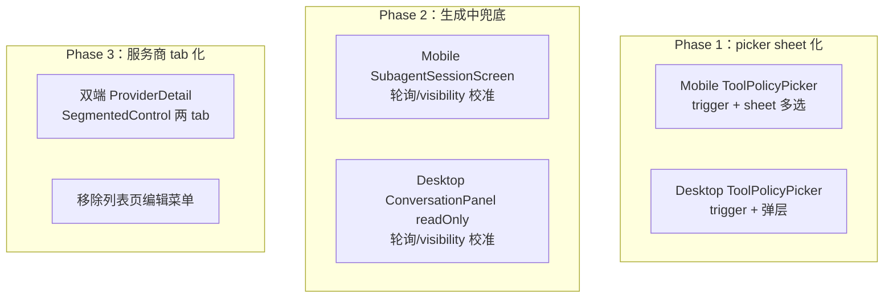

# UI 优化 实现规格（SPEC）

> 需求：[prd.md](./prd.md)
> 父迭代：[mobile-desktop-optimization-2026-08/prd.md](../../prd.md)
> 范围：`apps/mobile` + `apps/desktop`；无 core schema 变更，无 DB 迁移。

## 设计目标

- **picker sheet 化**：Mobile 工具 picker 从「裸奔 inline」改成 trigger + 底部 sheet 多选，样式与表单内 `FormSelectField` 对齐；Desktop 同步可折叠化。
- **生成中兜底**：在事件驱动主路径之外，为子会话 `uiRunning` 加校准机制，单一事件丢失不再导致永久残留。
- **服务商 tab 化**：详情页改 tab 容器，「服务商配置」与「模型管理」并列；列表页「编辑」菜单项移除。

三项互不阻塞，分三个 phase 推进。每个 phase 内部的 blocking 标注表示该 step 是否阻塞同 phase 后续 step。

---

## 现状与约束（代码探索）

### 子需求 1：工具配置 picker

**Mobile 现状（裸奔）**

```1:11:apps/mobile/src/components/agent/ToolPolicyPicker.tsx
type Props = {
  tokens: ThemeTokens;
  selected: readonly string[];
  onChange: (selected: string[]) => void;
};

export function ToolPolicyPicker({tokens, selected, onChange}: Props) {
  const [query, setQuery] = useState('');
```

- 唯一 state 是搜索词 `query`（L13-15），没有 collapse/expand 状态
- 搜索框 + 全量列表永久常驻（L41-96 直接 `return <View>`）
- checkbox 用 Unicode 字符 `☑/☐`（L80-82）
- 列表无高度限制、无滚动容器（L69-94 直接 `.map`）

`AgentEditorForm.tsx:906-916` 在 `toolsMode !== 'default'` 时把 `ToolPolicyPicker` 作为 `FormField` children 常驻，无容器包装。

工具目录固定 7 项（`packages/core/src/config-forms/agent/agent-tool-catalog.ts:9-17`）：`task/read/write/edit/fs/glob/grep`。

**Mobile 复用基础**

`FormSelectField.tsx`：现成的底部 sheet 单选实现（trigger Pressable row + `overlay.show` + backdrop + 取消按钮 + safe area + ✓ 样式）。

```34:62:apps/mobile/src/components/form/FormSelectField.tsx
export function FormSelectField({...}: Props) {
  const overlay = useFormOverlay();
  const overlayKey = useId();
  ...
  const select = (next: string) => {
    close();
    onChange(next);
  };
```

```85:108:apps/mobile/src/components/form/FormSelectField.tsx
            renderItem={({item}) => {
              const active = item.value === value;
              return (
                <Pressable
                  style={[
                    styles.row,
                    {borderBottomColor: tokens.border},
                    active && {backgroundColor: tokens.bgSecondary},
                    ...
                  ]}
                  onPress={() => select(item.value)}>
                  <View style={styles.rowText}>...</View>
                  {active ? (
                    <Text style={{color: tokens.primary}}>✓</Text>
                  ) : null}
                </Pressable>
```

`FormOverlayHost.tsx:15-18` 提供 `show(key, node) / hide(key)`，zIndex 100，可复用。

`FormChipGroup.tsx`：chip 选择参考（选中态 `backgroundColor: tokens.primary` + 白字）。

**Desktop 现状**

`apps/desktop/renderer/features/settings/ToolPolicyPicker.tsx`：chip + 搜索 + 复选列表，inline 常驻（与 mobile 同病）。

### 子需求 2：子会话「生成中」状态

**文案渲染**

- Desktop `apps/desktop/renderer/features/chat/MessageList.tsx:166-170`：`{uiRunning ? <p className="chat-message__stream-tail">生成中</p> : null}`
- Mobile `apps/mobile/src/hooks/useStreamTailGenerating.ts:1-10`：`useStreamTailGenerating(uiRunning)` 直接返回 `{ streamTailGenerating: uiRunning }`

**uiRunning 管理（已知脆弱点）**

Desktop `ConversationPanel.tsx` readOnly 子面板有独立回调链：

```432:447:apps/desktop/renderer/features/chat/ConversationPanel.tsx
  // ===== FR8-1：readOnly 子面板放宽守卫（对齐 mobile SubagentSessionScreen）=====
  //
  // readOnly 子会话的典型时序是「面板晚于 run 启动」：mount 时 RUN_STARTED 已是历史。
  // 主会话的 beginUiRun + shouldAcceptRunEvent 守卫在这个场景断裂（beginUiRun 先把
  // activeRunId 置 null，迟到 RUN_FINISHED 被守卫拒绝 → uiRunning 卡死）。
  // 这里另起一套回调：acceptRunEvent 放宽为非空 runId 即接受、不碰 activeRunId、
  // 只翻 uiRunning + 触发 reload。
  const readOnlyAcceptRunEvent = useCallback(
    (runId: string | undefined) => runId != null && runId !== '',
    [],
  );
```

mount probe（L474-512）调 `ipcAgentRunIsActive` 主动查 in-flight run，已有「竞态校正复询」一次。但 probe 只在 mount/sessionId 切换时跑一次。

Mobile `SubagentSessionScreen.tsx:140-169`：`handleRunStarted/Finished/Failed` 调 `abort.markRunStarted/markRunEnded` + reload；无 mount probe、无兜底。

**脆弱点**

1. probe 依赖 IPC 往返有竞态（已部分缓解，复询一次）
2. `RUN_FINISHED` 事件因 IPC/渲染重启丢失 → 永久卡住
3. 退出再进入重新 probe 能恢复（说明状态本身没坏，是事件没到位）

### 子需求 3：服务商配置

**数据模型**

- `LlmProvider`（`packages/core/src/domain/provider/model/provider.ts`）只持有连接信息（protocol/baseUrl/apiKey/headers 等），不持有 models
- `SavedModel` 通过 `providerId` 外键挂到 provider，一对多，靠 `ipcProviderModelsSavedList({providerId})` 查询

**Desktop（`apps/desktop/renderer/features/settings/SettingsViews.tsx`）**

- 导航树只露 providers 一个入口（`settings-nav.ts`），`providerDetail`/`providerCreate`/`providerEdit` 都是 push 子页
- 「编辑」菜单项：`ProvidersView` 右键 ContextMenu（L971-975）`{ label: "编辑", action: "edit" }`，handler `handleProviderMenuSelect` 的 edit 分支（L866-872）`nav.navState.editingProviderId = row.id; nav.push("providerEdit")`
- `providerEdit` 与 `providerCreate` 共用 `ProviderFormView`（mode 区分，L1013-1019），字段：protocol/baseUrl/displayName/apiKey/headersJson
- `ProviderDetailView`（L1146+）是模型列表页（标题「模型管理」），显示当前 provider 下挂的模型
- 无 Tab 组件；有 `SegmentedControl`（`apps/desktop/renderer/components/ui/SegmentedControl.tsx`，受控，可当 tab 头）

**Mobile（`apps/mobile/src/screens/stack/`）**

- `ProvidersScreen.tsx`：`ManageHeader` + `FlatList` + `BottomSheetMenu`（编辑/删除两项，L211-218）；点卡片 `navigation.navigate('ProviderDetail', {providerId})`（L187-189）
- `ProviderDetailScreen.tsx`：模型列表页，`ManageHeader` + 添加/远程按钮 + `BottomSheetMenu`（重命名/删除）；点模型 `navigation.navigate('ModelSampling', {savedModelId})`（L268-272）
- `navigation/types.ts:11-21`：`Providers/ProviderCreate/ProviderEdit/ProviderDetail/ModelSampling` 五个路由，stack push 结构

### 技术边界

- 不改 core 层数据模型、IPC 协议、agent-tool-catalog 内容
- 不改 `uiRunning` 主路径（事件驱动）；兜底是补充校准点
- 模型编辑（`ModelSampling` Mobile / `ModelSamplingView` Desktop）保持独立子页

---

## 总体方案



---

## Phase 1：工具配置 picker sheet 化

### Step 1.1：Mobile 抽取 sheet 外壳共用件

- **phase**: 1
- **blocking**: yes（后续 mobile picker step 依赖）
- **qa**: 无独立测试，靠 Step 1.2 用例覆盖

`FormSelectField` 当前的 sheet 外壳（backdrop + sheet 容器 + 标题 + 取消按钮 + safe area）是单选专属。多选需要「确定」按钮和临时选择缓冲。

做法：在 `apps/mobile/src/components/form/` 下新增 `FormMultiSelectSheet.tsx`（或抽 `useBottomSheet` hook），把 `FormSelectField` 的 sheet 外壳复用，行渲染改为多选 toggle + 临时 `Set` 缓冲。

`FormSelectField` 是否随之重构为调用新组件，看 diff 量——若改动小则一并重构，若大则保持现状只共用样式常量。

### Step 1.2：Mobile 改造 `ToolPolicyPicker` 为 trigger + sheet

- **phase**: 1
- **blocking**: no
- **qa**: T-P1、T-P2、T-P3

拆成两个组件：

- `ToolPolicyPickerTrigger`：`Pressable` row，文案 `白名单工具：{selected.length}/{BUILTIN_TOOL_CATALOG.length} ▼`（全未选显示「未选择」，全选显示「全部工具」），点击调 `overlay.show`
- `ToolPolicyPickerSheet`：底部 sheet，搜索框 + 多选列表 + 确定/取消。临时选择存在组件内 `Set`，点确定调 `onChange([...draft])` 再 `close`，点取消/backdrop 直接 `close`。底部按钮行布局：复用 `FormSelectField.tsx:112-123` 现有的 `cancelWrap` 容器（含 `borderTop` + safe area padding），但把 `flexDirection` 从默认（居中单按钮）改为 `'row'`，里面并排两个按钮——左侧「取消」（次色文字，`tokens.textSecondary`）+ 右侧「确定」（主色背景，`tokens.primary` + 白字），两按钮等分宽度或按内容自适应并加 `gap`，不要新造容器样式

行为差异（相对 `FormSelectField` 单选）：

- 单选 `select(next)` 立即 `close + onChange`；多选 `toggle(name)` 只翻 draft 不 close，`confirm` 才 `onChange + close`
- 选中行样式对齐 `FormSelectField`：`backgroundColor: tokens.bgSecondary` + 右侧 `✓`，废弃 `☑/☐` 字符
- 打开 sheet 时 draft 用 `selected` 初始化；搜索过滤逻辑沿用现状（按 name/description 匹配）

`AgentEditorForm.tsx:906-916` 的 `FormField` children 从渲染整个 `ToolPolicyPicker` 改为渲染 trigger，sheet 由 `FormOverlayHost` 顶起。

### Step 1.3：Desktop 改造 `ToolPolicyPicker` 为可折叠

- **phase**: 1
- **blocking**: no
- **qa**: T-P4

`apps/desktop/renderer/features/settings/ToolPolicyPicker.tsx` 改为 trigger + 弹层形态。具体容器选择按 desktop 现有组件惯例：

- 优先复用 desktop 已有的 Popover/Dialog 组件（若存在）
- trigger 文案与 mobile 对齐（N/总数）
- 展开内容仍是搜索 + 多选列表，样式对齐 desktop 其他弹层

若 desktop 表单内已有通用 trigger 行样式，复用之；不引入新 UI 库。

### Step 1.4：Phase 1 验证

- **phase**: 1
- **blocking**: no
- **qa**: T-P1 ~ T-P4

```bash
npm test -w @novel-master/mobile -- tool-policy
npm run lint -w @novel-master/mobile
npm run lint -w @novel-master/desktop
npm run build -w @novel-master/mobile
npm run build -w @novel-master/desktop
```

双端手工：在智能体编辑表单里操作 picker，对照 T-P1 ~ T-P4。

---

## Phase 2：子会话「生成中」状态兜底

### Step 2.1：Mobile `SubagentSessionScreen` 加兜底校准

- **phase**: 2
- **blocking**: no（与 desktop 互不依赖）
- **qa**: T-G1、T-G2-mobile、T-G3

当前 `SubagentSessionScreen.tsx:140-169` 只有 `handleRunStarted/Finished/Failed`，无 probe、无兜底；mount probe（L196-205）用的是 `runtime.abortRegistry.has(sessionId)`。注意 mobile 端没有 `ipcAgentRunIsActive` 这个 IPC（该 IPC 仅存在于 desktop 的 `@/ipc/client`），所以兜底数据源必须用 `runtime.abortRegistry.has(sessionId)`，跟现有 mount probe 对齐。加两路校准：

1. **visibility/focus 触发**：用 React Navigation 的 `useFocusEffect`（或 `AppState`）监听页面重新可见，当 `abort.isRunActive()` 为 true 时主动查 `runtime.abortRegistry.has(sessionId)`，若返回 false 则调 `abort.markRunEnded()` + reload（走与 `handleRunFinished` 相同的收尾）
2. **低频轮询**：在 run active 期间起 `setInterval`（建议 30s，可调），周期查 `runtime.abortRegistry.has(sessionId)`，结束则收尾 + 清 interval。run 未 active 时不启动 interval

收尾路径必须复用现有 `handleRunFinished` 的逻辑（`abort.markRunEnded` + `void reload()`），不能另起一套，避免状态机分叉。

**语义局限说明（mobile vs desktop）**：mobile 因为没有跨进程 IPC，run 是否结束只能以 `runtime.abortRegistry.has(sessionId)` 为准——它查的是本进程内存里的 core 层 in-memory registry 注册状态；desktop 走 `ipcAgentRunIsActive` 则是跨进程主动问 main 进程真实的 in-flight 状态，语义更强。正因为 mobile 查的是 registry 注册状态，如果 run 已经被 main 主动结束、但 unregister 事件还没派发到 renderer，`has` 可能短暂仍返回 true。所以 mobile 这两路校准都要带「复询一次防抖」：第一次 `has` 返回 false 后，短延迟（建议 500ms~1s，与 desktop mount probe 的复询节奏对齐）再查一次仍为 false，才认定 run 真的结束并走收尾。desktop 这边的复询沿用 `ConversationPanel.tsx:496-503` mount probe 已有的二次查询策略。

`useStreamTailGenerating.ts` 不需要改（它只是 `uiRunning` 的直通），兜底改的是 `uiRunning` 的源头（`abort` 状态）。

### Step 2.2：Desktop `ConversationPanel` readOnly 分支加兜底校准

- **phase**: 2
- **blocking**: no
- **qa**: T-G1、T-G2-desktop、T-G3

`ConversationPanel.tsx` 的 readOnly 分支已有 mount probe（L474-512），但只跑一次。补两路校准：

1. **visibility 触发**：监听 `document.visibilitychange`（或 window focus），当 readOnly 且 `getUiRunning()` 为 true 时，主动 `ipcAgentRunIsActive({sessionId})`，false 则 `markExternalRunEnded` + reload
2. **低频轮询**：readOnly 且 uiRunning 期间起 `setInterval`（同 30s 建议），周期查；结束则收尾 + 清 interval

收尾复用 `readOnlyOnRunFinished` 的逻辑（`markExternalRunEnded` + `onStreamReset` + `reloadMessages`），保持与事件路径一致。

注意 effect 依赖：visibility 监听和 interval 都要在 `readOnly && sessionId` 成立时才挂载，卸载时清理。

### Step 2.3：Phase 2 验证

- **phase**: 2
- **blocking**: no
- **qa**: T-G1 ~ T-G3（含 T-G2-mobile、T-G2-desktop）

```bash
npm test -w @novel-master/mobile -- subagent-session
npm test -w @novel-master/desktop -- conversation-panel
npm run build
```

手工模拟事件丢失：起一个子会话 run，中途断开事件订阅（dev 工具或代码注入）让它收不到 `RUN_FINISHED`，观察兜底是否在周期/visibility 触发后让「生成中」消失；再对照正常 run 结束不回归。

---

## Phase 3：服务商配置 tab 化

### Step 3.1：grep 确认 `providerEdit` / `ProviderEdit` 引用范围

- **phase**: 3
- **blocking**: yes（决定后续 step 是否删路由/视图）
- **qa**: 无

```bash
grep -rn "providerEdit" apps/desktop/renderer apps/desktop/src
grep -rn "ProviderEdit" apps/mobile/src
```

记录所有引用点。若 desktop `providerEdit` 除 `ProvidersView` 菜单 + `ProviderFormView` 注册外无其他引用，则可删；mobile `ProviderEdit` 路由若除 `ProvidersScreen` 菜单外无其他 `navigate('ProviderEdit')`，亦可删（或保留死路由，文档标注）。

### Step 3.2：Mobile `ProviderDetailScreen` 改 tab 容器

- **phase**: 3
- **blocking**: yes（mobile tab 主体）
- **qa**: T-T1、T-T2、T-T3

`ProviderDetailScreen.tsx` 顶部加 `SegmentedControl`——直接 import 现有组件 `apps/mobile/src/components/ui/SegmentedControl.tsx`（受控，props 为 `options/value/onChange/tokens`，已存在，L1-88），不要另造等价 tab 头。两个 tab：

- 「服务商配置」tab：内嵌原 `ProviderEdit` 表单内容（protocol/baseUrl/displayName/apiKey/headers），保存逻辑沿用
- 「模型管理」tab：保留现有 `ManageHeader` + 模型 `FlatList` + `BottomSheetMenu`

模型相关操作（添加/远程/重命名/删除/进采样）全部保留，仍 `navigation.navigate('ModelSampling')`（L268-272 不动）。

默认进入哪个 tab：建议「模型管理」（高频），但不强求——实现定，在 PR 注明。

### Step 3.3：Mobile `ProvidersScreen` 移除编辑菜单项

- **phase**: 3
- **blocking**: no
- **qa**: T-T4

`ProvidersScreen.tsx:211-218` 的 `BottomSheetMenu` items 删掉 `{ label: '编辑', action: 'edit' }`；handler（L226-228）删 `if (action === 'edit')` 分支。只保留删除。

点卡片仍 `navigation.navigate('ProviderDetail', {providerId})`（L187-189 不动），用户在详情页的「服务商配置」tab 里改连接信息。

若 Step 3.1 确认 `ProviderEdit` 路由无其他引用，一并清理——范围含：`navigation/types.ts` 删该类型、`navigation/header-config.ts`（L24）删 `ProviderEdit` 的 `PAGE_HEADER_CONFIG` 配置行（否则成死配置）、`navigation/RootNavigator.tsx`（L22-26 import、L120-124 和 L193-197 的 `Stack.Screen` 注册）一并删掉，以及 `__tests__/provider-edit-screen.test.tsx` 整个文件（该测试专测 `ProviderEditScreen`，删路由后会挂）。若保留路由则上述文件均不动，只在 `types.ts` 加注释标记废弃。

### Step 3.4：Desktop `ProviderDetailView` 改 tab 容器

- **phase**: 3
- **blocking**: yes（desktop tab 主体）
- **qa**: T-T1、T-T2、T-T3

`SettingsViews.tsx` 的 `ProviderDetailView`（L1146+）改为 tab 容器：

- 顶部加 `SegmentedControl`（`apps/desktop/renderer/components/ui/SegmentedControl.tsx`）当 tab 头，两个选项：「服务商配置」「模型管理」。注意 desktop 这版 `SegmentedControl` 是无样式纯按钮组（只有 `segmented-control` / `segmented-control__btn` 两个 class，裸 `div`+`button`），所以 tab 头要放在 `ProviderDetailView` 原有标题区位置（替代原标题行，或包一层带 padding 的容器），不额外加 outer wrapper 也不会脱形——布局位置由实现者按现有详情页顶部标题区贴合确定
- tab 头下方的 tab 内容区用条件渲染（`activeTab === 'config'` / `'models'`），不需要保留两个子 view 同时 mount；切 tab 时卸载非活动 tab，避免表单态互相污染
- 「服务商配置」tab 内嵌 `ProviderFormView` 的 edit 表单（抽出表单内容或直接调 `ProviderFormView mode="edit"`）；原「模型管理」标题改为根据当前 tab 动态显示（在「模型管理」tab 时保留，在「服务商配置」tab 时隐藏或换成「服务商配置」标题）
- 「模型管理」tab 保留现有模型列表 + 菜单逻辑

模型编辑（`ModelSamplingView`）保持 `nav.push` 独立子页。

默认 tab 与 mobile 对齐。

### Step 3.5：Desktop `ProvidersView` 移除编辑菜单项 + 废弃 `providerEdit`

- **phase**: 3
- **blocking**: no
- **qa**: T-T4

`SettingsViews.tsx:971-975` 的 ContextMenu items 删 `{ label: "编辑", action: "edit" }`；`handleProviderMenuSelect`（L866-872）删 edit 分支。点服务商行仍 `nav.push("providerDetail")`（L952-955 不动）。

若 Step 3.1 确认 `providerEdit` viewId 无其他引用：

- `settings-nav.ts` 删 `providerEdit` 注册
- `SettingsViews.tsx` 删 `providerEdit` 的 view 分发分支
- `ProviderFormView` create 完成仍 `nav.push("providerDetail")`（L1064-1068 已是此行为，不动）

若有遗留引用：保留 viewId 但 document 为废弃，加 `// @deprecated` 注释。

### Step 3.6：Phase 3 验证

- **phase**: 3
- **blocking**: no
- **qa**: T-T1 ~ T-T5

```bash
npm test -w @novel-master/mobile -- provider-detail
npm test -w @novel-master/desktop -- settings
npm run lint
npm run build
```

双端手工：服务商列表 → 点卡片进详情 → 切两个 tab → 改连接信息保存 → 切模型管理操作模型 → 进采样配置子页。对照 T-T1 ~ T-T5。

---

## 变更点清单

| 文件 | 变更 |
|------|------|
| `apps/mobile/src/components/form/FormMultiSelectSheet.tsx`（新） | 抽取的多选 sheet 外壳（或 `useBottomSheet` hook） |
| `apps/mobile/src/components/form/FormSelectField.tsx` | 视抽取方式：重构为调用新组件，或仅共用样式常量 |
| `apps/mobile/src/components/agent/ToolPolicyPicker.tsx` | 拆 trigger + sheet，废弃 `☑/☐`，对齐 `FormSelectField` 选中样式 |
| `apps/mobile/src/components/agent/AgentEditorForm.tsx` | `FormField` children 改为渲染 trigger |
| `apps/desktop/renderer/features/settings/ToolPolicyPicker.tsx` | 改可折叠 trigger + 弹层 |
| `apps/mobile/src/screens/stack/SubagentSessionScreen.tsx` | 加 visibility/focus + 低频轮询兜底，复用 `handleRunFinished` 收尾 |
| `apps/desktop/renderer/features/chat/ConversationPanel.tsx` | readOnly 分支加 `visibilitychange` + 低频轮询兜底，复用 `readOnlyOnRunFinished` 收尾 |
| `apps/mobile/src/screens/stack/ProviderDetailScreen.tsx` | 顶部加 `SegmentedControl`（复用 `apps/mobile/src/components/ui/SegmentedControl.tsx`，不另造），两 tab（服务商配置 + 模型管理） |
| `apps/mobile/src/screens/stack/ProvidersScreen.tsx` | `BottomSheetMenu` 删编辑项 + handler 分支 |
| `apps/mobile/src/navigation/types.ts` | 视 grep 结果：删 `ProviderEdit` 路由或标记废弃 |
| `apps/mobile/src/navigation/header-config.ts` | 视 grep 结果：删 `ProviderEdit` 的 `PAGE_HEADER_CONFIG` 配置行（L24），避免死配置 |
| `apps/mobile/src/navigation/RootNavigator.tsx` | 视 grep 结果：删 `ProviderEdit` 的 import（L22-26）+ `Stack.Screen` 注册（L120-124、L193-197） |
| `apps/mobile/__tests__/provider-edit-screen.test.tsx` | 视 grep 结果：删整个测试文件（专测 `ProviderEditScreen`，路由删后必挂）；若保留路由则保留该测试 |
| `apps/desktop/renderer/features/settings/SettingsViews.tsx` | `ProviderDetailView` 改 tab 容器（顶部 `SegmentedControl` + 条件渲染两 tab 内容，替代原标题区）；`ProvidersView` ContextMenu 删编辑项 + handler；视情况删 `providerEdit` view 分发 |
| `apps/desktop/renderer/features/settings/settings-nav.ts` | 视 grep 结果：删 `providerEdit` 注册 |
| 双端对应单测 | 新增/补充见测试策略 |

---

## 测试策略

### 自动化

| ID | 范围 | 断言 |
|----|------|------|
| T-P1 | Mobile `ToolPolicyPicker` | trigger 显示「N/7」；点开 sheet → 勾选两个 → 确定 → `onChange` 收到新数组 → trigger 文案更新 |
| T-P2 | Mobile `ToolPolicyPicker` sheet | 点行只 toggle draft 不关闭；点取消 → `onChange` 不被调用，trigger 文案不变 |
| T-P3 | Mobile `ToolPolicyPicker` 样式 | 选中行 = `backgroundColor: tokens.bgSecondary` + 右侧 `✓`；渲染树无 `☑/☐` 字符 |
| T-P4 | Desktop `ToolPolicyPicker` | trigger 折叠态可见；展开为弹层；收起后不占表单空间 |
| T-G1 | Mobile `SubagentSessionScreen` / Desktop `ConversationPanel` readOnly | 正常 `RUN_FINISHED` 到达 → 「生成中」消失（主路径回归） |
| T-G2-mobile | Mobile `SubagentSessionScreen` 兜底 | mock `runtime.abortRegistry.has(sessionId)` 返回 false + 不派发 `RUN_FINISHED` → 兜底（轮询/visibility）触发 → 复询一次仍 false → `abort.markRunEnded` 被调 + reload 触发 |
| T-G2-desktop | Desktop `ConversationPanel` readOnly 兜底 | mock `ipcAgentRunIsActive` 返回 false + 不派发 `RUN_FINISHED` → 兜底（轮询/visibility）触发 → `markExternalRunEnded` 被调 + reload 触发 |
| T-G3 | 同上收尾一致性 | 兜底结束时 reload 被触发，状态机字段（`abort`/`runLifecycle`）与正常事件结束一致 |
| T-T1 | 双端 `ProviderDetail` | 顶部 `SegmentedControl` 两个 tab，切换正常 |
| T-T2 | 双端「服务商配置」tab | 改字段保存 → 重新进入仍为新值 |
| T-T3 | 双端「模型管理」tab | 添加/删除/重命名模型行为同改造前 |
| T-T4 | 双端服务商列表 | 菜单无「编辑」项；点卡片进 tab 化详情页 |
| T-T5 | 双端模型采样 | 进采样配置仍走独立子页（Mobile navigate `ModelSampling` / Desktop push） |

运行：

```bash
npm test -w @novel-master/mobile -- tool-policy subagent-session provider-detail
npm test -w @novel-master/desktop -- tool-policy conversation-panel settings
```

### 手工（双端对照 PRD 验收）

| ID | 场景 |
|----|------|
| T-H1 | Mobile 智能体编辑 → 工具白名单 picker 全流程（展开/搜索/多选/确定/取消） |
| T-H2 | Desktop 同上 |
| T-H3 | Mobile 子会话 run 正常结束，「生成中」消失 |
| T-H4 | Mobile 模拟事件丢失（断订阅），「生成中」在兜底周期后消失 |
| T-H5 | Desktop 同 T-H3、T-H4 |
| T-H6 | 双端服务商详情页两 tab 切换 + 各自操作 |
| T-H7 | 双端服务商列表菜单只剩删除 |

### 负向

- Mobile `ToolPolicyPicker` 渲染树不含 `☑` / `☐` 字符
- 服务商列表菜单不含「编辑」项
- Desktop 无 `providerEdit` viewId 残留引用（若 grep 确认可删）

---

## 风险与回滚方案

| 风险 | 缓解 |
|------|------|
| Desktop picker 弹层容器选错（Popover vs Dialog） | 实现前先看 desktop 表单内现有同类容器，优先复用；无则取最接近 `FormSelectField` 行为的 |
| 兜底轮询周期不当（太短耗 IPC，太长体感差） | visibility 为主、30s 轮询为辅；周期写常量便于调整 |
| 兜底误判 run 结束（IPC 暂时抖动返回 false） | 复用 mount probe 已有的「复询一次」策略：第一次 false 后短延迟再查一次仍 false 才收尾 |
| Mobile `ProviderEdit` 路由删除引发类型大改 | Step 3.1 先 grep；若有其他引用则保留路由 + 标记废弃，不强行删 |
| Desktop `providerEdit` 废弃后 create 流程落不到详情页 | `ProviderFormView` create 完成已 `nav.push("providerDetail")`（L1064-1068），不受影响；tab 化后默认 tab 建议是「服务商配置」让 create 后直接可编辑 |
| tab 化后 mobile 详情页高度膨胀 | 「服务商配置」tab 内容是表单，独立滚动；「模型管理」tab 保留现有 `FlatList`，两 tab 各自管理滚动 |
| `FormSelectField` 重构引发单选 picker 回归 | Step 1.1 若重构 `FormSelectField`，必须跑现有单选用例 + 手工对照 |

**回滚**：三个 phase 互相独立，可分别 revert。Phase 1 revert 恢复 inline picker；Phase 2 revert 移除兜底回到纯事件驱动；Phase 3 revert 恢复独立编辑菜单 + 子页。无 DB 迁移，无 core schema 变更，回滚无副作用。

---

## 实现后检查清单

- [ ] Mobile picker：trigger + sheet 多选；选中样式对齐 `FormSelectField`；无 `☑/☐`
- [ ] Desktop picker：可折叠 trigger + 弹层
- [ ] Mobile/Desktop 子会话「生成中」主路径不回归 + 兜底生效
- [ ] 双端服务商详情页两 tab；列表无「编辑」菜单项
- [ ] 模型采样仍独立子页
- [ ] `providerEdit`/`ProviderEdit` 引用清理或标记废弃
- [ ] 单测 + lint（变更文件无新 error）
- [ ] 双端手工 T-H1 ~ T-H7
