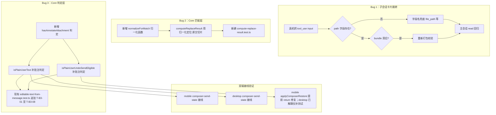

# Feature D：bug 修复 技术规格（SPEC）

> PRD：`docs/Iterations/mobile-desktop-optimization-2026-08/features/D-bug-fixes/prd.md`

## 设计目标

- **Bug 1（子会话卡片跳转）**：静态链路已通（白名单、镜像、渲染、分发、回调、导航参数齐备），真机定位运行时断点；按定位结果做字段名兜底或 bundle 校验，不破坏主会话 `read` 跳转。
- **Bug 2（edit 引号归一化）**：在 `compute-replace-result.ts` 匹配前加归一化层，对 `currentContent` 和 `oldString` 跑同一份归一化函数定位命中，再用原文做切片替换——**归一化只用于定位，落盘内容不被改写**。
- **Bug 3（批注消息判定）**：修 `isPlainUserText` 和 `isPlainUserUndoSendEligible` 两个判定函数，补充"消息 `attachments` 含 `action:"annotate"` 批注附件"也视为有效 user 输入——这样连续 user 守卫和 undo_send 回滚分支同时修好（同一根因，同一改法）。

## 现状与约束（代码探索）

### Bug 1：子会话 write/edit 卡片跳转

| 模块 | 现状 | 说明 |
|------|------|------|
| core 白名单（`vfs-tool-file-path.ts:9-10`） | `FILE_OPEN_TOOL_NAMES = {read, write, edit}` | write/edit 都在，**无遗漏** |
| WebView 内镜像（`state.ts:18-22`） | `VFS_FILE_TOOLS = {read:1, write:1, edit:1}` | write/edit 都在，**无遗漏**（探索阶段怀疑的"镜像没同步"实际不存在） |
| WebView 路径解析（`vfs-tool-path.ts:44-57`） | `resolveVfsToolFilePath(name, input)`：查镜像 → 取 `input.path` → 规范化 | 只认 `input.path` 字段名，**`file_path` 等非标准字段会返回 null** |
| 卡片渲染（`ToolGroup.tsx:20-47`） | `canOpen = filePath != null \|\| hasSubagent`；`data-action="open-tool-file"` | 只要 `filePath` 非空就渲染成可点击 |
| 点击分发（`rows-click.ts:50-56`） | `action === 'open-tool-file'` → `post('openToolFile', {path})` | 分发逻辑正常 |
| 宿主回调（`ChatTranscriptWebView.tsx:758-761`） | `message.type === 'openToolFile'` → `onOpenToolFile?.(payload.path)` | 回调正常 |
| 主会话接线（`ChatConversationPanel.tsx:256-260`） | `onOpenToolFile={scope.openSessionFilePreview}` | 主会话正常 |
| 子会话接线（`SubagentSessionScreen.tsx:260-272`） | `onOpenToolFile` 定义并传入，导航参数 `{path, scopeKind:'session', projectId, sessionId}` | **与主会话一致，静态无差异** |

**结论**：静态代码链路完全打通，包括探索阶段怀疑的"镜像没同步"也已经不存在。bug 极大概率是运行时问题——**最可能是 `input.path` 字段名不标准**（LLM 用了 `file_path`），其次现网打包 bundle 滞后。

### Bug 2：edit 中文引号匹配

| 模块 | 现状 | 问题 / 本迭代 |
|------|------|----------------|
| edit 工具（`vfs-tools.ts:302-309`） | `run` 直接转发给 `ctx.vfs.replace`，零预处理 | 本迭代不动这里 |
| 匹配核心（`compute-replace-result.ts:34-63`） | `replaceAll` 用 `includes`+`split`；单次用 `indexOf`+`slice`；**零 normalize()、零引号映射** | **本迭代主改点** |
| service 层（`vfs.service.ts:133-154`） | read → `computeReplaceResult` → write，中间无加工 | 不动 |
| read 链路 | TextEncoder/TextDecoder 标准 UTF-8，无 normalize，content mapper 直接透传 | 字节级保真已验证，bug 不在 read |
| 上一版修复（1.4.20，`action-xml-to-tool-uses.ts:25-57`） | 补了 8 个 HTML entity 解析 | 只被用户手动 VFS 操作调用，模型 tool_use 走原生 JSON 不经过；且 `「」『』` 无 HTML entity |
| `compute-replace-result.test.ts` | **不存在** | 本迭代新建 |
| 全局搜索 | `.normalize(` 只在 DOM/path API；NFC/NFD/NFKC/NFKD 零命中；`\u201C/\u201D/\u300C/\u300D` 字面量零命中；fullwidth/全角/半角 零命中 | 确认全代码库无任何引号归一化 |

**根因**：模型端 tokenizer 混淆（LLM 生成 oldString 时把 read 给的弯引号重建成日式引号）。

### Bug 3：批注消息回滚 + 连续 user 守卫

| 模块 | 现状 | 问题 / 本迭代 |
|------|------|----------------|
| `extractEditableTextFromMessage`（`editable-text-from-message.ts:16-25`） | 只 filter text 块 → map trim → filter Boolean → length>0 ? join : null | 批注在 attachments，不在 blocks，返回 null |
| `isPlainUserText`（`message-content-helpers.ts:27-37`） | `role===user && !hasToolResult && blocks.some(text块 trim 非空)` | **不看 attachments**，批注消息返回 false |
| `isPlainUserUndoSendEligible`（`editable-text-from-message.ts:32-42`） | 排除 tool_result / user_vfs_action 后 `return extractEditableTextFromMessage(message) != null` | 批注消息返回 false → 回滚走 rewind 分支 |
| Composer 守卫（mobile `composer-send-state.ts:29-44` / desktop `composer-send-state.ts` 同名） | `lastMessageIsPlainUserText: isPlainUserText(lastMessage)` | 批注消息 → false → 不触发"禁止带文字发送" |
| 回滚分支（mobile `useChatTabMessages.ts:434-438` / desktop `rollback-composer.test.ts:38-42` / core `message-rollback.service.ts:236-240`） | `mode = isPlainUserUndoSendEligible(target) ? 'undo_send' : 'rewind'` | 批注消息走 rewind，若前面没 assistant 锚点则失败 |
| `rollback-composer`（desktop `ConversationPanel.tsx:598-604`） | `restoreText: editableTextFromMessage(target), restoreAttachments: target.attachments ?? null` | 批注消息 restoreText=null + restoreAttachments=非空，需确认能容忍 |
| 批注附件判定 | `MessageAttachment.action === "annotate"`（`source` 必为 `user_ops`，见 `message-attachment.schema.ts:26-37`） | 这是判定的可靠字段 |

**关键代码位置**

```
packages/core/src/domain/chat/logic/editable-text-from-message.ts
packages/core/src/domain/chat/logic/message-content-helpers.ts
packages/core/src/domain/vfs/logic/compute-replace-result.ts
packages/core/src/domain/vfs/logic/compute-replace-not-found-error.ts   # 参考 dumpCodepoints 码点处理
packages/core/src/domain/tool/logic/vfs-tool-file-path.ts
apps/mobile/src/web/chat-transcript/webview/runtime/util/vfs-tool-path.ts
apps/mobile/src/components/chat/composer-send-state.ts
apps/desktop/renderer/features/chat/composer-send-state.ts
```

## 总体方案



## 详细方案

### Bug 1：子会话 write/edit 卡片跳转

**排查路径**（按优先级）：

1. **抓 tool_use input 字段**（最可能）：在 `ToolGroupItem`（`ToolGroup.tsx:20`）渲染时，对 `write`/`edit` 工具把 `tool.input` 的 keys 临时打到 `data-debug` 属性，或在 `rows-click.ts` 的 `open-tool-file` 分支里把 `actionEl.getAttribute('data-path')` 为空时打印 `tool.input` 全量。真机复现一次，看 LLM 实际传的是 `path` 还是 `file_path`。
2. **核查 bundle 滞后**：如果字段名是 `path`（标准），核查现网打包的 WebView bundle 是否含最新的 `VFS_FILE_TOOLS` 镜像和 `resolveVfsToolFilePath`（`chat-transcript-boot-script.test.ts` 的 `T-BR-CT-05` 已覆盖 boot script 含这些符号，但只验证 boot script 不验证 dist bundle）。

**修复**（视定位结果）：

- **字段名兜底**（如果定位到非标准字段名）：在 core `vfs-tool-file-path.ts` 的 `resolveVfsToolFilePath` 和 WebView 镜像 `vfs-tool-path.ts` 的 `resolveVfsToolFilePath` 里，把 `input.path` 改成 `input.path ?? input.file_path`。**兜底字段名以真机日志为准，v1 只兜 `file_path`，不强加 `filename`**（代码库里没有任何 write/edit 工具用过 `filename`，纯猜测不写进文档；等真机日志确认实际字段名再决定是否扩展）。两处都要改，保持一致。
- **bundle 重新打包**（如果定位到滞后）：重新构建 WebView bundle，确认 dist 含最新镜像。

**防御性加固**（无论定位结果都建议做）：在 `ToolGroupItem` 渲染时，如果 `filePath == null` 且工具名是 `write`/`edit`，在 dev 模式下 console.warn 打印 `tool.input`，方便后续复现定位。

### Bug 2：edit 中文引号归一化

**归一化函数 `normalizeForMatch`**（新增，放 `compute-replace-result.ts` 同目录或 `domain/vfs/logic/` 下）：

**v1 范围只做 1:1 映射**（引号族 + 全角空格→半角空格），归一化前后字符串长度严格相等，归一化坐标系的 index 可以直接当作原文 index 用，不需要任何位置映射。省略号变形（`……` vs `...`，N:1 映射）在实际 edit 场景里远比引号变形少见，且会引入"原文→归一化字符位置映射数组"的复杂度，所以 **v1 不做省略号归一化，推迟到后续迭代**。

归一化只做"引号族 + 全角/半角空白"两类，**不做全角字母数字归一化**（误伤风险高，比如文件名里的全角字母）。具体映射：

| 类别 | 原文 | 归一化为 | 映射 |
|------|------|----------|------|
| 直引号 | `"` `'` | `"` `'`（保持） | 1:1 |
| 弯引号 | `“` `”` `‘` `’`（U+2018/19/1C/1D） | `"` `"` `'` `'`（→ 直引号） | 1:1 |
| 日式引号 | `「` `」` `『` `』`（U+300C-F） | `"` `"` `'` `'`（→ 直引号） | 1:1 |
| 全角空格 | U+3000 | 半角空格 U+0020 | 1:1 |
| 省略号 | `……` / `…` / `...` | **v1 不归一化**（v2 待定） | N:1，v2 再处理 |

实现要点：
- 用 `Array.from(str)` 把字符串拆成码点数组，对每个码点做单字符映射，再 `join('')`——避免 UTF-16 码元 `length`/`slice` 在代理对上截断。
- 因为 v1 全部是单字符 1:1 映射，`Array.from(normalized).length === Array.from(original).length` 严格成立，归一化后不会改变码点数量，index 可以直接通用。
- 归一化函数内部用 `Array.from` 遍历是为了避免代理对截断，但归一化后的产物仍是普通的 JS `string`。后续在 `computeReplaceResult` 里做的 `indexOf` / `slice` 都继续用原生 UTF-16 版本即可——因为所有映射字符都是 BMP 内单码点（弯引号、日式引号、全角空格都是），代理对（emoji 等）原样透传不参与映射，所以归一化前后在 UTF-16 码元层面也是严格 1:1，`normalizedContent.indexOf(...)` 拿到的码元 index 可以直接当作 `currentContent` 的码元 index 用，不需要做码点/码元之间的换算。

**`computeReplaceResult` 改造（单次路径）**：

```ts
// 伪代码
const normalizedContent = normalizeForMatch(currentContent);
const normalizedOld = normalizeForMatch(oldString);

// 单次
const index = normalizedContent.indexOf(normalizedOld);
if (index === -1) throw buildReplaceNotFoundError(...);
// 因为 v1 归一化是 1:1 映射，normalizedContent 与 currentContent 码点数严格相等，
// 归一化坐标系的 index 可以直接当作原文 index 用，无需位置映射回查。
// 切片用原文 + 原始 oldString.length，保证落盘内容保持原文引号不被改写。
return currentContent.slice(0, index) + newString + currentContent.slice(index + oldString.length);
```

**`computeReplaceResult` 改造（replaceAll 路径）**：

`compute-replace-result.ts:41-50` 的 replaceAll 路径原本用 `includes + split + join`。归一化后**不能**继续用 `split/join`——因为 `split` 是基于 `normalizedContent` 的，返回的片段是归一化后的内容（弯引号已经被替换成直引号），`join` 后这些未替换段的原文引号就被悄悄改写了，违反 PRD「归一化只用于定位、落盘保持原文」的硬约束。所以 replaceAll 路径改成「归一化定位 + 原文切片拼接」方案：

```ts
// 伪代码：先在归一化坐标系里收集所有命中位置，再用原文 currentContent 切片拼接
const positions: Array<{ start: number; end: number }> = [];
let searchFrom = 0;
while (true) {
  const idx = normalizedContent.indexOf(normalizedOld, searchFrom);
  if (idx === -1) break;
  positions.push({ start: idx, end: idx + oldString.length });
  searchFrom = idx + normalizedOld.length;
}
if (positions.length === 0) throw buildReplaceNotFoundError(...);

// 用原文切片拼接：归一化只参与了上面的 indexOf 定位，
// 下面的 slice 和拼接全部走原文 currentContent，保证未替换段保持原文引号
let result = '';
let cursor = 0;
for (const pos of positions) {
  result += currentContent.slice(cursor, pos.start); // 原文片段，引号原样
  result += newString;                               // 模型给的替换串（不归一化）
  cursor = pos.end;
}
result += currentContent.slice(cursor);
return { nextContent: result, replacements: positions.length };
```

关键点：
1. 归一化（`normalizedContent` / `normalizedOld`）只用于 `indexOf` 定位命中位置，切片和拼接都用原文 `currentContent`。
2. 因为 v1 归一化是 1:1 映射，归一化 index === 原文 index（UTF-16 码元层面也 1:1——所有映射字符都是 BMP 内单码点，代理对原样透传不做映射），所以 `positions` 里收集到的 index 可以直接喂给 `currentContent.slice`，无需维护位置映射数组。
3. 这样未替换段保持原文引号（切片来自 `currentContent`），只有命中段被替换成模型的 `newString`，与单次路径的行为完全一致，满足 PRD「落盘内容保持原文引号不被改写」的硬约束。

关键约束：**v1 必须严格保证归一化是 1:1 映射**（不引入省略号等 N:1 映射），这样归一化坐标和原文坐标天然一致，`positions` 的 index 直接可用。如果后续 v2 要加省略号归一化（N:1），那时再引入「原文→归一化字符位置映射数组」做 index 回查，replaceAll 路径也要同步改成基于映射数组定位。

**代理对处理**：归一化和切片都按码点处理（`Array.from`），弯引号、日式引号都是 BMP 内单码点，代理对（emoji 等）原样透传不做映射，所以代理对不会被截断。

**测试**（新建 `packages/core/test/vfs/compute-replace-result.test.ts`）：

| 用例 ID | 场景 |
|---------|------|
| T-B2-01 | 文件弯引号 `"`、oldString 直引号 `"` → 命中替换 |
| T-B2-02 | 文件日式引号 `「`、oldString 弯引号 `"` → 命中替换 |
| T-B2-03 | 文件弯引号、oldString 也是弯引号（两侧一致）→ 命中（不破坏正常场景） |
| T-B2-04 | 文件全角空格、oldString 半角空格 → 命中 |
| T-B2-05 | 文件含 emoji（代理对），命中位置邻近 → 切片不截断 |
| T-B2-06 | oldString 确实不存在（归一化后也无）→ 抛 REPLACE_NOT_FOUND，LCS 诊断正常 |
| T-B2-07 | replaceAll:true，多处引号变形命中 → 全部替换 |
| T-B2-08 | 省略号 `……` vs `...`：v1 不做省略号归一化，此用例验证"不命中"（v2 引入省略号归一化后再改成命中，待定） |

补 `longest-common-substring.test.ts` 中文引号用例（LCS 诊断对引号变形的输出可读性）。

### Bug 3：批注消息回滚 + 连续 user 守卫

**新增判定 `hasAnnotateAttachment`**（放 `message-content-helpers.ts` 或 `editable-text-from-message.ts`，看依赖方向）：

```ts
/** 消息是否含批注附件（attachments 里有 action:"annotate"）。 */
export function hasAnnotateAttachment(message: ChatMessage): boolean {
  const attachments = message.attachments;
  if (!attachments || attachments.length === 0) return false;
  return attachments.some((a) => a.action === "annotate");
}
```

**改 `isPlainUserText`**（`message-content-helpers.ts:27-37`）：

```ts
export function isPlainUserText(message: ChatMessage): boolean {
  if (message.role !== "user") return false;
  if (hasToolResult(message)) return false;
  // 原判定：有非空 text 块
  const hasText = (message.content.blocks ?? []).some(
    (b) => b.type === "text" && b.text.trim().length > 0,
  );
  if (hasText) return true;
  // 新增：只有批注附件也算 plain user 输入（堵连续 user 守卫）
  return hasAnnotateAttachment(message);
}
```

**改 `isPlainUserUndoSendEligible`**（`editable-text-from-message.ts:32-42`）：

```ts
export function isPlainUserUndoSendEligible(message: ChatMessage): boolean {
  if (message.role !== "user") return false;
  if (hasToolResult(message)) return false;
  if (readMessageMetadata(message.raw)?.kind === "user_vfs_action") return false;
  // 原判定：extractEditableTextFromMessage != null
  if (extractEditableTextFromMessage(message) != null) return true;
  // 新增：只有批注附件也允许 undo_send（走恢复批注附件分支）
  return hasAnnotateAttachment(message);
}
```

**`extractEditableTextFromMessage` 不改**：它职责是"提取可编辑正文"，批注不是正文，返回 null 是对的。`restoreText: null` 由 rollback-composer 容忍。

**`rollback restore` 容忍性验证**（desktop 已解耦，mobile 需改）：

Desktop 侧（`ConversationPanel.tsx:683-699`）已经解耦——正文恢复走 `resolveComposerDraftAfterRollbackSuccess`（`rollback-composer.ts:14-27`，内部 `if (rollbackMode === 'undo_send' && restore.text != null)` 守卫），annotate 附件反投影走独立的 `applyUndoAnnotateRestore`（`rollback-annotate-restore.ts:42-67`）。两条路径互不依赖：`restoreText: null` 只导致正文不恢复，**完全不影响** annotate 从 `restoreAttachments` 反投影。所以 desktop 侧大概率无需改代码，只需补一个回归测试确认该行为。

Mobile 侧才是真正的 bug 点。`useChatTabMessages.ts:442-445` 的 `applyComposerRestore` 里：

```ts
const applyComposerRestore = async () => {
  if (mode !== 'undo_send' || restoreText == null) {
    return;  // ← restoreText 为 null 时提前 return
  }
  writeChatComposerDraftState(sessionId, { text: restoreText, ... }, ...);
  // 下面的 parseAnnotateDraftsFromAttachments 反投影根本执行不到
  if (attachmentsSnapshot != null) { ... }
};
```

`restoreText == null` 出现在提前 return 条件里，导致只有批注、无正文的 user 消息（`extractEditableTextFromMessage` 返回 null）在 undo_send 成功后，L456-462 的 `parseAnnotateDraftsFromAttachments` 根本不执行——批注附件恢复不了，正是因为这个提前 return。

**修复**（mobile `useChatTabMessages.ts:443`）：把提前 return 条件从 `if (mode !== 'undo_send' || restoreText == null)` 改成 `if (mode !== 'undo_send')`——把 `restoreText == null` 从条件里拿掉，让 `parseAnnotateDraftsFromAttachments`（L456-462）在 `restoreText == null` 时也能执行。同时 L447-454 的 `writeChatComposerDraftState`（写正文）要加 `restoreText != null` 守卫，避免写入空正文——只有正文非空时才写 draft state，批注反投影在守卫之外独立执行。

**双端接线**：

| 端 | 接线点 | 验证 |
|----|--------|------|
| Mobile | `apps/mobile/src/components/chat/composer-send-state.ts` `deriveComposerSendState` | `lastMessageIsPlainUserText` 现在 import core 的 `isPlainUserText`，core 改了它自动受益；确认无本地副本 |
| Desktop | `apps/desktop/renderer/features/chat/composer-send-state.ts` `deriveComposerSendState` | 同上，确认 import 的是 core/shared 透传的 `isPlainUserText`，无本地副本 |

**测试**（在现有 `packages/core/test/chat/editable-text-from-message.test.ts` 追加用例，文件已含 `extractEditableTextFromMessage` 和 `isPlainUserUndoSendEligible` 的若干 describe 块）：

| 用例 ID | 场景 |
|---------|------|
| T-B3-01 | 消息只有批注附件（无 text 块）→ `isPlainUserText` 返回 true |
| T-B3-02 | 消息只有批注附件 → `isPlainUserUndoSendEligible` 返回 true |
| T-B3-03 | 消息只有批注附件 → `extractEditableTextFromMessage` 返回 null（不改） |
| T-B3-04 | 消息既有正文又有批注 → `isPlainUserUndoSendEligible` 返回 true（不回归） |
| T-B3-05 | assistant 消息含批注 → `isPlainUserText` 返回 false（role 守卫不回归） |
| T-B3-06 | user 消息含 tool_result + 批注 → `isPlainUserText` 返回 false（hasToolResult 守卫不回归） |
| T-B3-07 | `user_vfs_action` 消息含批注 → `isPlainUserUndoSendEligible` 返回 false（synthetic 守卫不回归） |
| T-B3-08 | 消息 attachments 为空数组或 undefined → `hasAnnotateAttachment` 返回 false |

## 变更点清单

| 文件 | 变更 |
|------|------|
| `packages/core/src/domain/vfs/logic/compute-replace-result.ts` | 加 `normalizeForMatch` 归一化层；匹配用归一化定位、原文切片 |
| `packages/core/src/domain/vfs/logic/normalize-for-match.ts`（新增） | 归一化纯函数（引号族 + 全角空白，均为 1:1 映射）；省略号 v1 不做，v2 再加 |
| `packages/core/test/vfs/compute-replace-result.test.ts`（新建） | T-B2-01 至 T-B2-08 |
| `packages/core/test/vfs/longest-common-substring.test.ts` | 补中文引号 LCS 用例 |
| `packages/core/src/domain/chat/logic/message-content-helpers.ts` | `isPlainUserText` 补批注判定；新增 `hasAnnotateAttachment` |
| `packages/core/src/domain/chat/logic/editable-text-from-message.ts` | `isPlainUserUndoSendEligible` 补批注判定 |
| `packages/core/test/chat/editable-text-from-message.test.ts`（现有文件，新增 describe 块） | 追加 T-B3-01 至 T-B3-08（文件已含 `extractEditableTextFromMessage`、`isPlainUserUndoSendEligible` 的 describe 块和用例） |
| `packages/core/src/domain/tool/logic/vfs-tool-file-path.ts` | 字段名兜底（视 Bug 1 定位结果） |
| `apps/mobile/src/web/chat-transcript/webview/runtime/util/vfs-tool-path.ts` | 字段名兜底（视 Bug 1 定位结果，与 core 保持一致） |
| `apps/mobile/src/web/chat-transcript/webview/ui/render/ToolGroup.tsx` | dev 模式 console.warn（防御性加固） |
| `apps/mobile/src/screens/tabs/chat-tab/useChatTabMessages.ts` | `applyComposerRestore` 提前 return 条件拿掉 `restoreText == null`；`writeChatComposerDraftState` 加 `restoreText != null` 守卫 |
| `apps/desktop/.../ConversationPanel.tsx`（rollback restore 逻辑） | **已解耦，无需改代码**；仅补 `rollback-composer.test.ts` 回归用例确认 restoreText:null + restoreAttachments:非空 行为 |

## 详细实现步骤

### phase-bug2-normalize — blocking: yes — qa: auto

- Step 1 — phase-bug2-normalize — blocking: yes — qa: auto：新增 `normalize-for-match.ts`，实现引号族（弯引号→直引号、`「」『』`→直引号）、全角空格→半角空格，**全部为单字符 1:1 映射，归一化前后码点数严格相等，无需位置映射**。省略号归一化 v1 不做（推迟到 v2）。补单测覆盖每个字符族的映射，以及"归一化前后长度不变"的不变量断言。
- Step 2 — phase-bug2-normalize — blocking: yes — qa: auto：改造 `compute-replace-result.ts`：对 `currentContent` 和 `oldString` 跑归一化定位，因为 v1 全部 1:1 映射保证归一化前后长度不变、且 UTF-16 码元层面也 1:1，归一化坐标系的 index 可以直接当作原文 index 用。**两条路径都必须走「归一化定位 + 原文切片拼接」**：单次路径用 `normalizedContent.indexOf(normalizedOld)` 定位，再用 `currentContent.slice(0, index) + newString + currentContent.slice(index + oldString.length)` 落盘；replaceAll 路径在 `normalizedContent` 上循环 `indexOf` 收集所有命中 positions，再用 `currentContent.slice` 在原文上逐段拼接 + 插入 `newString`（见详细方案伪代码）。**replaceAll 路径不能用 `normalizedContent.split(normalizedOld).join(newString)`**——`split` 返回的片段是归一化后的内容（弯引号已变直引号），`join` 后未替换段的原文引号会被悄悄改写，违反「归一化只用于定位、落盘保持原文」的硬约束。两条路径统一保证归一化只参与 `indexOf` 定位，切片和拼接全部走原文 `currentContent`，落盘内容里未替换段的引号形态原样保留。
- Step 3 — phase-bug2-normalize — blocking: yes — qa: auto：新建 `compute-replace-result.test.ts`，落 T-B2-01 至 T-B2-08。补 `longest-common-substring.test.ts` 中文引号 LCS 用例。

### phase-bug3-guard — blocking: yes — qa: auto

- Step 4 — phase-bug3-guard — blocking: yes — qa: auto：在 `message-content-helpers.ts` 新增 `hasAnnotateAttachment(message)`，判定 `attachments` 里是否存在 `action === "annotate"`。
- Step 5 — phase-bug3-guard — blocking: yes — qa: auto：改 `isPlainUserText`：text 块判定为 false 时，回退 `hasAnnotateAttachment`。
- Step 6 — phase-bug3-guard — blocking: yes — qa: auto：改 `isPlainUserUndoSendEligible`：`extractEditableTextFromMessage` 为 null 时，回退 `hasAnnotateAttachment`。
- Step 7 — phase-bug3-guard — blocking: yes — qa: auto：在现有 `editable-text-from-message.test.ts`（文件已存在，含 `extractEditableTextFromMessage`、`isPlainUserUndoSendEligible` 的 describe 块）里追加 T-B3-01 至 T-B3-08 用例（含 `isPlainUserText`、`isPlainUserUndoSendEligible`、`hasAnnotateAttachment`、`extractEditableTextFromMessage` 四个函数的回归用例）。

### phase-bug3-rollback-tolerance — blocking: yes — qa: manual_rollback

- Step 8 — phase-bug3-rollback-tolerance — blocking: yes — qa: manual_rollback：**desktop 侧已解耦，大概率无需改代码**——`ConversationPanel.tsx:683-699` 里正文恢复（`resolveComposerDraftAfterRollbackSuccess`）和 annotate 反投影（`applyUndoAnnotateRestore`）是两次独立调用，`restoreText: null` 只导致正文不恢复，不影响批注附件反投影。desktop 只需补一个回归测试（`rollback-composer.test.ts` 加 restoreText:null + restoreAttachments:非空 用例）确认该行为。**mobile 侧需改代码**——`useChatTabMessages.ts:443` 的 `applyComposerRestore` 里 `if (mode !== 'undo_send' || restoreText == null) return;` 的提前 return 条件要改成 `if (mode !== 'undo_send') return;`（拿掉 `restoreText == null`），让 `parseAnnotateDraftsFromAttachments`（L456-462）在 `restoreText == null` 时也能执行；同时 L447-454 的 `writeChatComposerDraftState` 要加 `restoreText != null` 守卫，避免写入空正文。

### phase-bug1-diagnose — blocking: no — qa: manual_mobile

- Step 9 — phase-bug1-diagnose — blocking: no — qa: manual_mobile：真机复现子会话 write/edit 卡片点击，抓 tool_use input 字段（临时在 `ToolGroup.tsx` 打 data-debug 或 `rows-click.ts` 打印 input 全量），确认字段名是 `path` 还是 `file_path`。
- Step 10 — phase-bug1-diagnose — blocking: no — qa: manual_mobile：若字段名非标准，在 core `vfs-tool-file-path.ts` 和 WebView 镜像 `vfs-tool-path.ts` 的 `resolveVfsToolFilePath` 里加字段名兜底（`input.path ?? input.file_path`），两处保持一致。补单测覆盖非标准字段名。
- Step 11 — phase-bug1-diagnose — blocking: no — qa: manual_mobile：若字段名标准，核查现网 dist bundle 是否滞后（对比 dist 与源码的 `VFS_FILE_TOOLS` 镜像），重新打包。
- Step 12 — phase-bug1-diagnose — blocking: no — qa: manual_mobile：防御性加固——`ToolGroup.tsx` 里 write/edit 的 `filePath == null` 时 dev 模式 console.warn 打印 `tool.input`，方便后续定位。

### phase-regression — blocking: yes — qa: auto

- Step 13 — phase-regression — blocking: yes — qa: auto：跑 `packages/core` 全量测试，确认 Bug 2/3 的 core 改动无回归。
- Step 14 — phase-regression — blocking: yes — qa: auto：跑 mobile `__tests__`（`message-blocks.test.ts` 含 `vfsToolFilePath` 用例，确认 Bug 1 字段名兜底不破坏 read/write/edit 标准字段）。
- Step 15 — phase-regression — blocking: yes — qa: auto：跑 desktop `test/`（`rollback-composer.test.ts`、`message-blocks.test.ts`、`composer-send-state` 相关），确认 Bug 3 双端接线无回归。

## 测试策略

### 单元 / 集成（Core）

| 用例 | 文件 |
|------|------|
| 弯引号/日式引号/全角空白 归一化映射正确性（1:1 映射，长度不变） | `normalize-for-match.test.ts`（新建） |
| 归一化定位 + 原文切片（单次/replaceAll） | `compute-replace-result.test.ts`（新建） |
| 代理对邻近命中不截断 | 同上 |
| REPLACE_NOT_FOUND 诊断正常 | 同上 |
| LCS 诊断对引号变形的可读性 | `longest-common-substring.test.ts` |
| 只有批注附件 → isPlainUserText/isPlainUserUndoSendEligible 返回 true | `editable-text-from-message.test.ts` |
| 批注 + 正文 / tool_result / user_vfs_action 守卫不回归 | 同上 |
| hasAnnotateAttachment 边界（空数组、undefined） | 同上 |
| vfsToolFilePath 字段名兜底（file_path 等） | `vfs-tool-file-path.test.ts`（视 Bug 1 定位） |

### Mobile 单测

| 用例 | 文件 |
|------|------|
| `vfsToolFilePath` read/write/edit 标准字段不回归 | `message-blocks.test.ts` |
| boot script 含 `resolveVfsToolFilePath` 符号 | `chat-transcript-boot-script.test.ts`（已有 T-BR-CT-05） |
| Composer `lastMessageIsPlainUserText` 接线（视需要） | `chat-composer.integration.test.tsx` |

### Desktop

| 用例 | 文件 |
|------|------|
| rollback-composer restoreText:null + restoreAttachments:非空 已解耦（回归测试） | `rollback-composer.test.ts` |
| vfsToolFilePath read/write/edit 标准字段不回归 | `message-blocks.test.ts` |

### 手工验收

**Bug 1（Android 优先）**：

1. 子会话里触发 write/edit 工具调用，点击卡片 → 跳转文件预览，导航参数与主会话一致。
2. 子会话 read 卡片点击 → 不回归。
3. 主会话 write/edit/read 卡片点击 → 不回归。

**Bug 2（双端）**：

4. 文件含 `"你好"`，让模型 edit 时 oldString 用 `「你好」`（或构造 LLM 场景）→ 命中替换，落盘未动部分的引号不变。
5. 文件含全角空格，edit oldString 用半角空格 → 命中。
6. edit oldString 含 emoji 邻近 → 不截断。
7. edit oldString 不存在 → REPLACE_NOT_FOUND 报错正常。

**Bug 3（双端）**：

8. 划词批注后直接发送（无正文）→ 长按回滚 → undo_send 成功，Composer 恢复批注附件。
9. 批注发送后，Composer 输入文字尝试发送 → 被守卫拦住。
10. 批注 + 正文一起发送 → 长按回滚 → undo_send 成功，Composer 同时恢复正文和批注（不回归）。
11. 末条 assistant → Composer 可正常发送（守卫不回归）。

## 风险与回滚方案

| 风险 | 缓解 |
|------|------|
| Bug 2 归一化的省略号映射改变长度，导致 index 错位 | v1 严格限定为 1:1 映射（引号族 + 全角空格→半角空格），不做省略号归一化，归一化前后长度严格相等，index 直接通用，无错位风险；省略号归一化推迟到 v2，届时再引入位置映射数组 |
| Bug 2 归一化误伤（把不该匹配的也匹配上） | 严格限定字符族（引号 + 全角空白），不做省略号（v1）和全角字母数字；单测覆盖"两侧一致仍命中"和"归一化后也不存在则 not found" |
| Bug 3 mobile restoreText:null 提前 return 拦截批注恢复 | mobile `useChatTabMessages.ts:443` 的 `applyComposerRestore` 提前 return 条件含 `restoreText == null`，导致只有批注的消息 undo_send 后批注附件恢复不了。修复：拿掉 `restoreText == null` 条件 + `writeChatComposerDraftState` 加 `restoreText != null` 守卫；desktop 侧已解耦无需改 |
| Bug 3 desktop rollback-composer 不容忍 restoreText:null | desktop 已解耦（正文/annotate 两条独立路径），大概率无需改；补回归测试确认 |
| Bug 3 误判（把含其它附件的消息也当 plain user） | `hasAnnotateAttachment` 只认 `action === "annotate"`，不认 `userAttach`/`workplace`/其它 user_ops action；单测 T-B3-06/07 守 hasToolResult 和 user_vfs_action |
| Bug 1 真机定位不到（字段名标准、bundle 最新） | 保留 dev console.warn 加固，等下次复现抓更详细日志；本 feature 不强求 Bug 1 必修，标注为非 blocking |
| Bug 1 字段名兜底引入新字段名歧义 | 兜底顺序按实际观测，优先 `path`（标准）；兜底字段只在 `path` 为 undefined 时才读取 |

**回滚**：三个 bug 的改动相互独立，可分别 revert。Bug 2 归一化是纯增量（匹配前加一层，匹配失败仍走原 not found 路径）；Bug 3 是判定函数加回退分支；Bug 1 视定位结果决定是否实际改字段名兜底。
