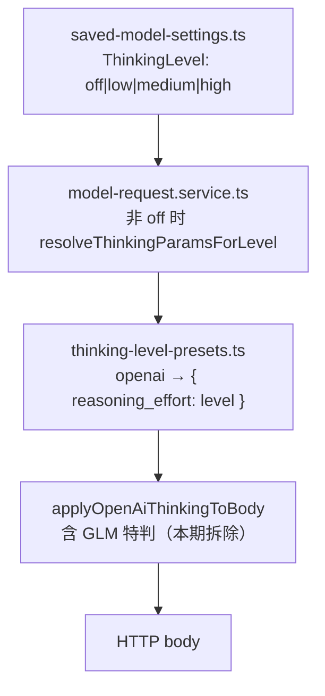

# 思考强度 openai 协议统一技术规格（SPEC）

> **PRD**：[prd.md](./prd.md)
> **前置**：[thinking-level/spec.md](../thinking-level/spec.md)（四档 `ThinkingLevel` 已落地）
> **范围**：`packages/core/**` 仅思考请求体相关；**不改** UI、schema、持久化；**零改动** anthropic / gemini 分支
> **测试基线**：core 测试 node:test + tsx（`npm test -w @novel-master/core`；定向用 `test:fast`）

## 设计目标

1. **字段统一**：openai 协议下，任一模型、任一档位，思考字段只有 `reasoning_effort` 一个出口——档位为低/中/高时请求体携带 `reasoning_effort: "low" | "medium" | "high"`；档位为关时不携带任何思考字段。
2. **拆除特判**：删除 GLM 型号识别与差异化写入（`thinking.type`、`enable_thinking` 不再出现），GLM 型号与其它 openai 协议模型行为完全一致；协议差异交给服务商 OpenAI 兼容层。
3. **上游零改动**：档位解析链（`saved-model-settings.ts` → `model-request.service.ts` → `thinking-level-presets.ts`）现状已满足目标语义，本期不动源码，仅补测试锁定。
4. **其他协议零回归**：`applyAnthropicThinkingToBody`（budget_tokens 钳制）与 `applyGeminiThinkingToBody`（thinkingConfig 分流）请求体与现状完全一致，对应测试原样作为基线。

## 总体方案

### 现状链路（核对结论）



- **解析层已经统一**：`thinkingLevelToModelThinkingParams` 的 openai 分支只返回 `{ protocol: "openai", openai: { reasoning_effort: level } }`，`off` 返回 `undefined`（`model-request.service.ts` 在 `thinkingLevel === "off"` 时不解析）。这条链无需改动。
- **特判只在最后一环**：`apply-thinking-to-body.ts` 的 `applyOpenAiThinkingToBody` 在写入前用 `isGlmDefaultThinkingOnModel(vendorModelId)` 识别 GLM-4.7 / `glm-5(\.|$|-)` 系列并改写字段：
  - 命中且 thinking 为 openai 协议 → 写 `thinking: { type: "enabled" }` + `enable_thinking: true` + `reasoning_effort`；
  - 命中且 thinking 缺失 → 写 `thinking: { type: "disabled" }` + `enable_thinking: false`。
- **特判符号引用面**：`isGlmDefaultThinkingOnModel` / `applyGlmThinkingDisabledToBody` / `applyGlmThinkingEnabledToBody` 定义于 `openai-glm-thinking.ts`，唯一 import 方是 `apply-thinking-to-body.ts`，删除无涟漪。

### 目标行为矩阵（openai 协议，含 GLM 全系）

| thinkingLevel | `reasoning_effort` | `thinking` | `enable_thinking` |
|---------------|--------------------|------------|-------------------|
| `off` | 不写 | 不写 | 不写 |
| `low` / `medium` / `high` | `= 档位名` | 不写 | 不写 |

### 设计决策

| 项 | 选择 | 理由 |
|----|------|------|
| 特判拆除方式 | 整文件删除 `openai-glm-thinking.ts` | 唯一使用方是 `applyOpenAiThinkingToBody`；保留空壳只会误导后续维护者 |
| `applyOpenAiThinkingToBody` 签名 | 收窄为 `(body, thinking)` 两参，删除 `vendorModelId?` 第三参 | 拆特判后该参数无消费者；收窄签名让「与型号无关」成为编译期事实 |
| adapter 调用点 | `buildBody` 与 `chatTextOnly` 两处同步去参 | `openai.adapter.ts` 全部调用点，已核实无第三处 |
| 解析层 / 配置层 | 零源码改动，仅补 GLM 型号测试断言 | 现状语义已正确；补测试防止将来有人把特判加回解析层 |
| `isGlmToolStreamModel`（`glm-tool-stream.ts`） | **不动** | 这是 GLM 工具流（`tool_stream`）特判，与思考字段无关，不在本期范围 |
| anthropic / gemini 分支 | **不动** | PRD 明确零回归；`applyAnthropicThinkingToBody` / `applyGeminiThinkingToBody` 原样 |

## 最终项目结构

```
packages/core/src/infra/llm-protocol/logic/
  apply-thinking-to-body.ts        # 改：applyOpenAiThinkingToBody 拆 GLM 分支、签名收窄两参
  openai-glm-thinking.ts           # 删除（isGlmDefaultThinkingOnModel 等三符号整体移除）

packages/core/src/infra/llm-protocol/impl/
  openai.adapter.ts                # 改：buildBody / chatTextOnly 两处调用去第三参

packages/core/test/infra/llm-protocol/
  openai-thinking-body.test.ts     # 改写：GLM 用例改为统一断言；吸收 text-only 路径覆盖
  openai-glm-thinking.test.ts      # 删除（覆盖并入上一文件）
  anthropic-thinking-body.test.ts  # 不动（零回归基线）
  gemini-thinking-body.test.ts     # 不动（零回归基线）
  glm-tool-stream.test.ts          # 不动（tool_stream 特判，非本期）

packages/core/test/provider/
  thinking-level-presets.test.ts   # 补强：GLM 型号断言（锁定无型号差异）
  model-request-thinking.test.ts   # 补强：GLM vendorModelId 用例

# 零改动（核对确认现状已符合目标）
packages/core/src/domain/provider/model/saved-model-settings.ts      # ThinkingLevel 枚举
packages/core/src/domain/provider/logic/thinking-level-presets.ts    # openai 分支仅产 reasoning_effort
packages/core/src/domain/provider/logic/resolve-thinking-wire.ts     # 入口透传
packages/core/src/service/provider/impl/model-request.service.ts     # off 不解析
```

## 变更点清单

### 源码（全部在 `packages/core`）

| 文件 | 符号 | 变更 |
|------|------|------|
| `src/infra/llm-protocol/logic/apply-thinking-to-body.ts` | `applyOpenAiThinkingToBody` | 删除 `openai-glm-thinking.js` import 与 `isGlmDefaultThinkingOnModel` 分支；签名收窄为 `(body, thinking)`；函数体只剩「`thinking?.protocol === "openai"` 时写 `body.reasoning_effort`」；更新 JSDoc（移除 GLM 关断说明与 `vendorModelId` 参数） |
| `src/infra/llm-protocol/logic/openai-glm-thinking.ts` | `isGlmDefaultThinkingOnModel` / `applyGlmThinkingDisabledToBody` / `applyGlmThinkingEnabledToBody` | **删除整个文件** |
| `src/infra/llm-protocol/impl/openai.adapter.ts` | `buildBody`（`applyOpenAiThinkingToBody(body, req.thinking, req.vendorModelId)` 行）、`chatTextOnly`（同款调用行） | 两处调用去掉第三参 `req.vendorModelId` |

### 测试

| 文件 | 变更 |
|------|------|
| `test/infra/llm-protocol/openai-thinking-body.test.ts` | 改写「GLM-4.7 未传 thinking 时显式关闭」「GLM-4.7 thinking 开启时写入 enabled 与 reasoning_effort」两个用例为统一断言（见 T-TO2 / T-TO3）；其余用例保持；新增 text-only 路径 GLM 用例（吸收自被删文件，见 T-TO3）；现有调用若传第三参同步去掉 |
| `test/infra/llm-protocol/openai-glm-thinking.test.ts` | **删除文件**（其唯一用例的覆盖由上一文件吸收） |
| `test/provider/thinking-level-presets.test.ts` | 补 GLM 断言：`glm-4.7` / `glm-5.2` 与 `gpt-*` 输出一致（T-TO6） |
| `test/provider/model-request-thinking.test.ts` | 补 GLM 用例：`createService` 支持自定义 `vendorModelId`，断言 medium → `reasoning_effort: "medium"`、off → `undefined`（T-TO7） |

### 明确不改

- `applyAnthropicThinkingToBody` / `applyGeminiThinkingToBody` 及 `resolve-thinking-wire.ts`、`thinking-level-presets.ts`、`model-request.service.ts`、`saved-model-settings.ts` 全部源码。
- `glm-tool-stream.ts`（`isGlmToolStreamModel`，`tool_stream` 字段）——GLM 工具流特判，独立议题。
- Desktop / Mobile UI、IPC、schema、持久化。

## 详细实现步骤

Step 1 — phase-openai-body-unify — blocking: yes — qa: auto：改写 `apply-thinking-to-body.ts` 的 `applyOpenAiThinkingToBody`：删除 GLM import 与分支、签名收窄为 `(body, thinking)`、同步 `openai.adapter.ts` 的 `buildBody` 与 `chatTextOnly` 两处调用；`npm run typecheck` 通过（T-TO1 / T-TO2 / T-TO3 / T-TO4 / T-TO5）。

Step 2 — phase-openai-body-unify — blocking: yes — qa: auto：删除 `packages/core/src/infra/llm-protocol/logic/openai-glm-thinking.ts`；全仓 grep `isGlmDefaultThinkingOnModel|applyGlmThinking|openai-glm-thinking` 确认主树（`packages/`、`apps/`）无残留引用——grep 须排除 `**/dist/**`、`**/node_modules/**`、`.woktree/**`（如 `rg -n 'isGlmDefaultThinkingOnModel|applyGlmThinking|openai-glm-thinking' -g '!**/dist/**' -g '!**/node_modules/**' -g '!.woktree/**' packages apps`；`packages/core/dist/` 下现存 `openai-glm-thinking.js` 等孤儿编译产物，`.woktree/*` 为并行工作树副本，均非源码，命中不算残留）；随后先 `npm run clean -w @novel-master/core` 再 `npm run typecheck`（tsc 增量构建不删孤儿产物，clean 后 typecheck 才能确证源码无残留引用）。

Step 3 — phase-test-rewrite — blocking: yes — qa: auto：改写 `openai-thinking-body.test.ts` 的两个 GLM 用例为统一断言、吸收 text-only 路径用例，随后删除 `openai-glm-thinking.test.ts`；定向跑 `test/infra/llm-protocol/openai-thinking-body.test.ts` 通过（T-TO2 / T-TO3 / T-TO5）。

Step 4 — phase-test-rewrite — blocking: no — qa: auto：补强解析层测试：`thinking-level-presets.test.ts` 加 GLM 型号一致性断言、`model-request-thinking.test.ts` 加 GLM vendorModelId 用例（T-TO6 / T-TO7）；定向跑两个文件通过。

Step 5 — phase-regression — blocking: yes — qa: auto：跑 core 全量 `npm test -w @novel-master/core` 与 `npm run lint -w @novel-master/core`；确认 `anthropic-thinking-body.test.ts`、`gemini-thinking-body.test.ts`、`glm-tool-stream.test.ts` 零改动且通过（T-TO8）。

## 测试策略

### 命令

- 全量：`npm test -w @novel-master/core`（node:test + tsx）。
- 定向：在 `packages/core` 下 `npm run test:fast -- test/infra/llm-protocol/openai-thinking-body.test.ts` 等。

### 测试用例

| id | Step | blocking | 文件 | 断言 |
|----|------|----------|------|------|
| T-TO1 | Step 1 | yes | `openai-thinking-body.test.ts` | 非 GLM 型号 + openai thinking → `body.reasoning_effort` 写入，`thinking` / `enable_thinking` 不存在（现有用例保持） |
| T-TO2 | Step 1 / 3 | yes | `openai-thinking-body.test.ts` | `glm-4.7`、`glm-5.2` + `reasoning_effort: "medium"` → body 仅 `reasoning_effort: "medium"`，`thinking` 与 `enable_thinking` 均不存在（改写原「GLM-4.7 开启」用例） |
| T-TO3 | Step 1 / 3 | yes | `openai-thinking-body.test.ts` | `glm-4.7` + 未传 thinking → `reasoning_effort` / `thinking` / `enable_thinking` 全部不存在（改写原「显式关闭」用例）；并含 adapter `chatTextOnly` 路径同款断言（吸收自被删的 `openai-glm-thinking.test.ts`） |
| T-TO4 | Step 1 | yes | `openai-thinking-body.test.ts` | 协议不匹配（anthropic 参数传入 openai 应用函数）→ 不写任何字段（现有用例保持） |
| T-TO5 | Step 1 / 3 | yes | `openai-thinking-body.test.ts` | adapter `chat`（走 `buildBody` 的非 text-only / 流式路径）+ GLM 型号 + medium → 捕获 body 仅含 `reasoning_effort: "medium"` |
| T-TO6 | Step 4 | no | `thinking-level-presets.test.ts` | `thinkingLevelToModelThinkingParams` 对 `glm-4.7` / `glm-5.2`：off → `undefined`；low/medium/high → `{ protocol: "openai", openai: { reasoning_effort } }`，与 `gpt-*` 完全一致 |
| T-TO7 | Step 4 | no | `model-request-thinking.test.ts` | `DefaultModelRequestService`：GLM `vendorModelId` + `thinkingLevel: "medium"` → mock adapter 收到 `{ protocol: "openai", openai: { reasoning_effort: "medium" } }`；off → `thinking === undefined` |
| T-TO8 | Step 5 | yes | `anthropic-thinking-body.test.ts` / `gemini-thinking-body.test.ts` / `glm-tool-stream.test.ts` | 三文件零改动原样通过（anthropic budget 钳制、gemini thinkingConfig 分流、GLM tool_stream 均为现状基线） |

### 手工验收（可选，发布前）

| 场景 | 预期 |
|------|------|
| GLM-4.7 已保存模型档位「中」，抓包请求体 | 仅 `reasoning_effort: "medium"`，无 `thinking` / `enable_thinking` |
| GLM-4.7 档位「关」，抓包请求体 | 无任何思考字段（接受服务商默认行为） |
| anthropic / gemini 模型各档位抓包 | 与改动前请求体一致 |

## 风险与回滚方案

| 风险 | 影响 | 缓解 | 回滚 |
|------|------|------|------|
| **非推理模型收到 `reasoning_effort` 可能 400（遗留）** | openai 协议对不支持思考的模型（如 `gpt-4o`）发送 `reasoning_effort` 可能被服务商拒绝 | 本期不解决（PRD 明确遗留）；用户可将该类模型档位设「关」规避，不发字段；模型能力门控另行评估 | 无需回滚代码；门控立项后按模型禁用非关档位 |
| GLM-4.7 / GLM-5* 档位「关」后不再显式关断 | 智谱侧默认开启 thinking 的型号，「关」档实际可能仍产出思考内容（用户感知「关不掉」） | PRD 已接受：协议差异交由服务商兼容层；文档/UI 不做特殊说明 | revert 本迭代提交即可恢复 `thinking.type: "disabled"` 显式关断 |
| GLM-5.2/5.3 档位映射失真 | 5.2 低档被拉高、5.3 不支持 medium | 服务商兼容层行为，产品侧不感知（PRD 已接受） | 不涉及 |
| 删除文件后残留引用 | 编译失败 | Step 2 全仓 grep + typecheck 双重确认；引用面已核实仅 `apply-thinking-to-body.ts` | 补回 import 即暴露 |
| anthropic / gemini 意外回归 | 其它协议请求体变化 | 分支零改动 + T-TO8 基线锁定 | revert 本迭代提交 |

**回滚方案**：改动集中在 2 个源码文件 + 1 个删除文件 + 4 个测试文件，无 schema / 持久化 / UI 变更，`git revert` 本迭代提交即完全回到现状（GLM 特判恢复）。无数据迁移、无兼容包袱。
